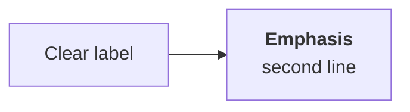

# Producing course notes in this repo

How to turn a video course, lecture series, book or paper into chapters under
`docs/`. Follow this end to end; the rules exist because each one was learned by
getting it wrong first.

---

## 1. Establish the contract before writing

Ask these **before** producing anything. Different answers mean materially
different work, and restructuring 20 pages afterwards is expensive.

| Question                                            | Why it matters                                                                                     |
| --------------------------------------------------- | -------------------------------------------------------------------------------------------------- |
| **1:1 with sources, or reorganised by topic?**      | Decides file count and naming. Do not merge two videos into one page unless told to.               |
| **Whose titles — theirs verbatim, or topic names?** | Default to **theirs verbatim**, with a short `sidebar_label` for navigation.                       |
| **Follow their flow, or restructure?**              | Default to **their flow**. See §4.                                                                 |
| **Anything to add beyond the source?**              | Advanced-concepts and capstone chapters are good additions, but must be **labelled as additions**. |

If the user says _"notes should be exactly the same as the video"_, that means:
same topics, same order, same examples, same analogies, same code, nothing
skipped, no reorganising. It does **not** mean transcribing verbatim — see §5.

---

## 2. Getting transcripts

### YouTube — the working recipe

```bash
yt-dlp --extractor-args "youtube:player_client=android" \
  --skip-download --write-auto-subs --sub-langs "en" --sub-format json3 \
  -o "subs/%(id)s.%(ext)s" "https://www.youtube.com/watch?v=VIDEO_ID"
```

- The **default and `tv` clients fail** with _"The page needs to be reloaded"_.
  Use `android`.
- **Never fetch in parallel.** YouTube rate-limits hard and most requests fail.
  Use a sequential loop with **6–8s sleeps**, rotating clients (`android`,
  `ios`, `mweb`, `web_embedded`, `android_vr`) across several rounds. Expect a
  few rounds to land everything.
- List a playlist with
  `--flat-playlist --print "%(playlist_index)s|%(id)s|%(title)s"`.

### When yt-dlp is fully rate-limited (HTTP 429)

Fall back to the **`youtube-transcript-api`** Python package. It handles the
player token that direct caption requests need.

```python
from youtube_transcript_api import YouTubeTranscriptApi

api = YouTubeTranscriptApi()
lst = api.list(video_id)
for t in lst:
    print(t.language_code, t.is_generated, t.is_translatable)

tr = lst.find_transcript(['hi'])
data = tr.translate('en').fetch() if tr.is_translatable else tr.fetch()
```

**Two traps:**

- On this machine the package installs under **`/usr/bin/python3`**, not
  homebrew python. Check with
  `/usr/bin/python3 -c "import youtube_transcript_api"` before assuming it
  failed.
- Fetching the caption `baseUrl` **directly returns HTTP 200 with an empty
  body** — even from inside a real browser session via Playwright, and even with
  `&fmt=json3&tlang=en`. It needs a player token. Do not waste time on this
  route; use the library.

### Non-English sources

Check `is_translatable`. If it is `False` there is **no auto-translated track**
— fetch the original language and **translate while writing**. That is the
normal path, not a fallback.

### Converting to readable blocks

Merge caption fragments into ~30–45s timestamped blocks before reading. Raw
fragments are unreadable and waste context.

```python
# [00:12:30] merged text of this block...
```

---

## 3. Structure and file layout

```text
docs/<course>/
  _category_.json
  01-<slug>.md          # one file per source unit
  ...
  22-advanced-concepts.md   # additions, clearly labelled
  23-capstone.md
  _old/                     # superseded drafts — see note below
```

- **Numeric filename prefixes** matching `sidebar_position`. Keeps disk order
  and sidebar order identical, which matters when someone edits by hand.
- **A folder or file prefixed `_` is ignored by Docusaurus.** Use `_old/` to
  preserve superseded drafts without them appearing twice in the sidebar. Never
  delete the user's previous work to make room for a rewrite — stash it.

### Frontmatter — match the repo's existing convention

```yaml
---
id: langchain-models
title: "LangChain Models | Indepth Tutorial with Code Demo | Video 3 | CampusX"
sidebar_label: "5 · Models"
sidebar_position: 5
slug: /genai/models
description:
  "One sentence on what the chapter delivers, written for search results."
tags: [langchain, models, chat-models, embeddings]
---
```

- `title` — the source's own title, verbatim, when tracking a course.
- `sidebar_label` — short, numbered, readable. Long titles wreck the sidebar.
- `slug` — clean and topical even when the title is not.

### The source line

Every chapter that maps to a source opens with it, before any prose:

```markdown
> **Video 5 of 21** (playlist video 3) ·
> [Watch on YouTube](https://www.youtube.com/watch?v=...) Notes follow the video
> section by section.
```

This is what lets the user check a page against what it came from. Without it
they cannot review your work.

---

## 4. Follow the source's own flow

Lectures have a shape. Mirror it rather than imposing a topic taxonomy:

```text
## Recap of the previous video
## Why <thing> is needed        ← the motivating problem, told their way
## What <thing> is              ← definition, then their framing
## Plan of action
## Demo 1 / Demo 2 / ...        ← their examples, their order
## What comes next
```

**Keep their material:**

- Their **examples** — the specific PDF-reader story, the specific cricketers,
  the specific bug.
- Their **analogies** — these are the load-bearing teaching device. Losing them
  loses the lesson.
- Their **code**, including variable names and the mistakes they make and then
  fix.
- Their **asides and corrections** — if they correct an earlier video, carry the
  correction.
- Their **warnings** — "this tool can delete files", "free APIs time out".

**Do not** skip a section because it seems minor, reorder for tidiness, or
replace their example with a cleaner one you prefer.

### When the source is wrong

Present the correct information, and note the correction in a `:::note`. Do not
silently reproduce an error, and do not silently fix it either — the reader
needs to know.

---

## 5. Write it in your own words

Notes **summarise and teach**; they are not a transcript dump.

- Read the transcript, understand the point, then **write the explanation
  yourself**.
- Never paste transcript text, and never lightly paraphrase it line by line.
- Short quotations of a definition are fine. Reproducing a 50-minute lecture is
  not, regardless of how the request is phrased.
- Code from the source can be reproduced — it is the technical substance and
  usually short.

The test: could someone read your chapter _instead of_ watching, and learn the
same thing? That is the goal. Could they reconstruct the speaker's exact words
from it? That is not.

---

## 6. Diagrams

**Recreate diagrams as original Mermaid. Never extract and embed video frames or
screenshots of someone else's slides.** Study the frame to understand the
diagram, then draw your own.



- Mermaid is enabled in `docusaurus.config.ts` (`markdown.mermaid` +
  `@docusaurus/theme-mermaid`).
- Every diagram gets an **Expand** button opening a zoom/pan lightbox — that is
  the swizzled wrapper at `src/theme/Mermaid/`. You do not need to do anything
  for this to work.
- Use `<br/>` for line breaks inside labels and `<b>` for emphasis.
- Label edges when the transition is conditional: `A -->|positive| B`.
- Keep diagrams to one idea. Two small diagrams beat one crowded one.

---

## 7. Docusaurus mechanics that will bite you

### MDX treats `{...}` in prose as a JSX expression

This **breaks the build**:

```markdown
> System: You are an experienced {profession}.
```

Put placeholders in a fenced code block or inline code, or escape them as
`\{profession\}`. Before building, sweep for it:

````bash
python3 - <<'PY'
import glob, re
for f in sorted(glob.glob("docs/<course>/*.md")):
    fence = False
    for i, l in enumerate(open(f), 1):
        if l.strip().startswith("```"): fence = not fence; continue
        if fence: continue
        if re.search(r"\{[^}]*\}", re.sub(r"`[^`]*`", "", l)):
            print(f"{f}:{i}: {l.strip()[:100]}")
PY
````

### Internal links need the `/docs` prefix

A page with `slug: /genai/models` is served at **`/docs/genai/models`**. Write
`[models](/docs/genai/models)`. Omitting `/docs` fails the build, because
`onBrokenLinks` is `throw`.

### Callouts

Use them for things that change what the reader does, not for decoration:

- `:::tip` — a shortcut or a better default
- `:::note` — a clarification, or a correction to the source
- `:::warning` — a trap that produces confusing behaviour
- `:::danger` — something that costs money, deletes data, or is a security risk

---

## 8. House style

- **Open with one line** stating the chapter's point in plain words.
- **Tables for comparisons.** Any "X vs Y" becomes a table.
- **Code blocks are runnable** — real imports, real names, `load_dotenv()` where
  needed.
- **Name the failure.** "Retrieve 20, rerank, keep 5" is weaker than "semantic
  search misses exact tokens like product codes; BM25 misses paraphrase; run
  both."
- **Close with a checklist** of what the reader should now be able to do. Phrase
  as capabilities ("I can explain why…"), not topics covered.
- British spelling, matching the rest of `docs/`.
- No em dashes as sentence connectors where a comma or full stop works.

---

## 9. Gaps and additions must be visible

**If a source could not be obtained, say so on the page.** A `:::warning` naming
what is missing and why, plus pointers to the nearest covered material. Never
quietly drop it and let the numbering imply completeness.

**Anything you write that is not from the source gets a marker:**

```markdown
:::note Not from the playlist This chapter is an **addition** — the topics the
course points to as next steps. :::
```

---

## 10. Verify before reporting

```bash
npm run build          # must pass; onBrokenLinks is "throw"
```

The build catches MDX errors and broken links. It does **not** catch a diagram
that renders unreadably or a UI feature that silently no-ops.

For UI work, verify in a real browser. The Playwright MCP profile is often
locked by another session; drive `playwright-core` directly instead, pointing at
a cached chromium:

```js
import { chromium } from "<npx-cache>/node_modules/playwright-core/index.mjs";
const browser = await chromium.launch({
  executablePath:
    "<home>/Library/Caches/ms-playwright/chromium_headless_shell-<ver>/chrome-headless-shell-mac-arm64/chrome-headless-shell",
});
```

Then serve the build (`npx docusaurus serve --port 3111`) and assert on real
behaviour — element counts, state changes, keyboard handling — not just that the
page loaded.

Report honestly: what is covered, what is not, and what you changed from the
brief.

---

## 11. Record the state

After a large import, write a `project` memory noting: what was imported, the
structure the user asked for, the tooling workarounds that worked, and what is
still outstanding. The next session will not have this context, and
rediscovering the yt-dlp client flag costs an hour.
