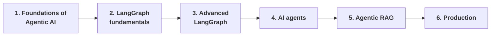

> **Video 1 of 28** · [Watch on YouTube](https://www.youtube.com/watch?v=yC36gN-rqjo) · Translated from the
> Hindi transcript. Notes follow the video section by section, in its order.

This video announces the new playlist, Agentic AI using LangGraph, and lays out why it exists, what it aims to achieve, what it will cover, and what you need to know before starting.

## The announcement

The channel is starting a new playlist on **Agentic AI using LangGraph**. Over the previous three or four months this was the most requested topic, with viewers repeatedly asking for a LangGraph playlist. The decision to make it was taken about three or four months earlier, and the time since went into research: defining a curriculum, preparing content around it, and studying the documentation in depth. Only after those three months was there enough confidence to teach it.

This first video matters if you intend to follow the whole playlist, because it explains the complete thought process behind the plan: the full curriculum, the prerequisites, and answers to the doubts you are likely to have.

## Why start this playlist: three reasons

**1. Timing.** This is the right moment to study agentic AI. Open YouTube, Twitter or Instagram and you will constantly hear the term; the big companies of the world and the thought leaders inside them are all hyping it. That hype is justified, because this is going to be the next big thing in computer science. ChatGPT arrived in 2022 and started a completely new trajectory of generative AI. Generative AI tools have now matured enough that genuinely powerful agents can be built with them over the next five years, and those AI agents will create a lot of value. CEOs of big companies and people in powerful positions can see that this could change the world. If you learn how agentic applications are built now, you put yourself in a position to be highly valuable in the future.

**2. Demand.** For three or four months, roughly every third comment on the channel asked to drop everything and make a LangGraph playlist, because the industry is talking about it so much.

**3. Build-up.** The channel has covered topics sequentially and in an organised way: machine learning first, then deep learning, then LangChain and generative AI. Having studied all that, you are now ready to learn LangGraph and how to build AI agents.

## The vision behind the playlist

When LangGraph came to market and requests to teach it started arriving, the first step was to search YouTube for existing LangGraph content. Two kinds existed:

- Content that teaches you to build a **project directly** with LangGraph, without discussing the fundamentals much.
- Content that teaches **very basic LangGraph fundamentals**, but in a short video that ends quickly.

Both have a flaw, and there was no comprehensive playlist that, followed start to finish, gives you complete end-to-end knowledge of building agentic applications with LangGraph. So the plan is a playlist of perhaps 30, 40 or 50 videos that leaves you able to build agentic applications and with full command of LangGraph.

There are three precise, actionable goals:

1. **Simple enough for a beginner.** Anyone, even a beginner, should be able to follow the playlist and easily learn to build agentic applications and any kind of agent.
2. **Strong command of LangGraph.** Teach the LangGraph fundamentals thoroughly enough that you really command the framework.
3. **Conceptual depth that outlives the framework.** If LangGraph is replaced tomorrow by some new framework, you should have enough conceptual depth to pick up the new one easily.

## The curriculum

### A disclaimer first

The curriculum is **not final**. Some things not listed now may be taught later, and some things listed now may not make the final playlist. Agentic AI is evolving very fast: something new appears every day and something old becomes obsolete, so a curriculum defined today may not be valid three months later. For that reason the plan is given as **modules**, not an exact topic-by-topic list.

### The six modules

**Module 1: Foundations of Agentic AI.** The first five or six videos give an in-depth overview of agentic AI and the terms around it:

- What agentic AI is
- The difference between agentic AI and an AI agent
- The difference between agentic AI and generative AI
- What agentic RAG is, and how traditional RAG differs from it
- The top frameworks for building agentic AI applications

Watching these gives you a good high-level overview of what the playlist will cover.

**Module 2: LangGraph fundamentals.** This is where the LangGraph journey starts: how a graph is built, the concept of **state**, what **nodes** are, what **edges** are, what **conditional edges** are, and how **looping** is done in LangGraph. Beyond the concepts themselves, you will use them to build some very popular AI workflows.

**Module 3: Advanced LangGraph concepts.** Once the fundamentals are done and you can build AI workflows, you will have the confidence to study LangGraph in depth. LangGraph offers concepts that let you build industry-grade AI agents: **persistence**, **memory**, **human in the loop**, **breakpoints**, **checkpointers** and **time travel**. Implementing these is what makes an agent truly industry-grade.

**Module 4: Building AI agents.** The most interesting module, and the core of the playlist. With LangGraph covered in detail, you use that knowledge to build different kinds of AI agents. It starts with theory: the popular design patterns used in industry today. Then, one by one:

- The **ReAct** agent
- The **reflection** design pattern
- The **self-ask** pattern
- **Planning**
- **Multi-agent systems**

By the end of this module you will be able to build every kind of AI agent.

:::note

The captions render the third pattern as "self ask with help". The established name for this pattern is **self-ask with search**, which is most likely what was said.

:::

**Module 5: Agentic RAG.** A different trajectory: building agentic RAG applications. You learned traditional RAG in LangChain; agentic RAG is an advanced version that merges the concepts of AI agents and RAG. Different architectures exist, such as **CRAG** and **Self-RAG**, and these will be covered.

**Module 6: Production.** Using everything studied so far, you build a project good enough to put on your resume and show in interviews. That means giving the agent a **UI**, adding **debugging** support, adding **observability**, integrating **LangSmith**, and finally **deploying** it.

Exact topics are not being shared yet because they keep changing, but this is the rough structure. If you have feedback on the curriculum, leave it in the comments; really solid suggestions will be integrated.

## Prerequisites

Many people wonder whether they are ready to start. You need three things.

**1. Python, at intermediate level.** For a change, basic Python will not do. The playlist uses things beyond basic Python:

- **OOP**, a lot; OOP principles will definitely be used
- The **typing** module
- **Pydantic**
- **asyncio**

If you do not know these somewhat advanced Python concepts, you will not be able to follow the playlist well.

**2. Some familiarity with LLMs.** You should have some idea of working with LLMs. If you have watched the LangChain playlist, this will not be a problem.

**3. LangChain.** LangGraph is built on top of LangChain, so almost any code in this playlist will have some LangChain dependency. If you have not studied LangChain at all, this playlist will go over your head. Watching the LangChain playlist is highly recommended: around 18 videos, somewhat long ones, but they will help a lot here.

## Other common questions

**How many videos in total?** An exact count is not possible, since agentic AI is evolving fast and LangGraph itself is changing a lot. The estimate is somewhere between **35 and 50 videos**.

**How often will videos be uploaded?** The aim is **three videos a week**. More than three is not possible, and if a week has fewer, there will be a reason, since everyone has a personal life; please bear with that. The commitment is to try for three per week, so you can work out the timeline for completing the playlist yourself.

Any other questions can go in the comments, where the author or his team will try to answer.

## Closing

If you want to learn LangGraph, follow this playlist. The promise is to create the best playlist on LangGraph, with full effort over the next three or four months.
