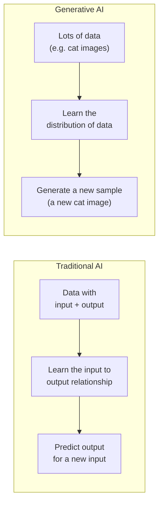
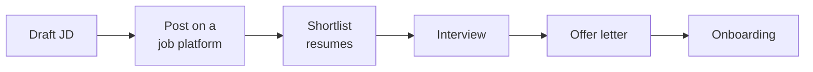
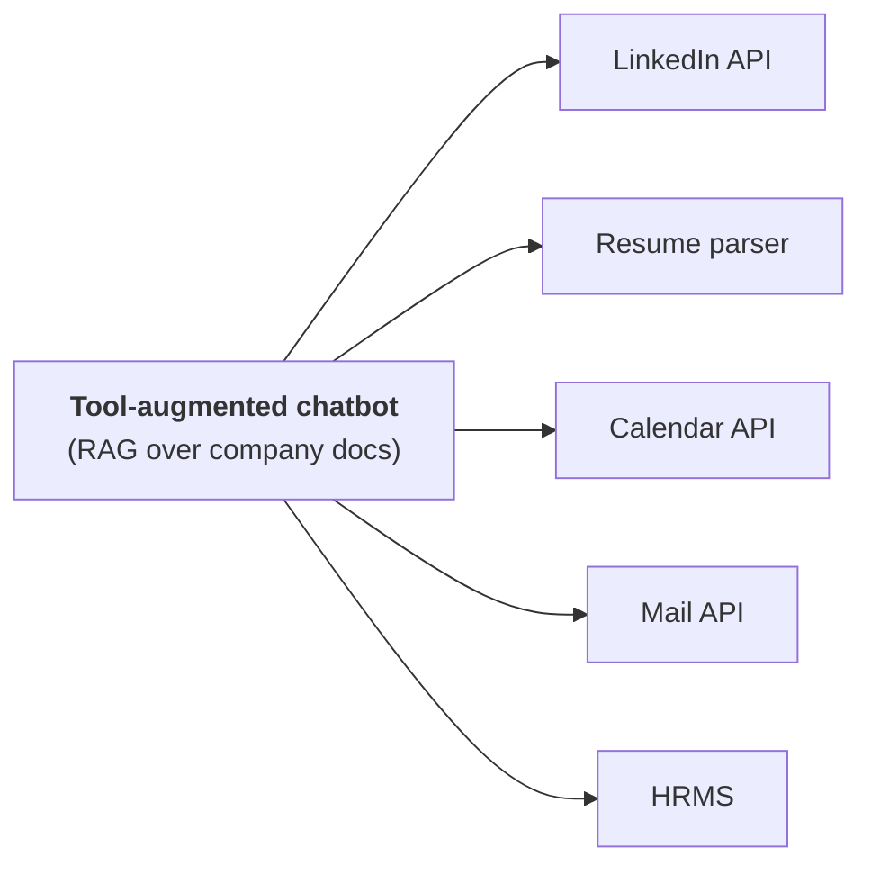
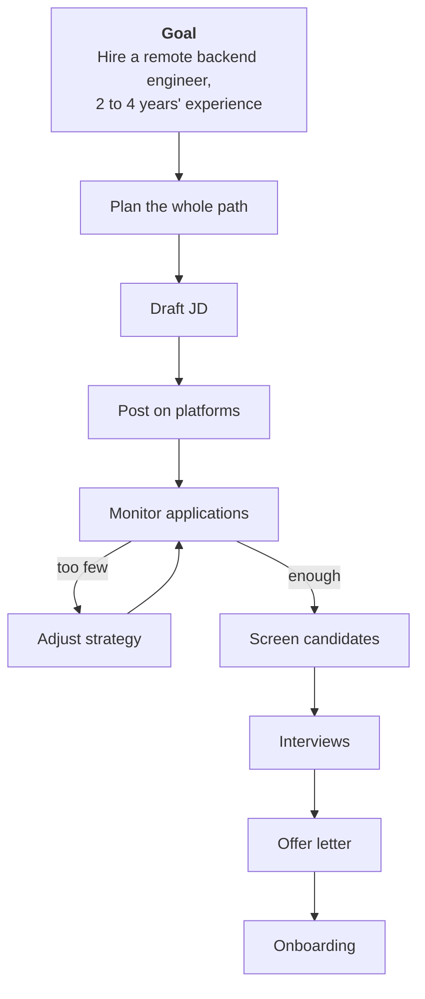
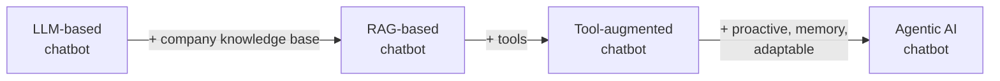

> **Video 2 of 28** · [Watch on YouTube](https://www.youtube.com/watch?v=xdA0pGDiUPE) · Translated from the
> Hindi transcript. Notes follow the video section by section, in its order.

Generative AI creates content when you ask; agentic AI takes a goal and works towards it on its own. This video shows the difference by evolving one hiring assistant, step by step, from a plain chatbot into an agentic system.

## Where this video fits

The previous video set out how the playlist will be approached: the curriculum and the vision behind it. This is the first proper video, and its topic is **generative AI vs agentic AI**.

You might object that you cannot compare the two without first knowing what agentic AI is. That is a fair objection. The original plan was to teach "what is agentic AI" first and the comparison second. On revisiting the curriculum, the order was swapped: seeing the difference first shows you **why agentic AI came into the picture**. The formal "what is agentic AI" topic comes in the next video.

The plan for today is one **practical scenario**. It is first solved with generative AI, then the solution is improved until it becomes agentic AI. Watching a product evolve from generative AI to agentic AI should plant a deep intuition for what agentic AI is and why it is needed.

## A quick revision of generative AI

Generative AI is a new, powerful, transformative technology that arrived only about three years ago and has changed the world in that time. Ask anyone about it and you will see two emotions: **excitement**, because it is so capable, and a little **fear** that it may become powerful enough to take our jobs.

The formal definition used here:

> Generative AI refers to a class of AI models that can create new content such as text, images, audio, code or video that resembles human-created data.

Put simply, GenAI is a branch of AI where you build models that create **new data in different modalities** (text, images, video). The best part is that the new data feels as if a human created it.

:::note

"Three years" dates generative AI from ChatGPT (2022), which is how the video uses it. Generative models such as GANs and VAEs existed years earlier; what arrived in 2022 was the wave of mainstream GenAI products.

:::

### Successful GenAI products of the last three years

- **LLM-based chatbots.** ChatGPT, the product where the GenAI journey started, about three years ago; it has arguably replaced Google in our lives. Also Google's Gemini, Claude and Grok, all powerful chatbots that generate human-like text and are also intelligent. LLM-based applications are the first true examples of generative AI.
- **Image generation models.** Diffusion-based models such as DALL-E and Midjourney: describe the image you want and get exactly that image back.
- **Code-generation LLMs.** LLMs fine-tuned to write software code, such as Code Llama.
- **Text-to-speech (TTS) models.** Give text and get speech that sounds like a real human, for example ElevenLabs.
- **Video generation models.** Sora turns a text description into a short video clip.

These products have all arrived in the last three years and are quite successful in their own domains.

### Generative AI compared with traditional AI

To see GenAI's real power, compare it with **traditional AI**. After 8 or 9 years of working in AI, that is the name used here for everything done in the pre-generative-AI era: classical ML and deep learning models, which are still built today.

**Traditional AI** learns from data that has inputs and outputs. The model finds **patterns**, meaning the relationship between input and output, so it can produce an output for a new input.

- **Classification**: decide whether an incoming mail is spam or not spam; examine a patient's chest X-ray and say whether the patient has cancer. The model studies labelled data (the image plus whether it is a cancer case), learns the input-output relationship, and then predicts for any new input.
- **Regression**: predict a continuous value instead of a category, such as today's temperature or a company's stock price from past data. It works the same way: find the mathematical relationship between input and output, then predict.

**Generative AI** is fundamentally different. It does not look for an input-output relationship. It tries to learn the **distribution** of the whole data, its nature. Give a GenAI model lots of cat images and it learns what cats look like in the real world. Once it has learned that distribution, it can easily draw a **new sample** from it: a new image containing a cat.

> Generative AI is about learning the distribution of data so that it can generate a new sample from it.

GenAI's single biggest strength is that its output is so refined it feels human-made. That is why it is being applied across so many domains with good results.

### Where generative AI is applied

**1. Creative and business writing.** Text was the first use case, because ChatGPT could write like a human. Give it a blog outline and it writes the whole blog. Paste in a business email you wrote and get back a formal, grammatically clean version. Existing tools now have GenAI built in: in Gmail you can read a summary of any mail and draft a reply instantly.

**2. Software development.** Code used to be written entirely by hand, and errors were debugged manually on sites like Stack Overflow. Now autocompletion tools predict what you want to write next and can generate the entire code, and you can paste an error into a tool like ChatGPT to find out why it happens. GenAI is being used very aggressively here.

**3. Customer support.** Every company needs it, since perhaps 2 in 100 customers of any product will hit a problem and call or message support. With crores of users you cannot give each one an executive, so companies build a GenAI chatbot that tries to solve the query and forwards the complaint to a human executive if it cannot. Ola, Uber, Zomato and Swiggy all have their own chatbots.

**4. Education.** Online learning is being transformed. Stuck at a timestamp in a YouTube video? A GenAI tool can explain the doubt. You can have ChatGPT build a personalised curriculum for a new technology, or paste a topic you do not understand and get a simplified summary. The way everyone learns has changed over these three years.

**5. Designing.** GenAI also creates images and video. A designer making thumbnails for a YouTuber can describe the thumbnail, have an AI tool generate it, then improve it iteratively. A social media intern who used to build product infographics by hand in design software can have AI tools generate them. An advertising firm that once needed shoots and full edits can generate short clips with tools like **Sora** and **Runway** and join them into a small ad.

These are not all the application areas, but the common thread is that GenAI can **mimic human creativity**, and that is why industries are adopting it so fast.

GenAI is also **constantly improving**. Early image generation models were really bad: any text inside a generated image came out misspelt or as nonsense. Recent models render text without spelling mistakes. That kind of improvement will continue, so soon almost every app you use will have some GenAI integration.

That completes the revision: what GenAI is, how it works, how it differs from traditional AI, and where it is useful. Next comes a practical problem, solved first with GenAI.

## The problem: hiring a backend engineer

Imagine you are an **HR recruiter** at a company. Your job is to hire whenever there is a requirement, and your current task is to hire a **backend engineer**, making sure end to end that the company gets a good one.

Broken down, the task has these steps:

1. **Draft a job description (JD).** A detailed document: what the engineer will do, the skill set needed, any eligibility criteria, the salary, and what you expect from the employee.
2. **Post the JD** on a job platform such as naukri.com.
3. **Shortlist.** Say 1000 people apply. You cannot interview 1000, so you study each resume against the requirement and finalise the top 10, 20 or 25.
4. **Interview** those candidates to find the best fit.
5. **Roll out an offer letter** to the person you like.
6. **Onboard** them once they accept.

## Solution 1: a simple LLM-based chatbot

Imagine your company has given you an **LLM-based chatbot**: you can chat with it, ask it your doubts, and ask it for help. Now run the hiring process with it.

- **Drafting the JD.** Tell it you want to hire a backend engineer with 2 to 4 years of experience and ask for a JD. Being LLM-based, it produces one straight away ("We are looking for a remote backend engineer with 2 to 4 years of experience in backend development…"), including whatever details you give it, such as salary and requirements.
- **Posting.** Ask where to post the JD. From its training knowledge it suggests platforms that get a good response, such as **LinkedIn** and **Naukri**. You then go to LinkedIn and naukri.com yourself and post it manually.
- **Shortlisting.** Some time later, eight applicants have applied. Ask for help screening them and it gives **generic advice** based on the JD: look for Python and cloud experience, startup experience, and experience leading a project. You then go through each resume yourself and shortlist against the JD.
- **Scheduling.** You liked two of the eight. Ask it to draft an interview-invitation email; it writes one and you send it to the two candidates.
- **Interviewing.** Ask what to ask, based on the JD. From its training data it suggests asking about backend experience, the frameworks they have used, and problem solving. Ask for a question bank and it generates a backend question bank you can use directly.
- **Offer.** You have finalised a candidate; ask it to draft an offer letter, then mail that letter to the candidate yourself.

At every step the chatbot helps. In the pre-GenAI era (say 2015 or 2018) you did all of this yourself: the JD, the interview questions, the content of every mail. GenAI has refined each step, so you work a little less and the output is a little better.

### What is still wrong with it

GenAI clearly helps, but the approach has problems:

1. **It is reactive.** The human keeps saying "now I need this, now I need that", and the chatbot reacts. It is not proactive: it cannot work out the flow or what should happen next. You handle most of the flow yourself.
2. **It has no memory, so it is not context-aware.** Ask it about the JD three days later and it will not remember; you have to show it the JD again.
3. **Its advice is generic.** The JD it writes could be used at any company. It would be better if it matched your company specifically, your company's DNA, but it has no company-specific information.
4. **It cannot take actions.** It can write the JD but cannot post it on naukri.com. It can write an email but cannot send it.

The next steps solve these one by one.

## Solution 2: a RAG-based chatbot

First, make the advice specific to your company. To do this, **connect the chatbot to your company's knowledge base**: give it many company documents, so it answers by referring to them and its replies are tailor-made.

The documents you could feed it:

- **JD templates** from all past hiring, examples of **high-performing JDs** (ones that attracted many applications), and JD **variations** such as remote vs in-office and junior vs senior.
- The **hiring strategy**, or hiring playbook: which platforms have worked best for hiring, the best practices your company follows for effective hiring, the **internal salary bands** for each experience level, what pointers you look for when shortlisting, and a **question bank** of questions asked in past interviews.
- **Onboarding documents**: offer letter templates, welcome email templates, and employee policies.

If you have studied generative AI or LangChain, you will recognise this as a **RAG-based chatbot**, where RAG is **retrieval-augmented generation**, a very famous GenAI concept. The simple LLM chatbot has become a RAG chatbot. Now run the same task.

- **Drafting.** Say you need a backend engineer. Because it knows the company, it understands your tech stack is **Python and Django** and puts that in the JD. Say 2 to 4 years' experience and it works out the salary itself. You no longer need to specify these explicitly.
- **Posting.** As a new recruiter, ask where to post. Based on past hiring it names the platforms that gave the best results: LinkedIn, Naukri and AngelList. You thank it and post on LinkedIn and Naukri manually.
- **Shortlisting.** Eight applications again. It knows how people were shortlisted in the past, so it gives **customised pointers**: Python and Django experience, AWS experience, prior startup experience, experience leading projects. Upload the resumes and it identifies the two or three candidates whose skills match best.
- **Scheduling.** You shortlisted two. It looks up the template your company uses for interview-scheduling mails and drafts the mail in it; you send it.
- **Interviewing.** Ask what questions have been asked in the past for this profile. It searches the knowledge base and returns the questions asked of backend engineers at the 2 to 4 years level, and on request extracts the whole interview question bank.
- **Offer.** It drafts the offer letter in your company's style and format, and you mail it.

Compared with the simple LLM chatbot there is a sure-shot improvement: advice specific to your needs instead of generic advice.

### Problems remaining

Going back to the problem slide:

| Problem | Solved by the RAG chatbot? |
| --- | --- |
| Reactive: you ask, it answers; it never takes the initiative and says what should happen next | No |
| No context awareness: it forgets what was said three days ago | No |
| Generic advice | **Yes**, advice is now company-specific |
| Cannot take actions: it drafts the JD but cannot post it on LinkedIn | No |

We have moved forward, but there is plenty of scope left.

## Solution 3: a tool-augmented chatbot

The next improvement is letting the chatbot **take actions**. Most chatbots only give textual, contextual replies. What if it could also act, not just drafting the mail but sending it, not just drafting the JD but posting it on LinkedIn?

To achieve this, **integrate tools** with the chatbot:

- A **LinkedIn API** tool, so it can communicate with LinkedIn
- A **resume parser** tool, so it can take in a PDF and understand its content
- A **calendar** tool, so it can see when you are busy and schedule accordingly
- The **mail API**, so it can send and receive emails
- The **HR management software (HRMS)**, through which it can do many kinds of work

A chatbot given this extra power to access tools is called a **tool-augmented chatbot**.

The same flow, with this chatbot:

- **Drafting.** Ask for a backend engineer with 2 to 4 years' experience. It drafts the JD from company information. No tool yet: this is purely the RAG aspect.
- **Posting.** Ask it to post the JD on various platforms. It says that, based on past hiring, LinkedIn and Naukri performed best, and then, without waiting for you, it **hits the LinkedIn and Naukri APIs** and posts the JD automatically. That work is off your plate.
- **Too few applicants.** You notice that not many people have applied. Ask it to check how many applications have arrived. It connects to LinkedIn and reports **just one application**. Ask what can be done and it pulls solutions from the hiring playbook for when applications are low: **broaden the JD** (write "full stack engineer" instead of "backend engineer") and **boost the LinkedIn post** by running an ad. You tell it to do both. It revises the JD and updates the LinkedIn post, then, with the credits you give it, boosts the post on LinkedIn. Even when something goes wrong mid-process, it helps.
- **Shortlisting.** Ask it to help shortlist. Using its resume parser tool, it downloads all eight applicants' resumes from LinkedIn, studies them against the JD, and reports "two candidates shortlisted". Ask it to mail you their profiles and, having mail access, it does.
- **Scheduling.** Tell it to mail the two candidates and schedule interviews. It **hits the calendar API**, finds you are free on Friday, and asks whether to book Friday. You say yes and ask it to email you and the candidate. It drafts the mail and sends it to both.
- **Interviewing.** As before: ask what questions to ask, and it lists the questions asked in the past from the company database.
- **Offer.** It drafts the offer letter and asks you to review it. Once you approve, it mails the letter to the candidate itself.
- **After acceptance.** Tell it the candidate accepted and it drafts and sends a **welcome email**. Tell it to trigger onboarding and, through the HRMS, it starts the whole process: the **employment contract** is generated, an **official email ID** is created, a **laptop** is assigned, and a **KT session** is planned.

Your work as a recruiter keeps getting easier with each improvement.

### Problems remaining

| Problem | Solved by the tool-augmented chatbot? |
| --- | --- |
| Reactive: you take the initiative and tell it what to do | No |
| No context awareness or memory | No |
| Generic advice | Yes (it is RAG-based) |
| Cannot take actions | **Yes**: it mails, posts, checks your calendar and runs onboarding |
| **New: cannot adapt.** It only recognised the low-applicant problem and what to do about it after you told it. It did not strategise, or notice by itself that too few applications were coming in | No |

Two problems solved, three remain: the chatbot is still reactive, is not context-aware, and cannot adapt by itself.

## Solution 4: an agentic AI chatbot

One last improvement solves all three. The chatbot must become:

- **Proactive** instead of reactive: it takes initiatives by itself.
- **Context-aware**: it remembers what it did previously and what it has to do next.
- **Adaptable**: when one flow of action is not working, it can choose alternate paths.

A chatbot that is proactive, context-aware and adaptable can actually be called an **AI agent**.

What we want: tell it "I want to hire a backend engineer", and behind the scenes it understands the whole goal (a remote backend engineer with 2 to 4 years' experience) and also **plans** how to achieve it. It works out on its own that it must draft a JD, post it on a platform, continuously monitor applications, adjust the strategy if needed, screen candidates, arrange interviews, send offer letters and handle onboarding. You gave it only the end goal, and it planned the whole path from there. This is called an **agentic AI chatbot**.

How the task runs now:

1. **Drafting.** It announces that it is starting with the JD, using the company documents, drafts it, and asks you to review. You approve.
2. **Posting.** Based on past data it posts the JD on **LinkedIn and Naukri** through their APIs, as in the tool-augmented chatbot, then says it will **keep monitoring** applications.
3. **Adapting.** Unprompted, it messages you: *"The job posting has received just two applications so far, much below our expectation."* It identified the problem itself and proposes the fix itself: broaden the JD to include full stack engineers, and promote the job on LinkedIn. It asks whether you agree. You say do both; it revises the JD, runs LinkedIn ads, and keeps monitoring.
4. **Screening.** It notifies you that **eight applications** have arrived, and that it has already screened them with the resume parser tool: **two strong candidates, three partial matches, three weak matches**. It asks whether to schedule interviews for the two strong ones.
5. **Scheduling.** You say go ahead. It checks your calendar API, finds you free on Friday, asks to confirm, then creates the invitation mail and sends it to the candidates and to you.
6. **Interview day.** It reminds you that two interviews are lined up today, and mails you a document of interview questions taken from past hiring.
7. **Offer.** You finalise a candidate and ask for an offer letter. It checks past documents for what an offer letter looks like, drafts one, asks you to review, sends it, and then **tracks whether a reply comes back**.
8. **Onboarding.** When the candidate accepts, it notifies you that it has triggered onboarding: sent a welcome email, submitted the IT access request, and completed laptop provisioning. It asks whether to set up an intro meeting between you and the new hire, and does so when you say yes.

This is the magic: the system has real **autonomy**. As a recruiter you only monitor and give approvals where needed; the system does the heavy lifting. That is an **agentic AI system**.

### All problems checked off

| Problem | How the agentic AI chatbot handles it |
| --- | --- |
| Reactive | Now **proactive**: it identifies the goal, plans for it, and executes each step itself |
| No context awareness | It has **memory**, so it knows which step it did last and which comes next |
| Generic advice | Company-specific, because the **RAG** element is still there |
| Cannot take actions | It acts through its **tool integrations** |
| Cannot adapt | It **adapts**: it spotted that only two people had applied, proposed the fix, and did the work once you approved |

## Conclusion: what the evolution shows

One problem statement (an HR recruiter hiring a backend engineer) was solved four ways: with generative AI, then improved with RAG, then with tools, and finally with agentic AI.

Three takeaways:

| | Generative AI | Agentic AI |
| --- | --- | --- |
| End goal | **Create content** of any kind (text, image, video); the end result is generated content | **Achieve a given goal** at any cost: receive a goal, plan for it, execute the plan step by step |
| Who drives | **Reactive**: the human guides it at every step and it reacts | **Proactive and autonomous**: given a goal once, it does the rest itself, bringing the human into the loop mostly for approvals |
| Relationship | A **building block** of agentic AI | A **broader term** that uses tools, planning and reasoning, and memory, and uses LLMs (elements of generative AI) for the planning and reasoning |

The first difference is the biggest one. On the third point, generative AI can be seen as a subset of agentic AI: agentic AI uses generative AI to get its work done. One line puts it neatly: **generative AI is a capability, whereas agentic AI is a behaviour**, one that draws on many capabilities of that kind.

## Closing

Someone else could teach all of this in five minutes. This video took 45 minutes, with all the slides and the worked scenario, so that the idea is planted deeply. When the next video formally teaches agentic AI, you should feel at home, as if you already know it. Every upcoming video will go similarly deep while staying simple.

## What comes next

The next video formally covers **what agentic AI is**.
