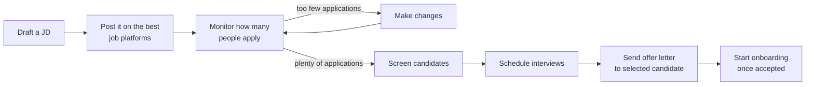
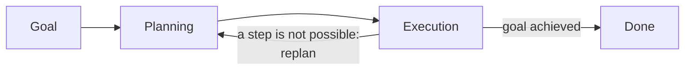
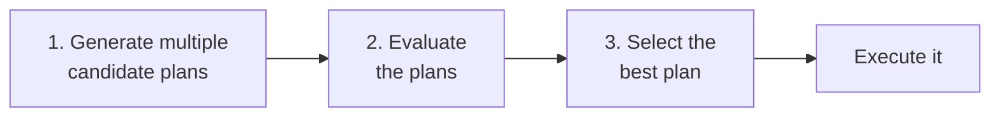

> **Video 3 of 28** · [Watch on YouTube](https://www.youtube.com/watch?v=GWnSsjT4V68) · Translated from the
> Hindi transcript. Notes follow the video section by section, in its order.

Agentic AI is software you give a goal to, which then plans and executes on its own with minimal human guidance. This video studies it formally: the definition, six key characteristics and five core components.

## Where this video fits

The previous video compared generative AI and agentic AI, using one practical scenario to show the whole evolution from one to the other, but it deliberately left the formal definition for later. That is this video's job.

The plan for today:

1. What agentic AI is.
2. The characteristics of any agentic AI system.
3. The components of any agentic AI system.

The whole video is theoretical, but it is worth watching end to end and making your own notes: every piece of this theory comes back later in the playlist when agents are coded and built.

## What agentic AI is

The definition used here:

> Agentic AI is a type of AI that can take up a task or goal from a user and then work towards completing it on its own, with minimal human guidance. It plans, takes action, adapts to changes and seeks help only when necessary.

In simple words, agentic AI is a **software paradigm** where you give the system a goal and the system works out for itself how to achieve it. All the planning and all the execution needed along the way are done by the system itself; human involvement stays minimal.

That is completely different from other paradigms such as **generative AI**, where you talk to a chatbot. A chatbot is **reactive**: whatever you ask at a given moment, it answers only that, and it takes no initiative of its own.

### The Goa trip example

Suppose you want to travel to Goa. Travelling involves many decisions: first you fix the dates, then the mode of transport for those dates, then hotels, then where to go and what to eat in Goa.

With a **generative AI chatbot**, every step is a question you ask and an answer you get, no less and no more:

- "What is the best way to get to Goa on the 15th of this month?" It says you can fly.
- "Which hotels are best for this duration?" It recommends hotels.
- "Where can we go around in Goa in this duration, based on the weather?" It answers that particular question.

The whole process is reactive: you ask, it answers, to the point.

With an **agentic AI system**, you only say that you want to go to Goa between these two dates. It does everything after that on its own: it finds the best way to reach Goa on those dates and tells you, comes back with hotel recommendations by itself, tells you where you can go on which date, and plans the whole itinerary for you.

That is the main difference from reactive software paradigms: **agentic AI is completely autonomous and does things proactively.**

## The HR recruiter example, revisited

To plant a deep intuition for how agentic AI works, here is a concrete real-world scenario. It is exactly the example from the previous video; if you watched it there, you can skip this section. It is repeated because the rest of this video leans on it heavily.

**The scenario.** You are an HR recruiter whose job is to hire employees for your company. Your current task is to hire a **backend engineer**, and your company has built you an **agentic AI chatbot** to help.

### Giving the goal and making a plan

You tell the chatbot: "I want to hire a backend engineer", with more detail: remote hiring, 2 to 4 years of experience, and a few other things.

The chatbot first tries to **understand the goal**, then **develops a plan** to achieve it. One proposed plan:

That is the agentic thought process: get a goal, understand it, make a plan to execute and achieve it. Once the plan exists, the main work starts: **execution**.

### Executing the plan step by step

The chatbot now works through the small sub-goals of its plan autonomously, with no human intervention needed.

1. **Drafting the JD.** It tells you it is drafting a JD (job description) and is reading the company's documents to understand which technologies a backend engineer works on, what the company pays at 2 to 4 years of experience, and what the job responsibilities are. It shows you the draft and asks whether any changes are needed. You say it is absolutely fine, and it produces the final JD.
2. **Posting the JD.** It does not stop there. It understands that a JD is useless unless it is posted, so it proposes posting it on LinkedIn. You agree. It has access to tools, such as the **LinkedIn API** and the **Naukri API**, uses them to post the job, notifies you, and says it will keep monitoring how many people apply.
3. **Adapting when applications are low.** A few days later only two people have applied. Because it is constantly monitoring, it realises the number is below expectation and immediately proposes two changes: change "backend engineer" to "full-stack engineer" in the JD, and run a small ad on LinkedIn to promote the job. It asks permission; you agree; it revises the JD and runs the ad. So it adapts midway: when something goes wrong, it works out for itself what else it can do.
4. **Shortlisting.** Applications start coming in good numbers. It tells you how many have applied and asks whether to shortlist. You say yes. With a **resume parser** tool it downloads and analyses every resume and reports: out of eight, two look like strong candidates, three like partial matches and three like weak matches. It asks whether to schedule interviews with the two strong ones. You agree.
5. **Scheduling interviews.** It checks your calendar, sees you are free on Friday, and asks whether you want both interviews then. You say line them up. It drafts an email and sends it to you and to both candidates. On interview day it reminds you that you have two interviews, and sends you a document with a list of questions you can ask.
6. **The offer letter.** You interview both and like one. You tell the chatbot to draft an offer letter for that person. It uses the company's documents to create one and asks you to review it. You approve, and it sends the offer letter to the candidate through your mail, which it has access to.
7. **Onboarding.** It keeps monitoring whether the candidate has accepted. As soon as they do, it tells you: the candidate has accepted, a welcome email has gone out, the IT access request has been submitted, and a laptop has been provisioned. It asks whether to set up a meeting with you on the date of joining. You say yes, and it does that too.

The most striking feature in this example is **how autonomous the chatbot is**. You gave it one goal and it did everything after that: it made the plan, it executed the plan, and when something went wrong during execution it adapted. It contacts you only when it needs permission, or when the situation gets really bad. Apart from that it is completely proactive and autonomous, and carries out the whole task on your behalf smoothly and efficiently.

## The six key characteristics

With the definition and the example in place, the next question is: if someone shows you a chatbot or an AI application, how do you identify whether it is an agentic AI system? Any agentic AI system has six characteristics, or traits:

1. It is **autonomous**.
2. It is **goal-oriented**.
3. It can **plan** by itself.
4. It can **reason** by itself.
5. It can **adapt**.
6. It is **context-aware**.

Each one is discussed below in detail, using the recruiter example.

## Characteristic 1: Autonomy

Autonomy is the biggest characteristic of any agentic AI system: an agentic AI system is always autonomous.

> Autonomy refers to an AI system's ability to make decisions and take actions on its own to achieve a given goal, without needing step-by-step human instructions.

This fits the AI recruiter perfectly. It was given a goal at the start, planned how to achieve it, executed all the steps on its own, and needed only minimal human guidance.

### Autonomy means being proactive

Being autonomous also means the system is **proactive**: it does things before you ask. The recruiter posted the job on LinkedIn, kept monitoring the applications, and after three days realised on its own that not enough people were applying, that something was wrong, and that it should make changes.

Compare a generative AI chatbot like **ChatGPT**. There, you would have to monitor the job application yourself, then go and tell ChatGPT: "I posted a job three days ago, not many people have applied, what should I do?" ChatGPT-type generative AI chatbots are **reactive**; the agentic AI chatbot is **proactive**.

### Autonomy shows up in multiple ways

Autonomy is not in just one aspect; it shows up in every aspect of how an agentic AI system works:

- **Execution.** The plan has multiple steps (make the JD, post it, take interviews, give the offer letter), and the system executes them one by one on its own.
- **Decision-making.** While reading every applicant's resume, the system decides how many people to shortlist and on what basis. It reports two strong candidates, three partial matches and three weak ones, but the decision was its own.
- **Tool usage.** It has many tools: one for mail, one for looking at the calendar, a resume parser. It decides by itself which tool to use when.

### Controlling autonomy

You can control an agentic system's autonomy, and honestly you need to. The ways to do it:

- **Permission scope.** Limit what tools or actions the agent can perform independently. For example, it may screen every candidate's resume freely, but must ask you before rejecting anyone. That is a constraint on its autonomy.
- **Human in the loop.** Insert checkpoints where human approval is required before continuing. For example, it can make the JD, but must take permission from you before posting it on any platform. Wherever a situation could be risky, you suppress the agent's autonomy and force it to get human permission before carrying out the task.
- **Override controls.** Allow users to stop, pause and change the agent's behaviour at any time. If you issue a "pause hiring" command midway, the agent must stop whatever it is doing, and stays stopped until you tell it to start hiring again.
- **Guardrails and policies.** Define hard rules or ethical boundaries the agent has to follow. While building the agent you might set a rule that interviews are never scheduled on weekends, or that it never uses informal language when talking to anyone or drafting a mail.

### Why control matters: where autonomy can be dangerous

Giving an agent autonomy can be very risky; it may do things that cause you a lot of harm. In the recruiter example, if the agent were completely autonomous and rarely asked permission:

- It could **roll out job offers without asking you**, with incorrect salaries and incorrect terms. That would be a real mess.
- It could become **biased while shortlisting**, for instance on nationality or age, which is against the law in certain countries. You cannot show bias in hiring, but depending on how the agent was trained, it may carry some bias and hire according to it.
- If it had the power to run LinkedIn ads by itself to boost the job description, it could **spend any amount of money without asking you**.

These situations can arise if autonomy, a very powerful trait, is left uncontrolled. That is why the control methods above exist, and some of them will be implemented later in the playlist to build controlled agentic AI systems.

## Characteristic 2: Goal-oriented

The second most important trait is being goal-oriented.

> Being goal-oriented means that the AI system operates with a persistent objective in mind and continuously directs its actions to achieve that objective, rather than just responding to isolated prompts.

Everything the AI recruiter did, it did for one thing: the goal given at the start, to hire a backend engineer. In any agentic system, whatever goal you provide, all further planning and execution are directed towards achieving that goal.

This ties back to autonomy. Autonomy means being able to function independently, but *what* to do while functioning independently is what the goal tells you. So the goal works like a **compass for the system's autonomy**: without a goal the system cannot function autonomously properly at all. The two attributes move hand in hand.

### Goals with and without constraints

- **Independent goal:** "Hire a backend engineer."
- **Goals with constraints:** "Hire a backend engineer who is from India" (being from India is the constraint), "I only want remote hiring" (remote is the constraint), or "hire an engineer but spend only a fixed amount" (the budget is the constraint).

### How a goal is stored in memory

Whatever goal you give an agentic system is stored in its **core memory**. A conceptual representation, in JSON, of the goal and its related information:

- **Main goal:** hire a backend engineer.
- **Constraints:** 2 to 4 years of experience, remote is true, and must know a particular stack.
- **Status:** currently active, meaning the agent is working on it.
- **Created:** when the goal was created.
- **Progress:** which of the tasks decided on for this goal are done: the JD is made, it is posted on two platforms, eight people have applied, two interviews are scheduled. When someone is hired that gets written here, onboarding gets marked true, and finally the status becomes completed.

This is a conceptual representation, not an exact one, because different libraries store goals in different ways. It just gives you an idea of how goals sit in an agentic system's memory.

### Goals can be altered midway

You can change the goal halfway through; the system has that flexibility. Say you posted the backend engineer job on LinkedIn, waited 7 days and nobody applied. You decide you do not want to hire a backend engineer after all; you only need one project carried out, so you will find a freelancer. The main goal changes, the planning changes with it, and the agentic system starts executing a different plan.

## Characteristic 3: Planning

Planning is the third trait, and arguably the most important. If someone asks how agentic AI systems work, you can say they operate in **two steps**:

1. **Planning:** as soon as they get a goal, they plan how to achieve it.
2. **Execution:** once the plan exists, they execute it.

This two-step process is **iterative**: it runs in a loop. You might be executing a plan step by step and realise midway that step four is not possible at all. Then you go back to the planning stage, plan again, execute the new plan, and keep doing this until the goal is achieved.

> Planning is the agent's ability to break down a high-level goal into a structured sequence of actions or sub-goals.

Planning divides the goal into small steps or sub-goals and then decides the best path to the desired outcome.

### The three steps of planning

In agentic systems, planning happens in three steps.

**Step 1: generate candidate plans.** It may be surprising, but an agentic AI system given a goal does not make just one plan. It makes several, called **candidate plans**. This is natural: to get from point A to point B there can be many routes, and you have to pick the most optimised one. Planning is really a **search problem**: there is an initial state (your company needs a backend engineer) and a final state (you have hired one), with many ways to get from one to the other, and you want the most efficient, most optimised one for your company.

In the hiring case the system might produce two plans:

- **Plan A:** make a JD, post it on LinkedIn and other job portals, promote it, and find the backend engineer there.
- **Plan B:** rather than posting on job portals, run a referral drive in the company or approach a hiring agency, which can also produce a good employee.

In the planning stage, the agentic AI's brain always lays out multiple plans.

**Step 2: evaluation.** With several plans in hand, the agent works out which is best. Criteria it can use:

- **Efficiency:** which plan is faster to execute.
- **Tool availability:** if plan A needs a Google search at some step but there is no Google search API among your tools, that plan is rejected automatically.
- **Cost:** with a budget constraint, you probably would not take the internal-referral-and-hiring-agency route, which costs more, and would most likely take the job-portal route, which lets you hire for less.
- **Risk:** which plan has the higher risk of failure.
- **Alignment with constraints:** if you need remote hiring, will you find more remote candidates on LinkedIn or through internal referrals?

You are not doing this evaluation; the agent does all of it itself.

**Step 3: select the best plan**, based on these metrics. The options for selecting:

- **Human-in-the-loop input:** the agent asks the human supervisor working with it, "I have made these two plans; which would you prefer?"
- **A pre-programmed policy** inside the agent, which it uses to decide between plan A and plan B.

In a nutshell, planning is the process of creating a structured sequence of sub-goals through which you achieve your big goal: generate multiple plans, evaluate them all, select one, and then execute it.

## Characteristic 4: Reasoning

Reasoning is the fourth key characteristic, and also a very important one. Recall that an agentic system works in two steps: **planning** (understand the goal and decide a series of steps) and **execution** (carry out those steps one by one). Reasoning is needed in **both**.

> Reasoning is the cognitive process through which an agentic AI system interprets information, draws conclusions and makes decisions, both while planning and executing.

### A human example: the stolen phone

Humans reason too. Suppose you go out somewhere and your phone is stolen.

1. **Interpret information.** Your environment gives you the information that your phone has been stolen.
2. **Draw a conclusion.** The phone is gone, and the thief might use your number to do something wrong.
3. **Make a decision.** First, call Airtel and get the number blocked.

That whole chain is reasoning. An AI agent has the same capability: when its environment gives it feedback, it understands the feedback, draws a conclusion and takes some action.

### Reasoning during planning

- **Goal decomposition.** "Hire a backend engineer" is one task, but executing it takes a series of steps. You can only work out those steps if you can reason, so task or goal decomposition is already a reasoning task.
- **Tool selection.** Deciding which tool to use at which step. If a step in the plan is "find the salary for 2 to 4 years of experience", the agent needs some external tool, say Google, to search. Concluding "this step needs this tool" comes from reasoning.
- **Resource estimation.** How much time it will take, what the dependencies are, what the risks are. Thinking all this through needs reasoning.

In short, planning happens at all only because the agentic AI can reason.

### Reasoning during execution

- **Decision-making.** When a step offers multiple options, which one to choose? While screening resumes, three candidates match: interview two, or all three? Making that call needs reasoning.
- **Human in the loop.** Knowing when to carry out a task yourself and when to ask a human for help. If the agent is not sure what the salary should be, should it search on Google or ask the human? That decision needs reasoning.
- **Error handling.** The agent is posting the job on LinkedIn and notices LinkedIn's server is down, so the step cannot happen. It can wait a while and retry, notify the human that it is not working, or post on a different platform. Choosing between these needs reasoning.

So agentic AI applications operate in two stages, planning and execution, and reasoning is needed everywhere in both. That is why reasoning is a very important key trait of any agentic AI system.

## Characteristic 5: Adaptability

Adaptability simply means adapting.

> Adaptability is the agent's ability to modify its plans, strategies or actions in response to unexpected conditions, all while staying aligned with the goal.

When the AI recruiter posted the job on LinkedIn and realised after three days that very few applications were coming in, it immediately adapted and proposed two changes: run ads on LinkedIn, and modify the JD so that full-stack engineers could apply too. That is adaptability: how the agent behaves when something unexpected happens. It is a very strong trait of any agentic system; whenever one gets stuck, it finds some alternate solution or path.

### Why an agent may need to adapt

**1. Failures.** An agentic system works with many tools. The AI recruiter used LinkedIn's API, a resume parser, a calendar API, a mail API and HR management software for onboarding. Any one of them can fail while it works. Suppose it needs your calendar to schedule an interview but the calendar API is down, so it cannot find out when you are free. It adapts: instead of using the calendar API, it messages you directly and asks when you are available.

**2. External feedback from the environment.** Any agentic AI system works inside an **environment**:

- An agent built to play chess has the chessboard as its environment.
- An agentic system built to drive a car has the car, the whole road around it and the pedestrians as its environment.
- For the AI recruiter, the environment is everyone applying for the job, LinkedIn, and you as the human.

Sometimes the environment gives feedback that spoils your flow, and you have to adapt. LinkedIn reporting that very few people had applied was external feedback from the environment, and the approach had to change because of it.

**3. The goal changes midway.** If you suddenly tell the system to drop the backend engineer and hire a freelancer instead, it obviously has to adapt, because the goal itself has changed.

Pick any agentic AI system and it will be adaptable.

## Characteristic 6: Context awareness

The last key characteristic: an agentic AI system always has the context of things.

> Context awareness is the agent's ability to understand, retain and utilise relevant information from the ongoing task, past interactions, user preferences and environmental cues to make better decisions throughout a multi-step process.

Hiring a backend engineer can run for many days. If the application cannot retain context, it cannot function properly. Today you tell it to make a JD and post it on LinkedIn; four days later you ask how many applicants have applied, and it replies "What are you talking about? I don't know." Then the work cannot happen at all. That is why context awareness is such an important attribute.

### The kinds of context an agent keeps

- **The original goal.** The first and most important: what it set out to do must be available at every moment.
- **Progress and interaction history.** How much progress has been made towards the goal (for example, the JD was finalised and posted on LinkedIn), and every chat between the agent and the human supervisor along the way.
- **The state of the environment.** The environment is where the agent operates. For example: the job is posted on LinkedIn and eight people have applied so far, or the money for the ad you ran will run out in two days.
- **Tool responses.** For example, the resume parser said "Candidate B has 3 years of Django plus AWS experience", or the calendar API said the human is free at 2:00 and can take the interview.
- **User-specific preferences.** For example, the company prefers remote candidates, or the human it works with likes interview questions sent in a Google Doc.
- **Policies or guardrails.** For example, do not send an offer letter until approval is received, or never use platforms that need paid ads on your own.

### Memory: short-term and long-term

The thing used to implement all of this context awareness is **memory**. Everything listed above is implemented in memory. Agentic AI applications generally have two types:

- **Short-term memory** stores information related to the current session.
- **Long-term memory** stores what lasts beyond it.

Humans work the same way. Short-term memory is things like the topic of the video being shot right now, how many slides need preparing, or that the shoot must finish before 4:00 because there is a meeting at 4:00. Long-term memory is things like living in Gurgaon at the moment, where your parents live, and what job you do.

In the agent: the resume parser's response that candidate B has 3 years of experience is **short-term** memory, important for the current session. The guardrail "never send an offer letter without asking" is **long-term** memory.

Both types will be studied in detail later with LangGraph, including how to implement memory in agentic workflows.

### The six-question test

Those are the six key characteristics: autonomy, goal orientation, planning, reasoning, adaptability and context awareness. If someone puts an application or chatbot in front of you and asks whether it is agentic, ask these six questions. If the answer to all of them is yes, it is an agentic AI chatbot.

## The five high-level components

There are five main components you will see in almost every agentic AI application. There can be more, but at the highest level these are the five:

1. The **brain**
2. The **orchestrator**
3. **Tools**
4. **Memory**
5. The **supervisor**

### 1. Brain

If the agentic AI system is LLM-based, the brain is generally **the LLM itself**. Agents exist elsewhere too, for instance in reinforcement learning, but this discussion is strictly about LLM-based agentic AI applications.

The brain does many jobs:

- **Goal interpretation:** figuring out exactly what the user wants.
- **Planning:** breaking the goal down into sub-goals.
- **Reasoning:** in both the planning stage and the execution stage.
- **Tool selection:** which of the available tools to use while executing a task.
- **Communication:** generating and understanding the natural language exchanged between the agent and the human.

It is the backbone: most of the heavy lifting in the whole workflow is done by the LLM acting as the brain.

### 2. Orchestrator

The orchestrator is the part that **executes the plan**. The LLM made the plan; now it has to be carried out step by step. Step one runs; based on its result, step two runs; based on step two's result, either step three or step four runs, because there is an "if" there. Deciding which step runs when, and how, is orchestration.

You design and build this with a framework such as LangGraph. Pick any framework, CrewAI, AutoGen or LangGraph, and it gives you classes to build orchestrators with. That is done later in the playlist.

The orchestrator's jobs:

- **Task sequencing:** the order in which the steps are executed.
- **Conditional routing:** from step two's output, going to step three or step four.
- **Retry logic:** if a tool fails, for example LinkedIn is down while posting a job, retrying after a while.
- **Looping and iteration:** repeating steps that need repeating.
- **Delegation:** deciding when a task goes to the human and when it goes to the LLM.

It is like the **nervous system of the body**, connected to every part, and like the **project manager** of the agentic AI application.

### 3. Tools

Tools are how the agentic AI application **interacts with the external world**. Any external action, such as calling an API, changing a database or sending a mail, happens through tools. Tools are the system's **hands and legs**, just as humans have hands and legs.

If you build a RAG-based agentic AI application with a knowledge base, like the company documents given to the AI recruiter, that knowledge base is also a kind of tool: it retrieves factual or domain-specific information using RAG to ground responses.

### 4. Memory

Memory is very important and performs two or three kinds of tasks:

- **Short-term memory:** within the current session, the user's messages, the tool calls made and the immediate decisions.
- **Long-term memory:** high-level goals, past interactions, user preferences and decisions across sessions.
- **State tracking:** how much work has been done so far and how much is left.

### 5. Supervisor

The supervisor is the component that implements **human in the loop** in an agentic AI application: it makes the agent and the human work together. It is useful for:

- **Approvals.** Before a high-risk action, such as sending an offer letter or running LinkedIn ads, the supervisor notifies the human, and the task runs only after the human gives permission.
- **Enforcing guardrails** on the system.
- **Edge cases and escalations.** Suppose a recruiting guardrail says to hire only candidates from IITs and NITs, but the agent notices one candidate who is not from an IIT or NIT and whose resume is very, very good. It alerts the human to look at that particular resume. The supervisor handles escalations like this.

### Going deeper than five

This is a high-level overview. Dive deeper and more components appear inside these. The brain alone contains several: a **planner** component that makes the multiple plans, and an **evaluator** component that evaluates them. Since this is a beginner-friendly video, only the five most important are covered.

## Closing

This was an introduction to agentic AI: what it is, how it works in a practical scenario, the six key characteristics of any agentic AI system, and its key components. Going forward, this same knowledge will be refined further.
