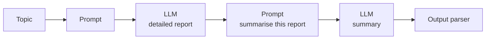
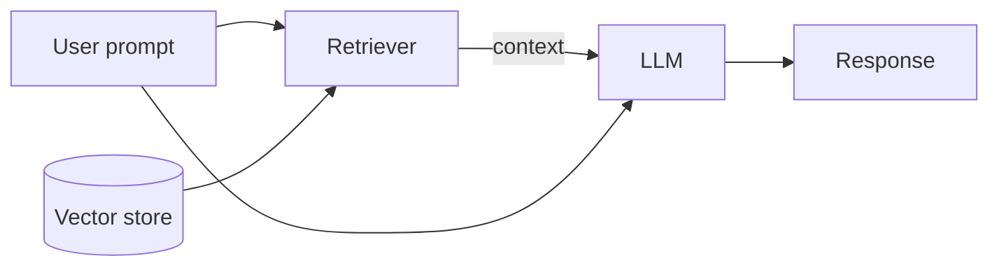
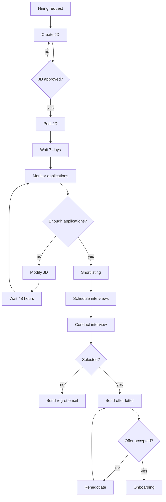
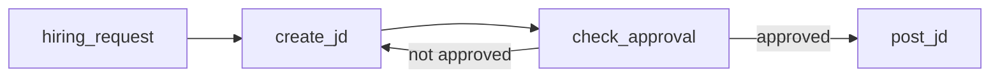
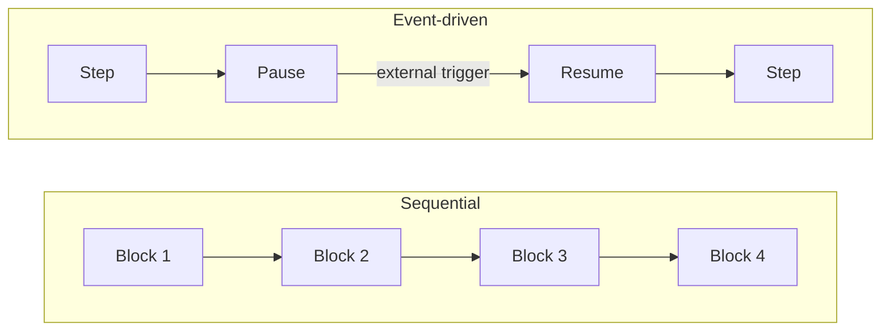
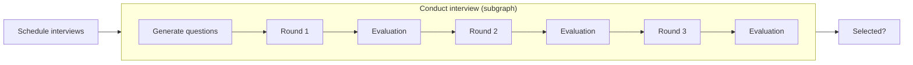

> **Video 4 of 28** · [Watch on YouTube](https://www.youtube.com/watch?v=31qyMKNB2RA) · Translated from the
> Hindi transcript. Notes follow the video section by section, in its order.

This video builds a deep intuition for why LangGraph was needed when LangChain already exists, so that by the end, looking at any application, you can tell whether it should be built with LangChain or with LangGraph.

## Recap of the playlist so far

This is the third video of the Agentic AI using LangGraph playlist. The two before it covered:

1. The key differences between **agentic AI and generative AI**.
2. A detailed overview of **what agentic AI is**: the definition, a practical **automated hiring** scenario showing visually, step by step, how agentic AI solves a problem, then the key characteristics and traits of agentic AI, and finally its key components.

With the "what" and "why" of agentic AI covered, the focus now shifts to how you **practically develop** agentic AI applications.

## Why a framework, and why LangGraph

Building agentic AI applications is honestly difficult, so you do not write the whole thing from scratch in plain Python. Many frameworks exist to make it easy: **CrewAI**, Microsoft's **AutoGen**, and a recently released agents SDK, among others.

The framework used throughout this playlist is **LangGraph**. It is made by the **LangChain team**, which is its biggest speciality, since LangChain is already a very well-known product. Going by the feedback so far, LangGraph is one of the top frameworks for building agentic AI, and every agentic application in this playlist is built with it.

## Goals for this video

Three goals:

1. A **deep intuition for why LangGraph exists**: what problem LangChain cannot solve that made LangGraph necessary.
2. A **technical overview of what LangGraph is**.
3. **LangChain vs LangGraph**: both are libraries, so what are the differences?

The payoff: when you look at any application, you will understand whether to build it with LangChain or LangGraph.

Two things before starting:

- **This video is long**, perhaps longer than usual. The difference could be explained in 10 to 15 minutes, but here it is shown through a proper example at a deep level. Watch it end to end and you will be able to answer any interview question on the key differences.
- **Prerequisite: LangChain.** You should know what LangChain is, what you can do with it, and how basic LangChain code is written. If not, first cover the LangChain playlist, at least its first two videos: the introduction to LangChain and the components of LangChain.

## A quick recap of LangChain

The definition on screen: *"LangChain is an open-source library designed to simplify the process of building LLM-based applications."*

Since LLMs arrived, there is a culture of integrating an LLM into every piece of software: a chatbot inside a food-delivery app, a Chrome plugin that lets you chat with the YouTube video you are watching. These are **LLM-based applications**. Building them is difficult because many kinds of things have to be joined together, and LangChain simplifies that process.

It does so through **modular building blocks**, from which you can build any kind of LLM-based workflow:

- **Model**: a **unified interface** for talking to any LLM provider's models, whether OpenAI's LLMs, Anthropic's Claude models, or open-source models via Hugging Face or Ollama. If you replace one LLM with another tomorrow, your code needs few changes. The first and most important component.
- **Prompts**: for engineering any kind of prompt. LLMs work entirely on prompts, and this component helps throughout the design process.
- **Retrievers**: fetch relevant documents from any vector store or knowledge base, however large and diverse, using different strategies and algorithms. This is what you build RAG applications with.
- **Chains**: LangChain's biggest offering, which is why "chain" is in the name. You join components together, for example prompt to model to output parser, into a chain of any length, and the **output of each block automatically becomes the input of the next**. You do not do this manually; LangChain does it.

### What you can build with LangChain

Because of these building blocks and the chain concept:

1. **Simple conversational workflows**, such as chatbots or text summarisers: take a prompt from the user, send it to an LLM, show the output. Put it in a loop and you have a chatbot.
2. **Multi-step workflows**. For example: take a topic from the user, generate a detailed report on it, then generate a summary of that report. Join a prompt to an LLM, that LLM to a new prompt ("generate a summary for this detailed report"), that prompt to another LLM, and that to an output parser.



3. **RAG-based applications**. Your company's documents and PDFs are stored as embeddings in a vector store, and you want to ask things like "what is my company's leave policy?" or "how many days is the notice period?". The user's prompt goes to the retriever, which searches for related text and fetches it (the **context**); the context and prompt go to an LLM, which understands the question and the context and generates a response.



4. **Simple-level agents**. LangChain has the concept of **tools** (APIs or Python functions) that you connect to the LLM, and the LLM decides when to call which tool with what input. Give the LLM a weather API tool; when the user asks "what is the weather in Gurgaon?", the LLM does not know, so it triggers the tool, gets Gurgaon's weather back, and formats it in its response. Not exactly agentic, but agent-based workflows of this kind are easy in LangChain.

All of this was covered in detail in the LangChain playlist; if it feels new, watch that first.

## The automated hiring workflow as a flowchart

From here the video proper starts. The plan: take the somewhat complex **automated hiring** workflow from the previous video, understand exactly how it works, then think through (conceptually, not with exact code) how it would be built in LangChain and what challenges would come up.

A detailed, comprehensive flowchart was made for this example, so large it had to be zoomed out to fit on screen.

### A workflow, not an agent

A critical distinction first: **what is on screen is not an agentic AI application. It is a workflow.** Anthropic's blog post *"Building effective agents"* explains the difference in simple words:

- *"Workflows are systems where LLMs and tools are orchestrated through predefined code paths."*
- *"Agents, on the other hand, are systems where LLMs dynamically direct their own processes and tool usage, maintaining control over how they accomplish tasks."*

In the previous video, a human recruiter told the system "I need a backend engineer" and the agentic application did everything else: it planned the steps itself and executed them one by one, making all the decisions about which steps and in what order. Here, the flowchart is already made, **by the developer**, and executes in the same order every time. That is why it is a workflow. An agent builds the flowchart itself, dynamically: one flowchart on the first run, another on the second. This one is **static**: run it once or 100 times, information flows exactly as shown. Both use LLMs, but one is more autonomous and the other is created by humans.

So here it is you, the developer, who makes the flowchart and then codes the application in LangChain.

### Walking through the flowchart

1. **Hiring request received.** A prompt says: hire a backend engineer, remote, 2 to 4 years of experience.
2. **Create JD.** An LLM writes a detailed job description from the prompt.
3. **JD approved?** The JD goes to the human supervisor for approval. If they do not like it, go back to create JD, take feedback and redesign it.
4. **Post JD.** If approved, post it on job platforms using tools, for example the APIs of LinkedIn and naukri.com.
5. **Wait 7 days**, so that as many people as possible apply.
6. **Monitor applications.** Using a tool (the LinkedIn API), check how many applications have come in on the job posted 7 days ago.
7. **Enough applications?** Suppose the threshold is 20; the interview process does not start below it.
   - **No**: say only 10 have come. **Modify the JD** to raise the chances of more applications: loosen eligibility (include freshers instead of 2 to 4 years), change backend engineer to full-stack engineer, raise the salary by 2 lakh, something like that. Then **wait 48 hours** and monitor again. Say 15 now: no again, modify again, wait again, monitor again. A loop forms until the exit condition is met.
   - **Yes**: one day there are 25 applications.
8. **Shortlisting.** A resume-parser tool downloads and parses all the resumes, and an LLM generates a score for each. Suppose five people score above the threshold.
9. **Schedule interviews** for those five, using tools: a calendar API to check the interviewer's availability and a mail API to email everyone.
10. **Conduct interview.** Several things happen here: give the interviewer a question bank, send reminder mails, conduct the interview.
11. **Selected?** Asked for each of the five candidates.
    - **No**: say Nitish was not selected; send him a **regret email**.
    - **Yes**: say Rahul was selected; **send an offer letter**, using an LLM to create the letter and mail APIs to send it.
12. **Offer accepted?** Keep tracking. If not accepted, a human **renegotiates** (perhaps raises the salary a bit), a new offer letter goes out, and you wait again.
13. **Onboarding**, once accepted: tools integrated with the HR management system send a welcome email, plan the KT session, provision a laptop, and so on. The hiring process ends here.



If you can code this properly, you can run a hiring drive through it. Conceptually it is clear. The big question is implementing it in code, **using LangChain**. Basic workflows, especially linear ones, are easy in LangChain, but this is a somewhat complex workflow, and you may already sense it will not be easy.

What follows is a point-by-point discussion of the problems you would face building this in LangChain, and how LangGraph solves each, giving a clear side-by-side picture of the key differences and why LangGraph was needed.

## Challenge 1: control flow complexity

LangChain is mostly used to build **chains**, and a chain is a **linear workflow**. This flowchart is **highly non-linear**, for three reasons:

1. **Conditional branches**: based on a condition, control goes one way or another (enough applications or not).
2. **Loops**: at several places. If the JD is not approved, make it again, and keep doing so until it is approved.
3. **Jumps**: control suddenly lifts from one place and goes somewhere ahead, or back somewhere behind. After waiting 48 hours, for example, control goes back.

### Building a subset in LangChain

To show the difficulty, a subset of the flowchart is built in LangChain: hiring request, create JD, JD approved?, post JD. It needs a loop and a small conditional: if the JD is not approved the loop runs; if approved, something else happens.

- A **hiring prompt** from the user: "We need to hire a software engineer for our backend team."
- An LLM and a prompt template, "Create a job description based on the hiring request", into which the hiring request goes. This is the create-JD step.
- A chain: JD prompt into the LLM, output into the string output parser.
- A function for approving and a function for posting. These are **dummy functions**; you would write proper code there later.

Then everything is stitched together: while `approved` is false, make a new JD with the JD chain and send it to the approve function. If not approved the loop keeps running; once approved, exit the loop and post it.

The narration names the pieces but not every identifier, so names below that were not spoken are marked:

```python
from langchain_openai import ChatOpenAI  # (implied, not shown in narration)
from langchain_core.prompts import PromptTemplate  # (implied, not shown in narration)
from langchain_core.output_parsers import StrOutputParser  # (implied, not shown in narration)

# hiring request
hiring_request = "We need to hire a software engineer for our backend team."

# create JD
llm = ChatOpenAI()
jd_prompt = PromptTemplate.from_template(
    "Create a job description based on the hiring request: {hiring_request}"
)
jd_chain = jd_prompt | llm | StrOutputParser()

# dummy functions
def approve_jd(jd):  # (implied, not shown in narration)
    return True      # dummy

def post_jd(jd):     # (implied, not shown in narration)
    print("JD posted")  # dummy

# glue code: the loop and the condition
approved = False
while not approved:
    jd = jd_chain.invoke({"hiring_request": hiring_request})
    approved = approve_jd(jd)

post_jd(jd)
```

### The problem: glue code

The chain part is LangChain. But the loop part is **custom Python code, not LangChain code**, and you had to write it because LangChain gives you no construct for running a loop. Code you write outside the library to stitch the whole flow together is called **glue code**, and **the less glue code, the better**.

This is only a small part of the flowchart. With loops, conditionals and jumps at many places, think how much glue code accumulates as the application gets fully built. The more glue code, the harder it is to maintain. LangChain simply does not have constructs for conditional branching, loops or jumps, so you build them yourself in Python; that makes a big complex project hard to maintain, hard to debug and hard to work on in teams. This is LangChain's biggest flaw: it works really well for linear workflows (chains), but as soon as non-linearity enters, it gives up.

### How LangGraph approaches it

In LangGraph you **represent the whole workflow as a graph**, which is where the name comes from. Each task is a **node**: hiring request, create JD, JD approved, post JD. Between the nodes you draw **edges**, and the edges decide the control flow. Since a graph is a non-linear data structure, you can represent any complex workflow easily.



In the LangGraph code shown, you create a graph and add nodes: hiring request, create JD, check approval, post JD. The nodes are **simple Python functions** (the create-JD function, the check-approval function, the post-JD function), passed in as you add each node. Then you draw edges: hiring request to create JD, create JD to check approval. For the loop and the branch there are **conditional edges**: check approval tells whether the JD was liked; if so, go to post JD, otherwise loop back to create JD. The last edge is added after post JD.

```python
from langgraph.graph import StateGraph, END  # (implied, not shown in narration)

graph = StateGraph(HiringState)  # state class (implied, not shown in narration)

graph.add_node("hiring_request", hiring_request)
graph.add_node("create_jd", create_jd)
graph.add_node("check_approval", check_approval)
graph.add_node("post_jd", post_jd)

graph.add_edge("hiring_request", "create_jd")
graph.add_edge("create_jd", "check_approval")
graph.add_conditional_edges(
    "check_approval",
    is_approved,  # routing function (implied, not shown in narration)
    {"yes": "post_jd", "no": "create_jd"},
)
graph.add_edge("post_jd", END)
```

The beauty is that there is **zero glue code**. No while loop, no if-else: LangGraph runs the loop, runs the branching, and makes any jumps for you. You do not know how to code in LangGraph yet, but you can see the idea: any workflow, however complex, becomes a graph where each task is a node and the control flow between them is edges, and on those edges you can loop and branch. Maintainability is high, and you can build an application of any complexity properly. LangChain struggles here; LangGraph flourishes.

## Challenge 2: state handling

### What state is

Which data matters in the hiring workflow? Several data points:

- The **JD** itself, integral to the workflow: it gets approved, posted, and people apply after reading it.
- Whether the **JD is approved**, since the further flow depends on it.
- Whether the **JD is posted**, for the same reason.
- **How many people have applied** so far.
- The **minimum number of applications** needed to start interviews.
- **How many candidates were shortlisted** and their contact details.
- **How many people were sent offers**.
- The **status of the offer**.
- The **status of onboarding**.

These data points and their values **evolve gradually** as the workflow moves on. At the hiring request, the JD has no value (None). At create JD, it gets set. At JD approved, the approval status becomes true or false. At post JD, JD-posted becomes true. At monitor applications you check the threshold (5 or 20, whatever it is) and decide. At shortlisting you record how many candidates were shortlisted.

**This set of data points, all put together, is the workflow's state.** The whole workflow functions only through it: it tells you where the application currently stands and where to go next. No workflow can execute if its state is not tracked properly.

### Why state is hard in LangChain

A workflow's state exists as **key-value pairs**, and LangChain gives you no option to store and track such key-value pairs. LangChain does have **memory**, but it is **conversational memory**: the chat you have had with the LLM is stored and passed back and forth through the chain so the LLM knows the past conversation. There is no mechanism for storing and tracking this kind of data.

So workflows built in LangChain are **stateless**. To implement state you do it manually: make a dictionary at the top of your code and handle it the whole time, changing values by hand as things move through the chain, removing things when needed. With a long chain you keep coming back at every step to edit this global dictionary, which is hectic for a complex workflow and makes mistakes much more likely.

A complex workflow will naturally have a complex state with many fields, and LangChain has no intrinsic mechanism for it. Your only options are to treat the whole state like conversational memory (as text), or to make a dictionary yourself, pass it around the chain and update it manually.

### How LangGraph handles state

Execution in LangGraph is **stateful**. When you create your graph you also create a **state object**, which can be made with **Pydantic** or with a **TypedDict**. It is basically a dictionary, and its speciality is that it is **accessible to every node** of the graph: any node can read it, and because it is **mutable**, any node can edit it.

When the graph executes: the create-JD node creates the JD and updates the JD's value in the state. The JD-approved node sets the approved field to true. The post-JD node sets the JD-posted field to true. Every node has the whole state available at all times, makes its changes, and those changes are visible to every node.

In the code shown earlier, every node gets a **state as input** and its **output is also a state**. As the graph executes node by node, each node is handed the state object ("this is the situation right now"), does its processing, updates what it needs to, and the updated state reaches the next node. Information passing in LangGraph is excellent: however many fields your state has, you define it as a dictionary and it is LangGraph's job to deliver it to every node and apply updates properly.

The important terms: **LangChain is stateless, LangGraph is stateful.** That is why LangGraph is much better suited to complex workflows.

## Challenge 3: event-driven execution

Any workflow can execute in two ways: **sequential** or **event-driven**.

**Sequential**: a multi-step LangChain chain where you take the user's prompt, send it to an LLM, make a second prompt from the response, send it to a second LLM, and show the final response. It executes left to right **without stopping**: as soon as one block finishes, the next starts, and nowhere in between does execution pause.

**Event-driven**: the workflow **pauses** somewhere in the middle and **waits for an external trigger**; when the trigger comes, it **resumes**.



The hiring workflow has several event-driven points:

- After posting the JD, you monitor applications **only after 7 days**. Post on LinkedIn today and do nothing for seven days: pause, and resume when the trigger "7 days are up" arrives.
- After modifying the JD, pause again and resume from the same place two days later.
- After sending the offer letter, further work happens only when the candidate **accepts or rejects** it. The external trigger is the candidate's reply.

Somewhat complex agentic AI systems very often need event-driven execution.

### Why LangChain cannot do it

**LangChain was built for sequential execution**: once a chain starts, it stops only after finishing its work. There is no functionality for a chain to start, stop, and continue after 7 days. To build this in LangChain you would make **two chains**: the first does its work and ends; external Python code tracks how much time has passed; then you trigger the second chain. And between them you manually code the **state transfer**. Again a lot of glue code, for event handling and for state transfer.

### How LangGraph does it

LangGraph **inherently** supports event-driven execution. Because execution is stateful, on reaching a particular node you can **store your current state** using a feature called the **checkpointer**, in memory or in an external database. You save your progress, pause, and wait for the external trigger. When it comes, you look up your current state and resume from right there. Event-driven execution is part of LangGraph's design, an out-of-the-box solution.

## Challenge 4: fault tolerance

**Fault tolerance** means that if something goes wrong in a system, it can still recover and run properly again. It matters most in **long-running** workflows, and the hiring workflow is one: make and post the JD, wait 7 days, modify and wait two more days if needed, schedule, conduct interviews, wait for the offer to be accepted, onboard over several days. It can run for days, even months, so faults are more likely.

Two kinds of fault:

- **Small**, at node level: you made the JD and are about to post it, but LinkedIn's API is not working.
- **Big**: the AWS server on which you deployed the workflow goes down.

Ideally you recover from both.

### LangChain has no fault tolerance

If a five-step chain fails at step three because the system went down, you must **execute the chain again from the start**. Real fault tolerance means resuming from where the system broke, and LangChain does not provide that. LangChain assumes its chains are **short-lived**: triggered, quickly done, execution over. So fault tolerance was not considered that important.

### LangGraph has built-in fault tolerance

For both kinds of situation:

- **Small faults: retry.** If LinkedIn's API is down when posting the JD, you can write LangGraph code that catches the error and tries again after a while. This **retry logic** handles small-level faults.
- **Big faults: recovery.** The server went down, the machine shut off, the Docker container died. Suppose execution had reached a certain node when that happened. With **recovery** you resume from exactly that place, so the next node to execute is the one after it, not the first one.

Recovery again uses the **checkpointer**. Execution is stateful, the state is continuously tracked and saved, in memory or an external database: a **persistence layer**, to be studied later. LangGraph **creates a checkpoint after every node's execution**, a snapshot of the state after that node, and stores it. If something big goes wrong, you resume the graph: tell it the previous state from when the system went down, and it identifies that state, the node where the problem happened and the next node, and restarts execution from that point.

:::note
The video mentions "a function called resume". LangGraph has no function by that name. You resume a checkpointed graph by invoking it again with the same thread configuration (the `thread_id` in `config`), or, after an interrupt, by passing `Command(resume=...)`. The idea of resuming from the last checkpoint is as described.
:::

LangGraph's fault tolerance is high by design: complex workflows are long-running, and long-running workflows will hit faults, so both retry and recovery come built in.

## Challenge 5: human in the loop

**Human in the loop** is when, at some stage of the workflow, you need a **decision from a human**. In the hiring workflow, right after the JD is made, it needs the approval of the human driving the system, and the workflow cannot move on until that approval comes. Other examples: before posting the JD on a website, you might require the workflow to ask you first ("you will not post anything on any website without asking me"). In real-world workflows there are many places where you want control to sit with the human, not the agent, because for risky things **accountability should be the human's**. This pause for the human in the middle of the workflow is human in the loop.

### Why it is a problem in LangChain

LangChain has **no default mechanism** for a chain to pause, wait for a human, and resume after approval. You can ask the human for input somewhere in the middle of a long chain, but because the chain is **synchronous and sequential**, that only works for a short wait. If getting the manager's approval takes 24 hours, your script sits stuck in the same place for 24 hours, eating compute, and may crash in between. The same underlying problem again: LangChain is not designed for long-running workflows.

One workaround is to **split the chain in two** at the approval step. When execution reaches that point, the first chain ends and you ask for approval; when it arrives one or two days later, you start the second chain. But then the workflow's state up to that point must be passed to the second chain manually: more glue code, more maintainability problems. In short, human in the loop is not in LangChain by default; short waits are possible, long-running ones are not.

### Human in the loop in LangGraph

In LangGraph, human in the loop is a **first-class citizen**: the feature was added explicitly while the framework was being built, and its documentation has a dedicated human-in-the-loop section. From its key capabilities: *"LangGraph allows you to pause execution indefinitely, for minutes, hours or even days, until human input is received. This is possible because LangGraph checkpoints the graph state after every step, which allows the system to persist execution context and later resume the workflow, continuing from where it left off. This supports asynchronous human review or input without time constraints."*

The concept is the same as in the previous two challenges: execution is stateful, so the checkpointer saves all progress up to the point where human review is needed, and when the review comes you resume from exactly that place.

It is like a **video game**. You are on stage three and need to shut the game down today; you save your progress, and tomorrow you resume at stage three. LangGraph gives you exactly that mechanism. This is an important feature and is studied in detail later.

Challenges three, four and five are connected: they all rest on **stateful execution** and the **checkpointer**.

## Nested workflows (a feature)

This one is less a challenge than a **feature**: **nested workflows**, a workflow inside a workflow.

In LangGraph any workflow is a graph and every node is a task. It is possible to **replace a single node with another graph**, or equivalently, a node can itself be a graph. These are **subgraphs**, and with them you can build any kind of nested workflow.

In the hiring workflow, "conduct interview" is a single node, but it is itself a very complex task: generating questions for each candidate, then round one, evaluation, round two, evaluation, round three, evaluation. It can be treated as a separate workflow connected into the big one. Inside one workflow you can have any number of other workflows, each represented as a node in the big graph.



LangGraph's documentation has a separate section on this: *"A subgraph is a graph that is used as a node in another graph. This is the concept of encapsulation applied to LangGraph. Subgraphs allow you to build complex systems with multiple components that are themselves graphs."*

The main thing to understand later is that the inner graph and the outer graph **each have their own state**, and how those states communicate is studied when subgraphs are covered. For now, know that it is possible and has two big use cases:

1. **Multi-agent systems**, where multiple agents work together. Example: a **self-driving car**. Its smart driving system could have one agent that brings in and processes information from all the sensors, a second that handles driving, a third that handles the car's entertainment, and a fourth that works like a **CEO**, getting work done by the others. Multi-agent systems are deployed in many places to solve complex problems, and in LangGraph you build them with subgraphs.
2. **Reusability**. Make a small graph reusable and use it as is in several places in a bigger graph. The hiring workflow needs **approval** in many places: approving the JD, posting the JD, scheduling interviews. Make one small approval workflow and reuse it throughout, just as functions in programming let you reuse code.

LangChain does not have this feature. When it already struggles to build this workflow, building another workflow inside it is not possible at all. So for LangChain it is a challenge; for LangGraph it is a feature.

## The last challenge: observability

The definition on screen: *"Observability refers to how easily you can monitor, debug and understand what your workflow is doing at runtime."*

At runtime many things can go wrong: an error, a crash, a decision you did not anticipate. Especially in production, with users using your workflow or agent, it is very important to monitor closely how it is running. Imagine an agent posted a job on LinkedIn and ran ads **without a limit**, spending a lot of money. For **auditing** you need to go back and see which steps led the agent to think it could spend any amount. Observability helps a lot with auditing and with debugging.

### Observability in LangChain

LangChain does have observability, through a library called **LangSmith**, whose purpose is monitoring LLM-based applications. Integrate LangSmith with LangChain and it monitors LangChain closely: if a step in the chain calls the LLM, LangSmith records it, along with the prompt sent, the reply, the number of tokens in the reply, and the time taken, so you can review the chain later.

The one problem: **LangSmith can only monitor LangChain; it cannot monitor your glue code.** Complex workflows in LangChain need glue code, such as your own while loop. LangSmith tracks the LangChain parts, such as the LLM call, but cannot understand what is happening inside the loop, or which iteration the message just sent to the LLM belongs to. So complex LangChain applications get **partial observability**, not complete.

### Observability in LangGraph

LangSmith has a very **tight integration** with LangGraph. Because LangGraph execution is stateful, everything is tracked: which node executed after which, the whole timeline of events, recorded in LangSmith. LangGraph itself reports this to LangSmith. You have information on what happened at each node's execution, what changed in the state (the state before entering and after leaving each node), the messages exchanged between the human and the agent, and when the human came into the loop and gave approval.

The result is a **chronological timeline** of the whole run, which you can backtrack with LangSmith from start to end. It may seem advanced now; later in the playlist observability is covered properly, including integrating LangSmith with LangGraph and how that integration works.

For now: monitoring production workflows closely is very important for debugging and auditing. With LangChain you get observability only partially because of the glue code. With LangGraph there is no glue code, everything is written inside LangGraph, so it can tell a tool like LangSmith exactly why each decision was taken at each point, which makes debugging very easy. If this feels difficult, leave it for now; it is studied in detail later.

## Conclusion: revision questions

### What is LangGraph?

*"LangGraph is an orchestration framework that enables you to build stateful, multi-step and event-driven workflows using LLMs. It's ideal for designing both single-agent and multi-agent agentic AI applications."*

*"Think of LangGraph as a flowchart engine for LLMs. You define the steps as nodes, how they are connected using edges, and the logic that governs the transitions. LangGraph takes care of the state management, conditional branching, looping, pausing and resuming, and fault recovery: features essential for building robust, production-grade AI systems."*

If you have watched the whole video, not one of these terms should feel alien.

### When to use what?

| Use LangChain when you are building… | Use LangGraph when you are building… |
| --- | --- |
| Simple, linear workflows | Complex, non-linear workflows |
| A prompt chain, a summariser, a basic RAG system | Workflows needing conditional paths, loops, a human-in-the-loop step, multi-agent coordination or collaboration, or asynchronous event-driven execution |

This was the promise at the start: when you pick up a new project and understand its requirements, you will know whether it calls for LangChain or LangGraph.

### Should you drop LangChain and learn only LangGraph?

**No.** LangGraph is **built on top of LangChain**. It was not built to replace LangChain; it solves more complex problems, but it does so **with the help of LangChain**. Even in very complex workflows you still interact with an LLM, write prompts and load documents, and all those components still come from LangChain: `ChatOpenAI`, `PromptTemplate`, retrievers, document loaders, text splitters, tools. You use **LangGraph to join and orchestrate** those things.

The two have different purposes. LangChain's main purpose is to provide the **components**, along with a basic system for making workflows (the chain). If you want complex workflows rather than chains, use LangGraph, which is for **orchestrating a workflow, not for components**. The two go hand in hand, and every agent or workflow built later in this playlist uses both. The effort you put into learning LangChain has not gone to waste.

You should now see the big picture of why this library exists. Until you have the answer to "why", the upcoming videos will not be as enjoyable, and with it you can look forward to them.
