> **Video 5 of 28** · [Watch on YouTube](https://www.youtube.com/watch?v=D5KhiCDM9XQ) · Translated from the
> Hindi transcript. Notes follow the video section by section, in its order.

This video covers, without code, the core LangGraph concepts you will meet everywhere, so that when workflows are built in code from the next video onwards, every idea already feels familiar.

## Where this video fits

The previous video was a detailed comparison of LangChain and LangGraph, with an introduction to what LangGraph is, its core capabilities, and when to use each. This one is dedicated entirely to LangGraph: a detailed discussion of the core concepts that show up everywhere. Watching it to the end means that when practical workflows are built from the next video on, you will feel at home and can turn the concepts into code easily. Making notes is recommended.

## A quick revision: what LangGraph is

In the simplest words, **LangGraph is an orchestration framework**. Give it an LLM workflow to execute and it first represents that workflow as a **graph**.

- Every **node** of the graph is one **task** of the workflow. In LLM workflows a task might be calling an LLM, calling a tool, or making a decision.
- The nodes are connected by **edges**, and the edges say which task should execute after a given task finishes.

So LangGraph lets you represent any LLM workflow as a flowchart and then execute it. Once the graph is built, you give input to the first node and trigger the graph; all nodes then execute automatically in the correct order and the workflow completes.

The definition on the slide: *"LangGraph is an orchestration framework for building intelligent, stateful and multi-step LLM workflows."*

LangGraph is not limited to building graphs. It also gives you:

- **Parallel execution**: after one node, the next two nodes can run together.
- **Loops**: after a node you can go back to an earlier node, in cycles.
- **Branching**: after a node, depending on a condition, either one node or another executes.
- **Memory**: whatever tasks execute and whatever conversation happens can be recorded.
- **Resumability**: if the workflow breaks down at some task, you can resume from that same point.

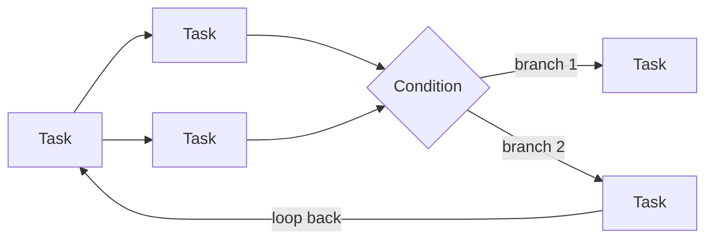

Taken together, these core features make LangGraph an **ideal candidate for building agentic and production-grade AI applications**. The previous video used a real-world use case to show why LangGraph is needed and listed seven core features; it is worth watching if you have not, since that material is not repeated here.

## Core concept 1: LLM workflows

LangGraph was defined as a framework for building LLM workflows, so it is worth pinning down the term.

A **workflow** is a series of tasks executed in order to achieve a goal. The automated-hiring example from earlier in the playlist is one: create the JD, post it, shortlist, interview, onboard. Only by running that series of steps in the right order does the hiring workflow complete.

An **LLM workflow** is a workflow in which many of the tasks depend on LLMs. Automated hiring is an LLM workflow because several tasks need an LLM: writing the JD, perhaps shortlisting, perhaps conducting interviews. Any workflow that uses LLMs during its execution is called an LLM workflow.

From the slide:

- LLM workflows are step-by-step processes using which we can build complex LLM applications.
- Each step performs a distinct task such as prompting, reasoning, tool calling, memory access or decision making.
- Workflows can be **linear, parallel, branched or looped**, allowing complex behaviours like retries, multi-agent communication or tool-augmented reasoning.

Every application has its own workflow (automated hiring is different from automating a call centre), but certain **common workflows** appear in many places. There are five of them, and the playlist will build them.

### Common workflow 1: prompt chaining

You call the LLM **multiple times in series**: once, twice, three times in sequence.

Example: the user gives a topic and you must produce a detailed report on it. Rather than going straight from topic to report, you break the task down. The topic goes to the first LLM, which draws an **outline**; the outline goes to a second LLM, which writes a **detailed report** from it.

Use prompt chaining when a complex task can be divided into subtasks. A bonus is that you can put **checks** in between to confirm the process is working. In this use case, one check could be that the report must not exceed 5000 words; if it does, you exit.

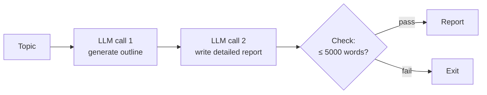

### Common workflow 2: routing

You understand a task and then **decide who should execute it**.

Example: a customer-support chatbot receives a query, which could be about a technical platform, a refund, or sales. An LLM looks at the query and decides whether it is refund-related, a technical doubt, or sales-related, then routes the request to the matching LLM. That first LLM acts as a **decision maker**, choosing which of the three LLMs is most capable of solving the query. In effect, the LLM call works as a **router**. This small pattern gets reused inside many different workflows.

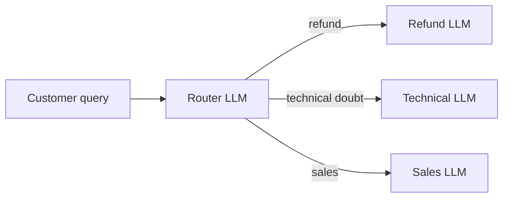

### Common workflow 3: parallelisation

You break a task into multiple subtasks, **execute them all together**, then merge their results into the final outcome.

Example: a **content-moderation workflow** for a platform like YouTube. When a video is published, YouTube first checks whether it is appropriate to go live. The same video must be checked from several angles:

1. Does it follow YouTube's **community guidelines**?
2. Does it contain **misinformation**?
3. Does it contain **sexual content**?

Only if it passes all three does it go live; otherwise it is flagged. The fun part is that the three checks are independent: checking misinformation does not require knowing the guidelines result first, and so on. So you take the video's content, generate its transcription, send it to three LLMs at once (one per check), and an **aggregator** decides from the three results whether the video should be published. This pattern also appears in many places, and the playlist will build it.

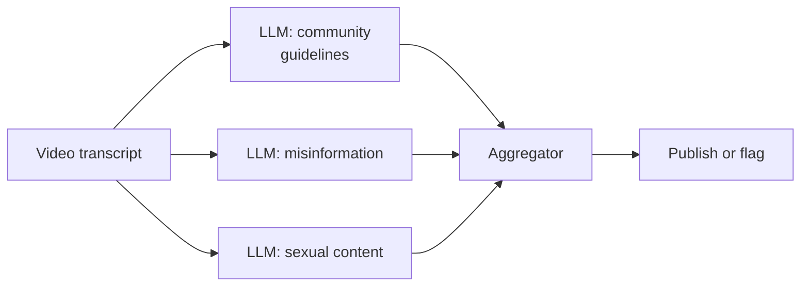

### Common workflow 4: orchestrator-worker

Very similar to parallelisation: a task is divided into multiple parallel subtasks. The **only difference** is that the nature of the subtasks is **not known in advance**; it is decided dynamically. In the YouTube example it was predefined that the first LLM judges community guidelines, the second misinformation, the third sexual content. Here, you do not know beforehand what each LLM will do.

Example: a **research assistant** that produces a detailed research report on a given query. The system must search the term on multiple platforms and aggregate the information into a report. But where and what to search depends on the query:

- A scientific or technical term might send the first LLM to **Google Scholar**, where research papers are.
- A social phenomenon or political incident might send it to **Google News**.

Because the subtasks vary so much with the input, an LLM called the **orchestrator** analyses the query and decides what work each of its **workers** (the sub-LLMs) gets. Things still run in parallel and the results are aggregated at the end; the difference is that the nature of each task depends on the input query. The playlist hopes to cover this one too.

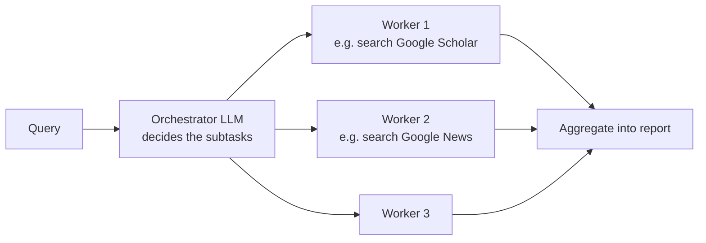

### Common workflow 5: evaluator-optimiser

For tasks that **cannot be done perfectly in one go**. Drafting an email or writing a blog on a topic: there is no guarantee the first attempt is the best. Emails, blogs, poems and stories are creative work and need iteration. A poet or writer writes a first draft, sees what is lacking, turns that into feedback, writes a second draft, and repeats in a loop; after five or six rounds they have a good final product.

The evaluator-optimiser workflow does the same with two LLMs:

- A **generator LLM** takes the task (write a blog, write an email) and produces a **solution**.
- An **evaluator LLM** is given a concrete **evaluation criterion** and either **accepts** or **rejects** the solution; on rejection it also gives **feedback**.

On rejection the generator uses the feedback to produce a new solution, and this loops until the evaluator is satisfied and accepts; then the loop breaks and you get the output. This workflow will be built right after loops in LangGraph are taught.

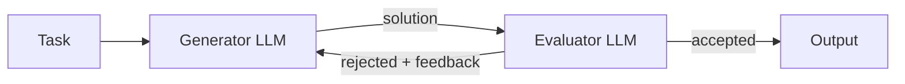

That covers LLM workflows in a nutshell and the five common ones, all of which the playlist will try to cover.

## Core concept 2: graphs, nodes and edges

Together these are arguably **the most important core concept of LangGraph**, because LangGraph represents any LLM workflow as a graph.

### The example: a UPSC essay-practice website

In the UPSC Mains exam, candidates write one or two essays, which carry a lot of weight; cracking them is considered important for cracking UPSC. Imagine a website that lets UPSC aspirants practise writing these essays:

- When a user arrives, the site **generates an essay topic**.
- The user types an essay on it and submits.
- The site analyses and **evaluates** the essay from multiple perspectives and generates a **score**.
- Above the **cut-off**: congratulate them. Below it: give **feedback**, and offer the option to write the essay again based on that feedback, which is then evaluated again.

This runs in iterations and needs LLMs in multiple places. To build it with LangGraph, first convert the high-level goal into **actionable steps**:

1. Generate the topic.
2. Collect the essay the student has written.
3. Evaluate it.
4. Since it is checked from multiple perspectives, aggregate those results.
5. Tell them whether the essay was good or bad.
6. Give feedback.
7. If they want, let them write a revised essay.

Write this flow out with pen and paper first; then it can be represented as a graph with LangGraph.

### The flow as a graph

The same flow, drawn as a graph:

- The topic is generated, the user writes the essay, and the essay is collected.
- It is evaluated on three things:
  - **Clarity of thought** in the essay.
  - **Depth of analysis**, including fact checks.
  - **Language**: strength of vocabulary, grammatical mistakes, tonality.
- Each gives a normalised score out of **5**, so the essay is scored out of **15**.
- With a threshold of **10**: above 10 is success, you congratulate them and the flow ends. Below 10, you tell them "the essay was not up to the mark", give feedback on all three dimensions about what went wrong, and ask whether they want to write it again. **No** ends the flow; **yes** goes back and the whole flow executes again.

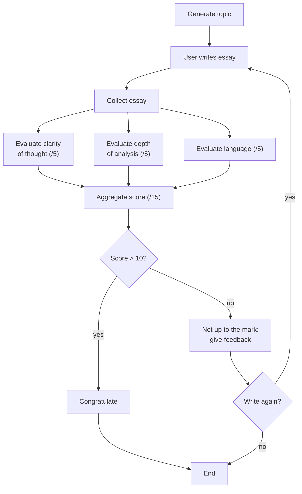

### What the graph shows

The first observation: any flow of this kind can be represented very easily as a graph.

The second: the graph contains two things, **nodes** and **edges**.

- Every **node** represents a **single task** of the workflow. Behind the scenes, every node in LangGraph is simply a **Python function**. That's it. If you can write a Python function, you can create a node. So a LangGraph graph is essentially a set of Python functions interconnected by edges.
- **Edges** say which node executes right after a given node. In short, **nodes say what to do; edges say when to do it**.

Edges come in several kinds:

- **Sequential** edges: one node after another.
- **Parallel** edges: two, three or more nodes execute together.
- **Conditional** edges: branching, where the flow goes one way or the other.
- **Loops**.

So the graph structure lets every node represent a task and the edges represent the flow of execution between them, and it gives you the freedom to express sequential, parallel, branching and looping flows. This is very practical material that you will truly appreciate once you write code and build workflows; the first workflow is built in the next video, where you will see how easily all of this is expressed in LangGraph.

## Core concept 3: state

A very important core concept.

Any LLM workflow needs some **pieces of data** that guide it throughout its execution. In the UPSC workflow:

- The **essay** the candidate writes is needed throughout: when you evaluate, what you evaluate is this essay text.
- The **scores** calculated at each evaluation step are needed too, because the final score is computed from them, and the final score decides whether the essay is good or bad.

This information also **evolves over time**. Suppose the essay is stored in a variable. If the candidate fails and writes it again, the new essay is stored back in that same variable, so its content changes over time. The score likewise changes as execution moves forward.

Data that is (1) **required for execution** and (2) **evolves over time as execution proceeds** is what we call **state**. From the slide: *"In LangGraph, state is a shared memory that flows through your workflow. It holds all the data being passed between nodes as your graph runs."*

State is a very critical component. Before you build any graph in LangGraph, you must first **define the state**, adding all the data points as **key-value pairs**. For the UPSC workflow, the data points could be:

- the essay text
- the essay topic
- the score for depth
- the score for language
- the score for clarity
- the overall score

The most powerful property: **at any moment every node has access to the state**. When a node executes, it receives the entire state as input, does its work, makes changes to the state, and sends the state on to the next node. The next node receives it, makes its own changes, and passes the changed state forward.

So the state is:

- **Shared** between all nodes.
- **Mutable**: any node can change it.
- **Evolving** as execution moves forward.

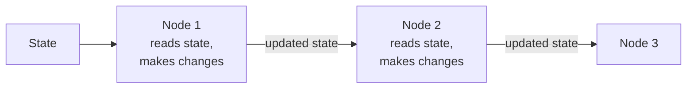

In code, the state is a special dictionary called a **typed dictionary** (`TypedDict`), which is a class in Python. You create one and add all the fields to it. A **Pydantic** object also works, but `TypedDict` is what is mostly used. Nothing special: just a type of dictionary that is always available to every node. It is a very important concept you will use constantly when writing code.

## Core concept 4: reducers

Closely connected to state. Recall the two properties: state is **accessible to all nodes**, and it is **mutable**, so any node can change it.

### Scenario 1: sum, then double

A very basic workflow: take two numbers as input, sum them, multiply the result by two, and print it. The state needs three data points: **first number**, **second number** and **result**.

- The first node receives the numbers; say the user gives 5 and 6. It updates the state: first number 5, second number 6.
- The next node receives that state and sums: 5 + 6 = 11, and updates **result** to 11.
- The next node picks up result, multiplies by two, and stores the value **back in result**: 22.
- Finally, result is printed.

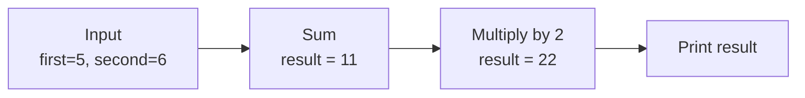

The thing to observe: the sum node wrote result = 11, and the next node **replaced** it with 22, because the value is mutable. Multiple nodes can update the same value, and updating means removing the old value and putting in the new one. In most cases this works with no problem.

### Scenario 2: a chatbot, where replacing fails

In some scenarios, this replace-on-update behaviour hurts you. Take a simple chatbot: a human node and an LLM node talking to each other in a loop. The state is simple: one key, **messages**.

1. The human says "Hi, my name is Nitish". The human node updates messages to that.
2. The LLM node sees it and replies "Hi, how can I help you?", which replaces it.
3. Back at the human node, the human asks "Can you tell me my name?", which replaces the previous message.
4. The LLM node now sees only that question. It can **never** tell the user's name, because the message containing the name has been erased from the state.

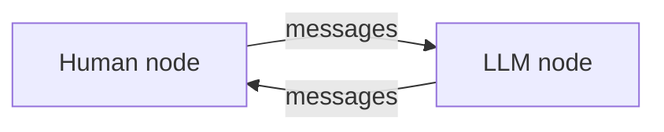

In a chatbot, the update policy fails. Ideally, rather than replacing the message, you should **keep adding** every message that has come into the chat so far.

### What a reducer is

That is the idea of a **reducer**: it says **how updates to the state are applied**: replace, add, or merge. From the slide: *"Reducers in LangGraph define how updates from nodes are applied to the shared state. Each key in the state can have its own reducer, which determines whether new data replaces, merges or adds to the existing value."* So one key might be replaced, another added to, a third merged.

### The UPSC example again

The UPSC workflow has a case where you should **preserve** past values rather than replace them. The **essay text** key stores whatever the student writes. The first essay does not turn out well and they write a new one; the variable changes and the old essay is lost. After another evaluation the feedback is still poor, so they write a third; the second disappears and the third is stored.

But what if the student wants to see their own evolution: the first, second and third essays, and how they are improving? Then replacing is the wrong policy. You **add** instead: keep the first essay, append the second, append the third. You simply provide a function called `add` for that key, so previous values are not erased and new ones keep getting appended.

Reducers will be shown in a use case later. They are generally most useful in **parallel workflows**, so they will be coded and used when the parallelisation workflow is built.

## The LangGraph execution model

One last, somewhat conceptual topic before concluding: how LangGraph executes a workflow behind the scenes.

An interesting fact first: the execution model LangGraph works on is inspired by **Google Pregel**, a system that can do graph processing at very large scale and is integrated into many of Google's products.

What happens when you build and run a workflow:

1. **Graph definition.** Given a workflow, you first create its graph: define the **nodes** and **edges**, and create the **state** (a `TypedDict`).
2. **Compilation.** You call a function named `compile`. The point is to check that the graph's structure is logically correct, for example that there is no node which is not connected to any other node (an **orphaned node**). Inconsistencies of this kind are checked here.
3. **Execution**, starting with **invocation**: you pass your **initial state** to the first node of the graph. That node is **activated**, meaning the Python function attached to it is called and does its work, and afterwards makes a **partial update** to the state.
4. As soon as the partial update happens, the updated state automatically travels along the **edge** to the next node, which is activated in exactly the same way, does its work, makes partial changes, and sends the state on along the next edge.

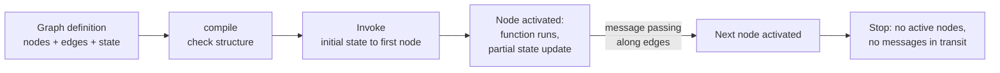

### Message passing and supersteps

Constantly using edges to send the state to the next node is called **message passing**.

The work happens **round by round**: one round, then a second, then a third. In LangGraph's language each round is a **superstep**.

Why "superstep" rather than "step"? Look at the UPSC graph just after the essay node: it has been activated, its function has run, and it has updated the state. Message passing now sends the updated state forward, but there are **three parallel nodes** ahead. The system must send the message to all three, and all three start working together and update the state together. That round consists of **three parallel steps**, so calling it a "step" is not logical; LangGraph calls it a **superstep**, because a graph's structure sometimes gives parallel invocations where more than one step executes at once.

After those three nodes update the state, their updates are **merged through the reducer**, and the state passes along the edges to the next node, which is activated, does its work, updates the state and passes messages, and so on until the end.

Execution **stops** when both conditions hold:

- there is **no active node**, and
- **no message is passing** along any edge.

The point to take away: once you have built a graph with multiple nodes, you do not manually call the first node, hand it the state, wait for it to finish, then call the second node and send it the state. All of that happens internally. The two terms you will keep hearing are **message passing** (sending the state along edges to the next node) and **supersteps** (the workflow is divided into supersteps, and one superstep may contain one step or more than one).

## Closing

All the important core concepts that will come up again and again have now been discussed theoretically and conceptually. When you do these things in code, they should not feel new or alien; you will recognise them as things you have already studied. That is why this video was shot separately.
