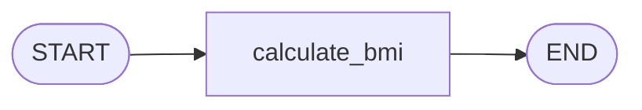
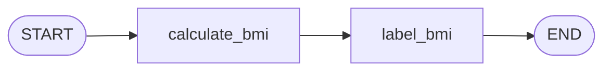
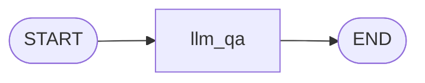
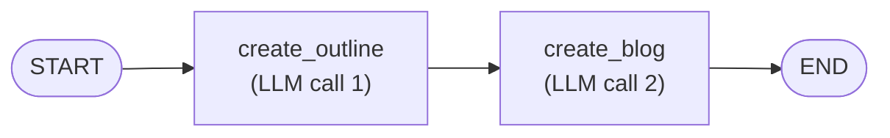

> **Video 6 of 28** · [Watch on YouTube](https://www.youtube.com/watch?v=bAWujyAl1Kk) · Translated from the
> Hindi transcript. Notes follow the video section by section, in its order.

The practical part of the playlist starts here: you learn how basic LangGraph code is written by building simple sequential workflows, so that you can then build any sequential workflow yourself.

## Recap of the playlist so far

Four videos so far, mostly theoretical and conceptual:

1. The main differences between **generative AI and agentic AI**.
2. A detailed deep dive into **what agentic AI is**, built around one use case.
3. **Why LangGraph is needed** when LangChain already exists, and the core differences between the two libraries, again through a use case.
4. The **core concepts of LangGraph** you need in order to code in it.

All the required theory is now covered. From this video on, every video codes and builds something.

## What a sequential workflow is, and the goals for this video

A **sequential workflow** is one where all the tasks are connected in a **linear fashion**: after the first task comes the second, after the second the third, and so on. No branching, no parallel paths.

This lecture has two goals:

1. Teach you how **basic LangGraph code** is written, since this is your first experience of coding in LangGraph.
2. With that code, let you build **any sequential workflow** yourself.

## Installing LangGraph

A folder named "LangGraph tutorials" is created on the desktop and opened in VS Code. The whole playlist will be coded inside this one folder, unless a project needs a completely new structure. The folder will be uploaded to a Git repository, linked in the video description.

In the terminal, first create a virtual environment (here named `myenv`) and activate it:

```bash
python -m venv myenv  # (implied, not shown in narration)
myenv\Scripts\activate
```

Then install the libraries:

```bash
pip install langgraph
pip install langchain
pip install langchain-openai
pip install python-dotenv
```

- **langgraph**: to build the workflows.
- **langchain**: LangChain and LangGraph work together. Even though the workflow is built in LangGraph, any **LLM-related component** comes from LangChain: chat models, prompt templates, document loaders, text splitters.
- **langchain-openai**: because OpenAI's models are used in this lecture.
- **python-dotenv**: to read environment variables.

### Testing the installation

Create a new file, `0_test_installation.ipynb`. All of today's code is written in **Jupyter notebooks**, because a notebook makes it very easy to print and view the graphs you build in LangGraph. Later, when building projects, normal Python files will be used.

```python
from langgraph.graph import StateGraph
```

Pressing Shift+Enter asks you to select a Python environment: choose the virtual environment you just created, where the libraries are installed. On re-running, it asks you to install the `ipykernel` package; install it and the cell runs. Typing `from langgraph` and `from langchain` now gives suggestions, which confirms the installation works.

## Workflow 1: a BMI calculator (no LLM)

The first workflow deliberately has **no LLM component**, so that your whole focus goes on LangGraph's syntax rather than on LLM details.

It is a **BMI calculator**: two quantities, **height** and **weight**, are given as input; a node calculates BMI from them; the result is shown as output. A very simple linear, sequential workflow.

In LangGraph it is represented as a graph, and it needs a **state**. (Pause and think what the state should be.) It has three key-value pairs: **weight**, **height** and **BMI**.



### Imports and the state

Create a new file, `bmi_workflow.ipynb`. The first import is `StateGraph` (explained shortly); nothing else is needed at this point.

```python
from langgraph.graph import StateGraph
```

The flow of any LangGraph workflow starts the same way: **define the state first**. You make a class, named to suit your application (here `BMIState`), which inherits from `TypedDict`. The state is a special dictionary called a typed dictionary: one where you can state the **data type** of each key-value pair.

```python
from typing import TypedDict

# define state
class BMIState(TypedDict):
    weight_kg: float
    height_m: float
    bmi: float
```

Weight is in kilograms, height in metres, and all three are floats.

### Defining the graph

Next, define the graph. Every graph in LangGraph is made with the **`StateGraph`** class. The one thing to make sure of is that you **pass your state** when creating the object. This, in effect, registers your graph.

```python
# define your graph
graph = StateGraph(BMIState)
```

From here, the work proceeds in four steps:

1. **Add nodes** to the graph.
2. **Add edges** to the graph.
3. **Compile** the graph, to check that its structure is correct.
4. **Execute** the graph.

### Adding the node and writing its function

This workflow needs just one node, where BMI is calculated. Typing `graph.` offers two methods, `add_edge` and `add_node`. Call `add_node`, give the node a name, `calculate_bmi`, and point it at the **function** that runs whenever the node is told to execute. Internally every LangGraph node is a Python function, so this is the mapping from node to function.

```python
# add nodes to your graph
graph.add_node('calculate_bmi', calculate_bmi)
```

The function does not exist yet, so create it in a new cell above. It **is** the node: when the node is executed, the code inside this function runs behind the scenes.

As covered in the previous video, a node receives the graph's **state** as input when it executes, and returns the **state** when it finishes. So the function takes a state object of type `BMIState` and returns one of the same type. That is **type hinting**: input is a state object of this type, output is a state object of this type.

The main code is simple: take weight and height out of the state, and calculate BMI. The formula is **weight divided by the square of height**. Then update the BMI back into the state, rounded to two decimal places. That is a **partial update** of the state, after which the same state is returned.

```python
def calculate_bmi(state: BMIState) -> BMIState:

    weight = state['weight_kg']
    height = state['height_m']

    bmi = weight/(height**2)

    state['bmi'] = round(bmi, 2)

    return state
```

The whole flow: the node executes, the function triggers and receives the state, pulls out weight and height, calculates BMI, updates it into the state, and returns the state. Exactly what the last couple of videos described.

The node here is named `calculate_bmi` and so is the function behind it. The two names can be different, by the way.

### Adding the edges

With a single node, the graph is `START` → `calculate_bmi` → `END`. Import `START` and `END` from LangGraph. They are a kind of **dummy node** that mark where the graph starts and where it ends. Then add the edges one by one: the first between `START` and `calculate_bmi`, the second from `calculate_bmi` to `END`.

```python
from langgraph.graph import StateGraph, START, END

# add edges to your graph
graph.add_edge(START, 'calculate_bmi')
graph.add_edge('calculate_bmi', END)
```

### Compiling and executing

Compiling is simply `graph.compile()`, which returns a **compiled graph** object, stored in a variable called `workflow`. (The first run fails because the cell above had not been run; run it, come back, and the graph compiles successfully.)

```python
# compile the graph
workflow = graph.compile()
```

Executing is just `workflow.invoke(...)`. Behind the scenes the compiled graph has become a **runnable**. You pass a dictionary: weight in kg is 80, height in metres is 1.73.

```python
# execute the graph
workflow.invoke({'weight_kg': 80, 'height_m': 1.73})
```

When you trigger the workflow with this state input, the values go into the state and all the code executes automatically: first node, then the second, then the third. Here there is only one node, so it runs and the workflow stops. What comes back is the state.

Always remember: you give a graph a **state as input**, and when its execution ends it gives you back a **state object**.

A better way to write it is with an `initial_state` variable going in and a `final_state` variable coming out ("final state" is the more correct name than "output state"):

```python
initial_state = {'weight_kg': 80, 'height_m': 1.73}

final_state = workflow.invoke(initial_state)

print(final_state)
```

The printed final state shows the weight of 80, the height of 1.73, and the calculated BMI.

You might wonder why so much effort went into something that could be done in a flash. The goal was not to build the world's best workflow; a very simple one was chosen just to show how to make a simple graph in LangGraph.

### Viewing the graph

You can also view the graph visually. A piece of code taken from LangGraph's documentation does this: paste it, and make sure it refers to `workflow`.

```python
from IPython.display import Image  # (implied, not shown in narration)
Image(workflow.get_graph().draw_mermaid_png())  # (implied, not shown in narration)
```

Running it shows the graph: from `START`, to `calculate_bmi`, to `END`. This is the reason for working in a Jupyter notebook: this code works only in a notebook, not in a `.py` file. As graphs get more complex, seeing them visually helps.

Congratulations: that is the first LangGraph workflow.

### Extending it: labelling the BMI category

Rather than stopping there, make the graph a little more complex. The new feature: using the calculated BMI, also say whether the person is fit, overweight or obese. That means one more node, `label_bmi`, after `calculate_bmi`, which finds the person's **BMI category** before going to `END`. The sequence just gets a little longer.



**Change 1: the state.** Go to the top and add a new attribute, `category`, a string.

```python
class BMIState(TypedDict):
    weight_kg: float
    height_m: float
    bmi: float
    category: str
```

**Change 2: a new node.** Add a node called `label_bmi`, whose function is also called `label_bmi`:

```python
graph.add_node('label_bmi', label_bmi)
```

Define the function in a new cell above. It too takes a `BMIState` and returns a `BMIState`. It extracts the BMI calculated by the previous node from the state and makes a decision based on it. The decision code is pasted in rather than written by hand: below 18.5 puts `"Underweight"` in the state's `category`, between 18.5 and 25 puts `"Normal"`, and so on. Then it returns the state, again a partial update.

```python
def label_bmi(state: BMIState) -> BMIState:

    bmi = state['bmi']

    if bmi < 18.5:
        state['category'] = 'Underweight'
    elif 18.5 <= bmi < 25:
        state['category'] = 'Normal'
    elif 25 <= bmi < 30:  # (implied, not shown in narration)
        state['category'] = 'Overweight'  # (implied, not shown in narration)
    else:  # (implied, not shown in narration)
        state['category'] = 'Obese'  # (implied, not shown in narration)

    return state
```

**Change 3: the edges.** Add an edge from `calculate_bmi` to `label_bmi`, and change the last edge so that `label_bmi` (instead of `calculate_bmi`) goes to `END`:

```python
graph.add_edge(START, 'calculate_bmi')
graph.add_edge('calculate_bmi', 'label_bmi')
graph.add_edge('label_bmi', END)
```

Before executing, view the graph: after `START`, control goes to `calculate_bmi`, then `label_bmi`, then it ends. Run the same initial state (the same weight and height) through the workflow, and the category comes back as well:

```text
'category': 'Overweight'
```

That was a very simple example of building non-LLM workflows in LangGraph.

## Workflow 2: a simple LLM workflow

Now for LLM-based workflows, starting with the **simplest one**. After `START` there is one node, `llm_qa`. Its job: when given a question, ask the LLM, bring back the LLM's response as an **answer**, and write it on the state. That's it. Then the workflow ends.

The point is to learn how **LangChain and LangGraph work hand in hand**. The state is simple: a `question` attribute (string) and an `answer` attribute (string).



### Setup

Create a new file, `simple_llm_workflow.ipynb`. Because OpenAI's LLMs are used, a `.env` file has been created holding the OpenAI API key (only a truncated version is shown on screen).

Four imports are needed: `StateGraph` from LangGraph, `ChatOpenAI` from `langchain_openai`, `TypedDict` from `typing`, and `load_dotenv` from `dotenv`. Call `load_dotenv()`, then create the model by calling `ChatOpenAI`, which loads whatever the default model is.

```python
from langgraph.graph import StateGraph
from langchain_openai import ChatOpenAI
from typing import TypedDict
from dotenv import load_dotenv

load_dotenv()

model = ChatOpenAI()
```

### State, graph and node

The state class is `LLMState`, inheriting from `TypedDict`, with the two attributes:

```python
# create a state
class LLMState(TypedDict):
    question: str
    answer: str
```

Create the graph object from `StateGraph`, passing the state, then add nodes and edges. There is one node, named `llm_qa` because it does question answering with the LLM, and its function has the same name:

```python
# create our graph
graph = StateGraph(LLMState)

# add nodes
graph.add_node('llm_qa', llm_qa)
```

Now write `llm_qa` above. It needs the state (of type `LLMState`) to do its work and returns a state object of the same type. The idea is simple:

1. Extract the question from the state.
2. Form a prompt.
3. Ask the LLM.
4. Update the answer in the state.

The prompt is an f-string, "Answer the following question" plus the question. The model is invoked with the prompt, and `.content` is taken, because an LLM response contains many things and the answer is inside the `content` attribute. The answer is written into `state['answer']` and the state is returned.

```python
def llm_qa(state: LLMState) -> LLMState:

    # extract the question from state
    question = state['question']

    # form a prompt
    prompt = f'Answer the following question {question}'

    # ask that question to the LLM
    answer = model.invoke(prompt).content

    # update the answer in the state
    state['answer'] = answer

    return state
```

### Edges, compile, execute

Go back to the top and import `START` and `END`, then add the edges and compile:

```python
from langgraph.graph import StateGraph, START, END

# add edges
graph.add_edge(START, 'llm_qa')
graph.add_edge('llm_qa', END)

# compile
graph.compile()
```

It compiles, and oddly the graph (`START`, `llm_qa`, `END`) is displayed even though no visualisation code was added here. It is not clear why, but it is useful: the graph shows up as soon as you compile.

One thing was missed: the compiled graph must be stored in its own object, `workflow`. (Once it is assigned to `workflow`, the graph is no longer displayed.)

```python
workflow = graph.compile()
```

Define the initial state with the question "How far is moon from the earth?", invoke the workflow, and print the final state:

```python
# execute
initial_state = {'question': 'How far is moon from the earth?'}

final_state = workflow.invoke(initial_state)

print(final_state)
```

It takes a moment because the question goes to the LLM. The final state has the `question` attribute and the `answer`. To see only the answer, select it:

```python
print(final_state['answer'])
```

Nothing special happened here. You could literally have got the same answer by calling the model directly:

```python
model.invoke('How far is moon from the earth?').content
```

All of that code, just for this much work. But the end goal is to **learn LangGraph**, and in this video to build linear workflows with it. For linear workflows LangGraph is honestly not a good candidate: it is **overkill**, like reaching round the back of your head to hold your ear. Its true power shows once you apply these concepts to complex workflows.

## Workflow 3: prompt chaining

The next workflow is **prompt chaining**, one of the workflows described in the previous video: making **multiple LLM calls in series**, because a single LLM call cannot do all the work, so you decompose the task and complete it through a series of calls.

The workflow: give the LLM a **topic**, and it generates a **blog** on it. It is prompt chaining because the blog is not generated directly from the topic. First the topic goes to the LLM with a request for a **detailed outline**; then the topic plus the outline go to the LLM with a request to **generate the blog**, which gives the final blog. There are two nodes, and both interact with the LLM; interacting with the LLM multiple times in a workflow is the definition of prompt chaining.



### Setup and state

Create a new file, `prompt_chaining.ipynb`, with the same imports, then `load_dotenv()` and the model.

```python
from langgraph.graph import StateGraph, START, END  # (implied, not shown in narration)
from langchain_openai import ChatOpenAI  # (implied, not shown in narration)
from typing import TypedDict  # (implied, not shown in narration)
from dotenv import load_dotenv  # (implied, not shown in narration)

load_dotenv()

model = ChatOpenAI()
```

The state needs three strings: the topic (named `title`, the title of the blog), the `outline`, and the blog's `content`.

```python
class BlogState(TypedDict):
    title: str
    outline: str
    content: str
```

### Graph and nodes

Build the graph with `BlogState` and add two nodes, `create_outline` and `create_blog`, each with a function of the same name:

```python
graph = StateGraph(BlogState)

# nodes
graph.add_node('create_outline', create_outline)
graph.add_node('create_blog', create_blog)
```

**`create_outline`** takes a `BlogState` and returns it. The idea: fetch the title, call the LLM to generate the outline, and update it in the state. The prompt is an f-string asking for a detailed outline for a blog on the topic:

```python
def create_outline(state: BlogState) -> BlogState:

    # fetch title
    title = state['title']

    # call llm gen outline
    prompt = f'Generate a detailed outline for a blog on the topic - {title}'
    outline = model.invoke(prompt).content

    # update state
    state['outline'] = outline

    return state
```

**`create_blog`** follows the same logic, but fetches both the title and the current outline, then asks for a detailed blog on the title using the outline (placed after a `\n`):

```python
def create_blog(state: BlogState) -> BlogState:

    title = state['title']
    outline = state['outline']

    prompt = f'Write a detailed blog on the title - {title} using the following outline \n {outline}'

    content = model.invoke(prompt).content

    state['content'] = content

    return state
```

### Edges, compile, execute

```python
# edges
graph.add_edge(START, 'create_outline')
graph.add_edge('create_outline', 'create_blog')
graph.add_edge('create_blog', END)

workflow = graph.compile()
```

Compiling first (before storing it in a variable) shows the graph: `START`, `create_outline`, `create_blog`, `END`. Then it is stored in `workflow`.

The initial state has the title "Rise of AI in India". Invoking the workflow completes both steps and returns the final state, which is printed. It is a very big output, and it takes a little longer because the LLM is called twice.

```python
initial_state = {'title': 'Rise of AI in India'}

final_state = workflow.invoke(initial_state)

print(final_state)
```

The final state contains the title and the outline. Printing just the outline:

```python
print(final_state['outline'])
```

It comes back as: Introduction; Historical context of AI in India; Current state of AI in India; Challenges and opportunities; Future outlook; Conclusion.

Printing the content shows the whole blog (it appears one line at a time because the output is horizontally scrollable). It is a proper blog.

```python
print(final_state['content'])
```

### The benefit over a LangChain chain

One benefit is already visible. Had you done the same thing in LangChain by building a chain, the final output would give you only the **blog's content**, not its outline; that was a problem faced when building chains. Here, in the last step, the **title, outline and content are all accessible**. That is thanks to the concept of **state**, which carries everything from start to end and keeps evolving.

## Wrap-up and homework

The goal was simple: build sequential workflows in LangGraph, and more than that, teach how to code in LangGraph, so things were kept simple and coded by hand. Build these on your own machine too.

**Homework.** In the prompt-chaining workflow there is currently one node for the outline and one for generating the blog. Add a third node that **evaluates**, with the prompt "Based on this outline, rate my blog", and have it generate an **integer score**. You will need to change the state and make some changes to the workflow. It is not a special improvement, but since this is your first time, doing even small things like this yourself is significant progress.
