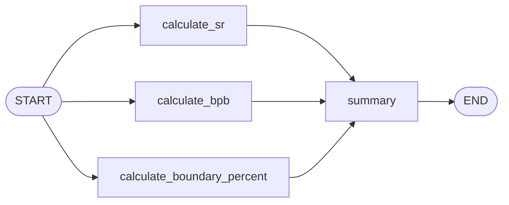
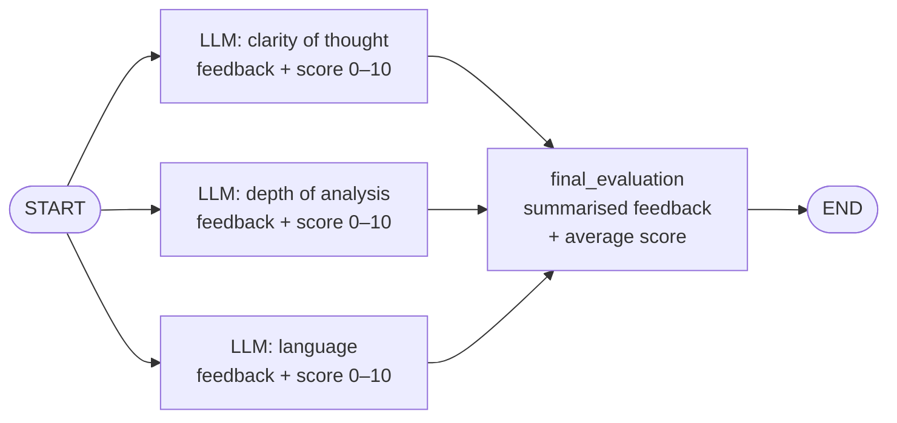

> **Video 7 of 28** · [Watch on YouTube](https://www.youtube.com/watch?v=O6ryuSpqdOw) · Translated from the
> Hindi transcript. Notes follow the video section by section, in its order.

This video picks up where the sequential-workflows video ended and teaches you, through two examples, how to build any parallel workflow in LangGraph.

## Recap and the plan for this video

Five videos so far, mostly conceptual, around both agentic AI and LangGraph. The last one started the practical part: building **sequential (linear) workflows** with LangGraph.

Today's goal is **parallel workflows**, through two examples:

1. A **simple, non-LLM** parallel workflow: nothing LLM-related, but interesting, and it gives you the idea of how parallel workflows are built.
2. An **LLM-based, slightly difficult** workflow, difficult because it also uses concepts from the LangChain playlist.

## Example 1: the cricket batsman workflow

### The problem

Input: a batsman's data points for one innings, namely **runs** made, **balls** played, number of **fours** and number of **sixes**. Output: several calculated quantities:

- **Strike rate.**
- **Runs-in-boundary percentage**: if he made 100 runs in total and 50 of them came from fours and sixes, the boundary percentage is 50%.
- **Balls per boundary**: after how many balls he hits a boundary. If he played 10 balls and hit a four or six 4 times, that is 2.5 balls per boundary.

These three quantities **can be calculated in parallel**: boundary percentage does not need the strike rate, and balls per boundary does not need either. All three depend only on the input values.

The workflow starts at START, runs three parallel nodes (strike rate, boundary percentage, balls per boundary), sends all three outputs to a **summary** node that combines them into a summary, and ends.



The **state** holds the four inputs (runs, balls, fours, sixes), the three calculated values (strike rate, boundary percent, balls per boundary) and, at the end, the summary.

### The state

A new file, `batsman_workflow.ipynb`, with the necessary imports already taken. First make the state: a class `BatsmanState` that inherits from `TypedDict`. Runs, balls, fours and sixes are the input attributes, all integers; strike rate, balls per boundary and boundary percent are floats.

```python
from langgraph.graph import StateGraph  # (implied, not shown in narration)
from typing import TypedDict  # (implied, not shown in narration)

class BatsmanState(TypedDict):
    runs: int
    balls: int
    fours: int
    sixes: int

    strike_rate: float
    bpb: float
    boundary_percent: float
```

### The graph and its nodes

Make the graph, an object of `StateGraph`, passing `BatsmanState`. There are four nodes in total, so add four nodes. The functions do not exist yet; they are written next.

```python
graph = StateGraph(BatsmanState)

graph.add_node('calculate_sr', calculate_sr)
graph.add_node('calculate_bpb', calculate_bpb)
graph.add_node('calculate_boundary_percent', calculate_boundary_percent)
graph.add_node('summary', summary)
```

**Strike rate** is how many runs you would make in 100 balls: 50 runs off 100 balls is a strike rate of 50. So divide runs by balls and multiply by 100. As first typed, though, the whole quantity was **divided** by 100 (this bug is caught later):

```python
def calculate_sr(state: BatsmanState):

    strike_rate = (state['runs']/state['balls'])/100

    state['strike_rate'] = strike_rate

    return state
```

**Balls per boundary**: 4 boundaries in 10 balls gives 2.5. Divide the number of balls by fours plus sixes.

```python
def calculate_bpb(state: BatsmanState):

    bpb = state['balls']/(state['fours'] + state['sixes'])

    state['bpb'] = bpb

    return state
```

**Boundary percent**: of all the runs made, what percentage came from fours and sixes. Runs from boundaries are fours times 4 (four runs for every four) plus sixes times 6, bracketed for readability, divided by total runs, times 100.

```python
def calculate_boundary_percent(state: BatsmanState):

    boundary_percent = (((state['fours'] * 4) + (state['sixes'] * 6))/state['runs'])*100

    state['boundary_percent'] = boundary_percent

    return state
```

**Summary**: nothing to calculate, just build a summary string with the three values on separate lines. Writing it reveals that `summary` was never added to the state, so it is added there as a string.

```python
def summary(state: BatsmanState):

    summary = f"""
Strike rate - {state['strike_rate']} \n
Balls per boundary - {state['bpb']} \n
Boundary percent - {state['boundary_percent']}
"""

    state['summary'] = summary

    return state
```

```python
class BatsmanState(TypedDict):
    runs: int
    balls: int
    fours: int
    sixes: int

    strike_rate: float
    bpb: float
    boundary_percent: float
    summary: str
```

### The edges

The most interesting part. Go back up and import `START` and `END` as well.

```python
from langgraph.graph import StateGraph, START, END
```

The first "edge" is really three edges together: START to strike rate, START to boundary percent, START to balls per boundary. Then all three nodes connect to summary. Finally summary connects to END.

```python
graph.add_edge(START, 'calculate_sr')
graph.add_edge(START, 'calculate_bpb')
graph.add_edge(START, 'calculate_boundary_percent')

graph.add_edge('calculate_sr', 'summary')
graph.add_edge('calculate_bpb', 'summary')
graph.add_edge('calculate_boundary_percent', 'summary')

graph.add_edge('summary', END)
```

That is the whole structure. Once you understand nodes and edges, it is no big deal whether the workflow is sequential or parallel: it is logical and very visual.

Compile it into a variable called `workflow` and print it. The picture matches the design: from START, boundary percent, bpb and strike rate are calculated, they go to summary, and the graph ends.

```python
workflow = graph.compile()

workflow
```

### Executing it, and the error

Define an initial state, the input to the graph: 100 runs off 50 balls, with six fours and four sixes. Then invoke the workflow with it.

```python
initial_state = {
    'runs': 100,
    'balls': 50,
    'fours': 6,
    'sixes': 4
}

workflow.invoke(initial_state)
```

Instead of the answers, an error appears:

```text
InvalidUpdateError: At key 'runs': Can receive only one value per step.
```

The problem is that each of the three parallel nodes (strike rate, boundary percent, balls per boundary) **returns the entire state**. You will not see this in sequential workflows. In a parallel workflow, `runs` is sent into all three nodes. None of them writes to `runs`; they only read it to calculate their quantity. But because each node sends back the whole state, LangGraph assumes each may have changed `runs` (and `balls`, `fours`, `sixes`), and it does not expect updates to the same key from three places in parallel. Whose `runs` value would be correct? That conflict is the error.

### The fix: partial state updates

Do not send the whole state out of these nodes. **Send only the attribute that node calculates.** `calculate_sr` sends just the strike rate key, `calculate_bpb` just bpb, `calculate_boundary_percent` just boundary percent. You are sending a **partial state** forward, which is very important in parallel workflows.

Instead of updating the state and returning it, each node returns a dictionary. The last video said nodes take state as input and return state; strictly, a node takes a **dictionary** as input (the state is a dictionary) and can return a **dictionary**, so returning this smaller dictionary is totally allowed. The summary node is changed the same way. This is called a **partial update**: send only the key you are updating and its value.

```python
def calculate_sr(state: BatsmanState):

    strike_rate = (state['runs']/state['balls'])/100

    return {'strike_rate': strike_rate}


def calculate_bpb(state: BatsmanState):

    bpb = state['balls']/(state['fours'] + state['sixes'])

    return {'bpb': bpb}


def calculate_boundary_percent(state: BatsmanState):

    boundary_percent = (((state['fours'] * 4) + (state['sixes'] * 6))/state['runs'])*100

    return {'boundary_percent': boundary_percent}


def summary(state: BatsmanState):

    summary = f"""
Strike rate - {state['strike_rate']} \n
Balls per boundary - {state['bpb']} \n
Boundary percent - {state['boundary_percent']}
"""

    return {'summary': summary}
```

Run everything again and it works: runs 100, balls 50, fours 6, sixes 4; balls per boundary is right; boundary percent is 48%, also right; the summary comes out fine.

### Fixing the strike-rate bug

The one problem: the strike rate is far too low. The formula should be runs divided by balls **multiplied** by 100, but it was divided by 100. Fix it and rerun:

```python
def calculate_sr(state: BatsmanState):

    strike_rate = (state['runs']/state['balls'])*100

    return {'strike_rate': strike_rate}
```

Now the strike rate comes out as 200.

### Which way should you return from nodes?

The last video returned the entire state; this one uses partial updates. Which to use? Returning the entire state works when you are working sequentially; in parallel you **must** do partial state updates. The recommendation is to **use partial state updates everywhere from now on**, sequential or parallel, since that is the one approach that works in both places.

That is the first parallel workflow: simple, and worth trying once yourself.

## Example 2: the UPSC essay evaluation workflow

### The problem

The last video mentioned a website where UPSC aspirants practise the essays asked in the exam: you write an essay and it gives feedback on different aspects. This is that workflow.

It starts with an **essay text** and evaluates it on three aspects:

1. **Clarity of thought**
2. **Depth of analysis**
3. **Language**

Each evaluation is done by an LLM: the same essay is sent in three different LLM calls, each asked about a different aspect. Each returns two things: a **text feedback** on the essay and a **score between 0 and 10**.

The outputs of the three nodes go to a **final evaluation** node, which does two things:

- Merges the three text feedbacks into a **summarised feedback**, again using an LLM.
- Calculates the **average** of the three scores as the **final score**.

The workflow then ends, with a summarised feedback and a final average score as output.



### What makes this one harder

- It is a **parallel** workflow.
- It is **LLM-based**: several nodes need an LLM.
- It needs two additional things:
  - **Structured output.** You expect each of the three LLMs to return exactly a textual feedback and a number between 0 and 10. Structured output (from the LangChain playlist) makes sure the output comes back in JSON format so both can be extracted properly and sent on.
  - **A reducer function**, from the last video. To see why, look at the state.

### The state, and why it needs a reducer

The state needs:

- An attribute for the **essay** (essay or essay text).
- Three string feedbacks: **clarity-of-thought (COT) feedback**, **depth-of-analysis feedback** and **language feedback**.
- A **final or summarised feedback**.
- An **individual scores** list holding the three scores.
- A **final or average score**, a float, the average of that list.

All three scores must go into the **same** individual-scores list, but they are calculated **in parallel**. So they have to be **merged**. Without merging, the default behaviour is that the value gets **replaced**, and you would not get all three scores. Merging needs a reducer function.

So this example deals with three concepts at once: parallel workflows, structured output and reducer functions. It is not as trivial as what came before, but nothing here is beyond you. You know parallel workflows and structured output, and you at least know conceptually what a reducer is. Do not panic; start coding.

### Step 1: a model that gives structured output

The file is `upsc_essay_workflow.ipynb`, with the necessary imports taken and `load_dotenv()` called. The work proceeds step by step, and the first goal is not the workflow but an **LLM that returns structured output**.

Why? Every time the essay goes to a node, you expect two outputs: a textual feedback and a number between 0 and 10. If you only ask for that in the prompt, the LLM might get it right 8 times out of 10, but twice it may slip: it might write the score as the word "s-e-v-e-n" instead of the number 7, and you cannot take the mean of "seven". The output must be structured, the same every time, reliable. With **structured output** you make a **schema** up front, send it to the model ("I want output only in this schema's format"), and the model follows it.

You need a model from `ChatOpenAI` that supports structured output by default, such as `gpt-4o-mini`. The schema (the rule the output must follow) is made with **Pydantic**: a class `EvaluationSchema` inheriting from `BaseModel`, with two fields.

- `feedback`: a string. Using the `Field` function, add the description "Detailed feedback for the essay". As covered in the LangChain playlist, the more descriptive the schema, the more it helps the LLM.
- `score`: an integer, described as "Score out of 10", with rules that it must be **greater than or equal to 0** and **less than or equal to 10**.

Then pass the schema to the model's `with_structured_output` function. The resulting model, `structured_model`, gives structured output.

```python
from langgraph.graph import StateGraph, START, END  # (implied, not shown in narration)
from langchain_openai import ChatOpenAI  # (implied, not shown in narration)
from dotenv import load_dotenv  # (implied, not shown in narration)
from pydantic import BaseModel, Field  # (implied, not shown in narration)

load_dotenv()

model = ChatOpenAI(model='gpt-4o-mini')

class EvaluationSchema(BaseModel):

    feedback: str = Field(description='Detailed feedback for the essay')
    score: int = Field(description='Score out of 10', ge=0, le=10)

structured_model = model.with_structured_output(EvaluationSchema)
```

### Trying the structured model

A sample essay, generated with ChatGPT, on a topic along the lines of "Role of India in AI", is pasted into a variable. A very simple prompt is used:

```python
essay = """..."""  # the sample essay on India's role in AI, pasted in

prompt = f'Evaluate the language quality of the following essay and provide a feedback and assign a score out of 10 \n {essay}'
```

The first invoke uses `model`, which returns normal output. That was a slip: it has to be `structured_model` to get output according to the schema.

```python
structured_model.invoke(prompt)
```

Now the output follows `EvaluationSchema`: a `feedback` key and a `score`. `.score` gives just the score, 8 here; `.feedback` gives just the feedback.

```python
structured_model.invoke(prompt).score
```

```text
8
```

```python
structured_model.invoke(prompt).feedback
```

If this feels new, revisit that video in the LangChain playlist. At this point you have one thing in hand: a model that returns structured output according to your schema. Now the workflow can be built.

### Step 2: the state, with a reducer

The state is `UPSCState`, inheriting from `TypedDict`:

- `essay`: the essay text, a string.
- `language_feedback`: string.
- `analysis_feedback`: depth-of-analysis feedback, string.
- `clarity_feedback`: clarity-of-thought feedback, string.
- `overall_feedback`: the summarised feedback, string.
- `individual_scores`: the three scores (0 to 10) from the three nodes, a **list of integers**.
- `avg_score`: a float.

For `individual_scores`, since three parallel nodes each produce one score, a reducer is needed to merge them into one list. Import `operator`, a Python module containing a functional equivalent of every operator, and import `Annotated` from `typing`. Then write the type as `Annotated[list[int], operator.add]`.

```python
from typing import TypedDict, Annotated  # (implied, not shown in narration)
import operator

class UPSCState(TypedDict):

    essay: str
    language_feedback: str
    analysis_feedback: str
    clarity_feedback: str
    overall_feedback: str
    individual_scores: Annotated[list[int], operator.add]

    avg_score: float
```

### What `Annotated[list[int], operator.add]` means

It may look scary, so here is what it says. Following the diagram, suppose the clarity-of-thought node rates the essay 8, the depth-of-analysis LLM rates it 7, and the language one 6. You want `individual_scores` to hold `[8, 7, 6]`, in exactly that format.

Because 8, 7 and 6 are produced together, in parallel, and all go into the same variable, there is a possibility of **overwriting**. The reducer function removes that behaviour, and here the reducer is **add**: 8 gets added to the list, 7 gets added, 6 gets added.

The plan: each of the three nodes returns its single score **inside a list**. So you have three lists, `[8]`, `[7]` and `[6]`, and they need merging. To merge two or more lists you use the **plus** operator: `[8] + [7] + [6]` gives `[8, 7, 6]`. You cannot write `+` in that position, so you use the function that works just like plus, `add` from the `operator` module. The reducer is `operator.add`.

Many kinds of reducer functions can be used, such as max or min; they are discussed later when needed.

### Step 3: the graph and the three evaluation nodes

Create `graph` as a `StateGraph` of `UPSCState` and add the nodes: `evaluate_language` (with a function of the same name), `evaluate_analysis`, `evaluate_thought` and `final_evaluation`. An error comes until the functions are defined.

```python
graph = StateGraph(UPSCState)

graph.add_node('evaluate_language', evaluate_language)
graph.add_node('evaluate_analysis', evaluate_analysis)
graph.add_node('evaluate_thought', evaluate_thought)
graph.add_node('final_evaluation', final_evaluation)
```

**`evaluate_language`** receives the state (a `UPSCState`). It sends the essay to the structured model and asks for a language-based text feedback and a language-based score between 0 and 10. The prompt is the one written above, copied, with the essay now coming from the state. Invoke the structured model with it; the output looks like what was shown earlier. Then extract and return a dictionary: `language_feedback` from `output.feedback`, and the individual score as `output.score` **inside a list**, because that is the format the reducer needs.

The other two nodes are copy-pastes. `evaluate_analysis` asks to "Evaluate the depth of analysis of the following essay" and returns `analysis_feedback`. `evaluate_thought` asks about clarity of thought and returns `clarity_feedback`.

As first written, the three nodes returned the key `individual_score`:

```python
def evaluate_language(state: UPSCState):

    prompt = f'Evaluate the language quality of the following essay and provide a feedback and assign a score out of 10 \n {state["essay"]}'
    output = structured_model.invoke(prompt)

    return {'language_feedback': output.feedback, 'individual_score': [output.score]}
```

But the attribute in the state is named `individual_scores`, so all three nodes are corrected to use `scores`:

```python
def evaluate_language(state: UPSCState):

    prompt = f'Evaluate the language quality of the following essay and provide a feedback and assign a score out of 10 \n {state["essay"]}'
    output = structured_model.invoke(prompt)

    return {'language_feedback': output.feedback, 'individual_scores': [output.score]}


def evaluate_analysis(state: UPSCState):

    prompt = f'Evaluate the depth of analysis of the following essay and provide a feedback and assign a score out of 10 \n {state["essay"]}'
    output = structured_model.invoke(prompt)

    return {'analysis_feedback': output.feedback, 'individual_scores': [output.score]}


def evaluate_thought(state: UPSCState):

    prompt = f'Evaluate the clarity of thought of the following essay and provide a feedback and assign a score out of 10 \n {state["essay"]}'
    output = structured_model.invoke(prompt)

    return {'clarity_feedback': output.feedback, 'individual_scores': [output.score]}
```

### Step 4: the final evaluation node

`final_evaluation` also gets the state and does two things.

1. **Summary feedback.** The prompt: "Based on the following feedbacks create a summarized feedback", followed on new lines by the language feedback, the depth-of-analysis feedback and the clarity-of-thought feedback. Here the **normal model** is used, not the structured one, since the structured model might generate yet another score. Invoking it returns a response with several things in it; only `content` matters. Call the result `overall_feedback`.
2. **Average score.** `individual_scores` is a list, so take its `sum` divided by its `len`, stored as `avg_score`.

Return both as a dictionary.

```python
def final_evaluation(state: UPSCState):

    # summary feedback
    prompt = f'Based on the following feedbacks create a summarized feedback \n language feedback - {state["language_feedback"]} \n depth of analysis feedback - {state["analysis_feedback"]} \n clarity of thought feedback - {state["clarity_feedback"]}'
    overall_feedback = model.invoke(prompt).content

    # avg calculate
    avg_score = sum(state['individual_scores'])/len(state['individual_scores'])

    return {'overall_feedback': overall_feedback, 'avg_score': avg_score}
```

Now running the node cell gives no error; all the nodes exist.

### Step 5: the edges, compile and run

Edges are no longer difficult. START connects to the three evaluation nodes; each evaluation node connects to `final_evaluation`; `final_evaluation` connects to END. Compile and store in a variable.

```python
graph.add_edge(START, 'evaluate_language')
graph.add_edge(START, 'evaluate_analysis')
graph.add_edge(START, 'evaluate_thought')

graph.add_edge('evaluate_language', 'final_evaluation')
graph.add_edge('evaluate_analysis', 'final_evaluation')
graph.add_edge('evaluate_thought', 'final_evaluation')

graph.add_edge('final_evaluation', END)

workflow = graph.compile()
```

The printed graph: from START, `evaluate_analysis`, `evaluate_language` and `evaluate_thought`, then `final_evaluation`, then END.

The initial state puts the essay variable into `essay`; invoke the workflow with it.

```python
initial_state = {
    'essay': essay
}

workflow.invoke(initial_state)
```

All the values come back: the essay text, language feedback, analysis feedback, clarity feedback and overall feedback. The individual scores are **7, 8 and 8**: 7 for language and 8 for each of the other two, with the final average score calculated from them.

### Testing with a badly written essay

To check the workflow, ChatGPT was asked for a second essay in very bad English, with deliberate spelling mistakes; it reads like "India have many good, we have smart student many engineer". Put `essay2` into the initial state instead and run the workflow again.

```python
initial_state = {
    'essay': essay2
}

workflow.invoke(initial_state)
```

Everything is bad: the language, the analysis, and there is no clarity of thought. So it gets low marks on all three, and the average score is low too.

That is a working parallel LLM-based workflow, made a little more interesting with structured output. Coding by hand gives you practice and some confidence, and you can see LangChain and LangGraph working hand in hand. Nothing very big has been built in the playlist yet, but the foundation is being made strong slowly, and within a few videos you will be building very complex, powerful workflows.
