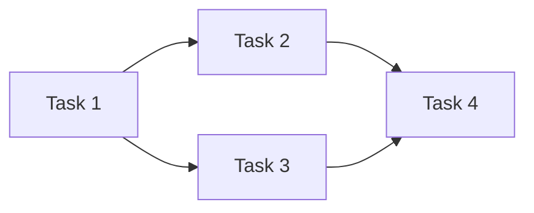
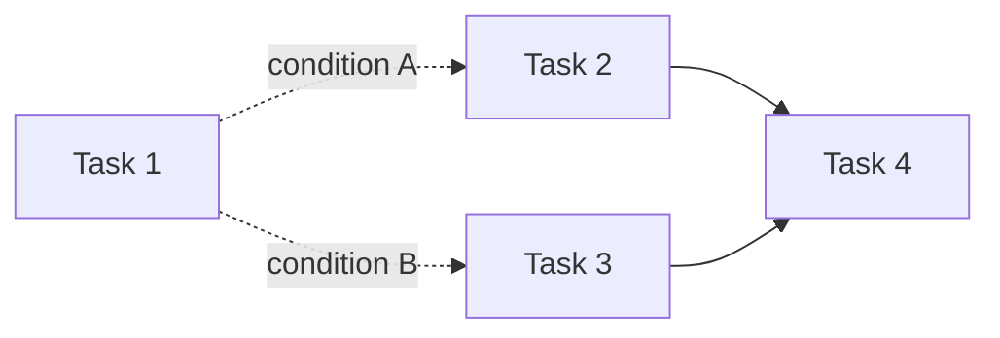
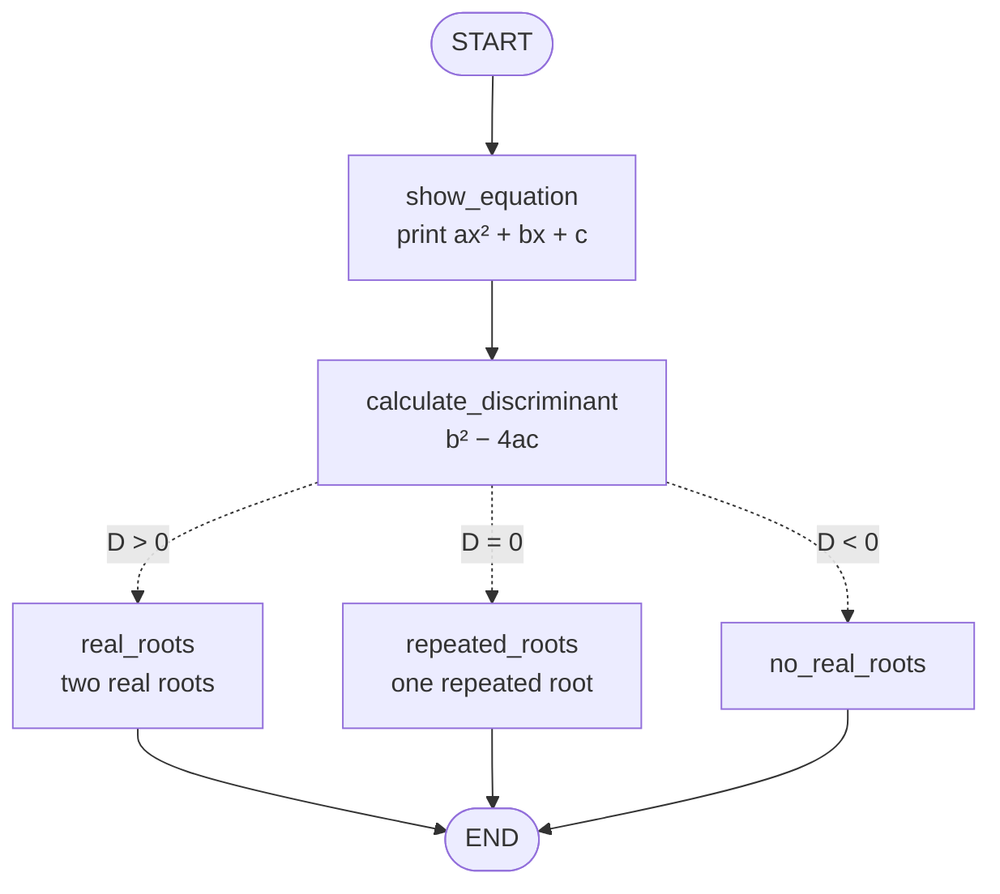
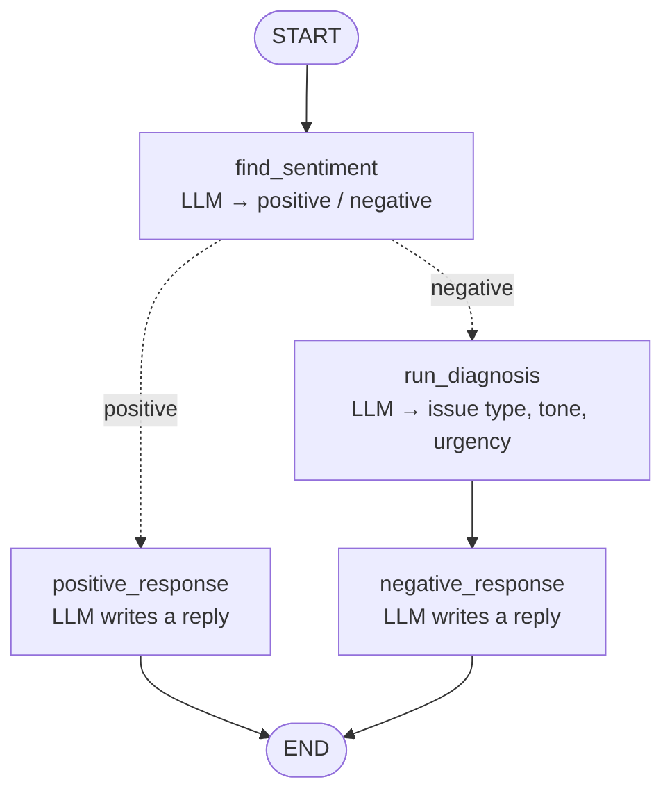

> **Video 8 of 28** · [Watch on YouTube](https://www.youtube.com/watch?v=I-dvZqTz-Wc) · Translated from the
> Hindi transcript. Notes follow the video section by section, in its order.

A conditional workflow has branches like a parallel one, but a condition sends execution down exactly one of them; this video builds two such workflows in LangGraph, one without an LLM and one with.

## What the playlist has covered so far

Apart from the theory, the playlist has so far taught two kinds of workflow.

- **Sequential workflows**: a series of tasks that execute linearly, one after another.
- **Parallel workflows** (the last video): you are asked to execute more than one task at the same time. In the flowchart below, after task 1 you run tasks 2 and 3 together; when both are done, their output reaches task 4, which then runs. The flow branches, enters several branches at once, executes them and comes back out.



## What a conditional workflow is

Today's topic is the third kind: the **conditional workflow**. It looks like a parallel workflow, but there is a very big difference. You still have branches, but you do **not** enter all of them. Based on a **condition**, you enter one single branch.

With the same shape as above: after task 1 you could go to task 2 or to task 3, but never both.

- Go to 2, and the execution order is 1 → 2 → 4.
- Go to 3, and the execution order is 1 → 3 → 4.

Tasks 2 and 3 never execute together. Which one runs is decided by a condition checked after task 1. This works exactly like **if-else** in programming, only in terms of workflows. There can also be more than two branches; there is no limit.



This concept matters a lot. Going forward, when more complex workflows are built, you may need conditional workflows almost every time. Conditional branching is as important in LangGraph as if-else is in programming.

## The plan for this video

Everything is done practically, by building two workflows:

1. A **non-LLM workflow**: a small maths problem solved with LangGraph. This makes the concept of conditional workflows clear.
2. An **LLM-based workflow** related to **customer support**, made a little more difficult and using a few more concepts, to solidify that understanding at a deeper level.

## Workflow 1: solving a quadratic equation

The problem needed to be both interesting and meaningful, and the choice was a workflow that **solves a quadratic equation**. Most of us studied quadratic equations in 10th class, and solving one involves conditions, which makes it an ideal candidate for demonstrating a conditional workflow.

### A revision of quadratic equations

A quadratic equation has the form **ax² + bx + c**, where a, b and c are its **coefficients**. The job is to find its **roots** (solutions). A quadratic has two roots, but what they look like depends on a condition.

To find the roots you first compute the **discriminant**:

> D = b² − 4ac

The value of D decides the kind of roots, and there are three possible conditions:

- **D > 0**: two real roots (two distinct real roots).
- **D = 0**: one repeated root. There are still two roots, but both are the same.
- **D < 0**: no real roots.

If this has faded, the NCERT book states it too: if b² − 4ac > 0 you get two distinct real roots. The formulas used here:

- Two real roots: (−b + D) / 2a and (−b − D) / 2a.
- One repeated root: −b / 2a, which is the same formula with D equal to zero.
- D < 0: the book says there is no real number whose square is this, so there are no real roots.

:::note

The two-root formula uses the **square root** of the discriminant: (−b ± √D) / 2a. The spoken formula says "D", but the code below correctly raises the discriminant to the power 0.5.

:::

### The workflow design



1. The user gives the values of **a, b and c** as input.
2. The first node uses those values to **print the equation**.
3. The next node **calculates the discriminant**.
4. Based on its value there are three possibilities: calculate two real roots if D > 0, calculate one repeated root if D = 0, or report no real roots if D < 0.

You go into only **one** of the three; all three at once is not possible. That one node runs, and the flow reaches the end.

### The state

A file called quadratic equation is created with the necessary imports already in place. As always, the **state** comes before the workflow. It is called `QuadState` (instead of `QuadraticState`) and inherits from `TypedDict`. Think about what the workflow needs:

- `a`, `b`, `c`: the coefficients.
- `equation`: where the quadratic equation is saved, a string.
- `discriminant`: a float, because its value can be a decimal.
- `result`: whatever roots come out, shown as a string.

```python
from langgraph.graph import StateGraph, START, END  # (implied, not shown in narration)
from typing import TypedDict, Literal  # (implied, not shown in narration)

class QuadState(TypedDict):
    a: int  # (type implied, not shown in narration)
    b: int  # (type implied, not shown in narration)
    c: int  # (type implied, not shown in narration)
    equation: str
    discriminant: float
    result: str
```

### First part: show the equation and calculate the discriminant

The workflow is built in pieces: first just the two nodes up to the discriminant, then the conditional part.

The graph is a `StateGraph` object built with `QuadState`. The first node is `show_equation` and the second is `calculate_discriminant`; each function has the same name as its node.

`show_equation` has nothing special to do. It builds an f-string from a, b and c and returns it in a dictionary. `calculate_discriminant` computes b² − 4ac from the state and returns it the same way.

```python
graph = StateGraph(QuadState)

graph.add_node('show_equation', show_equation)
graph.add_node('calculate_discriminant', calculate_discriminant)
```

```python
def show_equation(state: QuadState):
    equation = f"{state['a']}x²{state['b']}x{state['c']}"
    return {'equation': equation}

def calculate_discriminant(state: QuadState):
    discriminant = state['b']**2 - (4 * state['a'] * state['c'])
    return {'discriminant': discriminant}
```

Connect them with edges, START → `show_equation` → `calculate_discriminant` → END, and compile:

```python
graph.add_edge(START, 'show_equation')
graph.add_edge('show_equation', 'calculate_discriminant')
graph.add_edge('calculate_discriminant', END)

workflow = graph.compile()
```

The drawn workflow shows `show_equation` followed by `calculate_discriminant`. Invoke it with a = 4, b = −5, c = −4:

```python
initial_state = {'a': 4, 'b': -5, 'c': -4}
workflow.invoke(initial_state)
```

The output holds a, b and c, the equation 4x² − 5x − 4, and the discriminant 89. You can check it yourself: b² is 25, plus 64, gives 89. This much is done.

### The three root nodes

Next come the three nodes, of which only one will execute depending on the condition. First create them: `real_roots`, then (copy-pasted) `repeated_roots` and `no_real_roots`.

```python
graph.add_node('real_roots', real_roots)
graph.add_node('repeated_roots', repeated_roots)
graph.add_node('no_real_roots', no_real_roots)
```

Then write their functions. `real_roots` calculates two roots with (−b + √D) / 2a, writing the square root as the discriminant raised to the power 0.5 and putting 2a in brackets. The second root differs only in the sign: minus instead of plus. It returns `result` as an f-string, because `result` is a string.

For `repeated_roots`, copy that function: there is only one root, −b / 2a, so the square-root part goes away. The result reads "Only repeating root is …". `no_real_roots` calculates nothing and simply says "No real roots".

```python
def real_roots(state: QuadState):
    root1 = (-state['b'] + state['discriminant']**0.5) / (2 * state['a'])
    root2 = (-state['b'] - state['discriminant']**0.5) / (2 * state['a'])

    result = f'The roots are {root1} and {root2}'
    return {'result': result}

def repeated_roots(state: QuadState):
    root = (-state['b']) / (2 * state['a'])

    result = f'Only repeating root is {root}'
    return {'result': result}

def no_real_roots(state: QuadState):
    result = 'No real roots'
    return {'result': result}
```

### The routing function

The nodes exist, but they still have to be connected, and connecting them needs a **condition**. To create a condition you **write a function**. Here it is `check_condition`.

This is **not** the function of any node; it is a separate function. It also receives the state as input, and its output is one of three things: the name `real_roots`, the name `repeated_roots` or the name `no_real_roots`. It is a function whose output is the **name of another function** (node).

The logic is plain if-elif-else: if the discriminant is greater than zero return `real_roots`, elif it equals 0 return `repeated_roots`, else return `no_real_roots`. It is a kind of **routing function**: it checks the condition and tells you which node to go to next.

```python
def check_condition(state: QuadState) -> Literal["real_roots", "repeated_roots", "no_real_roots"]:
    if state['discriminant'] > 0:
        return "real_roots"
    elif state['discriminant'] == 0:
        return "repeated_roots"
    else:
        return "no_real_roots"
```

### `add_conditional_edges`

Now make the three dotted edges out of `calculate_discriminant`. This is very easy, because there is a function for it: **`add_conditional_edges`**. You tell it just two things:

1. Which node you are starting from: `calculate_discriminant`.
2. Which node to go to next. There are three candidates, and the one that decides is `check_condition`, so you pass it in. `check_condition` runs, returns the name of one of the three nodes, that name fits in, and the edge to it is created automatically.

Once that is done, connect all three root nodes to END. The earlier `calculate_discriminant` → END edge is gone, and the full set of edges now reads:

```python
graph.add_edge(START, 'show_equation')
graph.add_edge('show_equation', 'calculate_discriminant')

graph.add_conditional_edges('calculate_discriminant', check_condition)

graph.add_edge('real_roots', END)
graph.add_edge('repeated_roots', END)
graph.add_edge('no_real_roots', END)

workflow = graph.compile()
```

In the drawn graph you see START, `show_equation`, `calculate_discriminant`, and then three **dotted** arrows. Dotted means these are **conditional edges**: only one of them executes, and from whichever branch you take you reach END. It is exactly the workflow designed above. Nothing more is needed; just invoke it, and you get the discriminant and its roots.

### Running it with more inputs

Try another example with 4, 2 and 2. The equation prints as "4x²…" with no plus or minus signs between the terms. That is a display problem left for you to solve; everything else is right. The discriminant comes out negative, so the output is "No real roots".

Change the inputs so that b is 4 (b² becomes 16) and a and c are both 2. The discriminant becomes zero, and the output is "Only repeating root is −1".

Cross-check the formulas yourself in case of a mistake in writing them. That was not the main goal, though. The goal was to show how easily you can build conditional workflows.

### The main idea

That was the first conditional workflow. The main idea is simply this:

- Create a **function that checks the condition** and tells you, depending on the condition, which node comes next.
- Instead of `add_edge`, call **`add_conditional_edges`**, which does all the work behind the scenes.

Nothing special, but a very important concept you will use a lot.

There is also a **second way** to make conditional edges: a function called **`Command`**. That comes later, when dynamic workflows are built. Today covered the first way.

## Workflow 2: replying to customer reviews

With the concept in hand, the next workflow is an LLM-based conditional workflow. The design comes first, then the code.

### The workflow design

You receive a **review** from a customer and must **reply** to it. To reply well you need to know whether the review's **sentiment** is positive or negative, and you write the reply based on that.

1. The review text goes to an LLM, which is asked whether its sentiment is positive or negative. This is **structured output**, coming back in JSON format.
2. If the sentiment is **positive**, an LLM frames a **positive reply** and the flow ends.
3. If it is **negative**, you **run a diagnosis**: an LLM analyses the review further to extract three things, again as structured JSON output:
   - **Issue type**: what the issue relates to. For software, is it the UI, a performance issue, or some kind of bug?
   - **Tone**: is it frustration, anger, or something else?
   - **Urgency**: how much urgency the customer has shown in the review.
4. Based on those three things an LLM creates the **reply**. Considering them makes the reply more useful to the customer.



It is conditional because, as soon as the sentiment is known, you enter either the positive branch or the negative branch, never both.

### Setting up the model and a sentiment schema

A new file has the necessary imports already, and `load_dotenv` has been run because OpenAI models are used. The model is a `ChatOpenAI` using `gpt-4o-mini`.

Step by step, the first focus is the first part: given a review, can you extract its sentiment? The sentiment will be a single word, positive or negative, which means you need **structured output** from the LLM. For structured output you first **define a schema**.

`SentimentSchema` inherits from `BaseModel` and has one key, `sentiment`, of `Literal` type, so it can only be one of two values: positive or negative. It gets the description "Sentiment of the review". Calling `with_structured_output` on the model with this schema gives a new model, `structured_model`.

```python
from langgraph.graph import StateGraph, START, END  # (implied, not shown in narration)
from langchain_openai import ChatOpenAI
from dotenv import load_dotenv
from typing import TypedDict, Literal  # (implied, not shown in narration)
from pydantic import BaseModel, Field  # (implied, not shown in narration)

load_dotenv()

model = ChatOpenAI(model='gpt-4o-mini')

class SentimentSchema(BaseModel):
    sentiment: Literal["positive", "negative"] = Field(description='Sentiment of the review')

structured_model = model.with_structured_output(SentimentSchema)
```

Test it with a prompt:

```python
prompt = 'What is the sentiment of the following review - The software is too bad'
structured_model.invoke(prompt).sentiment
```

The output is sentiment `negative`, and adding `.sentiment` gives the value directly. Change the review to "too good" and you get `positive`. So there is now a model that gives structured output and can tell the sentiment.

### The state and the `find_sentiment` node

The graph is a `StateGraph` object, and before creating it you define its state. `ReviewState` inherits from `TypedDict` and has these keys:

- `review`: a string.
- `sentiment`: a string; in fact a `Literal` of positive and negative.
- `diagnosis`: for the three diagnosis values; it is itself a **dictionary** holding those three keys.
- `response`: a string, where the response to the review is stored.

```python
class ReviewState(TypedDict):
    review: str
    sentiment: Literal["positive", "negative"]
    diagnosis: dict
    response: str

graph = StateGraph(ReviewState)

graph.add_node('find_sentiment', find_sentiment)
```

The first node, and its function, is `find_sentiment`. It receives a `ReviewState`, writes a prompt asking for the sentiment of the review, invokes `structured_model`, extracts `.sentiment` and returns it.

```python
def find_sentiment(state: ReviewState):
    prompt = f'For the following review find out the sentiment \n {state["review"]}'
    sentiment = structured_model.invoke(prompt).sentiment

    return {'sentiment': sentiment}
```

Check this much with START → `find_sentiment` → END:

```python
graph.add_edge(START, 'find_sentiment')
graph.add_edge('find_sentiment', END)

workflow = graph.compile()

initial_state = {
    'review': "The product was really good"
}
workflow.invoke(initial_state)
```

The `review` key is set and the sentiment is `positive`. With "Really bad" the sentiment becomes `negative`. The first part is done.

### The conditional check

Next comes the conditional logic for positive and negative, and conditions need a function. `check_sentiment` receives the `ReviewState` and returns one of two names: `positive_response` or `run_diagnosis`.

```python
def check_sentiment(state: ReviewState) -> Literal["positive_response", "run_diagnosis"]:
    if state['sentiment'] == 'positive':
        return 'positive_response'
    else:
        return 'run_diagnosis'
```

Then add the three remaining nodes, each with a function of the same name:

```python
graph.add_node('positive_response', positive_response)
graph.add_node('run_diagnosis', run_diagnosis)
graph.add_node('negative_response', negative_response)
```

### `positive_response`

Nothing to do here beyond writing a prompt: write a warm thank-you message in response to the review, and at the end kindly ask the user to leave feedback on the website. This uses the **normal** model, not the structured one, so you get a normal response; extract its content and return it under the `response` key.

```python
def positive_response(state: ReviewState):
    prompt = f"""Write a warm thank-you message in response to this review:
    \n\n\"{state['review']}\"\n
Also, kindly ask the user to leave feedback on our website."""

    response = model.invoke(prompt).content

    return {'response': response}
```

### `run_diagnosis` and a second schema

This node runs a prompt: diagnose this negative review, and return issue_type, tone and urgency. You need three keys with values in the output, so this is structured output again and needs its **own schema**.

Rather than type it out, a prepared schema is copied in. It was called `DiagnosisOutput` and is renamed `DiagnosisSchema`, a better name. It also inherits from `BaseModel`:

- `issue_type`: a `Literal` choosing from UX, Performance, Bug, Support or Other, with the `Field` description "The category of issue mentioned in the review".
- `tone`: a `Literal` of three or four options, described as "The emotional tone expressed by the user".
- `urgency`: low, medium or high, described as "How urgent or critical the issue appears to be".

While pasting, the sentiment schema cell was accidentally overwritten; it is put back, and the diagnosis schema goes in its own cell. This schema needs **another model**, `structured_model2`, so there are now two models for extracting structured output.

```python
class DiagnosisSchema(BaseModel):
    issue_type: Literal["UX", "Performance", "Bug", "Support", "Other"] = Field(description='The category of issue mentioned in the review')
    tone: Literal["angry", "frustrated", "disappointed", "calm"] = Field(description='The emotional tone expressed by the user')  # (options implied, not read out in narration)
    urgency: Literal["low", "medium", "high"] = Field(description='How urgent or critical the issue appears to be')

structured_model2 = model.with_structured_output(DiagnosisSchema)
```

In `run_diagnosis`, invoke `structured_model2` with the prompt. The response has `issue_type`, `tone` and `urgency` with their values. The `diagnosis` key in the state must be a **dictionary**, and since the response is a Pydantic object, call **`model_dump`** on it to convert it into a dictionary before storing it.

```python
def run_diagnosis(state: ReviewState):
    prompt = f"""Diagnose this negative review:\n\n{state['review']}\n
Return issue_type, tone, and urgency.
"""
    response = structured_model2.invoke(prompt)

    return {'diagnosis': response.model_dump()}
```

### `negative_response`

The last function also writes a prompt: you are a support assistant; the user had this issue, sounded this tone, and marked urgency as this level; write an empathetic, helpful resolution message. It is used as an f-string, sent to the simple model, and the content is returned as `response`.

As first written, the prompt refers to `diagnosis` and shows an error. The fix is to create a variable `diagnosis` holding the dictionary in the state's `diagnosis`, then read its keys wherever needed:

```python
def negative_response(state: ReviewState):
    diagnosis = state['diagnosis']

    prompt = f"""You are a support assistant.
The user had a '{diagnosis['issue_type']}' issue, sounded '{diagnosis['tone']}', and marked urgency as '{diagnosis['urgency']}'.
Write an empathetic, helpful resolution message.
"""
    response = model.invoke(prompt).content

    return {'response': response}
```

### Connecting the edges

The START → `find_sentiment` edge already exists. Now the conditional edges: call `add_conditional_edges`, starting from `find_sentiment`, with `check_sentiment` as the function that decides where to go next. Then `positive_response` → END, `run_diagnosis` → `negative_response`, and `negative_response` → END.

```python
graph.add_edge(START, 'find_sentiment')

graph.add_conditional_edges('find_sentiment', check_sentiment)

graph.add_edge('positive_response', END)
graph.add_edge('run_diagnosis', 'negative_response')
graph.add_edge('negative_response', END)

workflow = graph.compile()
```

The drawn graph shows START, `find_sentiment`, a conditional edge to both `run_diagnosis` and `positive_response`, `run_diagnosis` leading to `negative_response`, and both reaching END.

### Running it on real reviews

A proper positive review:

```python
initial_state = {
    'review': "I've been using this app for about a month now and I must say, the user interface is incredibly clean and intuitive. Everything is exactly where you'd expect it to be. It's rare to find something that just works without needing a tutorial. Great job to the design team!"
}
workflow.invoke(initial_state)
```

The sentiment is positive and the response begins "Thank you for the kind words", with a placeholder for the user's name, thanking them for leaving such a thoughtful review and saying the team is thrilled that they enjoy the app and find the interface clean and intuitive.

A proper negative review:

```python
initial_state = {
    'review': "I've been trying to log in for over an hour now, and the app keeps freezing on the authentication screen. I even tried reinstalling it, but no luck. This kind of bug is unacceptable, especially when it affects basic functionality."
}
workflow.invoke(initial_state)
```

The output shows the review, the sentiment and the diagnosis: the issue type is **Bug**, the tone is **frustrated** (the review says it has been trying to log in for over an hour), and the urgency is **high**. The response is written accordingly.

With that the workflow is built, and along the way you have seen how conditional workflows are made in LangGraph.
