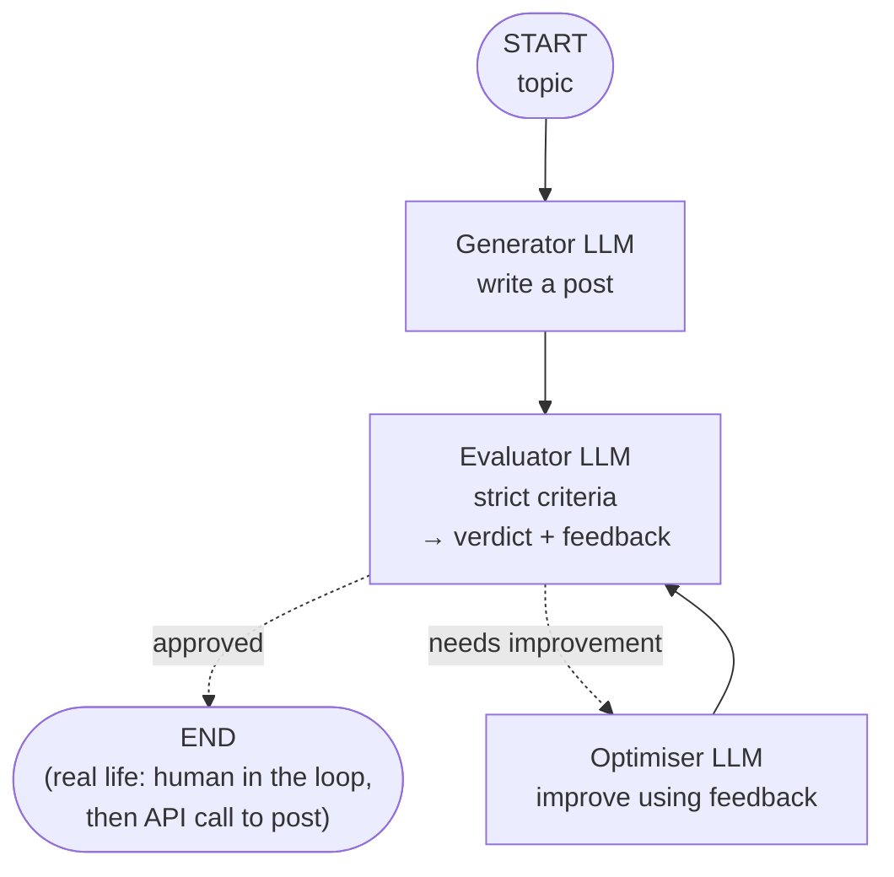
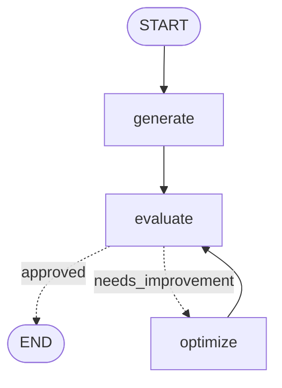

> **Video 9 of 28** · [Watch on YouTube](https://www.youtube.com/watch?v=7CbSqrovcsE) · Translated from the
> Hindi transcript. Notes follow the video section by section, in its order.

An iterative (looping) workflow runs back and forth between steps in order to improve something; this video builds one in LangGraph that generates a tweet, evaluates it and optimises it until it is approved.

## What the playlist has covered so far

Apart from the fundamentals of agentic AI and LangGraph, the playlist has taught three kinds of workflow:

- **Sequential workflows**: tasks execute linearly. The first task runs, then the second, then the third, and so on for any number of tasks.
- **Parallel workflows**: more than one task can execute at the same time.
- **Conditional workflows** (the last video): there are options to execute many different tasks, but only one of them runs, based on a given condition.

Today's topic is the fourth type: **iterative**, or **looping**, workflows. In an iterative workflow you run between two steps in order to **improve something**. This is also a very important kind of workflow; in more complex workflows later on, you will find yourself using loops in many places.

The topic is taught through a real-life use case.

## The use case: posting on social media automatically

This use case comes from the speaker's own life. His work is making YouTube videos, but on his other social profiles, LinkedIn, X and Instagram, he is not very active. The simple reason is that YouTube takes so much time that there is none left to create quality content elsewhere. Many people have suggested that a YouTuber should be active on the other platforms too. That seems fair, and he has tried several times to focus on them, but the time crunch gets in the way.

So the idea: build an **automated workflow that posts on these platforms on his behalf**. It saves time and allows growth on the other platforms.

The only problem is that an automated solution gives **no guarantee of quality**. The post could be mediocre or repetitive, and people might not see much value in it. Today's workflow is built to solve exactly that.

### The naive flow and its problem

The basic flow is very simple. You give the workflow a **topic**, say "AI in India", and ask for a post on it. The workflow generates a post, and you put it on whichever platform you like.

The problem is: how do you **evaluate** and make sure that a post generated by an LLM is really a quality post? Most of the time, if you ask an LLM to generate a tweet or a LinkedIn post, the output from the first round, the first go, is not that satisfactory. An iterative workflow solves this.

### The workflow: generation, evaluation, optimisation

The workflow has three important components: **generation**, **evaluation** and **optimisation**.

1. **Generation.** The topic goes to an LLM, which is asked to generate a post on it.
2. **Evaluation.** The generated post goes to an **evaluator**, a second LLM. The evaluator gets very **strict guidelines** about exactly what kind of post is wanted. The better you describe the evaluation criteria, the better the final outcome. The prompt used here spells out very clearly what kind of post to allow and what kind to throw out.
3. The evaluator either **approves** the post or says it **needs improvement** and has it regenerated.
   - If approved, the workflow ends. In real life it would not end there: a **human-in-the-loop** step would show the approved post to a human, and if the human also approves, an **API call** would publish it to the platform.
   - If the evaluator decides the post is not good enough by the criteria, it sends the post to a third LLM, the **optimiser**. The evaluator does not only judge; it also generates **feedback**. The optimiser is guided to take the post and improve it on the basis of that feedback.
4. **Optimisation.** With the post and the evaluator's feedback, the optimiser generates a new post and sends it **back to the evaluator**.
5. The evaluator judges the new post against its criteria and again decides: approve, or improve further. The same loop keeps running. When the post is approved at some point, the loop ends; otherwise you keep going round between evaluation and optimisation.



That is how looping is involved here, and why looping solves the problem better.

## Building the workflow in LangGraph

A new file is created with the necessary imports already in place.

### Three LLMs

The workflow needs **three different LLMs**: a generator, an evaluator and an optimiser. When you build this project properly, these should ideally be **different models**, each one excelling at its own task:

- The **generator** writes the post, so it needs very strong writing capability, such as GPT's 4.5 model.
- The **evaluator** judges a post against given criteria, so ideally it is a model that, given a task, follows it religiously.

Choosing well needs some knowledge of LLMs and LLM providers. Since this is a dummy project, roughly the same models are used for all three: from `ChatOpenAI`, GPT-4o for generation, GPT-4o mini for evaluation, and GPT-4o again for optimisation. When you build it properly, research which model is good for generation and which for evaluation, and swap them in here.

```python
from langgraph.graph import StateGraph, START, END  # (implied, not shown in narration)
from langchain_openai import ChatOpenAI
from typing import TypedDict, Literal  # (implied, not shown in narration)
from dotenv import load_dotenv  # (implied, not shown in narration)
from langchain_core.messages import SystemMessage, HumanMessage  # (implied, not shown in narration)
from pydantic import BaseModel, Field  # (implied, not shown in narration)

load_dotenv()  # (implied, not shown in narration)

generator_llm = ChatOpenAI(model='gpt-4o')
evaluator_llm = ChatOpenAI(model='gpt-4o-mini')
optimizer_llm = ChatOpenAI(model='gpt-40')  # typo, found and fixed later in the video
```

### Narrowing the task and defining the state

Whenever you build a LangGraph workflow, you define the **state** first. Before that, two decisions narrow the task:

- The workflow targets the **X platform** (formerly Twitter) and generates a **tweet** on any given topic.
- The tweet should be **funny and original**.

`TweetState` inherits from `TypedDict`. Think about what variables the workflow needs:

- `topic`: the topic given by the user, on which the tweet is generated.
- `tweet`: the generated tweet, a string.
- `evaluation`: produced by the evaluator, with only two possibilities, so a `Literal` of `approved` and `needs_improvement`.
- `feedback`: also produced by the evaluator, a string.
- `iteration`: an integer that shows how many loops ran to improve the tweet, meaning how many times you went round between the evaluator and the optimiser.
- `max_iteration`: used to **close the workflow**.

The last one matters because you can get **stuck in the loop forever**: the evaluator keeps rejecting, the optimiser keeps sending new versions, and the evaluator keeps rejecting them. The reason could be anything, for example evaluation criteria that are too strict combined with an LLM that is not capable of writing a tweet that good. At some point the loop has to be broken, so a maximum iteration limit is carried in the state. Here it starts at **five**; in your own project, decide it for your needs.

```python
class TweetState(TypedDict):
    topic: str
    tweet: str
    evaluation: Literal["approved", "needs_improvement"]
    feedback: str
    iteration: int
    max_iteration: int
```

### The graph and its three nodes

The graph is a `StateGraph` object built with `TweetState`. The workflow has three nodes, one each for generation, evaluation and optimisation: `generate` with function `generate_tweet`, `evaluate` with `evaluate_tweet`, and `optimize` with `optimize_tweet`. None of the functions exists yet; they come next, and the edges are added once all three are written.

```python
graph = StateGraph(TweetState)

graph.add_node('generate', generate_tweet)
graph.add_node('evaluate', evaluate_tweet)
graph.add_node('optimize', optimize_tweet)
```

### `generate_tweet`

A code cell is created above the graph for this function. Its job is simple: build a prompt that tells the LLM in detail what type of tweet to create and on what topic, send it to the generator LLM, and return the response.

The prompt is already written. This time, instead of a plain f-string, it uses the **`SystemMessage` and `HumanMessage`** classes, covered in the LangChain playlist. A list called `messages` holds two messages:

- A `SystemMessage`: "You are a funny and clever Twitter/X influencer."
- A `HumanMessage` describing in detail the tweet to generate: a short, original and hilarious tweet on the topic stored in the state. The rules: do not use question-answer format; no more than 280 characters; use observational humour, irony, sarcasm and cultural references; think in meme logic, punchlines and relatable takes; use simple, day-to-day English.

The prompt also had a final line asking for the tweet's version number (the current iteration plus one). That is not required, so it is removed for now, to be brought back later if needed.

Invoke the generator LLM with the `messages` list, extract the content of the returned message into `response`, and return it. The dictionary key must be exactly the one defined in the state, `tweet`.

```python
def generate_tweet(state: TweetState):
    # prompt
    messages = [
        SystemMessage(content="You are a funny and clever Twitter/X influencer."),
        HumanMessage(content=f"""
Write a short, original, and hilarious tweet on the topic: "{state['topic']}".

Rules:
- Do NOT use question-answer format.
- Max 280 characters.
- Use observational humor, irony, sarcasm, or cultural references.
- Think in meme logic, punchlines, or relatable takes.
- Use simple, day to day english
""")
    ]

    # send generator_llm
    response = generator_llm.invoke(messages).content

    # return response
    return {'tweet': response}
```

Running the cell gives "name 'TweetState' is not defined". The cells had probably not been run, so all cells are run again from the start, and the function and graph now work. The first node is done.

### `evaluate_tweet` and structured output

`evaluate_tweet` also receives a `TweetState`. It needs a prompt that describes the evaluation criteria in great detail and includes the generated tweet. The evaluator LLM judges the tweet against the criteria and returns two things: an **evaluation result** (selected or rejected) and **feedback**.

That calls for **structured output**, so that every response from the LLM comes back in exactly those two parts.

The prompt was written in great detail, with the help of ChatGPT:

- **System message**: "You are a ruthless, no-laugh-given Twitter critic. You evaluate tweets based on humor, originality, virality, and tweet format."
- **Human message**: evaluate the following tweet (the tweet from the state), using these criteria:
  - **Originality**: is it fresh, or have you seen this tweet a hundred times before?
  - **Humour**
  - **Punchiness**
  - **Virality potential**
  - **Format**
- **Auto-reject** the tweet if it is in question-answer format, is over 280 characters, or is a traditional joke.
- "Respond ONLY in structured format": `evaluation` (either `approved` or `needs_improvement`) and `feedback` (one paragraph on strengths and weaknesses).

```python
    messages = [
        SystemMessage(content="You are a ruthless, no-laugh-given Twitter critic. You evaluate tweets based on humor, originality, virality, and tweet format."),
        HumanMessage(content=f"""
Evaluate the following tweet:

Tweet: "{state['tweet']}"

Use the criteria below to evaluate the tweet:

1. Originality – Is this fresh, or have you seen it a hundred times before?
2. Humor
3. Punchiness
4. Virality Potential
5. Format

Auto-reject if:
- It's written in question-answer format
- It exceeds 280 characters
- It's a traditional joke

### Respond ONLY in structured format:
- evaluation: "approved" or "needs_improvement"
- feedback: One paragraph explaining the strengths and weaknesses
""")
    ]
```

Before sending the prompt, define a **schema** for the response with Pydantic: `TweetEvaluation`. The original version of this code also had a **score**, but it is not needed for now. It keeps two fields:

- `evaluation`: a `Literal` of `approved` or `needs_improvement`, with a description.
- `feedback`: described as "Constructive feedback for the tweet", then changed to just "feedback for the tweet".

Then create `structured_evaluator_llm` by calling `with_structured_output` on `evaluator_llm` with this schema, and use it instead of `evaluator_llm`.

```python
class TweetEvaluation(BaseModel):
    evaluation: Literal["approved", "needs_improvement"] = Field(..., description="Final evaluation result.")  # (description text implied, not read out)
    feedback: str = Field(..., description="feedback for the tweet.")

structured_evaluator_llm = evaluator_llm.with_structured_output(TweetEvaluation)
```

Invoke `structured_evaluator_llm` with the messages. The response holds the evaluation result and the feedback; return both, `response.evaluation` under `evaluation` and `response.feedback` under `feedback`.

```python
def evaluate_tweet(state: TweetState):
    # prompt
    messages = [...]  # the evaluator messages shown above

    response = structured_evaluator_llm.invoke(messages)

    return {'evaluation': response.evaluation, 'feedback': response.feedback}
```

### `optimize_tweet`

In a new cell, `optimize_tweet` receives a `TweetState`. Its prompt basically says: here is a tweet on this topic, and here is the feedback it got; can you improve it? The prepared prompt is pasted in:

- **System message**: "You punch up tweets for virality and humor based on given feedback."
- **Human message**: "Improve the tweet based on this feedback:" followed by the feedback, the topic of the tweet and the original tweet, and finally "Re-write it as a short, viral-worthy tweet. Avoid Q&A style and stay under 280 characters."

Invoke `optimizer_llm` with the messages and take the content of the response. Return the new tweet, and also **increment the iteration count** carried in the state: `iteration` becomes the state's current `iteration` plus 1, because one more tweet has been generated.

```python
def optimize_tweet(state: TweetState):

    messages = [
        SystemMessage(content="You punch up tweets for virality and humor based on given feedback."),
        HumanMessage(content=f"""
Improve the tweet based on this feedback:
"{state['feedback']}"

Topic: "{state['topic']}"
Original Tweet:
{state['tweet']}

Re-write it as a short, viral-worthy tweet. Avoid Q&A style and stay under 280 characters.
""")
    ]

    response = optimizer_llm.invoke(messages).content
    iteration = state['iteration'] + 1

    return {'tweet': response, 'iteration': iteration}
```

All three nodes are now defined.

### The edges, and the loop

First the plain edges: START → `generate`, then `generate` → `evaluate`.

Now the main work: a **conditional edge** after `evaluate`, based on its result, going either to END or to `optimize`. A conditional edge needs a function that makes the decision, so `route_evaluation` is written just above. It receives the state and makes a very simple decision: if the evaluation is `approved`, **or** the iteration count has reached `max_iteration` (the loop has gone round five times), return `approved`; otherwise return `needs_improvement`.

```python
def route_evaluation(state: TweetState):

    if state['evaluation'] == 'approved' or state['iteration'] >= state['max_iteration']:
        return 'approved'
    else:
        return 'needs_improvement'
```

The conditional edge starts at the `evaluate` node, and `route_evaluation` decides where to go: if it returns `approved`, go to END; if it returns `needs_improvement`, go to `optimize`. That creates both dotted edges.

The last edge is the one that makes the **loop**: from `optimize` back to `evaluate`. From `evaluate` to `optimize` is a conditional edge, and from `optimize` back is a normal edge.

```python
graph.add_edge(START, 'generate')
graph.add_edge('generate', 'evaluate')

graph.add_conditional_edges('evaluate', route_evaluation, {'approved': END, 'needs_improvement': 'optimize'})

graph.add_edge('optimize', 'evaluate')

workflow = graph.compile()
```

That is how you create loops in LangGraph: you are **simply manipulating edges**, nothing else.

Printing the compiled workflow shows START → `generate` → `evaluate`, then, based on the evaluation result, either END or `optimize`, and from `optimize` back to `evaluate`. That is the loop.



### Running it

The initial state provides three things: the **topic**, here "Indian Railways" (a topic with a lot of potential for funny tweets); `iteration` set to 1, since this is the first iteration; and `max_iteration` set to 5.

```python
initial_state = {
    "topic": "Indian Railways",
    "iteration": 1,
    "max_iteration": 5
}
result = workflow.invoke(initial_state)
```

The first run generates a tweet and it is approved:

```text
Boarding an Indian Railways train is like going to Hogwarts. You have no clue when you'll get there, you'll make unexpected friends, and there's a slim chance you'll spot wild creatures like the ticket checker.
```

Which you could call funny.

On the second run the code fails with an error involving `max_iteration`. This time the tweet was not approved directly and went down the `needs_improvement` path, where the error surfaced. The cause: the state declares `max_iteration`, but the initial state passed the key spelled with "iterations". After fixing the key, the run works.

### Forcing more than one iteration

Every run gets approved in the first iteration, which does not show the loop. One way to get weaker tweets that the evaluator rejects is to use a less powerful model. GPT-4o is fairly powerful, so the generator is switched to GPT-4o mini, and the optimiser too.

While changing it, a bug turns up: the optimiser had been written as `gpt-40` instead of `gpt-4o`. It never threw an error because control flow had never reached the optimiser.

```python
generator_llm = ChatOpenAI(model='gpt-4o-mini')
evaluator_llm = ChatOpenAI(model='gpt-4o-mini')
optimizer_llm = ChatOpenAI(model='gpt-4o-mini')
```

Running everything again, the workflow reaches **iteration 2**: the first tweet was rejected and the second was selected.

### Keeping a history of tweets and feedback

A small improvement: see the tweets generated in the intermediate iterations along with the feedback each one received. That means maintaining a **history** of tweets and feedback.

Two attributes are added to the state. `tweet_history` stores every tweet in a list, declared as `Annotated[list[str], ...]` with a **reducer function**, so that each new tweet does not replace the previous one. The same reducer from the last video is used: import the `operator` module and use `operator.add`, which keeps adding (merging) each new tweet into the list. `feedback_history` works in exactly the same way.

```python
from typing import Annotated
import operator

class TweetState(TypedDict):
    topic: str
    tweet: str
    evaluation: Literal["approved", "needs_improvement"]
    feedback: str
    iteration: int
    max_iteration: int

    tweet_history: Annotated[list[str], operator.add]
    feedback_history: Annotated[list[str], operator.add]
```

The rule is simple: every time a tweet is generated, also add it to `tweet_history`; every time feedback is generated, add it to `feedback_history`. Tweets are generated in two places, `generate_tweet` and `optimize_tweet`, so both get the change. They store `response` in `tweet` and send `[response]`, a list, to `tweet_history`. It must be a list so that the lists keep getting merged. In `evaluate_tweet`, `feedback_history` gets a list containing `response.feedback`.

```python
    # in generate_tweet
    return {'tweet': response, 'tweet_history': [response]}

    # in optimize_tweet
    return {'tweet': response, 'iteration': iteration, 'tweet_history': [response]}

    # in evaluate_tweet
    return {'evaluation': response.evaluation, 'feedback': response.feedback, 'feedback_history': [response.feedback]}
```

After running every cell from the top to be safe, the first run finishes in iteration 1, so `tweet_history` and `feedback_history` each hold a single entry. The next run is the same.

For "Indian Railways" the tweet kept being approved in one go. So some gibberish text is typed in as the topic instead, and this time a tweet is finally selected in the **third iteration**: "Just downloaded … and now I can finally express myself in fluent cringe." The model figured out something on its own, and it still reads a little funny. `tweet_history` now shows the first tweet, then the second and the third, and `feedback_history` likewise.

The result is stored in a variable `result`, and a few more runs are tried to show all the individual iterations, but each gets approved in one go. To see every tweet one by one, loop over the history:

```python
for tweet in result['tweet_history']:
    print(tweet)
```

A last try is also approved at once. Run the code yourself, and if you get more than one iteration, print the history and look at it.

## Wrapping up

The planned workflow is built, and along the way you have learned **how to create loops in LangGraph**. This same workflow may be improved later in the playlist, when **tools** and **human-in-the-loop** are covered.
