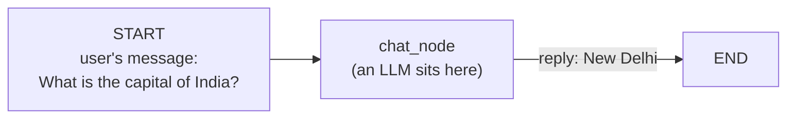
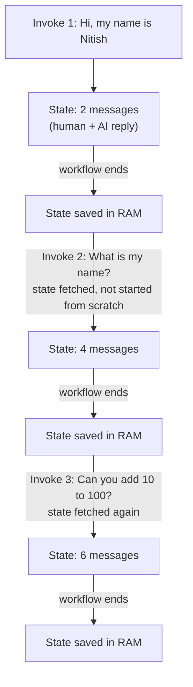

> **Video 10 of 28** · [Watch on YouTube](https://www.youtube.com/watch?v=51Ve2tE3Zns) · Translated from the
> Hindi transcript. Notes follow the video section by section, in its order.

With the workflow basics done, this video starts building a chatbot in LangGraph: a simple one that chats with the user and remembers the previous conversation history.

## Where the playlist stands

So far the playlist has covered two things:

1. The **fundamentals of LangGraph**, the theoretical fundamentals, plus some basics of agentic AI.
2. At a very basic level, **how to build the different types of workflows** in LangGraph: sequential, parallel, conditional and, in the last video, looping workflows.

At this point the basics needed to build agentic AI applications are more or less in place. From here the playlist goes deeper and builds useful things with LangGraph.

## The plan: one chatbot, many features

Starting with this video, the plan is to build a very good chatbot with LangGraph. "Good" because many features will be added to this single chatbot:

- **Normal chatting**, as with any LLM-based chatbot.
- **RAG**, so that if needed the chatbot can look through your documents to answer.
- **Tools**, so that if the chatbot needs to take some action it can do so with their help.
- A **UI**.
- **LangSmith** integration.

In the process of building it, the advanced concepts of LangGraph get covered too:

- **Memory**, implemented in this chatbot.
- **Persistence**: what persistence is and what checkpointers are.
- **HITL**, human in the loop.
- How **retry logic** is implemented and how **fault tolerance** is added.

The idea is that building this single chatbot covers all of LangGraph's advanced topics. This video is the first of the sequence. Its goal is a simple chatbot that can chat with the user and remember its previous conversation history; later videos keep adding features and increasing its complexity.

## The chatbot's design

A chatbot is essentially just a workflow, an LLM-based workflow like the ones built so far, and in fact a slightly simpler one. It is a **sequential workflow with only one node**.



At START you send the user's message, for example "What is the capital of India?". It goes to the **chat node**, where an LLM sits. The LLM receives the message, generates a reply according to it ("New Delhi"), that goes to END and the workflow finishes. You keep doing this whole thing **in a loop** for as long as the user is chatting with you.

## The state: the list of messages

The more important discussion is what this workflow's **state** will be, since any LangGraph workflow starts by defining a state. In a chatbot the important data is the **messages** exchanged between the user and the LLM. So the state holds an attribute called `messages`, a list that stores every message:

- The user says "What is the capital of India?" and that message is added to the list.
- The LLM replies "New Delhi" and that is added too.
- The user asks "What is the capital of Portugal?" and it is added.
- The LLM says "Lisbon" and it is added.

The whole conversation history lives inside the state.

## Coding the state

In a new file with the necessary imports already taken, the first step is the state: a class called `ChatState` that inherits from `TypedDict` with a single attribute, `messages`.

A first thought is to make `messages` an annotated list of strings. That would work, but it is better to use **`BaseMessage`** instead of string.

### Why `BaseMessage`

As covered in the LangChain playlist, you talk to an LLM in terms of messages, and there are a few types:

- **`HumanMessage`**: what a human types and sends to the LLM, such as "What is the capital of India?".
- **`AIMessage`**: what the AI generates in reply, such as "New Delhi".
- **`SystemMessage`**: used to specify a role for the LLM, such as "You are a very experienced data scientist. Answer the following questions accordingly."
- **`ToolMessage`**.

All four inherit from `BaseMessage`. So declaring `messages` as a list of `BaseMessage` means the list can hold a human, AI, system or tool message. That adds flexibility.

### Why a reducer function

One more thing has to be specified: a **reducer function**. As the last video showed, the nature of state is that whenever you put in a new value, the previous value is **replaced**:

- "What is the capital of India?" is stored in the list.
- The LLM generates "New Delhi". Send that into the list and the first message is deleted; only "New Delhi" remains.
- The user asks "What is the capital of Portugal?" and "New Delhi" is deleted in turn.

The state removes whatever was there and keeps the new thing. A chatbot must maintain the entire conversation history, so you need a reducer. Last video used `operator.add`, which kept the old value and added the new one.

Here, instead of `operator.add`, you use a specialised reducer built into LangGraph called **`add_messages`**. It works the same way as `operator.add`, but it is more optimised for working with `BaseMessage` objects. That is why LangGraph recommends `add_messages` over `operator.add` whenever you want to append messages to a list.

```python
from langgraph.graph import StateGraph, START, END  # (implied, not shown in narration)
from typing import TypedDict, Annotated  # (implied, not shown in narration)
from langchain_core.messages import BaseMessage, HumanMessage  # (implied, not shown in narration)
from langchain_openai import ChatOpenAI  # (implied, not shown in narration)
from langgraph.graph.message import add_messages
from dotenv import load_dotenv  # (implied, not shown in narration)

load_dotenv()  # (implied, not shown in narration)

class ChatState(TypedDict):
    messages: Annotated[list[BaseMessage], add_messages]
```

## Building the graph

The graph is a `StateGraph` of `ChatState`. The workflow has only one node, named `chat_node`, and its function is also called `chat_node`.

```python
graph = StateGraph(ChatState)

graph.add_node('chat_node', chat_node)
```

### The `chat_node` function

The function receives the state (of type `ChatState`) as input. Its job: take the user's query out of the state, send it to the LLM, and store whatever response comes back in the state. So first you define an LLM, `ChatOpenAI` with its default model.

Inside the function you extract the messages currently in the state, call `llm.invoke` with them, get a response, and return it under `messages`, **inside a list**. It goes in a list because `messages` is defined as a list: each newly generated message is sent as a list, and that list gets merged with the existing one, just as in the last video.

```python
llm = ChatOpenAI()

def chat_node(state: ChatState):
    messages = state['messages']
    response = llm.invoke(messages)
    return {'messages': [response]}
```

### Edges and compile

The edges go from START to `chat_node`, then from `chat_node` to END. The compiled object is stored in a variable called `chatbot` instead of `workflow`.

```python
graph.add_edge(START, 'chat_node')
graph.add_edge('chat_node', END)

chatbot = graph.compile()
```

Drawing it shows exactly the expected shape: START, `chat_node`, END.

## Trying it once

Create an initial state with a `messages` attribute, a list (since `messages` is a list) containing a `HumanMessage` whose content is "What is the capital of India?", and invoke the chatbot with it.

```python
initial_state = {
    'messages': [HumanMessage(content='What is the capital of India?')]
}

chatbot.invoke(initial_state)
```

The returned state has a `messages` list holding two types of messages: the `HumanMessage` "What is the capital of India?" and the `AIMessage` the LLM replied with, whose content is "The capital of India is New Delhi."

To extract exactly the answer, take `messages`, then the item at `-1`, which is the AI message, then its content.

```python
chatbot.invoke(initial_state)['messages'][-1].content
```

## Making it feel like a chat: the loop

That is not much of a chatbot yet: you ask one question, it answers, and the program ends. You should be able to chat with a chatbot. What exists so far is the basic skeleton; the chatting feature comes next, by running the whole thing inside a loop that keeps going until the user says exit or quit.

- A `while` loop whose condition is always `True`, so it runs until explicitly stopped.
- Inside, ask the user to "Type here" and store what they type in a variable.
- A simple check: strip any leading or trailing white space from the user's message and lower-case it. If it is **exit**, **quit** or **bye**, break the loop; chatting ends and the program stops.
- Otherwise the user has typed a proper message for the LLM, so process it as before: call `chatbot.invoke` with a dictionary, basically the initial state, with `messages` holding a list containing a `HumanMessage` whose content is the user's message.
- As soon as the user gives their message, print it too, so they can see it.
- The invoke returns the response, the final state, with all the messages (human and AI). Extract `messages`, take the last one and print its content as what the AI said.

```python
while True:

    user_message = input('Type here: ')

    print('User:', user_message)

    if user_message.strip().lower() in ['exit', 'quit', 'bye']:
        break

    response = chatbot.invoke({'messages': [HumanMessage(content=user_message)]})

    print('AI:', response['messages'][-1].content)
```

Each invoke returns the conversation history including the most recent AI message, and only that most recent AI message is displayed.

### Running the loop

Typing "hi" gets "Hello, how can I assist you?". A few messages, "What is the capital of India?" and "What is the capital of Portugal?", do not show up at first; this is a UI bug in Jupyter Notebook, not an issue with the code, and the messages had in fact arrived. "What is the capital of Spain?" gets Madrid, the Portugal answer Lisbon appears, and "What is quantum mechanics?" gets an AI answer. Typing **bye** stops the program.

With this logic it seems like a proper chatbot without a UI. No UI has been built, you are just typing in the console, but it gives the feel of a chatbot.

## The big problem: no memory

Run the code again:

- "Hi, my name is Nitish" gets "Hello Nitish, how can I assist you?".
- "Can you tell me my name?" gets "I'm sorry, but I don't have access to your personal information." It was told the name a moment ago, but it does not remember.
- "Add 10 to 100" gets 110. "Now add 15 to the result" gets a garbage value, **25**, when it should have been **125**.

The chatbot has **no memory**: it does not remember what was said earlier in the conversation. The natural doubt is: if every invoke sends the entire conversation history, why can it not answer such simple questions? Pause the video, look at the code and work out the problem: why has the chatbot become the Aamir Khan of *Ghajini*?

### Why it forgets

Look at what the code does. It runs a loop:

1. On the first pass the user says "Hi, my name is Nitish". That message is put into the list and the chatbot is invoked, triggering the flow. It reaches the chat node, which generates "Hello Nitish, how can I assist you?". That goes to END, the workflow ends, its execution finishes and **everything in the state is removed**.
2. On the next pass the user says "Can you tell me my name?". That message is put into a list and sent to the LLM, but this time the list holds **only this message**. The previous two never arrive, because they were part of the previous invocation.

Every pass of the loop calls `invoke`, and every call to `invoke` starts the state **completely from scratch** with no previous information. Technically everything was done right; the one big flaw is that invoking the chatbot repeatedly from the loop erases everything previous, so each time starts fresh.

## The fix: persistence

The problem is solved with a LangGraph concept called **persistence**. It is not covered in detail here, because the next video explains it properly; here it is only used.

The basic idea is simple. Until now, when you trigger the workflow with `invoke`, the nodes execute step by step, each making changes to the state, and as soon as you reach END the state is erased from memory. The next invoke fills the state again from scratch.

With persistence, when execution reaches END you **do not erase** what is in the state; you **store it somewhere**. There are multiple options:

1. Store it in a **database**, so that you can bring it back at any time in the future.
2. Store it in **memory**, as in RAM, so that as long as the program is in memory the state stays as it is and you can fetch it back.

Industry mostly uses the database approach. Since this is a basic-level chatbot, the state is stored in memory.

### The code changes

Not many changes are needed. First, right at the top, one import:

```python
from langgraph.checkpoint.memory import MemorySaver
```

`MemorySaver` is a kind of memory in LangGraph that stores things in RAM.

A lot of new things appear here, and there is no need to be scared. The next video explains them clearly: what checkpointers are, how you implement persistence with them, what else a checkpointer lets you do, how to implement memory, how to add fault tolerance and human in the loop. For now the task is only this: the chatbot forgets everything and has to be made to remember.

Where the graph is defined, create a **checkpointer**, an object of the `MemorySaver` class, and when compiling the graph say that it has a checkpointer, namely this one. What a checkpointer is will not make sense yet, but it is all very easy; it is just not this video's topic, and it has to be used here out of necessity.

```python
checkpointer = MemorySaver()

chatbot = graph.compile(checkpointer=checkpointer)
```

### Threads and the config

Then, whenever you invoke the chatbot, you have to do one small thing: define a **thread**. A thread is basically **one interaction with the chatbot**. Once the chatbot is live any user can talk to it, Nitish, Rahul or Amit, even all at the same time. Nitish's interaction is one thread, Rahul's is one thread, Amit's is one thread. Giving the thread an **ID** identifies whom the chatbot is currently talking to.

When invoking, define a `config` variable: a dictionary with a key `configurable`, whose value is itself a dictionary with a key `thread_id`, set to the thread ID defined above. It looks complicated, but that is all it is. When invoking the chatbot, send not only the messages but also this config, `config=config`.

```python
thread_id = '1'  # (implied, not shown in narration: the ID's value)

while True:

    user_message = input('Type here: ')

    print('User:', user_message)

    if user_message.strip().lower() in ['exit', 'quit', 'bye']:
        break

    config = {'configurable': {'thread_id': thread_id}}

    response = chatbot.invoke({'messages': [HumanMessage(content=user_message)]}, config=config)

    print('AI:', response['messages'][-1].content)
```

### Running it with memory

The first run still fails to remember the name, which is embarrassing: the cells above had not been re-run. After running everything (and removing a cell that was throwing an error, which does not matter here):

```text
User: Hi, my name is Nitish
AI: Hello Nitish, nice to meet you.
User: What is my name?
AI: Your name is Nitish. How can I assist you today?
User: Can you add 10 to 100?
AI: Yes, of course, it's 110.
User: Now can you multiply the result with two?
AI: Sure, 110 * 2 = 220.
```

Now the whole past interaction, the entire conversation history, reaches the chatbot, which is why it can answer all these questions.

### Looking at the stored state

You can see this with `chatbot.get_state`. You have to pass the config, because the config is how you say who was chatting: it was Nitish, so which thread ID. Only then do you get the state.

```python
chatbot.get_state(config=config)
```

The state shows every message exchanged so far. It does not display nicely, and pasting it into a JSON viewer does not work because it is not valid JSON but a Python object; you will have to run it on your own laptop and look through it. The first message is "Hi, my name is Nitish", the third is "What is my name?", the next one tells you your name is Nitish, and so on: the whole conversation history is captured in the state.

### What happens behind the scenes



1. The user says "Hi, my name is Nitish", which is stored in the state. The AI replies "Hello Nitish, nice to meet you", also stored. The loop pass finishes and the workflow closes, and whatever was in the state is stored somewhere in RAM.
2. The next message, "What is my name?", triggers the workflow again. This time the state does **not** start from scratch: LangGraph goes to RAM, brings back the state with the previous two messages and appends the third. It is appended because the reducer used was `add_messages`. The AI replies "Yes, your name is Nitish", which is added too, and the workflow closes for the second time. The four messages so far are saved to RAM.
3. The third trigger brings "Can you add 10 to 100?". Again LangGraph fetches the state from RAM, which now has four messages, adds the fifth, then adds the reply, and the workflow finishes and the state is saved in memory again. This continues until exit.

At that point every message is stored in the state, and each time the workflow is triggered it gets the entire conversation history so far.

### Why RAM is not enough in production

If you now remove the program from memory, for example by pressing **restart** and then Run All, and ask "What is my name?", it cannot tell you. The memory chosen was the RAM one, so removing the program from RAM removed the stored state as well. With a database-backed memory, the state would survive closing and restarting the program.

That is why production chatbots use databases. Suppose you are chatting today with WhatsApp or some AI chatbot, you close the session and the program is removed from memory, and you come back on Friday, four days later, and ask "Hi, what did we talk about that day?". The chatbot remembers, because the state is saved in a database.

## What comes next

At this point the likely problem is the code: threads and checkpointers will not be clear yet, and the code may look a little scary. The next video is entirely on persistence: threads, checkpointers, and what features other than memory you can implement in LangGraph workflows with persistence. Treat this video as part one, ending on a cliffhanger that the next video answers properly. Persistence is a very important LangGraph feature and needs a dedicated video. For now, the point is how a chatbot with memory is built.
