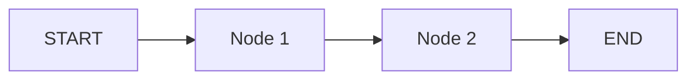
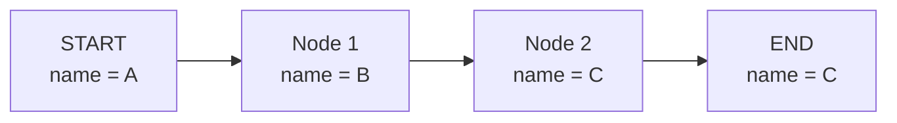
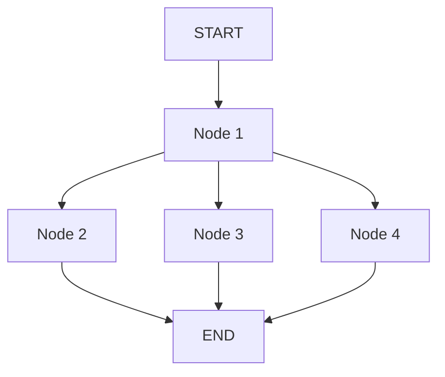
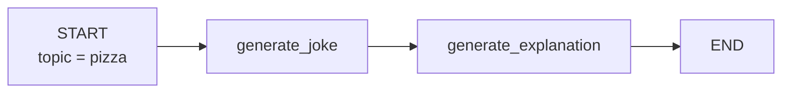
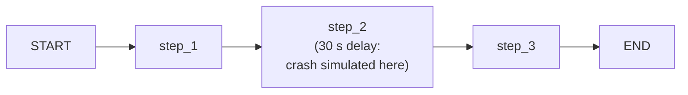
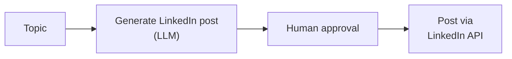
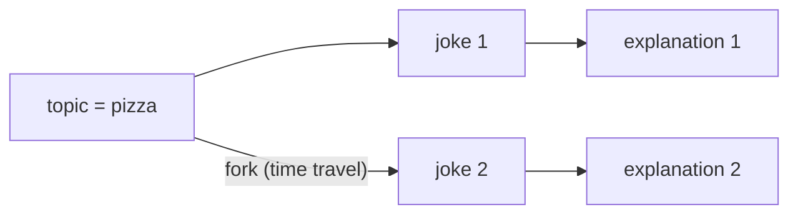
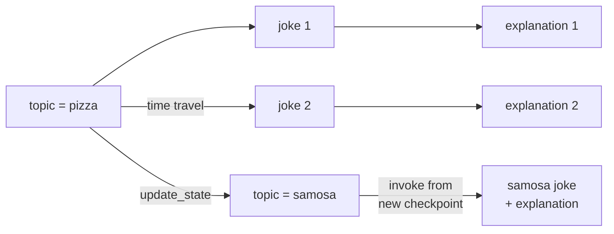

> **Video 11 of 28** · [Watch on YouTube](https://www.youtube.com/watch?v=_IPP7_Bi8uA) · Translated from the
> Hindi transcript. Notes follow the video section by section, in its order.

Persistence lets a LangGraph workflow save its state, final and intermediate, and restore it later; it is a foundational topic on which many later LangGraph topics are built.

## The plan for this video

Persistence is one of the most important topics in LangGraph. You can call it foundational, because many other topics are built on top of it. The video covers three things in order: what persistence is, why it was needed, and how to implement it in code. Watching it end to end gives you the concept and also a solid foundation for the concepts that come later.

## What persistence is

The definition used here:

> Persistence in LangGraph refers to the ability to save and restore the state of a workflow over time.

It is short and simple, but to understand it fully you need to recall the two basic principles LangGraph has taught so far.

**1. The concept of a graph.** Any high-level goal can be decomposed into a set of tasks, and that set of tasks can be represented as a graph. Every node is one task of the goal, and the edges between nodes represent the **execution order**: they tell you whether task 2 or task 3 runs after task 1.

**2. The concept of state.** Whenever you build a graph or workflow in LangGraph, you first build its state. The idea is that any workflow needs some important data to execute. In a chatbot workflow, that data is the **messages** exchanged between the AI and the human, which have to be stored somewhere while the chatbot runs. You store such data in the state, which is nothing but a dictionary. Every key-value pair in it is accessible from any node, and nodes can also change those values: every node can both **read from** and **write to** the state.

With these two core ideas you can build an LLM-based workflow of any complexity in LangGraph, and the playlist has built and executed several.

### The behaviour persistence changes

While executing those workflows you may have noticed one behaviour. When you trigger a workflow with `invoke`, the input enters at START and moves down the graph: START passes it to node 1, node 1 does its work and passes its output to node 2, node 2 does its work, and the workflow ends.



Throughout this execution the state keeps changing: node 1 changes it, node 2 changes it, and at the end you have a final state. Generally, when execution finishes, **every value stored in the state is erased**; it goes out of RAM. Once the workflow has finished you cannot access that state again, so if you need those values in the future you cannot recover them. That is a core behaviour of LangGraph.

Persistence changes this behaviour. With persistence you **save the workflow's state somewhere**, so that in the future you can see what values were in it and use them again. That is the whole idea behind "save and restore the state of a workflow".

## Persistence stores intermediate values too

Persistence's biggest speciality is that it does not store only the **final** values of the state; it stores all the **intermediate** values as well.

Take a workflow with two nodes and one state variable, `name`. At the start you give `name` the value **A**. Node 1 changes it to **B**. Node 2 changes it from B to **C**, and the workflow ends with the final value C.



With persistence added, you do not save only C. You save what `name` was at the start, at node 1, at node 2, and after the workflow ended. Persistence saves the state's values at **every intermediate stage**. That is why the definition says "over time".

### Why this matters: fault tolerance

Suppose that while executing this workflow it suddenly crashes during node 1, or say node 2. The reason could be anything: the server running the workflow went down, or an API the node was hitting went down. Because the state has been saved at every intermediate stage, you can trigger the workflow again and it will **restart from the point where it crashed**, not from the beginning, since the progress up to there is already saved.

This feature is called **fault tolerance**. The introduction video listed fault tolerance as one of LangGraph's big features, and this is where it comes from. Without persistence, LangGraph workflows would not be fault tolerant.

### Why this matters: resuming chats

The second scenario is building chatbots. On a chatbot like ChatGPT you have two options: start a **new conversation** about a new topic, or **resume an old conversation**. Say you discussed a doubt with ChatGPT three days ago and want to resume exactly that conversation today.

To support that, your chatbot workflow must use persistence and save all the messages stored in the state somewhere. Only then can you fetch those messages back, show them to the user, and resume the chat from that point. If you never saved the messages in the state, meaning you never used persistence, the user's old conversations cannot be resumed and you cannot show any past chat. So any chatbot you build needs persistence to offer **resume chat**.

### Where the state is saved

"Somewhere" is **some sort of database**. You store the state's values in a database and retrieve them in the future.

So far, then, persistence has two benefits:

- **Fault tolerance**, possible because persistence stores all intermediate values, not only the final ones.
- **Resume chat**, possible because all past interactions kept in the state are in the database, so if a user asks to resume what they talked about a week ago, you can.

It is a very important concept for building powerful LLM-based workflows, which is why this video matters so much.

## Terms you will see in the code

### Checkpointer

Persistence in LangGraph is implemented with a **checkpointer**. The checkpointer divides the whole graph's execution into **checkpoints**, and at every checkpoint it saves the state's values.

How are checkpoints decided? **Every superstep of the graph becomes a checkpoint.** (Supersteps were introduced in the first or second video.) Take this graph:



- START to node 1 is one superstep.
- Node 1 to nodes 2, 3 and 4 happens in parallel, so those three steps together are a single superstep.
- Nodes 2, 3 and 4 to END also happen in parallel, so that is another single superstep.

The graph therefore has three supersteps. The checkpointer places a checkpoint at each of them, plus one at the end, and as the graph executes it saves the state's values (intermediate plus final) into the database at every checkpoint.

In summary: persistence is implemented with a checkpointer; the checkpointer places checkpoints across the graph, one per superstep; and as the graph runs it saves the state into the database at each checkpoint.

#### A worked example with a reducer

In case checkpoints are still confusing, here is exactly what gets stored and when. Suppose the state has an attribute `numbers`, a list of integers, with a **reducer function** that merges each new value into the list.

1. You start the workflow with `numbers` = `[1]`. At **checkpoint 1** the database records `[1]`.
2. Node 1 generates another value, 2. Because of the reducer the value is merged, not replaced, so `numbers` becomes `[1, 2]`. At **checkpoint 2** that is saved.
3. Nodes 2, 3 and 4 each produce a value, and all three merge in: `[1, 2, 3, 4, 5]`. That is **checkpoint 3**, and it is saved.
4. At END no values change, so `numbers` is still `[1, 2, 3, 4, 5]`. END is also a checkpoint, so it is saved again.

The database now holds four state values, because the graph had four checkpoints.

### Threads

The second concept to learn before coding is **threads**.

Run the same graph twice, meaning you call `invoke` twice:

- **First run:** initial `numbers` = 1. The next node generates 2, giving `[1, 2]`, then nodes 3, 2 and 4 generate their values, giving the final state. All checkpoint values are saved to the database.
- **Second run:** initial value 6. The next node produces 7, giving `[6, 7]`, then nodes 3, 2 and 4 generate 8, 9 and 10, giving the final state `[6, 7, 8, 9, 10]`. Again every checkpoint is saved to the database.

Nothing special there: the same workflow invoked with different values gives different results. The question is how to load **only one particular execution's values** from the database, to resume it or inspect it, when every run keeps adding more values to the same database.

The answer is threads. Whenever you use persistence, you **assign a thread ID** when you execute the workflow. Run the first execution with thread ID 1 and its values are stored against thread ID 1. Run the second with thread ID 2 and its intermediate and final values are stored against thread ID 2. Later, if you want the second execution's state, you ask the database for whatever was generated in thread ID 2, and because everything is stored neatly against thread IDs you get it at once.

Each execution gets its own thread ID, and holding that thread ID you can retrieve its state values.

This is very useful for a chatbot where you want to store every chat interaction:

- A user says "I want to start a new conversation". You create a thread ID for that session, say 1, and store the whole conversation against thread ID 1.
- Two days later the user starts a new conversation. You create thread ID 2 and store that conversation against it.
- The user asks to resume a particular conversation. You fetch its thread ID, pull out all messages stored against it, and the whole chat history is resumed automatically.

The demos below provide a thread ID whenever a workflow runs with persistence.

## Demo 1: a joke workflow with persistence

That is all the theory needed. The practical example is a simple **sequential workflow** that generates a joke on a given topic and then an explanation of that joke. At START you provide a topic, say **pizza**. The first node, generate joke, uses an LLM to write a joke on the topic. The next node uses an LLM again to explain that same joke, and the workflow ends.



### The code

All the necessary libraries are imported. The one import to notice is the class `InMemorySaver` from `langgraph.checkpoint.memory`. `InMemorySaver` is a kind of checkpointer, and this particular one saves all the state values (intermediate plus final) **in memory**, that is, in RAM.

Saving in RAM means the values are deleted when the program closes. That is known: this checkpointer is generally used for demos and for understanding things, not in a production setup. Production has other checkpointers, such as a **Postgres** checkpointer and a **Redis** checkpointer, which will be used later when the course builds projects. The concept is exactly the same.

Next an LLM is created, then the state. It has three things, all strings: the joke's **topic**, the joke's text (**joke**), and the joke's **explanation**.

```python
from langgraph.graph import StateGraph, START, END
from langgraph.checkpoint.memory import InMemorySaver
from langchain_openai import ChatOpenAI  # (implied, not shown in narration: the LLM provider is not named)
from typing import TypedDict

llm = ChatOpenAI()  # (implied, not shown in narration)

class JokeState(TypedDict):
    topic: str
    joke: str
    explanation: str
```

The two node functions:

- **generate_joke** builds a prompt, "generate a joke on the topic", with the topic fetched from the state, sends it to the LLM, stores the result in `response`, and puts it in the state's `joke` attribute.
- **generate_explanation** builds a prompt, "write an explanation for the joke", with the joke fetched from the state, sends it to the LLM, stores the result in `response`, and puts it in the state's `explanation` key.

```python
def generate_joke(state: JokeState):
    prompt = f'generate a joke on the topic {state["topic"]}'
    response = llm.invoke(prompt).content
    return {'joke': response}

def generate_explanation(state: JokeState):
    prompt = f'write an explanation for the joke - {state["joke"]}'
    response = llm.invoke(prompt).content
    return {'explanation': response}
```

The graph gets the two nodes and three edges: START to `generate_joke`, `generate_joke` to `generate_explanation`, and `generate_explanation` to END.

Then comes the main thing. To make the workflow implement persistence, you create a **checkpointer object** of the `InMemorySaver` class and pass it as `checkpointer` when compiling the graph. That one line tells LangGraph to save every state value of the graph, intermediate plus final, in memory using `InMemorySaver`. That is all you have to do.

```python
graph = StateGraph(JokeState)

graph.add_node('generate_joke', generate_joke)
graph.add_node('generate_explanation', generate_explanation)

graph.add_edge(START, 'generate_joke')
graph.add_edge('generate_joke', 'generate_explanation')
graph.add_edge('generate_explanation', END)

checkpointer = InMemorySaver()

workflow = graph.compile(checkpointer=checkpointer)
```

### Running it with a thread ID

You run a workflow with `workflow.invoke`, sending the initial state: topic pizza. With persistence you must also send a **thread ID** at execution time, since everything is stored against it. So a `config` variable says the thread ID for this execution is 1.

```python
config1 = {"configurable": {"thread_id": "1"}}
workflow.invoke({'topic': 'pizza'}, config=config1)
```

This runs normally and returns values for topic, joke and explanation.

### Reading the final state: `get_state`

The benefit is that you can call `workflow.get_state`, pass the config (the thread ID), and fetch the workflow's final state. Its values show `pizza` in topic, the generated joke and its explanation. On a re-run the joke was:

```text
Why did the pizza go to the doctor? Because it was feeling a little cheesy.
```

```python
workflow.get_state(config1)
```

The interesting part: had you used an actual database-backed saver, closed the program after invoking, and come back three days later to run this code, you would see exactly the same thing, because the final state is stored in the database. That is the first benefit.

### Reading intermediate states: `get_state_history`

The second benefit is that you get the intermediate state values too. For those, run `workflow.get_state_history`, again passing the thread ID.

```python
list(workflow.get_state_history(config1))
```

It returns **four** values, one for each point before START, before `generate_joke`, before `generate_explanation`, and before END. Reading them:

- **Before START** the state is empty: no topic, no joke, no explanation. This is the last entry in the list, and its "next" field says the node to execute next is START.
- **Before generate_joke** the values hold only topic pizza, since neither the joke nor the explanation exists yet. Next: generate_joke.
- **Before generate_explanation** the values hold topic pizza and the joke. Next: generate_explanation.
- **Before END** the values hold topic, joke and explanation, and nothing is next because that was the last node.

So you have the final value of the state and also the intermediate values stored at different checkpoints.

### A second thread: pasta

Invoke the workflow again, this time with the topic **pasta** and a different thread ID, 2.

```python
config2 = {"configurable": {"thread_id": "2"}}
workflow.invoke({'topic': 'pasta'}, config=config2)
```

It produces a pasta joke and its explanation. Now `workflow.get_state(config2)` shows the pasta joke, while `workflow.get_state(config1)` shows the pizza joke. Both are stored and can be retrieved at any later stage. The same holds for `get_state_history`: config 2 shows all of pasta's intermediate values, config 1 all of pizza's.

Every time you execute the graph, all its intermediate state values go to the database, and later you can retrieve both the final and the intermediate values. That is persistence in practice, implemented with checkpointers.

## The four benefits of persistence

Persistence precisely gives four benefits:

1. **Short-term memory** in chatbots.
2. **Fault tolerance** in workflows.
3. **HITL**, human in the loop.
4. **Time travel**.

They are discussed one by one.

### 1. Short-term memory

As shown earlier, a tool like ChatGPT lets you start a new conversation or resume a past one. Resuming means seeing what you discussed before and continuing from where you stopped. You can get that past conversation only if you stored it somewhere, that is, if you used persistence. So for short-term memory, **persistence is the only way in LangGraph**.

To see it working, watch the previous video in this playlist, where a chatbot is built in LangGraph with short-term memory implemented through persistence.

### 2. Fault tolerance

Being fault tolerant means that if a workflow with three nodes crashes at one node, you can **resume exactly at that point** instead of re-executing everything from the beginning. Because the state is stored at every step, you know where the crash happened, what the state was at that point, and which node runs next, so the workflow can resume at the exact point of the crash.

#### Demo 2: simulating a crash

The demo workflow has three steps. **Step 2 has a 30-second delay**, during which the workflow does nothing. While those 30 seconds run, a manual keyboard interrupt stops the execution, simulating a crash. The workflow is then resumed, and you will see it resume from step 2, not from the beginning.



This code is written in **Google Colab**, because the keyboard interrupt could not be given in VS Code. It may work fine on your machine; otherwise run the same code on Google Colab.

The state has four attributes: `input`, `step1`, `step2` and `step3`. The three node functions do nothing but print statements and change the state's values; the last one puts `step3` in and sets it to done too. The one interesting detail is the 30-second delay in step 2.

```python
import time
from typing import TypedDict
from langgraph.graph import StateGraph, START, END
from langgraph.checkpoint.memory import InMemorySaver

class CrashState(TypedDict):
    input: str
    step1: str
    step2: str
    step3: str

def step_1(state: CrashState):
    print("Step 1 executed")
    return {"step1": "done"}

def step_2(state: CrashState):
    print("Step 2 executed")
    time.sleep(30)  # 30-second delay; interrupt the kernel during this
    return {"step2": "done"}

def step_3(state: CrashState):
    print("Step 3 executed")
    return {"step3": "done"}
```

The graph has the three nodes and the edges START to step 1, step 1 to step 2, step 2 to step 3, step 3 to END, and the checkpointer is given at compile time.

```python
builder = StateGraph(CrashState)
builder.add_node("step_1", step_1)
builder.add_node("step_2", step_2)
builder.add_node("step_3", step_3)

builder.add_edge(START, "step_1")
builder.add_edge("step_1", "step_2")
builder.add_edge("step_2", "step_3")
builder.add_edge("step_3", END)

checkpointer = InMemorySaver()
graph = builder.compile(checkpointer=checkpointer)
```

Invoke the graph with `start` as the input and thread ID 1:

```python
config = {"configurable": {"thread_id": "1"}}
graph.invoke({"input": "start"}, config=config)
```

Step 1 executes. Step 2 is still running because of the delay, so the run is stopped manually and Colab reports that the kernel was manually interrupted. The crash is simulated.

Extracting the state at this point shows `input` is `start` and `step1` is `done`, so the first node ran, but `step2` is not done: the crash happened at step 2.

`get_state_history` at this point has **three** state values:

- the first with nothing in its values;
- the second with `input` = `start` (the START node);
- the third with `input` = `start` and `step1` = `done`, which is where execution stopped.

#### Resuming with `None`

To resume, call `graph.invoke` again, but this time pass **`None`** instead of an initial state. Last time the initial state was `input: start`; passing `None` means "resume the workflow from wherever it last stopped". The same thread ID as before must be provided.

```python
graph.invoke(None, config=config)
```

This time "Step 1 executed" does not appear. Execution starts directly from step 2, runs its 30 seconds (not interrupted this time), then step 3 executes. The final state has `input` = `start` and `step1`, `step2` and `step3` all `done`. `get_state` shows that final state, and the full history now has **five** entries. Reading the "next" field on each: nothing to execute on the latest, then step 3, step 2, step 1, and START.

That is fault tolerance using persistence. The example is very simple, but it is very useful when you run a long-running workflow.

### 3. Human in the loop

Take a simple workflow: give it a topic, it generates a **LinkedIn post** on that topic, and then posts it to LinkedIn through LinkedIn's API. One minor change: after the post is generated, the workflow should ask your **permission** before posting it. A human is seated in the middle of the workflow, which is why it is called human in the loop.



It sounds simple but it is a little tricky. The LLM generates the post quickly and asks the user whether to post it. The user's answer may come immediately, after an hour, or after two days; it depends on the user. You cannot keep the workflow active in memory for two days; that is not logical.

So to implement human in the loop, LangGraph **interrupts** the execution at that point, suspending it temporarily, and waits for the human's input. When the input arrives, LangGraph resumes the workflow exactly where it interrupted it. How does it know where to resume? **Persistence.** Because the workflow is saved at every checkpoint, when you resume you know where you interrupted and can continue from there.

It is similar to fault tolerance, except that you do it **deliberately**: fault tolerance depends on external factors, while here you are waiting for a human. Human in the loop also needs persistence. It is not shown in code here; a dedicated later video covers human in the loop, and persistence will be used there too.

### 4. Time travel

Time travel lets you **replay** your workflow's execution. Take the joke workflow: suppose it has run once, generating the joke and its explanation. You can go back to a particular checkpoint and replay the execution of all the nodes after it.

What is the benefit? **Debugging.** When you work with a very complex workflow and something goes wrong somewhere in the middle, you can go to that checkpoint and replay the workflow from there.

#### Demo 3: replaying from a checkpoint

Using the same joke example, jokes and explanations already exist for pizza and pasta. The goal is to go back to the stage where the topic pizza had been given and re-run everything after it, so the pizza joke and its explanation are generated again.

First you reach the checkpoint where the topic exists but no joke has been generated. Go to `get_state_history` and find the entry where the topic value has arrived. Every checkpoint has its own **checkpoint ID**, visible on each entry, and that ID is how you reach it. Copy that checkpoint's ID, then call `workflow.get_state` with the thread ID **and** the checkpoint ID, so you get the intermediate state at that checkpoint instead of the final state. It shows topic pizza.

```python
workflow.get_state({"configurable": {"thread_id": "1", "checkpoint_id": "<copied checkpoint id>"}})
```

Now re-run the execution from that checkpoint: call `workflow.invoke` with no initial state (`None`), passing the thread ID and exactly the same checkpoint ID. Everything after that point re-executes.

```python
workflow.invoke(None, {"configurable": {"thread_id": "1", "checkpoint_id": "<copied checkpoint id>"}})
```

The topic is still pizza, but the joke changed:

```text
Why did the slice of pizza go to the party? Because it wanted to get a little saucy.
```

Scrolling up, the earlier pizza joke also started "Why did the pizza go to the party?", but its punchline was different, and the two explanations differ too. You reached that checkpoint and replayed everything after it. The outputs differ because the LLM is **probabilistic** and generates different answers.

Running `workflow.get_state_history` again now gives **six** objects instead of four: four from the first execution and two from time travel, one with topic pizza and the new joke, the next with the new joke and its explanation. At the pizza checkpoint a **fork**, a branch, was created, and a second joke and explanation were generated along it.



#### Demo 4: changing the state at a checkpoint

You can also go to a particular checkpoint and **change the state's values**. For example, go to the pizza checkpoint, change the topic from pizza to **samosa**, and run everything after it; the joke will then be about samosa and the explanation about that joke.

Call `workflow.update_state`, giving the ID of the checkpoint where the value is pizza (copied from the history) and the updated state value, topic samosa instead of pizza:

```python
workflow.update_state(
    {"configurable": {"thread_id": "1", "checkpoint_id": "<pizza checkpoint id>"}},
    {'topic': 'samosa'},
)
```

The state is updated, and `get_state_history` now shows one additional entry: previously six (four from the first execution, two from time travel), and now one more where the topic is samosa. Another cut has been made at that point.

Next, invoke the workflow with `None` from that checkpoint, using the same checkpoint ID as before, expecting a samosa joke. Instead a **pizza** joke comes back. Something went wrong: on an earlier try the samosa joke and its explanation had appeared, so why not this time?

After pausing to figure it out, the mistake is clear. Redo the update: copy the checkpoint ID where the topic is pizza, pass it to `update_state`, and set the topic to samosa. Running this creates a new fork: six entries from before (four from the first execution, two from time travel) plus this one from the state update, where samosa appears. A new branch has been created.

The mistake was invoking the graph from the **old checkpoint where pizza was set**, which naturally generates a pizza joke and its explanation. Instead, you must execute the graph from the **new branch**: copy the checkpoint ID of the new, updated entry, and pass that to `workflow.invoke` with `None`.

```python
workflow.invoke(None, {"configurable": {"thread_id": "1", "checkpoint_id": "<new samosa checkpoint id>"}})
```

Now the joke is on samosa and the explanation is of that joke. The history now reads: the first four from the initial execution, two from time travel, one from the state update, and one from time travel again.



This whole feature will not be very useful to you unless you are building very complex workflows; it is a debugging tool. It is shown to demonstrate what persistence makes possible. If it feels difficult or confusing, you can ignore this part without any problem.

## Wrapping up

The video covered the theory of persistence, saw it in practice, and then went through its four aspects: short-term memory, fault tolerance, human in the loop and, lastly, time travel. It was a slightly technical video, but if it made sense, you now understand LangGraph one level better.
