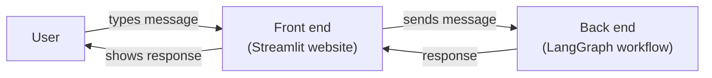
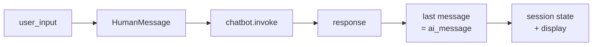

> **Video 12 of 28** · [Watch on YouTube](https://www.youtube.com/watch?v=voZAgDmO-rk) · Translated from the
> Hindi transcript. Notes follow the video section by section, in its order.

The LangGraph chatbot built two videos ago worked and had short-term memory, but its big flaw was that it had no user interface; this video gives it a web UI built with Streamlit.

## The flaw in the earlier chatbot

The chatbot from the video before last worked correctly, and short-term memory let it remember past messages. Its one big flaw: it had **no UI**. To interact with it you typed into the same Jupyter notebook. The fix is a **web interface**, a website where the same LangGraph chatbot lives and users talk to it through the site.

## Demo of the finished UI

The finished UI is clean and simple. At first the screen shows only an **input box** where the user types a message.

- Type **"hi"**. The message moves to the top of the UI with a **user icon**, and right below it the assistant's reply appears with a **different icon**, so you can immediately tell who typed what: "Hello, how can I assist you today?"
- "My name is Nitish" gets "Nice to meet you, Nitish. How can I help you today?"
- "What is the capital of India?" gets "The capital of India is New Delhi."
- "What is the recipe to make pasta?" returns ingredients and instructions.
- **Short-term memory** is implemented here too: "What is my name?" is answered with Nitish, from earlier in the chat.

As messages are added the whole UI moves up, and when the conversation gets long a **scroll bar** appears so you can scroll through the messages.

The UI is built with **Streamlit**, a Python library for building websites. There are other options, but for a demonstration Streamlit seemed the best and fastest. The video builds this exact UI step by step so that you can make an exact replica on your machine.

## Plan: split the chatbot into back end and front end

The first step is to divide the chatbot into two components:

1. **Back end**, where the LangGraph workflow is built.
2. **Front end**, a website built with Streamlit.

The user interacts with the front end by typing a message. The front end sends that message to LangGraph, receives LangGraph's response, and shows it to the user.



So you need two separate files. In the code from the video before last, the part that builds the workflow and graph goes into the **back end**. The part that ran a loop asking the user for input, invoked the chatbot and printed the response becomes the **front end**.

The back end needs little work, since most of that code is already written. The effort goes into the front end. The plan of action:

1. Learn how to build **chat interfaces in Streamlit**.
2. Then **integrate Streamlit with LangGraph**.

### Prerequisites

- **Streamlit fundamentals.** If you do not know them, do not worry: it is a very simple library. Watch any Streamlit video on YouTube and within 15 to 20 minutes you will have the fundamentals.
- **LangGraph fundamentals.** If you have followed the playlist so far, you should have no problem.

## The project setup

A completely new project folder was created for the UI, with a few things already done:

- **`langgraph_backend.py`**, the chatbot's back end, with the code already written. It should not feel new: it is exactly the code from the video before last. It imports the libraries, defines the state, builds a simple graph from START to the chat node to END, and uses a checkpointer, the **`InMemorySaver`** one.
- **`streamlit_frontend.py`**, where the UI code goes. It is empty for now; all of it is written in this video.
- A **`.env`** file holding the OpenAI key.
- A virtual environment with the libraries installed: **LangChain**, **LangGraph** and **Streamlit**.

The back end, as described (it is the earlier video's code; lines the narration does not spell out are marked):

```python
from langgraph.graph import StateGraph, START, END
from typing import TypedDict, Annotated
from langchain_core.messages import BaseMessage
from langchain_openai import ChatOpenAI
from langgraph.checkpoint.memory import InMemorySaver
from langgraph.graph.message import add_messages
from dotenv import load_dotenv

load_dotenv()

llm = ChatOpenAI()  # (implied, not shown in narration)

class ChatState(TypedDict):  # (implied, not shown in narration: the state's exact name and field)
    messages: Annotated[list[BaseMessage], add_messages]

def chat_node(state: ChatState):  # (implied, not shown in narration: the node body)
    messages = state['messages']
    response = llm.invoke(messages)
    return {'messages': [response]}

checkpointer = InMemorySaver()

graph = StateGraph(ChatState)
graph.add_node('chat_node', chat_node)
graph.add_edge(START, 'chat_node')
graph.add_edge('chat_node', END)

chatbot = graph.compile(checkpointer=checkpointer)
```

## The two components of a chat UI

Before writing the front end you need one conceptual point: identify the **main components** of the UI. This UI has two.

1. **`chat_message`**: each box where a message is displayed, the user's or the AI assistant's.
2. **`chat_input`**: the input box at the bottom where the user types and sends a chat.

Without these two components you cannot build this UI at all, so they come first.

### `chat_message`

Start with a small interface showing a single user message. Write `with st.chat_message(...)` and pass the **role**: who sent this message, the user or the AI assistant. Since the user sent it, the role is `'user'`. Inside, `st.text` can hold anything, for example "Hi".

```python
import streamlit as st

with st.chat_message('user'):
    st.text('Hi')
```

That creates a text box showing the user's message. To run it:

```bash
streamlit run streamlit_frontend.py
```

The output is a text box with the user's message.

Next, show the assistant's message right below it with the same logic, but role `'assistant'`, because the assistant is printing it:

```python
with st.chat_message('assistant'):
    st.text('How can I help you?')
```

Save and rerun, and the assistant's message appears. The **icons come from the roles** you assign: `user` gives one icon and `assistant` gives the yellow one. You can change them with a parameter called **`avatar`**, but that is not needed now.

One more box, a user message again:

```python
with st.chat_message('user'):
    st.text('My name is Nitish')
```

Save, rerun, and the third message is displayed.

### `chat_input`

The second component is the input box, `chat_input`. Call `st.chat_input` and give it a placeholder such as "Type here" to guide the user. Whatever the user types is stored in a variable, `user_input`.

```python
user_input = st.chat_input('Type here')
```

Save and rerun, and the `chat_input` component appears at the bottom. You can type something and press Enter, and Enter triggers some action. No action is defined yet, so nothing shows.

Define one: whatever the user types should appear above in a user box as soon as they press Enter. If `user_input` is set, meaning the user typed something, display it inside `st.chat_message` with role `'user'`, using `st.text`.

```python
user_input = st.chat_input('Type here')

if user_input:
    with st.chat_message('user'):
        st.text(user_input)
```

Type "Nitish", press Enter, and "Nitish" appears; type something else and it updates. That covers placing both components on the UI.

## A copycat chatbot

Next, one notch more complexity: a chatbot whose assistant prints back **exactly** what the user typed. Write "hi" and the AI writes "hi"; write "My name is Nitish" and the AI writes "My name is Nitish". It is a chatbot, but a dumb one. Build it at a very basic level first, then improve it.

### First attempt

It seems quite simple. Show a `chat_input` box with "Type here" and store what the user types in `user_input`. If `user_input` is set, first show the user's message with `st.chat_message` (role user) and `st.text(user_input)`. Then show the assistant's message, which is exactly the same, so repeat the code with role assistant.

```python
import streamlit as st

user_input = st.chat_input('Type here')

if user_input:
    with st.chat_message('user'):
        st.text(user_input)

    with st.chat_message('assistant'):
        st.text(user_input)
```

Type "hi" and both the user's and the assistant's messages appear, identical.

### The problem: old messages vanish

As soon as you type a second message, say "hello", the old messages **disappear**. This is Streamlit's nature: every time the user presses Enter, the **script re-executes from top to bottom**. Suppose "hello" is showing and the user types "Nitish". On Enter the script reruns: is `user_input` set? Yes, so "Nitish" goes into the user box and into the assistant box, and whatever was there before vanishes.

You can display the current messages, but in the process you wipe out the old **conversation history**. The simple reason: the conversation history is not being **stored** anywhere.

### Second attempt: a `message_history` list

So store the history. Each message becomes a dictionary with two keys:

- **`role`**, saying whether the user or the assistant typed it;
- **`content`**, what was said in that turn, such as "hi".

There will be one such dictionary per message, the user's and then the assistant's, and all of them go inside a **Python list** named `message_history`, created right at the top.

Whenever a user or assistant message arrives, you first **add it to the history**, then display it. For the user's message, `message_history.append` a dictionary with role `'user'` and content `user_input`, then display it. The assistant's message gets the same treatment: role `'assistant'`, and for now the content is the same `user_input`.

Then, right at the top, **display every message in `message_history`**: first the whole history prints, then the current user message, then the current assistant message. That is a loop, `for message in message_history`, going through each dictionary and calling `st.chat_message` with the dictionary's `role` value and `st.text` with its `content`.

```python
import streamlit as st

message_history = []

# loading the conversation history
for message in message_history:
    with st.chat_message(message['role']):
        st.text(message['content'])

user_input = st.chat_input('Type here')

if user_input:
    # first add the message to message_history
    message_history.append({'role': 'user', 'content': user_input})
    with st.chat_message('user'):
        st.text(user_input)

    message_history.append({'role': 'assistant', 'content': user_input})
    with st.chat_message('assistant'):
        st.text(user_input)
```

Will it work? On rerun there is no history, so nothing loads. Type "hi": "hi" and "hi" appear. Type "hello": ideally the two "hi"s should stay and two "hello"s appear below them. **It does not work.**

Pause and think about why. The answer is simple: every Enter reruns the script from top to bottom, so the line `message_history = []` also executes every time. That line **erases and resets the conversation history** each time, wiping out every message you added.

### The fix: `st.session_state`

Ideally you would have a dictionary that does **not** reset every time Enter is pressed, one whose stored messages stay exactly as they are. Streamlit has one, a component called **session state**. Session state is also a dictionary, but its contents are **not erased when you press Enter**. They are erased or reset only when you **manually refresh the page**; otherwise things keep accumulating in it. So use this dictionary instead of the plain Python one.

In the code, first check at the top whether session state already has something called `message_history`. If not, add a key `message_history` to session state whose value is a list, empty at first. Session state is itself a dictionary; you have added a key named `message_history` whose value is a list. Remove the old `message_history = []` line, load the conversation history from `st.session_state['message_history']`, and append into that key instead of the plain list, for both messages.

```python
import streamlit as st

if 'message_history' not in st.session_state:
    st.session_state['message_history'] = []

# loading the conversation history
for message in st.session_state['message_history']:
    with st.chat_message(message['role']):
        st.text(message['content'])

user_input = st.chat_input('Type here')

if user_input:
    # first add the message to message_history
    st.session_state['message_history'].append({'role': 'user', 'content': user_input})
    with st.chat_message('user'):
        st.text(user_input)

    st.session_state['message_history'].append({'role': 'assistant', 'content': user_input})
    with st.chat_message('assistant'):
        st.text(user_input)
```

Rerun and type "hi", then "hello": the "hi" stays and two "hello"s appear below it. Type "Nitish" and it comes exactly as expected.

Why does it work now? On each Enter, the initialisation code does not execute, because `message_history` has been in session state since the first message. Since it does not reset, the messages inside it print one by one. The new user message is put into `message_history` and then printed below in the UI; the new assistant message is likewise put into `message_history` first and then printed. That is how session state works, and the simple copycat chatbot is done.

## Connecting Streamlit to LangGraph

Those are all the Streamlit fundamentals needed for chat UIs. Now use them to connect Streamlit to LangGraph, so that instead of dummy messages you get intelligent AI messages.

Honestly, little changes. Step by step:

- The code that **loads the conversation history** needs no changes; it works as it is.
- The code that **takes input** from the user needs no changes.
- The code that **adds the user's message** to the history and displays it needs no changes.
- Only **one place** changes: where the assistant's message is added to the history and displayed. Right now the assistant's message is simply the user's message. In the real world, you send the user's message to the AI, the AI returns a response, and you display that response.

From the video before last, the flow to complete is: take the user's message, convert it to **`HumanMessage`** format, call **`chatbot.invoke`**, get a response back, and extract the **AI message** from that response.



`chatbot.invoke` is not available in the Streamlit code; the `chatbot` object lives in the back end. So first, in the Streamlit file, import the `chatbot` object from `langgraph_backend`. With it you can call `chatbot.invoke`, passing the initial state where the `messages` key holds the user's input as a `HumanMessage`. That needs the `HumanMessage` class, imported at the top from `langchain_core.messages`, with the user's input as its `content`. Executing this sends whatever the user typed on the UI to the LLM.

The LLM sends back a response. From it, extract the **very last message**: that is the AI message. Then, instead of `user_input`, use `ai_message` as the content in session state and when displaying.

```python
from langgraph_backend import chatbot
from langchain_core.messages import HumanMessage

# ...

    response = chatbot.invoke({'messages': [HumanMessage(content=user_input)]})

    ai_message = response['messages'][-1].content
    st.session_state['message_history'].append({'role': 'assistant', 'content': ai_message})
    with st.chat_message('assistant'):
        st.text(ai_message)
```

That is all the code to change. Rerun, and in fact refresh once so whatever is in the session is cleared, then type "hey". It does not work.

### The bug: no thread ID

The problem is that `invoke` was sent only the message. Since the back end has a **checkpointer**, you must also send a **thread ID** when invoking. So pass a config as well. Define it at the top, in capital letters, as `CONFIG`, with `thread_id` set to `thread-1`, and pass `CONFIG` as `config` in the invoke call. The basic mistake was using a checkpointer but not giving a thread ID while invoking.

The complete front end:

```python
import streamlit as st
from langgraph_backend import chatbot
from langchain_core.messages import HumanMessage

CONFIG = {'configurable': {'thread_id': 'thread-1'}}

if 'message_history' not in st.session_state:
    st.session_state['message_history'] = []

# loading the conversation history
for message in st.session_state['message_history']:
    with st.chat_message(message['role']):
        st.text(message['content'])

user_input = st.chat_input('Type here')

if user_input:
    # first add the message to message_history
    st.session_state['message_history'].append({'role': 'user', 'content': user_input})
    with st.chat_message('user'):
        st.text(user_input)

    response = chatbot.invoke({'messages': [HumanMessage(content=user_input)]}, config=CONFIG)

    ai_message = response['messages'][-1].content
    # first add the message to message_history
    st.session_state['message_history'].append({'role': 'assistant', 'content': ai_message})
    with st.chat_message('assistant'):
        st.text(ai_message)
```

Rerun, refresh, and try it:

```text
hello                             -> How can I assist you?
My name is Nitish
What is the capital of Kerala?    -> Thiruvananthapuram
What is my name?
```

The chatbot is built, with Streamlit and LangGraph integrated: a clean back end in its own file, used by the front end, giving you your own chatbot with a UI.

## Closing

Do not just watch this video; code it on your own machine alongside. Seeing the output will feel good.
