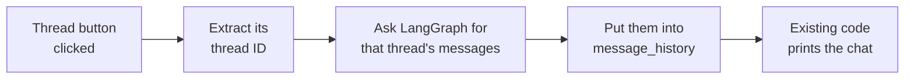

> **Video 14 of 28** · [Watch on YouTube](https://www.youtube.com/watch?v=N2nVG2MGWJ8) · Translated from the
> Hindi transcript. Notes follow the video section by section, in its order.

The chatbot gets a ChatGPT-style sidebar: start a new conversation, or click any past conversation to resume it, all built in the Streamlit frontend without touching the LangGraph backend.

## Where the chatbot stands

Over the last three or four videos a chatbot has been built, with one new feature added per video. It started as a very basic chatbot with no UI, where all the chatting happened in the console. Then a UI was added, and in the last video, **streaming**. Ask it "What is the recipe of biryani?" and the answer starts appearing almost instantly, which is the biggest advantage of streaming: a much better user experience.

Today's improvement is a **resume chat** feature. You have almost certainly used it: open any chatbot, say ChatGPT, and you have two options. Either start a **new chat** on a new topic, or **resume an existing chat**, an old one you had two or three days ago.

## A demo of the finished feature

After this video the chatbot has two sections: the area where you chat, and a **sidebar** showing two things, a way to **start a new chat** and access to your **existing conversations**.

- In a new chat, ask "Write the code to calculate the factorial of a number in Python". The code comes back correct (with a small formatting issue). Then say "My name is Nitish" and it replies "Hello Nitish, how can I assist you?" That is one single **thread**.
- Click **New Chat** and you get a fresh window for another topic: "Write a small 100 words long blog on job crisis in the age of AI". Then "My name is Rahul", and it replies "Hello Rahul, thanks for sharing your name."
- Click the earlier factorial thread in the sidebar and that conversation comes back. Ask "What is my name?" and it says **Nitish**. Go back to the blog chat, ask the same question, and it says **Rahul**.

So there will be both a start-new-conversation feature and a resume-chat feature, just like in ChatGPT. The whole feature is coded by hand, from scratch.

## Only the frontend changes

The chatbot was built in two parts: a **backend** with LangGraph and a **frontend** with Streamlit. The resume chat feature needs **no backend changes**; the existing backend is sufficient. All the work is in the frontend, in a new file.

## Breaking the feature into small tasks

The most important skill in programming, in this course's view, is to break whatever you are building into small tasks and then execute them one by one; the big feature then builds itself. The resume chat feature is split into **four small tasks** (sets of tasks), and they are ticked off as they are done.

The starting point is exactly the code from the last video (the streaming version), pasted as it is, with comments added for readability. The parts that matter today are the session's `message_history` list and the hard-coded thread ID passed to `chatbot.stream`:

```python
import streamlit as st
from langgraph_backend import chatbot  # (implied, not shown in narration)
from langchain_core.messages import HumanMessage  # (implied, not shown in narration)

CONFIG = {'configurable': {'thread_id': 'thread-1'}}  # (implied, not shown in narration)

# **************************************** Session Setup ****************************
if 'message_history' not in st.session_state:
    st.session_state['message_history'] = []

# ... loop over message_history printing each message,
# then chatbot.stream(..., config={'configurable': {'thread_id': 'thread-1'}})
```

## Task set 1: sidebar UI, dynamic thread ID, show the thread ID

### Adding the sidebar

The first task is a small UI change: a **sidebar** with the title "LangGraph Chatbot", a button to start a new chat, and a section called "My Conversations" under which past conversations will appear.

A new section, **Sidebar UI**, is created in the code for all sidebar-related UI. In Streamlit, writing `st.sidebar` places the UI element that follows on the sidebar.

```python
# **************************************** Sidebar UI *********************************
st.sidebar.title('LangGraph Chatbot')

st.sidebar.button('New Chat')

st.sidebar.header('My Conversations')
```

The button label was going to be "Start", but "New Chat" is used instead.

To run it, the command uses the file name `streamlit_frontend_threading`. The first attempt fails with "file does not exist": the file had been named with "streaming" instead of "streamlit". After renaming it, the same command runs and all three elements appear. Clicking the button does nothing yet, but the chatbot still works. First task done.

### Generating a dynamic thread ID

Next, generate a **dynamic thread ID** and add it to the session. In the existing code, when `chatbot.stream` is called with the user's message, a thread ID is passed alongside it, but that ID was written by hand: `thread-1`. That approach will not work, because with the New Chat button the user can start **any number** of conversations, and you do not know in advance how many. Thread IDs have to be generated **programmatically**, one for each new conversation.

Python's `uuid` library generates a random new ID each time. A new section, **Utility functions**, is created (more utility functions will follow), starting with `generate_thread_id`. It needs no input; it calls `uuid.uuid4()`, stores the result in `thread_id`, and returns it.

```python
import uuid

# **************************************** utility functions *************************
def generate_thread_id():
    thread_id = uuid.uuid4()
    return thread_id
```

In the session setup, if no thread ID has been set yet, generate one and store it in the session:

```python
if 'thread_id' not in st.session_state:
    st.session_state['thread_id'] = generate_thread_id()
```

Then the old code is structured a little more properly. Where `thread-1` was sent by hand, send `st.session_state['thread_id']` instead, and where the whole dictionary was passed manually to `chatbot.stream`, pass the `CONFIG` variable:

```python
CONFIG = {'configurable': {'thread_id': st.session_state['thread_id']}}

# ... inside the streaming call:
# chatbot.stream(..., config=CONFIG, ...)
```

Now whenever the user clicks New Chat in future, the new conversation gets its own ID automatically. Second task done.

### Showing the current thread ID in the sidebar

The third task: display the current conversation's thread ID in the sidebar, under "My Conversations". In the sidebar UI, add a text element showing the thread ID stored in the session:

```python
st.sidebar.text(st.session_state['thread_id'])
```

Reload, and the current conversation's thread ID appears. That completes the first set of tasks.

## Task set 2: making New Chat work

Right now clicking **New Chat** does nothing. The goal: suppose the user is chatting about "recipe of biryani" and suddenly wants a different topic. Clicking New Chat should **clear** the current chat and show a completely empty one for the new topic.

The task "add a New Chat button" was already done, so it is removed as a repeat. What remains is that on the click of New Chat a new chat window opens, and behind the scenes three things happen:

1. **Generate a new thread ID**, since a new conversation needs its own ID.
2. **Save it in the session**, replacing the old thread ID.
3. **Reset the message history.** A few videos ago a session variable called `message_history` was created: a list storing every message exchanged between the user and the AI. The user's "recipe of biryani" was stored there, then the AI's full recipe, and a loop printed them one by one. Emptying this list is what cleans up the UI for the new conversation.

A new utility function, `reset_chat`, does all three:

```python
def reset_chat():
    thread_id = generate_thread_id()
    st.session_state['thread_id'] = thread_id
    st.session_state['message_history'] = []
```

And in the sidebar UI, the button calls it when clicked:

```python
if st.sidebar.button('New Chat'):
    reset_chat()
```

**Testing it.** The user is talking about "recipe of idli". On clicking New Chat, two things should happen: the idli conversation disappears and the screen goes empty, and the thread ID (ending in 8874) is replaced by a new one. Both happen. In the new conversation the user asks "Program to swap two numbers in Python" and gets an answer (with some UI bug in the display).

But a new problem has appeared: the **previous conversation disappears**, and so does its thread ID.

## Task set 3: keeping every thread ID

The fix is to keep a **list of all thread IDs**, and to make that list part of the **session** so it is never lost when a new conversation is created.

In the session setup:

```python
if 'chat_threads' not in st.session_state:
    st.session_state['chat_threads'] = []
```

Now the current thread ID (already in the session) has to go into `chat_threads`. How many times does this need to happen? **Twice**: once when the page loads for the first time, and again every time New Chat is pressed, because a new thread ID is generated and stored in the session and must also be added to the list. Since it happens in two places, it becomes another utility function, `add_thread`. It takes a thread ID and appends it only if it is not already in the list:

```python
def add_thread(thread_id):
    if thread_id not in st.session_state['chat_threads']:
        st.session_state['chat_threads'].append(thread_id)
```

It is called in both places. On page load, right after `chat_threads` is created:

```python
add_thread(st.session_state['thread_id'])
```

And inside `reset_chat`, after the new ID is stored in the session:

```python
def reset_chat():
    thread_id = generate_thread_id()
    st.session_state['thread_id'] = thread_id
    add_thread(st.session_state['thread_id'])
    st.session_state['message_history'] = []
```

Now, instead of showing only the current thread ID in the sidebar, loop over every thread in `chat_threads` and show each one:

```python
for thread_id in st.session_state['chat_threads']:
    st.sidebar.text(thread_id)
```

**Testing it.** On reload there is a single thread ID; say "Hi, my name is Nitish". Click New Chat: the first ID stays and a second appears below it; say "Hi, my name is Rahul". New Chat again adds a third; "Hi, my name is Atul". Old thread IDs are no longer lost.

### Turning thread IDs into buttons

One last step in this set: the thread IDs are shown as plain text. Make them **clickable buttons**, so that clicking one can later load and resume that conversation. Just swap `text` for `button`.

On reload this throws an error: the button function expects a **string**, so the thread ID is explicitly converted:

```python
for thread_id in st.session_state['chat_threads']:
    st.sidebar.button(str(thread_id))
```

Now each New Chat creates a conversation with its own thread ID, the ID is added to the list, and every ID from the list is shown in the sidebar.

## Task set 4: loading a conversation when its thread is clicked

The goal: when someone clicks a particular thread, load whatever conversation has happened so far in that thread, between the user and the AI, into the main area.

Step by step:

1. Extract the **thread ID** of the button that was clicked.
2. Send that thread ID to **LangGraph** and ask it for all the messages associated with that thread.
3. Put those messages into **`message_history`**.
4. The code that prints `message_history` is already written, so the conversation appears.



### Extracting messages for a thread ID in the backend

First, a quick experiment in the LangGraph backend file to show how messages for a given thread ID are extracted. Some code is copied over from the frontend, `stream` is replaced with `invoke`, the user content becomes "Hi, my name is Nitish", and the config uses `thread-1` in place of the session's thread ID:

```python
CONFIG = {'configurable': {'thread_id': 'thread-1'}}

response = chatbot.invoke(
    {'messages': [HumanMessage(content='Hi my name is nitish')]},
    config=CONFIG,
)
```

To get all messages of a thread you call **`chatbot.get_state`** (covered in an earlier video), passing the config, which tells it the thread ID:

```python
print(chatbot.get_state(config=CONFIG))
```

The output is a lot of information in the form of a **`StateSnapshot`** object. The messages sit in its **`values`** attribute. Accessing `.values` gives a dictionary with a key called `messages`, holding the messages in a list. Extracting that key:

```python
print(chatbot.get_state(config=CONFIG).values['messages'])
```

Now the output is the messages themselves: one human message, then one AI message. That is how you extract every message associated with any thread ID. The experiment code is then removed and the backend file restored to how it was.

### The `load_conversation` utility function

Back in the frontend, a utility function takes a thread ID and returns the whole list of messages stored in that thread. The printing is not needed; the config is replaced with one built from the given thread ID:

```python
def load_conversation(thread_id):
    return chatbot.get_state(config={'configurable': {'thread_id': thread_id}}).values['messages']
```

### Wiring it to the thread buttons

In the sidebar UI, each thread is a button, so an action is attached: if that thread's button is clicked, call `load_conversation` with that button's thread ID, which returns the list of messages.

Those messages now have to go into `message_history`, but there is a **compatibility issue**: the formats differ.

| | Format |
| --- | --- |
| `message_history` | A list of dictionaries, each with two keys: `role` (user or assistant) and `content` (the message text) |
| `load_conversation` returns | A list of LangChain message objects (`HumanMessage`, `AIMessage`) |

So a little manual code is needed to convert one format into the other.

Before writing it, a **mistake** is caught: when the user clicks a conversation, its thread ID is available, but it must also be **stored in the session**, because everything that follows depends on the session's thread ID. So the first line inside the click handler sets it.

Then the conversion. Make a list called `temp_messages` (first called "temp message dictionary", then renamed), loop over the messages, and for each one check `isinstance(msg, HumanMessage)`: if so the role is `'user'`, else `'assistant'`. Append a dictionary with that role and the message's content. The loop variable is renamed to `msg` to make it less confusing. Once the loop finishes, assign the list to `message_history`:

```python
for thread_id in st.session_state['chat_threads'][::-1]:
    if st.sidebar.button(str(thread_id)):
        st.session_state['thread_id'] = thread_id
        messages = load_conversation(thread_id)

        temp_messages = []

        for msg in messages:
            if isinstance(msg, HumanMessage):
                role = 'user'
            else:
                role = 'assistant'
            temp_messages.append({'role': role, 'content': msg.content})

        st.session_state['message_history'] = temp_messages
```

(The `[::-1]` reversal is added at the end of the video; see below.) Nothing else is needed, because the UI code that prints `message_history` already exists.

### Testing resume

Say "Hi, my name is Nitish" and get "Hello Nitish, how can I assist you?" Click New Chat, and say "Hi, my name is Rahul". Now click the previous chat: the old history appears, "Hi, my name is Nitish" and "Hello Nitish, how can I assist you?". Click the lower thread and Rahul's chat appears; back to Nitish. Ask "What is my name?" in one and it says **Nitish**; in the other it says **Rahul**. Conversations can now be switched and resumed.

### Showing the newest chat first

One small change: normally the most recent chat is shown at the **top**, but here it is the reverse, with the oldest on top. Reversing the `chat_threads` list where it is displayed (the `[::-1]` in the loop above) fixes it. After reloading and creating chats for Nitish, then Rahul, then "Write code for factorial", the newest appears at the top, then Rahul, then Nitish. The UI issue seen earlier also happened to disappear this time, though there is still some UI bug with the streamed factorial code.

## Homework

If you are coding along: work out how, instead of showing raw thread IDs in the sidebar, each conversation could be given a sensible, **logical name**, as ChatGPT does. It could have been done in the video, but homework was requested, so this one is yours.

## The remaining big problem, and what comes next

The chatbot is improving slowly and steadily, but one very big problem remains: **refresh the page and every old conversation is gone** and cannot be accessed again. The reason is that persistence uses **`InMemorySaver`**, a checkpointer that keeps all messages and all threads in **RAM**. When the program is refreshed it terminates, leaves RAM, and all the associated memory goes with it.

In the next video the LangGraph backend is connected to a **database**, so past conversations survive a refresh and stay intact: have a conversation today, load the chatbot four days later, and your messages are exactly as they were.

Later on, the same chatbot will get **tools**, the principles of **MCP**, a **RAG** feature and a few more features, with the expectation that within about three weeks it becomes a very powerful chatbot.
