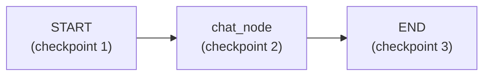

> **Video 15 of 28** · [Watch on YouTube](https://www.youtube.com/watch?v=c6a47iX5JkU) · Translated from the
> Hindi transcript. Notes follow the video section by section, in its order.

Swap the in-memory checkpointer for a SQLite-backed one, and the chatbot's conversations survive closing the program, reloading the page, or coming back days later.

## The chatbot so far

For the last four or five videos a chatbot has been built up step by step:

1. A **very basic** chatbot workflow in LangGraph, talked to through the VS Code console terminal.
2. A **GUI** with Streamlit, giving the LangGraph backend a UI.
3. **Streaming**, because printing the whole response in one go is poor user experience; now the user sees tokens as soon as the LLM starts generating them.
4. **Threads**, so any user can resume past conversations.

In its current state you can say "Hi, my name is Nitish" in one chat, open a new chat about "recipe of pasta", and move between them. Back in the first chat, "What is my name?" gets the right answer; in the pasta chat, "How long will this recipe take to cook?" gets "20 to 25 minutes".

## The problem: no permanent storage

Short-term memory is implemented with **`InMemorySaver`**, which means every conversation is stored in **RAM**. Close the application, or even just reload the page, and every conversation so far disappears.

Today's agenda is to fix that: remove `InMemorySaver` and use a different checkpointer that **integrates the chatbot with a database**. Every message the user sends and every AI reply is stored there, so even if the application shuts down or the page is refreshed, conversations stay intact. You can come back after three or four days and resume exactly where you left off.

## Backend and frontend both change

This feature needs changes in **both** the backend (the LangGraph code) and the frontend (the Streamlit code). Two new files are created in the project folder, one for each. The backend comes first: a new file, `langgraph_database_backend.py`, starts as a copy of the existing backend, and the changes are made there, following a step-by-step list.

## Installing the SQLite checkpointer

The LangGraph documentation lists three kinds of checkpointer:

- **`InMemorySaver`**: RAM based, used so far.
- **`SqliteSaver`**: based on the SQLite database. Generally used for **prototyping**; it is a very small database and not used much for production-grade systems. Since this is the learning phase, this is the one used here.
- **Postgres**: a proper database, for when you build **production-grade** chatbots.

`SqliteSaver` needs the library **`langgraph-checkpoint-sqlite`**, which is not built into LangGraph at the moment, so it is installed as an external library. Google "langgraph checkpoint sqlite", copy the install command from the top result, and run it in your virtual environment (it was already installed here; for you it may take a little time).

```bash
pip install langgraph-checkpoint-sqlite
```

:::note

The video guesses the package was probably built by someone in the community and will join LangGraph in a future version. `langgraph-checkpoint-sqlite` is published by the LangGraph team itself, as a separate package alongside `langgraph`; it is kept separate on purpose, not because it is unofficial.

:::

## Replacing `InMemorySaver` with `SqliteSaver`

First change: instead of importing from `langgraph.checkpoint.memory`, import `SqliteSaver` from `langgraph.checkpoint.sqlite`.

Second change: where the checkpointer is defined, call `SqliteSaver` instead of `InMemorySaver`. But `SqliteSaver` does not work on its own like that. Behind the scenes you have to create a **SQLite database** and connect the checkpointer to it.

Python's `sqlite3` module creates SQLite databases. `sqlite3.connect` takes two things:

1. **The database name**, here `chatbot.db`. If it does not exist, running this creates it in the project directory.
2. **`check_same_thread=False`**. If you leave it `True` (its default), the code throws an error. The reason given: later the code uses multiple threads to handle multiple conversations, but SQLite's restriction is that a database works only on a **single thread**, the one it was created in. Setting it to `False` tells SQLite that the same database will be used from different threads, so it stops checking whether the creating thread and the using thread are the same. It is a slightly technical point that a quick Google search will clear up; for now, the workflow simply needs this parameter to be `False`.

:::note

`check_same_thread` is about **Python execution threads**, not LangGraph conversation threads (`thread_id`). SQLite's Python driver by default refuses to let a connection created in one Python thread be used from another; Streamlit and LangGraph can run code on different Python threads, which is why `False` is needed. Having many conversation threads does not by itself require it.

:::

Running `connect` returns a **connection object**, and that object is passed to the checkpointer:

```python
from langgraph.checkpoint.sqlite import SqliteSaver
import sqlite3

conn = sqlite3.connect(database='chatbot.db', check_same_thread=False)

# Checkpointer
checkpointer = SqliteSaver(conn=conn)
```

These two lines create a `SqliteSaver` checkpointer. Behind the scenes a database is created, and the checkpointer keeps storing every value that comes through into it. That communication is set up automatically; LangGraph already contains the code for it.

## Testing that messages reach the database

To check that messages and replies really are stored, some test code is added at the bottom of the backend. The part of the frontend that talks to the LLM through the chatbot is copied over, with `chatbot.invoke` instead of streaming (no stream mode needed), the user input "Hi, my name is Nitish", and a config with the thread ID set by hand to `thread-1`. The response is stored in a variable and printed:

```python
CONFIG = {'configurable': {'thread_id': 'thread-1'}}

response = chatbot.invoke(
    {'messages': [HumanMessage(content='Hi my name is nitish')]},
    config=CONFIG,
)

print(response)
```

To summarise the changes: `InMemorySaver` was replaced with `SqliteSaver`; a SQLite database was created, giving a connection object; that object was passed to the `SqliteSaver` class to make the checkpointer. Everything else is exactly the same.

Running it shows two things:

1. The **response**: your message, "Hi, my name is Nitish", and the AI's reply, "Hello Nitish, how can I assist you today?"
2. A **`chatbot.db` file** appears in the project directory automatically, holding all the data. Both messages are now stored in it.

**Proving it.** Run the code again with "What is my name?". With `InMemorySaver` there would be no answer, because the program ran once and closed, emptying its memory. With `SqliteSaver`, the checkpointer looks up the earlier messages in the database and answers from them. The response now shows **four** messages instead of two: "Hi, my name is Nitish", "Hello, how can I assist you today?", "What is my name?" and "Your name is Nitish". Two are from the previous run and two from this one, and the earlier ones could be retrieved only because they were safely stored in the database.

**Switching threads.** Change `thread-1` to `thread-2` and send "Hi, my name is Rahul". Two new messages are stored in a completely new thread. Ask "What is my name?" and the answer is "Your name is Rahul"; `thread-2` now also has four messages.

Switch back to `thread-1` and ask "What is the capital of India? Acknowledge my name while answering." The answer says New Delhi and thanks **Nitish**. The same question on `thread-2` gets "Thanks for asking, **Rahul**."

This demonstrates two things:

- Old messages are **not lost** after the program closes; they can be retrieved.
- Messages are stored **per thread**: `thread-1`'s messages and `thread-2`'s messages are kept separately in the database, and either set can be extracted by its thread ID.

That completes the backend: the library is installed, the database-based checkpointer is set up and working, and chatting in multiple threads has been tried.

## Looking inside `chatbot.db`

To see that messages really are stored in different threads, open the database. There are several ways; one is a VS Code extension. Search "SQLite" in VS Code's Extensions and you will find two or three options. The one used here is **SQLite Viewer**, by publisher Florian Klampfer. Once installed, clicking `chatbot.db` opens it right inside VS Code. Other software can view the file too, but this is the most straightforward way.

Inside you see all the **checkpoints**. There are two threads, `thread-1` and `thread-2`, but they repeat, because the same code was run several times with the same thread number. The chatbot's workflow is designed so that **one execution creates three checkpoints**: one at the start, one at the chat node, and one at the end.



Counting the runs:

- `thread-1`: "Hi, my name is Nitish" (3 checkpoints), "What is my name?" (3 more), "What is the capital of India?" with the name (3 more).
- `thread-2`: "Hi, my name is Rahul" (3), "What is my name?" (3), and the capital-of-India question with the name (3).

That is why there are so many checkpoints, even though there are only **two unique threads**.

To see one thread's messages, go to a checkpoint, double-click the field and open it; the messages appear, though not very neatly. For `thread-2`: "Hi, my name is Rahul", the AI's "Hello Rahul, how can I help you?", "What is my name?", "Your name is Rahul", "What is the capital of India?", "The capital of India is New Delhi, Rahul", and so on. This shows directly how many checkpoints were created per thread.

If you are coding along, install the extension and look: seeing it visually builds confidence. If it is not clear why so many checkpoints are created, go back to the **persistence** video in this playlist, which covers in detail when and where each checkpoint is made.

## The frontend change: load existing threads at start-up

Now the main work: changing the frontend so that chats are not lost. Very few changes are needed. A new file, `streamlit_frontend_database.py`, starts as an exact copy of the previous video's threading frontend.

Only **one place** changes: the **session setup** at the very beginning. The session holds three things:

1. `message_history`: all messages of a particular thread, in a list.
2. `thread_id`: the thread ID of the chat currently going on.
3. `chat_threads`: all the threads on the chatbot.

In the previous code, `chat_threads` starts as an **empty list** whenever the chatbot loads. That was logical when there was no permanent storage: every fresh load had zero threads. But now past threads live in the database, so you should not start from zero. At start-up, ask the backend how many threads already exist in the database (here `thread-1` and `thread-2`), start `chat_threads` with those, and then keep adding any new threads created in the current session. That is the only change.

## Backend: finding all threads with `checkpointer.list`

So back to the backend, to write code that reports which threads exist in the database. The test code is removed first.

The checkpointer object has a function called **`list`**. It can return **all** the checkpoints currently in the database, or the checkpoints inside **one particular thread**. The database has **18** checkpoints right now, nine for `thread-1` and nine for `thread-2`. Pass `thread-1`'s config and you get its nine; pass **`None`** and you get all of them, not filtered by any thread ID.

```python
checkpointer.list(None)
```

Running this should show a big output, but it actually returns a **generator object**. No problem: loop over it and print each checkpoint.

```python
for checkpoint in checkpointer.list(None):
    print(checkpoint)
```

The output is rather scary: 18 checkpoints, each with a lot of metadata, each printed as a **`CheckpointTuple`**. The details sit inside its `config`. Step by step:

```python
for checkpoint in checkpointer.list(None):
    print(checkpoint.config)
```

```python
for checkpoint in checkpointer.list(None):
    print(checkpoint.config['configurable'])
```

```python
for checkpoint in checkpointer.list(None):
    print(checkpoint.config['configurable']['thread_id'])
```

Now you get the thread ID associated with every checkpoint. The final goal is the number of **unique** threads, and here they repeat. So make a **set** called `all_threads` and add to it instead of printing. Because it is a set, only unique values stay: once `thread-1` is in, it will not be added again, and the same for `thread-2`. After the loop, print it as a list:

```python
all_threads = set()
for checkpoint in checkpointer.list(None):
    all_threads.add(checkpoint.config['configurable']['thread_id'])

print(list(all_threads))
```

The output is the list of unique threads, `thread-1` and `thread-2`; a `thread-3` would appear too if it existed. It is a bit of a jugaad (a makeshift workaround), but it extracts the unique threads in the database.

The logic is then turned into a function, `retrieve_all_threads`, which returns the list:

```python
def retrieve_all_threads():
    all_threads = set()
    for checkpoint in checkpointer.list(None):
        all_threads.add(checkpoint.config['configurable']['thread_id'])

    return list(all_threads)
```

Anyone who calls it learns which unique threads exist in the database at that moment.

## Frontend: using `retrieve_all_threads`

In the frontend, two edits. At the top, the backend's file name has changed to `langgraph_database_backend`, and now `retrieve_all_threads` is imported along with `chatbot`:

```python
from langgraph_database_backend import chatbot, retrieve_all_threads
```

And where `chat_threads` is initialised, call `retrieve_all_threads()` instead of using an empty list:

```python
if 'chat_threads' not in st.session_state:
    st.session_state['chat_threads'] = retrieve_all_threads()
```

On start-up it returns `thread-1` and `thread-2`, which go into `chat_threads`, and the rest of the frontend logic runs as before.

## Running the persistent chatbot

Run the frontend file, `streamlit_frontend_database`. Even on the chatbot's very first load, `thread-1` and `thread-2` are already in the sidebar, **along with their conversations**, and a new window is open for chatting.

- Start a new thread with "recipe of biryani".
- Open `thread-1`: the same messages written earlier from the backend are there, "My name is Nitish", "What is my name?", "What is the capital of India? Acknowledge my name while answering", and the replies.
- Open `thread-2`: the Rahul thread, "Hi, my name is Rahul", "Hello Rahul, how can I assist you?", exactly the same.
- The biryani thread is there too.

Now **stop the code**, so it leaves RAM, and run it again. All threads are intact: `thread-1` (Nitish), `thread-2` (Rahul) and the biryani one. Refresh, do anything, come back after four days: whenever you open the site, your old chats are there. The chatbot now has **persistent storage**, and chats are no longer lost when the program closes, which is an important feature.
