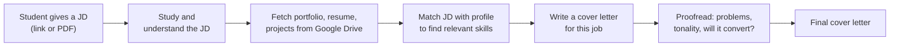
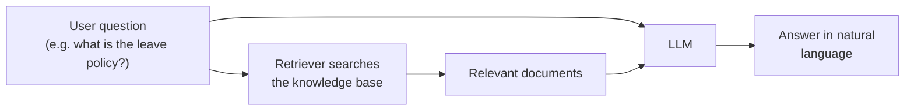
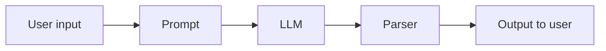
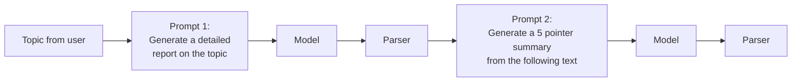
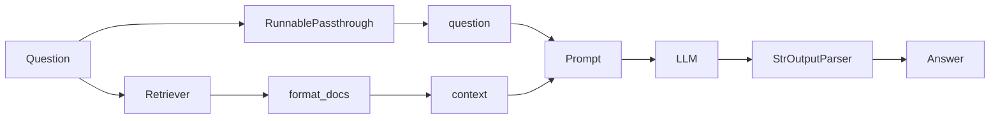
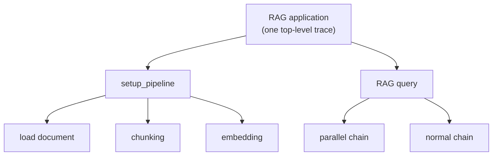
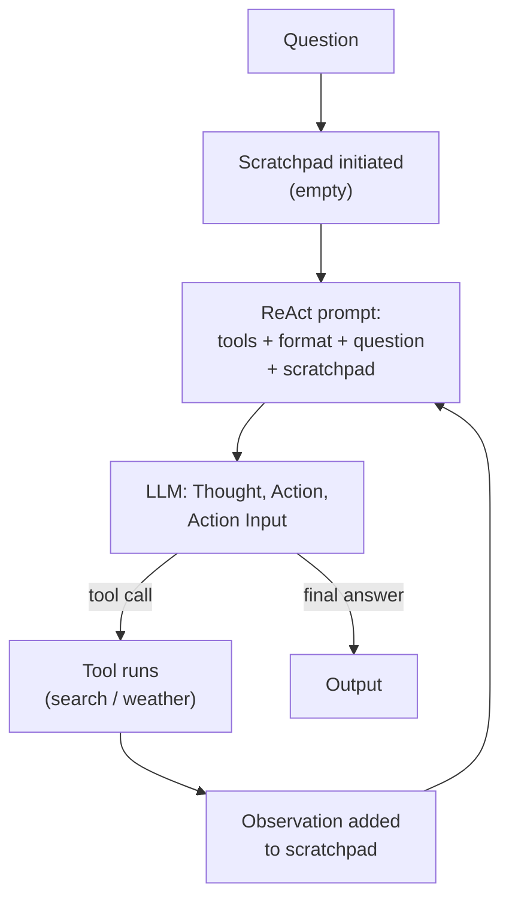
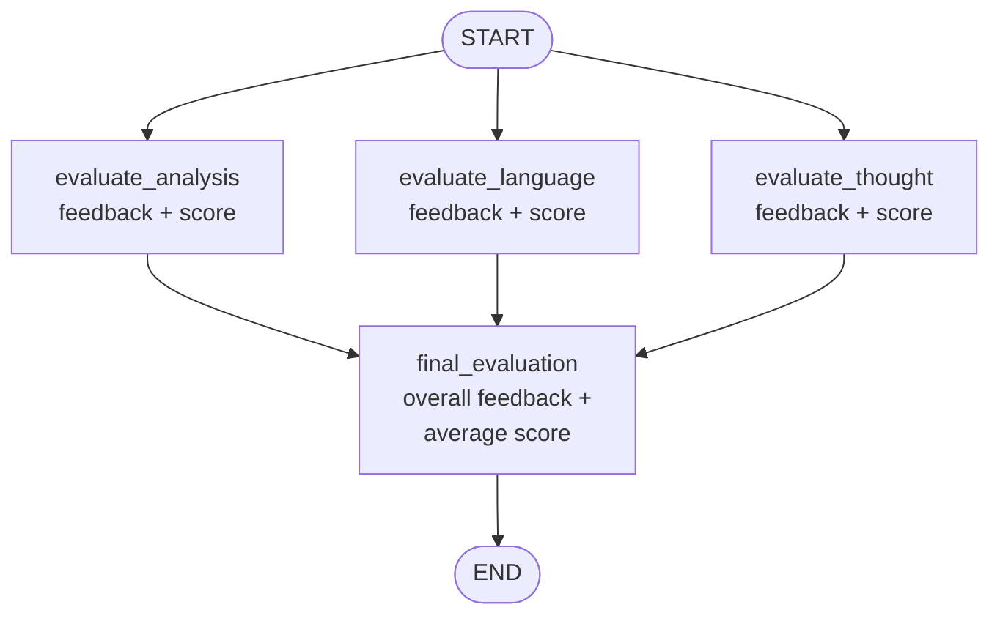

> **Video 16 of 28** · [Watch on YouTube](https://www.youtube.com/watch?v=4FFspU4riHk) · Translated from the
> Hindi transcript. Notes follow the video section by section, in its order.

LLM systems are black boxes that fail without error traces; LangSmith turns them into white boxes by tracing every step of every execution, and this video integrates it with LangChain and LangGraph.

## What this video covers

The GenAI curriculum so far has gone LangChain first, then LangGraph (still in progress). LangGraph has now reached the point where you need to know how **observability** is implemented in LLM applications, so this video is a short detour into **LangSmith**, a powerful observability and evaluation tool you can integrate into LLM applications.

The plan:

1. Theoretical background: why LangSmith is needed, and what observability means for an LLM system.
2. A detailed practical integration of LangSmith with both **LangChain** and **LangGraph**.
3. At the end, an idea of a related emerging field called **LLMOps**.

Two prerequisites: you should know LangChain, and you should know the LangGraph covered in the playlist so far.

## Why tools like LangSmith are needed

Three real-world scenarios show the need.

### Scenario 1: the cover-letter app that became slow

You work at a startup. Your team noticed a problem students face after graduating: they go to a site like naukri.com, filter jobs, pick the ones they like, study each JD, modify their resume and cover letter for it, and apply. They do this 10 or more times a day, and they do not want to send the same resume and cover letter everywhere, because they want the employer to feel they made an effort.

So you built an **LLM-based application** for it:



Students like it and use it daily. Normal **latency** (time from input to output) is about 2 minutes. Then one day mails pour in saying the site has become slow: the same work now takes 7 to 10 minutes. Users get frustrated and leave, which means revenue loss, so you must debug quickly.

The difficulty is that this is a **complex LLM workflow**: multiple stages, different work in each, and an LLM involved in many of them (studying the JD, matching, generating the letter, proofreading). All you have is the user's input, the final output, and the total time. You have no **breakdown**: how long reading the JD took, how long fetching the portfolio took, how long matching took. There may even be branches. You cannot tell which component is eating the extra 8 minutes.

Suppose the last update mistakenly pushed code that scans the **entire Google Drive** instead of one specific folder. The culprit is the document-fetching stage, but since you cannot get inside the system and see it step by step, you cannot identify it. The problem is increased latency; the real problem is that you cannot find the culprit. This is where tools like LangSmith come in.

### Scenario 2: the research assistant whose cost spiked

Your team built an **agent**, a research assistant. A researcher enters a topic (say "solar energy"); the agent fetches related academic papers from sites like Google Scholar or arxiv.org, studies each paper and extracts key points, summarises them into a report, and lets you chat with the report. (ChatGPT offers a similar tool.) Users like it and pay for it.

Say one report costs about **50 paise** in OpenAI API tokens, and you price accordingly. One day your OpenAI dashboard shows costs rising: some reports now cost **₹2**, while others still cost 50 paise. At scale, with many users paying the same amount as before, you go into a loss.

To debug this you need to know how agents work. Agents are **autonomous** software: you give a goal, and the system reasons by itself, performs actions, checks whether the goal is achieved, and repeats in a loop.

Hypothetically, the last upgrade made a minor prompt change: *keep making the report until a really excellent report is made*. Now, if the agent does not like the report, it repeats everything: back to Google Scholar, download, study, extract, summarise, analyse again. For some topics it is satisfied first time (50 paise); for others it keeps redoing the work. It has become **Aamir Khan**: it wants perfection. A one- or two-sentence change, made to improve user experience, changed the agent's behaviour, and only in some scenarios.

Debugging this is hard: the error does not come every time, nothing is printed, the code has not crashed so there is no error trace, and with multiple stages you do not know which stage is spending the money. Again you need a tool that gives an **inside view** of the system, converting a **black box into a white box** so you can see step by step what each component is doing. (Scenario 1 was about latency; this one is about cost.)

### Scenario 3: the TCS HR chatbot that started hallucinating

The third use case is **RAG**. You are a senior software developer at TCS, an organisation with lakhs of employees where thousands of freshers join every year. It has many rules (leave policy, notice period, health insurance), freshers do not understand them, so they keep asking HR, and HR complains that answering the same questions daily hurts their productivity.

You build a **RAG-based chatbot**: accumulate the company documents into a knowledge base and give it to an LLM.



It works; freshers get answers and the pressure on HR goes. Then teammates complain that it has started **hallucinating**: imagining answers instead of giving facts, spreading misinformation. An employee asks about leave policy and the chatbot says there's no stress, take leave whenever you like, go to Goa if you want. He packs his backpack and leaves. The fault is the company chatbot's. Similar concerns could arise around notice period and salary, so you are told to debug it fast.

A RAG system mostly hallucinates for two reasons:

1. **The retriever fails.** It reads the question but fetches irrelevant documents: the question is about notice period and it brings documents about company history, so the LLM cannot answer.
2. **The generator fails.** The LLM answering is at fault: a low-quality local LLM, an OpenAI upgrade that worsened answers, or a prompt that leads to poor answers.

In this scenario either could have happened. In the last upgrade you may have mistakenly set the retriever's number of documents to **n = 1**, which is too few; some queries need more than one document, so maybe 3 or 5. Or a teammate may have written a **lenient prompt** that does not strongly enforce answering from context. A RAG prompt should say: answer only from the given context, and if the context does not have enough information, simply say "I don't know". Without that emphasis, the LLM answers as it pleases when the context has nothing relevant.

The problem is you cannot tell whether the retriever or the generator is to blame, because you cannot see which documents the retriever fetched or what the final prompt (question plus context) looked like. Once more you need a tool that shows step by step what each component sees and does.

Across the three scenarios: latency rose and could not be debugged; cost rose and could not be understood; the system hallucinated and nobody knew why. Hence the need for a tool that tells you what is going on inside the system.

## What observability is

Before LangSmith, one key term you will hear a lot:

> Observability is the ability to understand a system's internal state by examining its external outputs, like logs, metrics and traces. It allows you to diagnose issues, understand performance and improve reliability by analysing data generated by the system. Essentially, it's about being able to answer why something is happening within a system, even if you didn't anticipate the problem.

What the three examples had in common is that they were **LLM-based systems**, and the hardest thing about those is that LLM behaviour is **non-deterministic**. Ordinary software gives the same output for the same input: do 2 × 4 on a calculator 1000 times and you get 8 every time. An LLM system can give different outputs for the same or similar input. So when a latency, cost or hallucination problem appears, it leaves **no proper error trace**, and these systems are complex black boxes with no explainability. That is why debugging LLM applications in production is so hard.

The basic funda of observability: with some tool, you **open up the internal working** of your system and see what is happening component by component. Each time you execute the software you **trace it end to end**, and the trace is stored so you can come back any time and understand where things went wrong.

## What LangSmith is

> LangSmith is a unified observability and evaluation platform where teams can debug, test and monitor AI app performance.

In a nutshell, LangSmith brings observability into LLM applications. You run your application, and LangSmith traces the whole execution component by component: what input each component took, what output it gave, how long it took. Everything is recorded at a very granular level.

The practical plan: integrate LangSmith with LangChain first, then with LangGraph, testing normal workflows, RAG workflows and agentic workflows along the way, so you get an end-to-end idea of implementing observability in any kind of LLM workflow.

## What LangSmith traces

When you log every execution in LangSmith, it records:

- **Inputs and outputs** of every execution. The user asks "What is the capital of India?", the app replies "New Delhi"; both are traced.
- **All intermediate steps.** In a RAG system: what question the retriever got, what context it produced, what question and context went into the prompt, what the LLM generated, what the output parser saw.
- **Latency**, at the application level and at the component level.
- **Token usage**, based on the model you use, and the **cost** of those tokens, both input and output.
- **Errors** in any component.
- **Tags**: your own, plus some system-generated ones. If you use GPT-4o, LangSmith is smart enough to tag the trace with the model name.
- **Metadata**: custom metadata you attach, plus system metadata such as which LangChain version and which dependencies you are using.
- **User feedback**, if you attach it to the trace.

Each of these is shown practically later in the video.

## Setting up

One setup is prepared and used throughout the video:

1. **Download the code.** All the code is already written and on GitHub (the link is in the video description). Copy the repository link from **Code** and run `git clone <url>` in your command prompt. Here it is cloned to the desktop, then opened in VS Code via **Open Folder** (the LangSmith masterclass folder).
2. **Create a virtual environment** in the project folder from a new terminal:

   ```bash
   python -m venv myenv
   source myenv/bin/activate
   ```

3. **Install the libraries** listed in the requirements file:

   ```bash
   pip install -r requirements.txt
   ```

4. **Create a LangSmith account** while that installs. Go to the LangSmith website, sign up (or log in). This UI will be seen a lot in the video.
5. **Generate an API key.** In **Settings**, click the plus button, add a description (here "personal project"), keep the key type as **Personal Access Token**, set an expiry (here "Never"), click **Create API key**, and copy the key.
6. **Create a `.env` file** in VS Code and paste the variables (the full content is in the video description). The keys shown on screen are deleted after the shoot; use your own.

```bash title=".env"
OPENAI_API_KEY=<your OpenAI key>
LANGCHAIN_TRACING_V2=true
LANGCHAIN_ENDPOINT=https://api.smith.langchain.com  # (implied, not shown in narration)
LANGCHAIN_API_KEY=<your LangSmith key>
LANGCHAIN_PROJECT=Langsmith Demo
```

- The OpenAI key is needed because OpenAI models are used.
- `LANGCHAIN_TRACING_V2` must be `true`, or nothing is traced.
- The endpoint is LangSmith's endpoint.
- `LANGCHAIN_API_KEY` is the LangSmith key you just copied.
- `LANGCHAIN_PROJECT` is the project name. A project with this name is created in LangSmith and all tracing goes into it.

## Three core concepts: project, trace, run

Take a very simple LLM application: take a question from the user, put it into a prompt, send the prompt to an LLM, send the LLM's output to a parser, and show the parser's output to the user.



- **Project**: the whole LLM application you built.
- **Trace**: one single execution of the project. The app runs once for one user's query, again for another user's query; each end-to-end run (e.g. for "What is the capital of India?") is one trace.
- **Run**: the execution through one component. The prompt, the LLM and the parser each take an input and give an output, so this example has **three runs** per trace.

So LangSmith calls the whole application a project, each execution a trace, and each component's execution inside a trace a run. These three concepts come up throughout the video.

## Demo 1: a simple LLM call

Open the first file, **simple LLM call**. It is a simple chain of prompt, model and parser: the question goes into `PromptTemplate.from_template`, the model is `ChatOpenAI` with its default model, and the parser is `StrOutputParser`.

```python
from dotenv import load_dotenv  # (implied, not shown in narration)
from langchain_openai import ChatOpenAI
from langchain_core.prompts import PromptTemplate
from langchain_core.output_parsers import StrOutputParser

load_dotenv()  # (implied, not shown in narration)

prompt = PromptTemplate.from_template("{question}")  # (implied, not shown in narration)
model = ChatOpenAI()
parser = StrOutputParser()

chain = prompt | model | parser

result = chain.invoke({"question": "What is the capital of Peru?"})
print(result)
```

```text
The capital of Peru is Lima.
```

It looks as if nothing LangSmith-related happened. That is the magic of LangSmith: **you change nothing in your code**. Because the endpoint and API key are in the environment file, running the code is enough for LangSmith to trace the whole execution.

In the LangSmith UI, go to **Tracing Projects**. There are two projects: **default**, created automatically, and **Langsmith Demo**, the name from the `.env` file. Click it to see its traces (one per execution; one so far, with its start time). For the trace you can see:

- the input ("What is the capital of Peru?") and the output,
- whether any error occurred (no),
- the latency of the whole request,
- the tokens used and their cost, depending on the model.

Click the trace for a detailed view of its runs. The application has three components, so there are three runs: **PromptTemplate**, **ChatOpenAI** and **StrOutputParser**. Click any run to see what it received and produced:

- PromptTemplate: input is the question, output is the formatted prompt.
- ChatOpenAI: input is a human message, output is an AI message.
- StrOutputParser: extracts the string from the LLM's complex output.

Each run also has its own details, for example ChatOpenAI took **1.11 seconds**. Everything is organised: Tracing Projects contain projects, projects contain traces, traces contain runs.

Run it again with "India" as the input. The project now shows **two traces**, and the most recent one has its own full, component-by-component detail. More complex examples (RAG, an agent, LangGraph) follow.

## Demo 2: a sequential chain

Open the second file, **sequential chain**. This code was covered in the LangChain playlist: a two-step application that first generates a report on a topic, then generates a five-point summary of that report.



Before running it, three changes are made.

**Change 1: a separate project, set from code.** Otherwise this would be traced into the same "Langsmith Demo" project. Ideally each new application gets its own LangSmith project. Besides editing the `.env` file, you can set the project name inside the code with `os.environ`, using the same key as in the environment file. The `.env` value is read first, then the value in code **overrides** it. Both options are available.

**Change 2: explicit models.** Instead of one default model, make two: `model1` is `gpt-4o-mini` for report generation, and `model2` is `gpt-4o` for summarisation, each with its own temperature.

**Change 3: your own tags and metadata.** Where you finally invoke the chain, form a `config` dictionary with `tags` (a list) and `metadata` (a dictionary), and pass it to `invoke`.

```python
import os
from dotenv import load_dotenv  # (implied, not shown in narration)
from langchain_openai import ChatOpenAI
from langchain_core.prompts import PromptTemplate
from langchain_core.output_parsers import StrOutputParser

os.environ["LANGCHAIN_PROJECT"] = "Sequential LLM App"

load_dotenv()  # (implied, not shown in narration)

prompt1 = PromptTemplate(
    template="Generate a detailed report on {topic}",
    input_variables=["topic"],
)

prompt2 = PromptTemplate(
    template="Generate a 5 pointer summary from the following text \n {text}",
    input_variables=["text"],
)

model1 = ChatOpenAI(model="gpt-4o-mini", temperature=0.7)
model2 = ChatOpenAI(model="gpt-4o", temperature=0.5)

parser = StrOutputParser()

chain = prompt1 | model1 | parser | prompt2 | model2 | parser

config = {
    "tags": ["llm app", "report generation", "summarization"],
    "metadata": {
        "model1": "gpt-4o-mini",
        "model1_temp": 0.7,
        "parser": "stroutputparser",
    },
}

result = chain.invoke({"topic": "Unemployment in India"}, config=config)
print(result)
```

After running, LangSmith has a second tracing project, **Sequential LLM App**, with one trace named **RunnableSequence**. In the trace:

- The **tags** appear: report generation, summarization, llm app.
- The **metadata** appears: model1 and its temperature, the parser, plus some metadata LangSmith adds itself.
- The runs are organised in order: prompt template 1 (input "Unemployment in India", output "Generate a detailed report on Unemployment in India"), ChatOpenAI labelled **gpt-4o-mini** producing the report, StrOutputParser, prompt template 2 ("Generate a 5 pointer summary from the following text"), the second model **gpt-4o**, and StrOutputParser.
- Runs have their own tags too: the first prompt template is tagged as step 1 of the sequence, the first ChatOpenAI as step 2, and so on (the second model shows step 5).
- The metadata you set shows at the **trace level**, and each run also has its own metadata: this ChatOpenAI instance's model is gpt-4o-mini, the other's is gpt-4o. LangSmith logs bits of metadata at its own level.

**Changing the run name.** The auto-generated name "RunnableSequence" can be replaced. Add `run_name` to the same config (with a comma after the previous entry):

```python
config = {
    "run_name": "sequential chain",
    "tags": ["llm app", "report generation", "summarization"],
    "metadata": {
        "model1": "gpt-4o-mini",
        "model1_temp": 0.7,
        "parser": "stroutputparser",
    },
}
```

The new trace now carries the name you chose; everything else (components, latency, token usage, inputs and outputs) is the same.

New in this demo: setting the project name from code, setting your own tags and metadata, and setting your own run name.

## Demo 3: tracing a RAG application

### Why LangSmith is a good idea for RAG

In RAG you give the LLM a query plus **additional context**: to answer questions over your personal data, you send the question along with the relevant chunks from your documents, and the LLM combines the two into a final answer.

It sounds simple, but in production most people complain that their RAG chatbot's answers are not satisfying. There are two kinds of error:

- **Retriever errors**: the retriever cannot bring the right chunks for the question.
- **Generator errors**: the chunks are relevant, but the LLM somehow hallucinates.

In production you only see the final response, so you cannot deduce whether the retriever or the generator was at fault. LangSmith solves this by tracing every intermediate step: the user's question, the documents the retriever fetched, the final prompt combining question and context, and the LLM's response. Looking at each step makes it easy to see where the failure is.

### The RAG code

Open the third file. A PDF sits in the project directory: the book **Introduction to Statistical Learning**, a machine learning book. You ask questions about the book ("Who is the author of this book?", "What's the summary of chapter number six?") and the LLM answers. The code is very similar to the RAG video of the LangChain playlist.

- Imports, then `load_dotenv()`, then the PDF path (rename it if you use another PDF).
- **Load** the PDF with `PyPDFLoader`.
- **Chunk** it with chunk size 1000 and chunk overlap 150.
- **Embed** and create a **retriever**.
- The **prompt**: "Answer ONLY from the provided context. If not found, say you don't know."
- The **LLM**.
- A `format_docs` function: the retriever returns `Document` objects, and this merges their text into one big text.
- The **chain**, in two parts. First a **parallel chain** with two paths: in one, `RunnablePassthrough` lets the question come out unchanged; in the other, the question goes to the retriever, then `format_docs` merges the retrieved documents into a single context. Its output is the original question plus the context. Second, those two go into prompt, then LLM, then `StrOutputParser`.



Before running, one change: a separate project name, set in code.

```python
import os
from dotenv import load_dotenv
from langchain_community.document_loaders import PyPDFLoader
from langchain_text_splitters import RecursiveCharacterTextSplitter
from langchain_openai import OpenAIEmbeddings, ChatOpenAI
from langchain_community.vectorstores import FAISS  # (implied, not shown in narration)
from langchain_core.prompts import ChatPromptTemplate
from langchain_core.runnables import RunnableParallel, RunnablePassthrough, RunnableLambda
from langchain_core.output_parsers import StrOutputParser

os.environ["LANGCHAIN_PROJECT"] = "RAG Chatbot"

load_dotenv()

PDF_PATH = "islr.pdf"  # (implied, not shown in narration) use your PDF's file name

# 1) Load the PDF
loader = PyPDFLoader(PDF_PATH)
docs = loader.load()

# 2) Chunk
splitter = RecursiveCharacterTextSplitter(chunk_size=1000, chunk_overlap=150)
splits = splitter.split_documents(docs)

# 3) Embed and build a retriever
emb = OpenAIEmbeddings(model="text-embedding-3-small")
vs = FAISS.from_documents(splits, emb)  # (implied, not shown in narration)
retriever = vs.as_retriever()

# Prompt
prompt = ChatPromptTemplate.from_messages([
    ("system", "Answer ONLY from the provided context. If not found, say you don't know."),
    ("human", "Question: {question}\n\nContext:\n{context}"),  # (implied, not shown in narration)
])

llm = ChatOpenAI()

def format_docs(docs):
    return "\n\n".join(d.page_content for d in docs)

parallel = RunnableParallel({
    "context": retriever | RunnableLambda(format_docs),
    "question": RunnablePassthrough(),
})

chain = parallel | prompt | llm | StrOutputParser()

q = input("Q: ")  # (implied, not shown in narration)
ans = chain.invoke(q)
print(ans)
```

### Running it and reading the trace

The first run is slow, because the document is loaded, split and embedded before any question can be asked. Asking "Who is the author of this book?" returns the authors (Gareth James, Trevor Hastie, Robert Tibshirani, and so on).

In LangSmith a new project, **RAG Chatbot**, holds the trace, and everything is tracked:

- At the top, **RunnableSequence**: the whole RAG application.
- Inside it, **RunnableParallel** with its two parts: the retriever branch, which takes "Who is the author of the book?" and returns chunks of information, and **RunnablePassthrough**, which returns the question as it is. The RunnableParallel's output is the two things expected: the context and the question.
- **ChatPromptTemplate**: its input shows context and question, and it forms a prompt with the system message ("Answer ONLY from the provided context…") plus the question and the context.
- **ChatOpenAI** generates the answer, and **StrOutputParser** displays it more cleanly.
- The time and token usage of every component are all there.

### Two problems

**Problem 1: the application is only partly traced.** LangSmith traces only the part where the chain executes (the parallel chain and the normal chain). Loading the PDF, chunking and embedding are also important parts of the application, but there is no mention of them anywhere in the trace. By default LangSmith traces only **LangChain runnables**, meaning wherever `invoke` is implemented. The loading, chunking and embedding code uses no runnables, so it is not traced. Ideally you should know how long the PDF took to load, how long chunking took, how long embedding took, and which embedding model was used.

**Problem 2: a logical flaw.** Every run loads the PDF, chunks it and generates embeddings again, so every run takes a long time. Ideally the first run should load, chunk, embed and **store** the embeddings, and each subsequent run should go straight to that database. Running the app again takes just as long; then "What is the full form of GLM?" returns "Generalized Linear Models", traced fine, but the same steps are repeated every time, which is not logical.

First the whole application gets traced, then the latency problem is solved.

### Fix 1: tracing the whole application with `traceable`

Open the **rag v2** file. The project stays **RAG Chatbot**. The main differences:

- `traceable` is imported from the `langsmith` module. With it you can form **decorators**.
- The loading, splitting and embedding code is converted into **functions**: `load_pdf` (give it the PDF path, get the loaded PDF), `split_documents` (give it the documents, chunk size and chunk overlap), and `build_vectorstore` (embed and produce a retriever).
- A `setup_pipeline` function calls all three in turn and returns the retriever.
- Each of the four functions gets the `traceable` decorator with a **name**: the run name under which that function appears as a component in LangSmith.
- At the end, `chain.invoke` gets a config with `run_name` set to **pdf_rag_query**, so the trace shows that instead of "RunnableSequence". This is optional.

```python
from langsmith import traceable

@traceable(name="load_pdf")
def load_pdf(path: str):
    loader = PyPDFLoader(path)
    return loader.load()

@traceable(name="split_documents")
def split_documents(docs, chunk_size=1000, chunk_overlap=150):
    splitter = RecursiveCharacterTextSplitter(
        chunk_size=chunk_size, chunk_overlap=chunk_overlap
    )
    return splitter.split_documents(docs)

@traceable(name="build_vectorstore")
def build_vectorstore(splits):
    emb = OpenAIEmbeddings(model="text-embedding-3-small")
    vs = FAISS.from_documents(splits, emb)  # (implied, not shown in narration)
    return vs.as_retriever()

@traceable(name="setup_pipeline")
def setup_pipeline(pdf_path: str):
    docs = load_pdf(pdf_path)
    splits = split_documents(docs)
    retriever = build_vectorstore(splits)
    return retriever

retriever = setup_pipeline(PDF_PATH)

# ... prompt, llm, format_docs, parallel and chain as before ...

ans = chain.invoke(q, config={"run_name": "pdf_rag_query"})
print(ans)
```

The big change is `traceable`: it lets you trace **any normal Python function**, even one with no runnable inside it.

Running it (still slow the first time, since that problem is not fixed yet) and asking "What is linear regression?" gives an answer. In **RAG Chatbot** there are now **two separate traces**:

- **setup_pipeline**, with three runs: **load_pdf** (input: the path; output: 441 `Document` objects, one per page, since the book has 441 pages), **split_documents** (input includes the chunk size and chunk overlap used for splitting), and **build_vectorstore** (input: the 441 documents; output: a retriever object). Latency is visible too: loading the PDF took **15 seconds**, splitting took little time, building the vector store took a while.
- **pdf_rag_query**, with exactly what was seen before: RunnableParallel with its two paths, ChatPromptTemplate, ChatOpenAI, StrOutputParser.

The whole application is now traced, but in **two parts**, as if it were two applications. The hierarchy that is wanted:



The next change modifies the code so that one top-level trace contains both the setup work and the RAG query work.

### Side note: tags and metadata on `traceable` functions

Besides tracing plain Python functions, `traceable` lets you give each component its **own tags and metadata**. For the loading component, add tags such as "pdf" and "loader" and metadata recording the loader used. For the vector store component, add tags such as "embedding" and "vectorstore" and metadata recording the embedding model (and, if you like, the number of embedding dimensions).

```python
@traceable(name="load_pdf", tags=["pdf", "loader"], metadata={"loader": "PyPDFLoader"})
def load_pdf(path: str):
    ...

@traceable(
    name="build_vectorstore",
    tags=["embedding", "vectorstore"],
    metadata={"embedding_model": "text-embedding-3-small"},
)
def build_vectorstore(splits):
    ...
```

Running it with "What is logistic regression?" takes some time, because asking the question triggers the whole pipeline and then the query. The run now shows the **whole hierarchy**. In **load_pdf** the tags "pdf" and "loader" appear and the metadata shows the loader is PyPDFLoader; in **build_vectorstore** the embedding model now appears, with the tags "embedding" and "vectorstore" on the run.

The best part is that traces become **searchable**: click a metadata value (such as the embedding model) to find every trace that used it. With a lot of traces, searching by tags and metadata is the main benefit.

### Fix 2: reusing a stored index

The remaining problem: every query takes about **202 seconds**. The fix is in the **rag_v4** file. This code is a bit difficult and not explained line by line, because the goal of the video is understanding LangSmith, not writing the best RAG code; check it yourself when you download the code. The gist:

- The vector database is **FAISS**.
- On the first run, the code **builds an index** in the project directory (the document's embeddings).
- On every later run it first checks whether the index already exists. If so, it **uses the existing index** to answer; if not, it builds it again.

First run (no index exists yet) with "Who is the author?": the whole setup happens (load, chunk, embed, build the index) and takes around **30 seconds**. The trace again has two parts: **setup_pipeline**, which calls **build_index** (containing load_pdf, split_documents and build_vectorstore), and then the query-handling code.

Second run with "What is the full form of GLM?": the answer arrives instantly.

```text
The full form of GLM is Generalized Linear Model.
```

Latency: **1.65 seconds**. Inside the trace the first step is now **load_index**, not build_index; its output is the index stored in the project folder (a directory where all the embeddings are stored), reused instead of rebuilt. Another question, "What is this book all about?", takes **4.42 seconds**, a bit more maybe because more documents are retrieved, but nowhere near 202 seconds.

When does it rebuild rather than reuse? The code has conditions:

1. The index is not available (first run).
2. The PDF's content changes, for example you bring in another PDF and update the path.
3. The PDF's metadata changes: its size or its last modification time.
4. The chunking parameters change (chunk size or chunk overlap).
5. A different embedding model is used (currently text-embedding-3-small).

In every other case the existing index answers, so the application is fast. In production you maintain an index and answer from it repeatedly rather than doing the same work each time.

That covers what RAG is, the challenges of running it in production, and how LangSmith helps solve them.

## Demo 4: tracing an agent

One notch harder: run an agent's code and see what LangSmith shows. The agent is a **ReAct agent** with two tools, a **DuckDuckGo search** and a weather tool (**get_weather_data**, which hits a weather API).

**Query 1: Dhadak 2's release date.** The response says "Dhadak 2 is set to hit theatres on August 26, 2025", which is basically wrong; the movie has already been released. In any case, the trace (in a new project) is detailed, and collapsed it has three main components:

1. The agent's **scratchpad** is initiated; at the start it is empty.
2. The **ReAct prompt** is prepared with the question. It says "Answer the following questions as best as you can. You have access to the following tools", lists the two tools, gives the Thought / Action / Observation format, and ends with the question. It goes to the LLM, which decides the action is to search on DuckDuckGo with the action input "Dhadak 2 release date". That is added to the scratchpad.
3. The DuckDuckGo search runs with that input and returns results. Again the Thought / Action / Observation pattern: the whole thing ("I should use DuckDuckGo search" plus the observation) is added to the scratchpad, the prompt is modified to include the observation at the end, and the new prompt goes to the LLM, which says "I now know the release date of Dhadak 2. Final answer is…". That is the output.



Because of LangSmith you see each step, how each step's output becomes the next step's input, and how the Thought / Action / Observation pattern is implemented.

**Query 2: "What is the current temperature of Gurgaon?"** This forces the second tool.

```text
The current temperature of Gurgaon is 30°C.
```

The trace follows the same setup: the scratchpad is initiated; the prompt template holds the question; the LLM responds "I should use the get_weather_data function to find the current temperature of Gurgaon", with the action being that function and the action input the city name, Gurgaon; that goes into the scratchpad. The tool is called with Gurgaon, and since an API is hit, lots of data comes back (humidity, wind speed and more), all recorded. It is added to the scratchpad, the scratchpad content is pasted into the prompt template, and the LLM concludes the temperature is 30°C.

Even though the agent works autonomously, you can observe every intermediate state. If something goes wrong and you need to debug, or cost is going too high, you can check it easily; the top view shows total tokens spent, their cost and the latency in one go.

**Query 3: a two-tool question.** Identify the birthplace of Kalpana Chawla, then give its current temperature. This forces both search and weather. The first attempt picked Gurgaon, which is wrong (it should be Karnal), but the question had not actually been pasted in. After pasting it, saving and running, the agent picks **Karnal** and returns its temperature.

The trace is longer, with the additional tool:

- First log: "First, we need to search for the birthplace of Kalpana Chawla and then get the current temperature of the city", with a DuckDuckGo action and the input "Kalpana Chawla birthplace city". The results include details of many different people named Kalpana; all of it goes into the scratchpad.
- Next log: "Now that we know the birthplace city of Kalpana Chawla is Karnal, we can get the current temperature of Karnal." The action is `get_weather_data` and the input is Karnal; the API returns lots of weather data.
- Final log: "The current temperature in Karnal is 27°C.", with the type **AgentFinish** and the final answer.

This was a very basic agent. Remember the earlier discussions of more complex agents, such as the hiring-platform agent that runs the whole hiring process. Imagine the complexity inside that kind of agent and how hard debugging it would be when something goes wrong; there LangSmith is very, very helpful. Whenever you build agentic applications, integrate LangSmith. The agents built in the ongoing LangGraph playlist will integrate it too.

So far everything (simple LLM app, RAG, agents) was written in LangChain. Next is LangGraph, which is equally important, maybe more important than LangChain.

## LangSmith with LangGraph

A quick recap for anyone who does not know LangGraph: it is a library for building LLM applications that treats them as **workflows**, and represents any workflow as a **graph**. There is a **state**; each **node** represents a task; two nodes are connected by an **edge**, which says which task executes after which.

The problem: even slightly complex workflows make the graph complex, and when something goes wrong, debugging is hectic because the structure is complex. LangSmith has a very strong integration with LangGraph because both products are developed by the same team. Two concepts to remember:

1. **One graph execution becomes one trace.** Executing the graph from top to bottom is stored in LangSmith as a trace.
2. **Each node becomes a run inside the trace.** Just as a LangChain chain with a prompt, an LLM and a parser gives three runs, a graph with five nodes gives five runs in the LangSmith UI.

You can also visualise which path was taken during execution, and LangSmith captures branching (conditional, parallel) and subgraphs. However complex the graph, LangSmith tracks it easily.

### Demo 5: the essay evaluator

The example is the application from the LangGraph playlist: give the graph an essay and judge it on three parameters, **language**, **analysis** and **clarity** (clarity of thought). Each gives a feedback and a score; then an overall feedback is generated from the three, and a final score as the average of the three scores.

The code is not explained, since without LangGraph you would not follow it and with LangGraph it is very simple. The graph's structure:



- All the nodes and edges are created, with a function for each node: evaluate_language, evaluate_analysis, evaluate_thought and final_evaluation.
- LangSmith tracks every node on its own, but here each node's **function** is also decorated with `traceable`, so both the node and the function running inside it are traced. This is optional; remove the traceable line and there is no real problem.
- The input is **essay2**, the essay shown earlier in the file.
- A config passes several tags and metadata (removable to simplify the code) and a run name, and a project name is set.

Running it takes a bit longer because of three or four LLM calls. The output shows feedback on language, analysis and clarity, then the overall feedback, then the individual scores: **4** in each, so the average score is also **4**.

In the LangSmith dashboard there is a new project (the LangGraph essay checker) with a new trace named **evaluate_upsc_essay**, the run name given at the bottom of the code. Collapsed, it shows the three evaluation nodes executing **in parallel**, and their outputs going to the final node, **final_evaluation**. Node by node:

- **First node.** Inside it is the evaluate-analysis **function**, visible because functions are traced as well as nodes. Its input is the **whole state** (in LangGraph a node's function always receives the state) and its output is shown. To see how the output was produced, open the **RunnableSequence** inside: its input is the essay, and its output follows a schema, a value for feedback and a value for score. That is because the LLM received the prompt and essay along with an **evaluation schema** asking for exactly those two values. The model is a **structured LLM**: a normal model on which `with_structured_output` was called with the `EvaluationSchema`, so the call returns output following the schema. A **RunnableLambda** takes the LLM's response and arranges it according to the output schema.
- **Second node** works exactly the same: node function with state as input, a RunnableSequence, and schema-shaped output from the structured LLM.
- **Third node**, the same again.
- **final_evaluation.** Its function receives the state, which by now holds the analysis feedback, clarity feedback, language feedback and all the individual scores. It generates two things: the **overall feedback summary** and the **average score**. The overall feedback comes from an LLM call whose prompt says, in effect, "I will give you three kinds of feedback; generate an overall feedback from them". This LLM is a **normal** model, not a structured one, so you do not see RunnableSequence or RunnableLambda here; those appear only for structured-output LLMs.

```python
structured_model = model.with_structured_output(EvaluationSchema)
```

Nothing fancy: a LangGraph execution becomes one trace, each node's execution becomes a run, you can name each run and its function and attach tags and metadata, and at node level you can see how long each node took (evaluate analysis took **3.5 seconds**) and what each node costs.

Because LangSmith and LangGraph come from the same company and are tightly coupled, the recommendation is to always integrate LangSmith when building complex LangGraph workflows, since debugging them is otherwise difficult. The course author uses LangSmith when building complex graphs and agentic AI applications, not only for debugging but also for understanding how a graph functions, which makes it a good **learning tool** too. The more complex workflows and agentic AI applications coming up in the LangGraph playlist will integrate LangSmith everywhere.

## Beyond observability

Everything so far has been one perspective, **observability**: tracing any LLM application end to end. LangSmith is used for other very important things too. They are not covered in depth here, only enough to give an idea.

### Monitoring and alerting

> Monitoring in LangSmith looks across many traces at once to track the overall health of your LLM system. It aggregates key metrics like latency, token usage, cost, error rates and success rates. You can set up alerts to notify you when these metrics drift outside acceptable ranges.

Observability studies the trace from one execution. But your application runs many times a day, so LangSmith lets you monitor **many traces together** on various metrics: the average latency, token usage or cost across all of today's traces. If latency is suddenly rising, you can take preventive measures quickly.

**Alerting**: set an alert on a metric, for example if latency goes above **5 seconds**, raise an alert and message the team so they can debug and bring it back within normal limits.

In the UI, just below Tracing Projects is **Monitoring**. Select a project (here the LangGraph essay checker) to see many graphs:

- traces per day (a usage curve),
- trace latency,
- trace error rate (zero here),
- total LLM calls and LLM call latency,
- cost and tokens, and cost per trace,
- output tokens and output tokens per trace, input tokens and input tokens per trace,
- tool usage,
- and more.

Under Monitoring there is also **Alerts**: select a project and create a custom alert on a metric you want to track, with a limit it should not exceed; if it does, the alert is raised to your website or webhook.

This matters because an application deployed in production could silently develop a problem (latency or cost rising) without you knowing, which can be very dangerous.

> In production, issues often appear first as patterns across multiple runs rather than a single trace.

One trace will not show that latency has risen; it may be a one-off. A pattern of rising latency across many traces over time is the signal to catch.

> Monitoring helps you catch these early signals before they impact users at scale. Instead of waiting for customer complaints, you are proactively alerted when performance degrades or cost spikes, enabling fast response and more reliable applications.

In summary: **observability** studies a single trace, **monitoring** studies many traces together, and **alerting** raises an alert when a metric goes above or below a permissible limit. LangSmith supports this strongly.

### Evaluation

LLMs are non-deterministic: the same input can give different outputs, because of their probabilistic nature. So when you build systems around LLMs, a small change (a tweak to the prompt, model B instead of model A, a different retriever) can change the output a lot even though the user's input is the same. You therefore need to **benchmark** the output, evaluate it, and deploy only if the evaluation is above a certain threshold.

> LLM behaviour can be unpredictable. A small change in prompts, models or retrieval logic may improve some cases but break others. Evaluation provides an objective, repeatable way to track performance over time, ensuring that new versions are actually better and preventing regressions.

When you push a new upgrade to production, how do you know it is better than the previous version? It may even be worse. Evaluation is how you measure that.

> Evaluation in LangSmith helps you systematically measure the quality of your LLM outputs. You can run tests against gold-standard datasets or apply custom evaluation metrics such as faithfulness, relevance and completeness. LangSmith supports multiple approaches: automated scoring with LLM-as-a-judge, semantic similarity checks, and even custom Python evaluators.

Evaluation can be done **online** or **offline**. The basic funda: try your system on standardised datasets where everyone knows what output each input should give. Some metrics are predefined (faithfulness, completeness and so on), and many evaluation methods exist, one very famous one being **LLM-as-a-judge**, where one LLM evaluates another LLM-based system.

In the UI: in Tracing Projects, click any project, go to **Evaluators**, and set up an evaluator for that project. You can use your own data or make data from scratch, write your own functions, or use prebuilt evaluators (for hallucination, conciseness, a code checker), and you can define your own evaluators.

All of this (monitoring, evaluation and the next few things) falls under a broad umbrella term, **LLMOps**, which is where you learn these properly and which is kind of a specialised job role. It may be covered in a future playlist or course.

### Prompt experimentation

How good a performance you get from an LLM depends on how good your prompt is; prompts are important enough to have their own field, **prompt engineering**. When building chatbots, RAG systems and agents, prompting should be on point. But with prompt A and prompt B, how do you know which is better? Running each once on ChatGPT gives no conclusive evidence. You need a systematic way to decide, and that is **prompt experimentation**: take a dataset and test your prompts on it against some evaluation criteria. In effect, it is **A/B testing of prompts**.

> Prompt experimentation in LangSmith allows you to systematically test and compare different prompt versions. You can run A/B tests across prompts on the same dataset, track their performance against evaluation metrics and record the outcomes. Results are stored over time, giving you a clear history of which prompt variations worked best and under what conditions.

In the UI there is a **Prompt Engineering** section. In the **Playground** you can hit **Compare**, set up your prompt, provide a schema, set up evaluation criteria, and even test models by running the same prompt on two different models. This is planned to be shown practically in a future prompt engineering playlist.

LangSmith also offers **prompt versioning**: store prompts, let teammates collaborate on them, and view public prompts through **LangChain Hub**. It is a place to host all your prompts properly.

### Dataset creation and annotation

Evaluation needs a standardised dataset: either a publicly available one or your own, built for your use case. LangSmith provides this.

> LangSmith provides tools to build datasets for evaluation and fine-tuning.

You can also do **manual annotation**, labelling how right or wrong the LLM's responses were, and it stores dataset versions for reuse across projects. For example, while building a customer chatbot, you build up a dataset of the most common questions and expected answers, which then helps test all future versions of the application.

In the UI: under **Evaluation**, go to **Datasets & Experiments**. You can set up a new experiment for evaluation, or a new dataset, either importing existing rows or creating an empty dataset to add data to. To add data, open a trace you are studying in a traced project and click **Add to Dataset**; it becomes a row in the dataset. You can annotate it with your own labels by putting it in the **annotation queue** and annotating from there. Datasets are well organised and reusable: one created in your account can be used for any project in that account. This too will be shown practically in future LLMOps work.

### User feedback integration

In ChatGPT, every answer has options below it, including **thumbs up** and **thumbs down**, which tell OpenAI whether you liked the response. That is user feedback, and like any feedback it helps improve the LLM system. LangSmith lets you add this mechanism to your own app.

> It lets you capture thumbs up/down ratings or structured feedback from users in production. Feedback is logged alongside traces, tied to the exact prompt, model and state.

It also supports bulk analysis of what users like and dislike, with the analysis available in the Monitoring tab. In the UI, open any trace of any project: until now the focus has been on the **Run** tab, but there is also a **Feedback** tab where feedback is logged per trace. In Monitoring, the **feedback score** shows it across traces, so you also learn the users' sentiment about the application. A small but very important feature.

### Collaboration

LangSmith is designed so that teams can build LLM applications together effectively. Before such tools, collaboration mostly happened over mail: if an execution had high latency or cost, people took snapshots and tagged each other on mail saying "this is the issue". With LangSmith, everything is traced properly, and you can click a button to copy a trace's link and share it with anyone; they can view and study exactly that trace, as it is, on their machine. With prompts you can version them and invite collaborators, and you can build your own **custom dashboards** and share those too. Collaboration is a big problem in large teams, and here the tool is very handy.

## Wrap-up

LangSmith was covered in detail, with most of the focus on **observability**. Beyond that it does a lot more: monitoring, evaluation, prompt experimentation, dataset creation and annotation, user feedback integration and collaboration. All of these broadly fall under **LLMOps**, around which a future video, playlist or course is hoped for. Studying it gives the perspective that building LLM apps is one thing, but running them effectively in production without problems is a whole different game.
