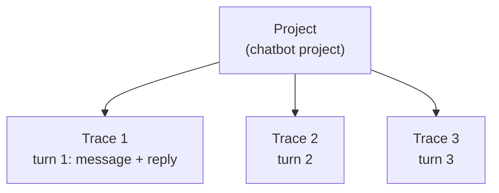
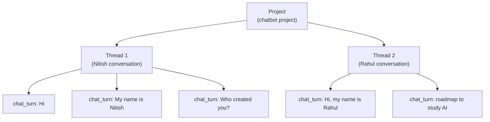

> **Video 17 of 28** · [Watch on YouTube](https://www.youtube.com/watch?v=ikzN6byFNWw) · Translated from the
> Hindi transcript. Notes follow the video section by section, in its order.

With a few environment variables, LangSmith traces every turn of the chatbot's conversation; with one extra piece of config, those traces are grouped into the same threads the chatbot uses.

## The journey so far

The playlist began with theory: what agentic AI is, what LangGraph is and why it is needed. Then LangGraph was learned practically, starting with its fundamentals and moving on to building different types of workflows. Then came a small project, a chatbot, with features added in each video. At this point the chatbot has:

- a **GUI** through which the user interacts with it;
- **streaming**, so the user does not wait to see the LLM's response;
- **database persistence** (last video), so chats are not erased: chat today, shut down the machine and the program, open the chatbot four days later, and the old chats are intact.

## Today's feature: observability

Today adds one more very important feature: **observability**. What observability is and why it matters for LLM systems is not covered here. Instead, watch the channel's **LangSmith crash course**, a two-hour video published two days earlier, end to end before this one. It gives two benefits: you understand the concept of observability well, and you learn to work in detail with **LangSmith**, the tool used for observability here. Without it, this video will not make much sense.

In a nutshell, in this context observability means **tracing the chatbot's execution end to end**. A user comes to the chatbot and starts chatting; every message they send and every message they get back is recorded in LangSmith. Much more is recorded too: token usage, latency, and how each system inside the chatbot works internally.

The payoff comes later: when more complex features such as **tools** or **RAG** are added in coming videos, this observability will make it easier to understand what is going on.

## Setting up LangSmith

Go to LangSmith's website, **smith.langchain.com**, and create an account (here, an existing account is used to log in). The LangSmith user interface is explored in more detail below; first, the setup.

### Creating an API key

The first thing you need is an **API key**; it is what lets LangGraph and LangSmith be integrated with each other. Go to **Settings**, open **API Keys**, click the API key button, provide a description and click **Create API Key**. Copy the key somewhere.

### The environment variables

Next, a little code (shared in the video's description) goes into the **environment file** in your project folder. It is three or four variables; as soon as they are in your project, LangSmith automatically starts tracing your LangGraph project.

```bash
LANGSMITH_TRACING=true
LANGSMITH_ENDPOINT="https://api.smith.langchain.com"
LANGSMITH_API_KEY="<your-api-key>"
LANGSMITH_PROJECT="chatbot-project"
```

- `LANGSMITH_TRACING`, set to `true`.
- `LANGSMITH_ENDPOINT`, LangSmith's URL.
- `LANGSMITH_API_KEY`, exactly the key you just created.
- `LANGSMITH_PROJECT`, a project name. LangSmith organises all your projects in one place, under **Tracing Projects**, where past projects are listed (yours may be empty). Once you run with this name, a project called "chatbot project" appears there, and all the chatbot's tracing shows up inside it.

With this much setup, you are ready to go.

## Tracing without changing the code

The best thing about LangSmith is that once this setup is done, you **do not need to change your main code**. LangSmith starts tracing automatically behind the scenes.

The code is rerun in a new terminal, and it is exactly the code from the last video (the database integration), with no changes. Send "Give me a roadmap to study AI engineering" and the chatbot behaves completely normally. But behind the scenes LangSmith is at work: in the dashboard, under Tracing Projects, a new project named "chatbot project" appears, because that project name was set in the environment variable.

### How LangSmith organises things

At the very top level is the **project**, here "chatbot project". Every time the user talks to the chatbot, LangSmith captures a **trace**. One message to the chatbot and one reply back became a single trace.

Clicking the trace shows a lot of information:

- the **node** name in LangGraph, `chat_node`, and the LLM used inside it, `ChatOpenAI`;
- the **input** that went in and the **output** from the LLM;
- when the execution **started** and **ended**;
- how long it took to see the **first token**;
- the **status**;
- total **tokens**, both input and output;
- the system's **latency**, how long the response took to generate.

All of it is in one place.

Send a second message, "How much time will it take to cover this syllabus?", and after the answer, the dashboard shows the **second turn captured as a separate trace**, with its question, answer, time taken and tokens.

So the basic idea: you create a project in LangSmith, and inside it, every turn of the user's chat (a message and its reply) is captured as a trace. You can come back at any time and check what the user asked, what answer they got and how long it took. You can observe everything, which is why it is called **observability**.



## The problem: every thread's turns land in one place

One thing may bother you here, as it did the first time LangSmith was used for this course. Open a **new thread** in the chatbot and ask for "recipe of biryani", a separate conversation. In LangSmith, a third trace appears: the biryani question and the LLM's response.

The problem is that although this is a new conversation in a separate thread, its turn is stored in **exactly the same place** as the previous thread's messages. All messages from all the different conversations end up in one place, and if you switch back to the earlier thread and keep talking, those messages land there too. That looks mismanaged: different conversations should be stored separately.

That is a very valid concern, and LangSmith's creators thought of it: you can organise your traces **inside threads**. The chatbot already uses threading (each new conversation creates a new thread that stores the whole chat), and LangSmith lets you mirror that, with each thread's messages automatically stored inside that thread. The one catch is a little extra code.

## Logging threads to LangSmith

In LangSmith's **Threads** section there are no threads yet ("No threads found"). Below that is a link, **"Learn how to log your first thread"**. The page explains in simple words that to use threads you must explicitly mention one of these while invoking your chatbot:

- a **thread ID**, or
- a **session ID**, or
- a **conversation ID**.

The piece of code for this is also in the video's description. It goes into the existing frontend code from the last video, where there is a `CONFIG` variable: a dictionary whose key `configurable` is itself a dictionary holding the thread ID stored in the session. That variable was made so it could be sent to the chatbot's backend, LangGraph, which uses it to organise messages into threads.

```python
CONFIG = {'configurable': {'thread_id': st.session_state['thread_id']}}
```

The only change is to replace this `CONFIG` with a new one:

```python
CONFIG = {
    'configurable': {'thread_id': st.session_state['thread_id']},
    'metadata': {
        'thread_id': st.session_state['thread_id']
    },
    'run_name': 'chat_turn',
}
```

What differs:

- **`configurable`** is exactly the same as before.
- **`metadata`** is new. The LangSmith page says "You can add metadata to your traces", and this is that metadata: `thread_id` set to the current user's thread ID.
- **`run_name`** is optional and can be removed. By default every trace is named "LangGraph", which is not very informative; you cannot tell what it represents. Each trace represents **one turn** of conversation (you say something, the chatbot replies), so `run_name` is set to `chat_turn` and that name shows instead of "LangGraph". It is there for readability.

## Testing threads in LangSmith

Rerun the code. To start the tracing afresh with no confusion, the "chatbot project" is **deleted** from Tracing Projects first.

- Say "Hi"; the reply is "Hello, how can I assist you?" After a refresh, the "chatbot project" is back, with one trace, exactly as before, except it is now named **chat_turn** instead of LangGraph.
- The difference is in **Threads**: there is now **one thread** containing one trace, one turn. Clicking it shows the conversation in a very nice UI: the human said "Hi", the AI said "Hello, how can I assist you?"
- Say "My name is Nitish" and get "Nice to meet you, Nitish". Tracing Projects now shows two traces, but Threads still shows **one thread**, now with two traces inside: turn one ("Hi", "Hello") and turn two, visible when you hover.
- Ask "Who created you?" and get "I was created by OpenAI". After a short wait, the **third turn** appears in the same thread.

That is the benefit of adding the thread ID: the whole conversation is stored inside one thread, however many traces it has, three or ten.

Now **create a new conversation** in the chatbot, a new thread: "Hi, my name is Rahul", then "What is the roadmap to study AI?". Under Tracing Projects there are lots of traces, which is not useful to look at. Under **Threads**, a **new thread** has appeared at the top. Clicking it shows the second conversation arranged exactly right: "Hi, my name is Rahul", "Hello Rahul", "What is the roadmap to study AI?" and the reply, with all its turns captured. Click any turn to study it: what was said, what the AI replied, the latency and the tokens used, all in one place.



Every new conversation you create on the chatbot is now stored beautifully in LangSmith as a thread, with all its traces inside it. That is the beauty of LangSmith, and why people use it.

## Why it will matter later

You may not fully appreciate it yet, but going forward, when more complex things are added (tools, RAG, MCP and so on), this LangSmith dashboard will help a lot in building your understanding. More than that, when you push your chatbot to production as a software developer, it brings very important information together in one place.

Only a few LangSmith features are shown here. The LangSmith crash course video on the channel covers much more about this tool, including everything else in the dashboard: **Monitoring**, **Datasets and Experiments**, **Prompts** and **Playground**. Hopefully these will be discussed in future too.

This was a small video, but it added a very important feature to the chatbot, one that will pay off a lot later.
