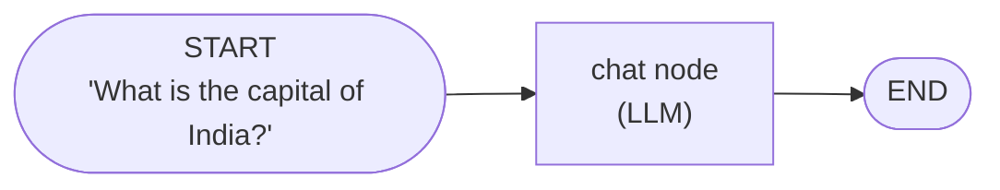
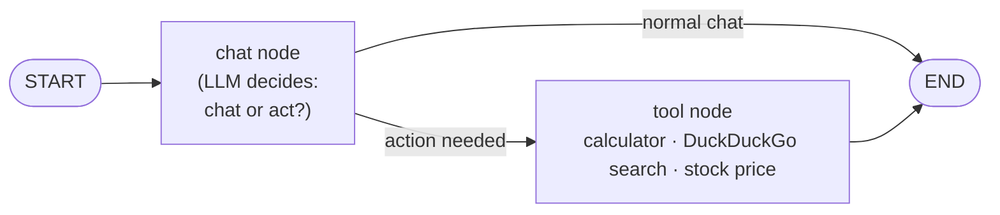
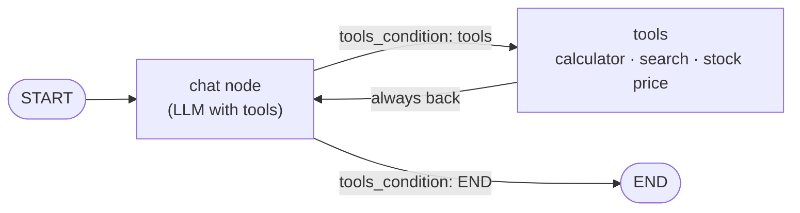

> **Video 18 of 28** · [Watch on YouTube](https://www.youtube.com/watch?v=_UuUigoM9MA) · Translated from the
> Hindi transcript. Notes follow the video section by section, in its order.

This video gives the running chatbot the ability to perform actions, not just talk, by adding tools to its LangGraph workflow.

## Recap: what the chatbot can and cannot do

Over the last several videos a chatbot has been built, gaining one new feature per video. It now has a **GUI**, **short-term memory**, **database persistence** and **streaming**.

Its problem: on the back end it is connected to an OpenAI LLM, so you can talk to it about anything and get a sensible response, but it has **no capability to perform actions** for you. Today that changes by adding **tools**. With tools, the chatbot can still talk normally, and if you give it a job it can also do that job for you.

There is honestly no limit to what kind of tool you can attach. Since this is a beginner-friendly tutorial, three basic tools are added:

1. **Calculator**: the chatbot can do any numerical calculation.
2. **Internet search**: right now the chatbot cannot search the internet. Ask it "What is the top news in India today?" and it cannot tell you. With a search tool it can go to the internet and bring back results.
3. **Stock price**: you give the name of any company, and the tool brings back that company's stock price at this moment.

## Demo of the finished chatbot

If you talk to the chatbot normally ("hi"), it works in normal mode. As soon as you give it a task, it identifies that it should use a tool and picks the tool it thinks is right for that task.

- **"What happened to the Mumbai monorail last week?"** The chatbot does not have this information, so it immediately starts searching the internet. A status briefly shows **"Using DuckDuckGo search tool"**. DuckDuckGo is a search engine just like Google, and the chatbot uses it behind the scenes to search the internet. This time it did not produce the answer.
- **"Who won the South Africa versus Australia ODI match yesterday?"** Again DuckDuckGo search. It is a little embarrassing, but you get the idea: the tool is working behind the scenes, it just is not returning good results.
- **"What is the product of 654 and 713?"** It shows **"Using calculator"**, and the calculator produces the output, which you can cross-check.
- **"What is the current stock price of Tesla?"** It uses the third tool, **get stock price**, and replies that Tesla's current stock price is **$323**.

That is the power of tools: you can talk to the chatbot and also get work done through it.

To show at least one use case performing properly, a query that forces **two tools**: **"Who owns YouTube? Find the stock price of that company."** First it should search for YouTube's parent company, then fetch that company's stock price. DuckDuckGo search runs first and, thankfully, answers: "YouTube is owned by Google. Let me find the stock price of Google for you." Then: "The current stock price of Google is $54."

So this is how the chatbot will function from now on: normal queries are handled in normal chat mode, and when you want work done it takes help from tools and executes the task.

## Plan of action

The video is in two parts:

1. **Fundamentals**: how you add tools in LangGraph.
2. **Adding the three tools** to the chatbot project.

This video does not go in depth into what a tool is or what tool calling is; you should already know that. If you do not, the LangChain playlist has a video on **Tools** that covers in detail what tools are, why they are used and how LLMs call them. Watch it first and today's video will make much more sense.

## Theory: from the simplest workflow to one that can act

Before the code, a little basic theory so the code is easy to follow. Start from the simplest workflow built earlier in LangGraph: a **start** node where the user's question arrives ("What is the capital of India?"), a **chat node** with an LLM inside that looks at the question and answers, and an **end** node where the workflow finishes.



The requirement now is that the chatbot does both kinds of work: normal conversation, and, when needed, actually doing a task. That needs two or three changes to this basic workflow.

### Change 1: the chat node also makes a decision

The simple chat node, which only held an LLM, now has to do some additional **decision making**. When a question arrives, it reads the content and works out whether the user wants simple chatting or wants a job done.

- "What is the capital of India?" The chat node understands this is normal chatting, generates a normal answer, and goes to the end by that route.
- "Search the internet and tell me today's top news." The chat node understands that it should not chat but **perform an action**, so it takes an alternate, second route.

So instead of only chatting, the chat node now also decides whether to chat or to act.

### The tool node

If it decides to act, a very important concept comes in: the **tool node**. In LangGraph you make a collection of all the tools you want to add to your chatbot and prepare one special node that handles all of them. Here the tool node holds the three tools: the **calculator**, **DuckDuckGo search** and the **stock price** tool.

The whole flow: the question "Get me today's top news" arrives. The chat node detects that it must perform an action, not chat, so it sends the execution flow to the tool node. The tool node's speciality is that it **automatically understands which tool to execute**. From the chat node it receives the tool's **name** and the **input** for that tool: for "Tell me today's top news" the LLM says to use the DuckDuckGo search tool, with the input "top news in India today". The tool node, which has all the tools sitting with it, tells the DuckDuckGo tool to start its work with that input. The tool executes, prints the answer, and the workflow ends.



In a nutshell, the tool node is the place where all your tools reside, and it is the thing that executes them: you can call it your **tool executor**.

The more formal definition shown on screen:

> In LangGraph, a `ToolNode` is a **prebuilt node** that acts as a bridge between your graph and external tools. Normally in LangGraph you would write a node function yourself; it takes in a state and returns state. A `ToolNode` is a ready-made node that knows how to handle a list of LangChain tools. Its job is to listen for tool calls.

"Prebuilt" means you do not build it; LangGraph provides the functionality. It keeps listening for the tool call the LLM makes, and as soon as it gets one it automatically routes that request to the correct tool, and the tool's response then shows up.

### `tools_condition`

One more technical term: **`tools_condition`**. It is an inbuilt LangGraph function used at the chat node, and it is what tells you whether, for your question, you should chat or call a tool. The flow out of the chat node is **conditional**: it goes either one way or the other, and `tools_condition` is what decides.

The definition shown on screen:

> `tools_condition` is a **prebuilt conditional edge function** that helps your graph decide: should the flow go to the `ToolNode` and back to the LLM, or to the `END` node?

So only two new concepts need your focus: what a **tool node** is and what **`tools_condition`** is. Understand these two and the code is easy.

## Code: adding tools in LangGraph

The code is already written in a notebook; this is a walkthrough.

### Imports

Most imports are familiar. The new ones:

- `ToolNode` and `tools_condition` from `langgraph.prebuilt`, exactly what was just discussed;
- `DuckDuckGoSearchRun` from `langchain_community.tools`, a tool studied in the LangChain playlist;
- `tool` from `langchain_core.tools`, because you want to build your own **custom** tools, like the calculator.

```python
from typing import Annotated, TypedDict                 # (implied, not shown in narration)

import requests                                         # (implied, not shown in narration)
from dotenv import load_dotenv
from langchain_community.tools import DuckDuckGoSearchRun
from langchain_core.messages import BaseMessage         # (implied, not shown in narration)
from langchain_core.tools import tool
from langchain_openai import ChatOpenAI
from langgraph.graph import StateGraph, START           # (implied, not shown in narration)
from langgraph.graph.message import add_messages        # (implied, not shown in narration)
from langgraph.prebuilt import ToolNode, tools_condition
```

Then load the environment file and create a `ChatOpenAI` LLM.

```python
load_dotenv()

llm = ChatOpenAI()
```

### The three tools

This is the most important step: creating the three tools, DuckDuckGo, a calculator and the stock price tool.

One concept to know first: tools in LangChain are of **two types**.

| Prebuilt tool | Custom tool |
| --- | --- |
| LangChain gives it to you ready-made. | You, as the programmer, build it for your own use case. |
| Example: the DuckDuckGo search tool. LangChain expects many use cases to need internet search, so it built this tool; you do not need to build it again. | Example: the `calculator` tool here, built with the `@tool` decorator. |

The first tool, `DuckDuckGoSearchRun`, is simply put in a variable.

```python
search_tool = DuckDuckGoSearchRun()   # variable name not read out
```

The second is a function called `calculator` with `@tool` on top, which turns it into a tool. It is very basic code: it takes **three inputs**, the first number, the second number, and the operation to perform between them (plus, minus, multiplication or division), and an if-else inside produces the output.

```python
@tool
def calculator(first_num: float, second_num: float, operation: str) -> dict:
    """Perform a basic arithmetic operation on two numbers: add, sub, mul or div."""  # (implied, not shown in narration: exact wording)
    if operation == "add":
        result = first_num + second_num
    elif operation == "sub":
        result = first_num - second_num
    elif operation == "mul":
        result = first_num * second_num
    elif operation == "div":
        result = first_num / second_num
    return {"first_num": first_num, "second_num": second_num, "operation": operation, "result": result}
```

The third tool is `get_stock_price`. It uses an API from a website called **Alpha Vantage**. You have to create an API key there; it is free, so make your own. Do not use the key in the code, because its daily usage runs out very quickly. The tool simply returns whatever data it gets back, as JSON.

```python
@tool
def get_stock_price(symbol: str) -> dict:
    """Fetch the latest stock price for a given symbol (e.g. 'AAPL', 'TSLA') using Alpha Vantage."""  # (implied, not shown in narration: exact wording)
    url = f"https://www.alphavantage.co/query?function=GLOBAL_QUOTE&symbol={symbol}&apikey=YOUR_API_KEY"  # (implied, not shown in narration)
    r = requests.get(url)
    return r.json()
```

:::tip

Whenever you build your own tool, always add a **docstring** that says exactly what the tool does. The LLM reads it and uses it to decide which tool to use for a particular problem.

:::

### Binding the tools to the LLM

Put all three tools in a list in a variable called `tools`, then tell the LLM "we have these three tools" with `bind_tools`.

```python
tools = [search_tool, get_stock_price, calculator]
llm_with_tools = llm.bind_tools(tools)
```

### State, nodes and edges

From here it is the LangGraph work you have done many times. The state is very simple: just a `messages` variable, exactly as in the chatbot project.

```python
class ChatState(TypedDict):
    messages: Annotated[list[BaseMessage], add_messages]
```

The workflow has **two nodes**: the **chat node** and the **tool node**. Create a `StateGraph` object and add both. The tool node comes from calling the built-in `ToolNode` and passing your tools; that automatically makes it a tool node. The chat node's code is exactly what was written in the chatbot project, except that it calls **`llm_with_tools`** rather than the normal LLM: it reads the messages so far, passes them all in, and returns the response.

```python
def chat_node(state: ChatState):
    messages = state["messages"]
    response = llm_with_tools.invoke(messages)
    return {"messages": [response]}

tool_node = ToolNode(tools)

graph = StateGraph(ChatState)
graph.add_node("chat_node", chat_node)
graph.add_node("tools", tool_node)
```

The edges are very simple. The first goes from `START` to the chat node. Then a **conditional edge** starts from the chat node, and where it goes is decided by `tools_condition`: the normal workflow goes to `END`, and if tools are needed it goes to the tool node.

```python
graph.add_edge(START, "chat_node")
graph.add_conditional_edges("chat_node", tools_condition)

chatbot = graph.compile()
```

Run all the cells and compile, and the drawn graph is exactly the one planned above.

### Asking the workflow questions

- `chatbot.invoke` with **"hello"** returns "Hi there, how can I assist you?" That is the normal workflow: question asked, LLM replies, workflow ends.
- **"What is the product of 2 cross 3?"** The output is not a normal output; it comes from the **calculator tool**.
- **"What is the stock price of Apple?"** A JSON comes back with a lot of information about Apple's stock.

```python
chatbot.invoke({"messages": [HumanMessage(content="hello")]})  # (implied, not shown in narration: exact call and HumanMessage import)
```

So the flow works: normal conversation goes by one route, and actions go by the other.

## The problem with this structure

Pause and think: is there a problem with this graph, or is it the perfect structure?

There is a problem. From the chat node you go to the tools node, and whatever the tools node outputs is sent straight to `END` and shown to the user. That causes **two big problems**.

**1. The tool output is not polished enough to show a user.** Asking for Apple's stock price gave a very technical output, basically JSON, which a normal user will not understand. Ideally the answer should read "The current stock price of Apple is this much". But because the flow goes chat node → tool node → `END`, there is no chance at all to present the tool's output in a polished way.

**2. Multi-step queries are impossible.** Take a slightly more complex query: "What is the stock price of Apple? How much would it cost to purchase 50 shares?" The output is weird: first number 50, second number zero, operation multiplication, result zero. What you wanted was two steps: first find Apple's stock price, then, with that price, multiply to find the cost of 50 shares. That is thinking in two steps, using one tool and then a second tool based on its output. With chat node → tool node → `END`, a two-step or three-step flow is not possible.

So the structure is not fully correct and has to be modified: the tool's output must be **sent back to the chat node**.

## The fix: loop from the tools back to the chat node

With the tool's output going back to the chat node:

- **Simple tool query** ("work out 2 cross 3" or "get Apple's stock price"): you go to the tool, the tool returns JSON, and that JSON goes back to the LLM. The LLM looks at it, sees that it has the answer to the question it was asked, and prints it in a refined way on the route to `END`.
- **Two-step query** (Apple's stock price, and the cost of 50 shares): this is now a kind of **loop**. The query reaches the chat node, which understands it must first find Apple's stock price. It goes to the tool node and invokes the stock tool for Apple's price. With the price, it comes back to the chat node, which now has the whole history: what the user originally asked, what it decided, and what the tool said. On that basis it decides it now needs to calculate the cost of 50 shares and should invoke the calculator. It goes back to the calculator with first number 50, second number Apple's stock price, operation multiplication. The result comes back to the chat node, which again reads the whole chat history, sees it has everything it needs, and gives the final result on the route to `END`.



So you create a **loop between your LLM and your tools**, and these problems go away. The change is minor: one more edge, from the tools to the chat node. Make a new graph object with the new edges:

```python
graph.add_edge(START, "chat_node")
graph.add_conditional_edges("chat_node", tools_condition)
graph.add_edge("tools", "chat_node")
```

The new structure: from the chat node you go conditionally either to the tools or to `END`, but from the tools you **always** go back to the chat node.

Re-running the same queries:

- "hello" is the normal case and is unchanged.
- "2 cross 3", which gave a JSON-style output before, now returns: "The result of 2 \* 3 is 6". The tool's output went back to the LLM, and the LLM handled it properly.
- The Apple stock price, which gave a technical output before, now comes back as a proper answer.
- The two-level query now produces a full answer. (Whether the calculation is right was not checked on screen; it should be.)

## Looking at it in LangSmith

LangSmith was covered in the last video, and this notebook is already integrated with it behind the scenes: all the LangSmith variables are in the `.env` file. So you can look at how the whole thing runs.

Take the trace for **"What is the stock price of Apple?"** The execution divides into three parts:

1. **Chat node.** Control goes to the chat node with the question. All three tools are shown as available to it. Its output: call the `get_stock_price` tool with Apple as the input. Checking `tools_condition` for this step, its output is **`tools`**, meaning go from the chat node to the tool node.
2. **Tool.** The `get_stock_price` tool is called with **`AAPL`**, Apple's ticker, as input, and returns all the details the API gave.
3. **Back to the chat node.** Control returns to the chat node, which now has the full information: first the question, then what the chat node said, then what the tool said. On that basis it gives the final output. Checking `tools_condition` here, its output is now **go to `END`**.

Visualising the run in LangSmith, seeing when the tool is called and when the LLM is called, helps you understand the concept more deeply.

That completes the first part: the basics of adding tools in LangGraph.

## Adding the tools to the chatbot project

Now that you understand the code, integrating the three tools into the existing chatbot project is easy.

### The new back end

Inside the project folder there is a new file, **`langgraph_tool_backend`**. The old back end, where the chatbot's whole graph was built, is rewritten, and this becomes the new back end. There is nothing special in it; it contains exactly what was just discussed:

- the same imports and `load_dotenv`;
- the LLM;
- the same three tools: the search tool, the calculator tool and the `get_stock_price` tool;
- the tools in a list, bound to the LLM;
- the same state;
- the same chat node function;
- the tool node;
- the checkpointer code you have seen before;
- the graph code, exactly as just discussed;
- a helper function used in a past video.

### The front end: point it at the new back end

The Streamlit front end needs no changes. Use last video's file as it is, with one minor change: in the import, write the name of the new back-end file in place of the old one.

```python
from langgraph_tool_backend import chatbot   # (implied, not shown in narration: the imported names)
```

That is it; run the app.

- "hi" gets a normal reply.
- "What is the product of 2456 and 1234?" gets the output.

### A bug: the tool output is streamed too

There is one problem: somehow the **tool's output is also being printed**. With "What is the stock price of Apple?" you do get the right answer in the end, but in between the tool's output is printed or streamed as it is.

The reason is in the front-end streaming code: at the end, where the streaming happens, **every** message that comes from the back end is streamed and printed. That should not happen. Two types of messages come from the back end:

- an **AI message**, sent by the LLM;
- a **tool message**, sent by the tool.

Ideally only the AI message should be streamed, not the tool message.

The fix is a ready-made piece of code to copy in: a simple check that streams **only if it is an AI message**, otherwise not. This also needs an import of `AIMessage`.

```python
from langchain_core.messages import AIMessage

# inside the existing streaming code, keep only AI messages:
if isinstance(message_chunk, AIMessage):   # (implied, not shown in narration: exact variable name)
    ...  # stream it as before
```

Save, go back and rerun. "What is the share price of Tesla?" no longer shows that tool message.

To sum up the changes: a new back-end file, and two small front-end changes, replacing the back-end file name and adding a filter so that streaming happens only for AI messages.

## Showing which tool is running: the status container

One last thing. In the demo at the start, whenever the chatbot used a tool, a **status container** showed which tool was being used. That is a good user experience, because the user should always know whether normal chatting or tool usage is happening, and if a tool, which one.

This is very much front-end work. In Streamlit's official documentation, under **chat elements**, there are four chat elements. Three have already been used; the fourth is the **status container**. Its code is slightly difficult and tricky, so it is not explained line by line here. Instead there is a completely new front-end file that is mostly the same as before; only the last part uses the status container, so you see updates on which tool is being used behind the scenes. You can use it directly, or break the code down and understand it with the help of ChatGPT, rather than lengthening the video.

Running the updated file, "What is the top news in India?" shows **DuckDuckGo search** in the status, then the output.

All the code is in the video's description box for you to experiment with.

## Wrap-up and homework

What was planned has been achieved. First, you learned what tools are and how to use them in LangGraph. Second, one more feature, a very powerful one, has been added to the existing project.

**Homework:** add a tool of your own choice to the chatbot, using what you learned in this video.
