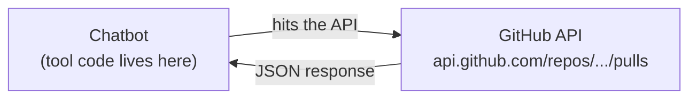
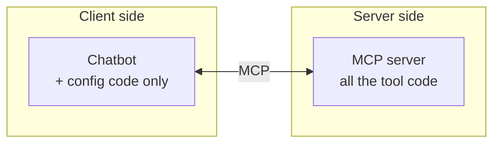
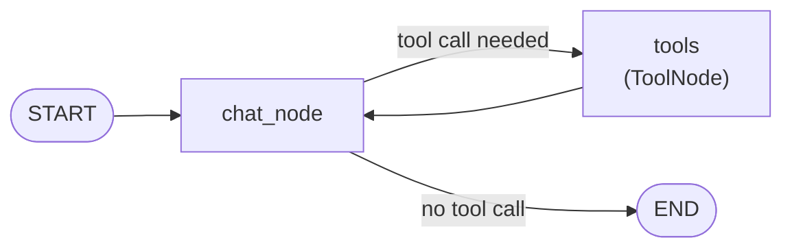

> **Video 19 of 28** · [Watch on YouTube](https://www.youtube.com/watch?v=yZGjVA4uDc4) · Translated from the
> Hindi transcript. Notes follow the video section by section, in its order.

MCP is a better, standardised way to connect tools to an LLM application; this video shows why, then replaces the chatbot's hand-written tools with an MCP client built in LangGraph.

## Resuming the playlist, and a recap

The playlist had been paused for a long time while other work (chiefly a separate MCP playlist) took priority. It now resumes, with the focus on completing it.

What the first 18 videos covered:

- General topics: what agentic AI is, generative AI vs agentic AI, LangGraph vs LangChain.
- LangGraph's core concepts.
- Different workflow types in LangGraph: parallel, sequential, conditional and iterative.
- A small chatbot project, with features added one at a time: a basic LangGraph chatbot, then a UI, streaming, resume chat, a database so old chats can be viewed later, observability with LangSmith, and finally **tools**. The chatbot was connected to a stock market tool, a web search tool and a calculator tool.

Today's topic is **MCP, the Model Context Protocol**, which has become very famous in the last six months. The chatbot gets an MCP feature. If MCP is new to you, the recommendation is to watch the eight-video MCP playlist on the same channel first; today's video will make much more sense after it.

The agenda: why the chatbot needs MCP, what MCP is, and how to implement it in LangGraph.

## What MCP is and why it is needed

In very simple words, **MCP is an improved version of tools**. Tools were added to the chatbot to make it more capable, but the tools technique has an **inherent flaw**, and MCP exists to solve it. So MCP is not something completely new. It is a better way to integrate tools with a chatbot or LLM application: **a standardised way to connect tools to your LLM applications**.

### The example: connecting the chatbot to GitHub

The chatbot currently uses three tools: a **search** tool that searches the internet, a **calculator** tool for mathematical calculations, and a **get stock price** tool for the current price of any stock.

Now the manager asks for more: the chatbot is being built for the company's developers, so it should connect to **GitHub** and answer questions about GitHub repositories. How would you do that?

Every tool integrated so far is one of two kinds:

- **Library-based tools**, such as `DuckDuckGoSearchRun`, which comes from inside LangChain. You write no code for it.
- **User-defined tools**, where you write the code yourself. The other two tools in the chatbot are of this kind.

As far as is known, LangChain has no built-in tool for GitHub, so you would have to create your own. The video shows a dummy tool, written only for teaching and not tested, that connects to GitHub and returns the list of pull requests in a repository:

- It needs these inputs: the **owner** of the repository, the **repository**, which pull requests you want (**open or closed**), and how many to show the user at a time (currently **five**).
- It needs a GitHub **token** so it can connect, plus some additional **headers**.
- It hits the pull-requests URL on the GitHub API, gets a response back, extracts the **JSON** data and prints each pull request's **number, title, author, state and URL**.

That is one tool doing one job: pulling the information of all the pull requests. To see commits you would need a separate tool; to see the number of files, another separate tool.

### Why this approach is brittle

The problem is that this approach is **brittle**: it can break very easily. The code may work today, but there is no guarantee it will work tomorrow.

The system has two parts: the **chatbot**, and **GitHub**, which exposes an API (`api.github.com/repos/.../pulls`). The tool on the chatbot's side is the piece of code that hits this API and brings back pull-request data.



Everything works for now. Then, six months later, GitHub updates its API from version 1.0 to 2.0. Major version changes like this often bring many code changes. Suppose `pulls` in the URL becomes `pull_requests`, `title` becomes `title_name`, and `user` becomes `user_name`. The moment those changes land, the chatbot starts giving errors: as soon as anyone asks for pull requests, the code blows up because it still has the old URL and the old attributes.

As the coder of the project, you now have to go to GitHub's documentation, study what changed in version 2.0, then come back and update the code: `pulls` to `pull_requests`, `title` to `title_name`, and so on.

That might sound like no big deal once every six months. It actually is a big deal:

- This is **just one tool**. Connecting to a service like GitHub might take **10 tools** like this, so a single API change means changes in all 10 places.
- Your company might have **five different chatbots** for different divisions, so the changes are needed in five places.
- And that is only GitHub. What if the company also wants **Gmail, Slack and Jira**?

If every chatbot has **n** tools and there are **m** chatbots, this becomes an **n × m maintenance problem**. You would spend all your time writing code just to maintain the chatbots. The root problem is that changes on the service's side are also affecting the chatbot (client) side. That should not happen, and it is the biggest problem with the tools approach.

### How MCP solves it

MCP names the two parties: the chatbot side is the **client**, and the tool side is the **server**. It keeps a proper **separation of concerns** between them:

- All tool-related code lives on the **server** side.
- The **client** side holds only some **config code**.



So even if the server changes its code or updates its API, the config code should not change. GitHub can change its API as it likes; once the chatbot is connected to GitHub through the config code, those version changes need nothing from you. All the heavy lifting in coding happens on the server side. The client's only responsibility is to connect to the MCP server.

Instead of writing all that tool code, you write a short piece of config code that connects to the GitHub MCP server. With just that, you automatically get all the information about which tools GitHub offers, their definitions, what they do and when to use them. If things change on the server tomorrow, this code needs no changes, and the client can sit back completely relaxed. Solving this maintenance problem is **the biggest selling point of MCP**.

This is only a surface-level explanation. MCP is a dense concept; the problem, how MCP solves it, the MCP life cycle and the MCP architecture are all covered in depth in the MCP playlist. Watching that first will avoid gaps in understanding.

## Plan: an MCP client in LangGraph

Now that it is clear why MCP is superior to plain tools, the next step is to build an **MCP client in LangGraph** and show that it does the same work as tools, just more easily.

One clarification first. MCP code has two sides: the **MCP server**, and an **MCP client** that talks to it. This video focuses **only on the client**: an MCP client in LangGraph that talks to an MCP server and gets work done. Writing servers is not covered, because you cannot build MCP servers in LangGraph; there is a dedicated library for that, **FastMCP**, taught in the MCP playlist. Here, a ready-made MCP server is used and only the client code is written.

### The starting point: last video's chatbot

The starting code is the one written in the last video: a very simple LangGraph chatbot with access to one tool, the **calculator**. You can chat normally with it or ask it to calculate. The sample question asks it to perform the **modulus** operation on two numbers and give the answer like a **cricket commentator**; it replies in commentary style ("and that's a pitch…") and ends with a remainder of **12**.

A quick revision of that code:

- The imports, `load_dotenv`, and the OpenAI key loaded for the model.
- The calculator tool's code.
- `bind_tools`, which tells the LLM it has the calculator tool, giving `llm_with_tools`.
- The LangGraph part: the state class, and two nodes, a **chat node** and a **tool node**.
- The graph structure: from `START` to the chat node, a conditional edge between the chat node and the tool node, and an edge from the tool node back to the chat node so the information returns.
- The code to talk to the chatbot.



The plan is to **replace the calculator tool with an MCP client**. The calculator code will live in an MCP server, and the chatbot will connect to it through the MCP client. Then, if the calculator server changes tomorrow, the client side needs no changes.

### Why async comes first

The MCP client code is not written directly. There is a small in-between step. The current code is entirely **synchronous**; `async`/`await` is not used anywhere. The first step is to convert it to **asynchronous** code, which LangGraph supports.

Why async in a video about MCP? Because the library used to build the MCP client **works only in async mode**. Rather than springing that on you all at once, the code is first converted to async while keeping the tool, and that async code is then used for the MCP client.

## Step 1: converting the chatbot to async

A new file, `chatbot_async`, is created, and the old code is pasted in piece by piece, with each async change made along the way.

1. **Imports**: all the existing imports are needed, plus the `asyncio` library.
2. **LLM, tool and binding**: the code that creates the LLM, defines the tool and binds it stays exactly as it is.
3. **State**: the state definition stays as it is.
4. **`build_graph`**: the interesting part. All the graph-building code is delegated to a function called `build_graph`, which returns the `chatbot` graph.
5. **An async `main`**: it gets `chatbot` from `build_graph`, then runs the old chatting code as it is, with one change. Since this is asynchronous code, `chatbot.invoke` becomes **`ainvoke`** (asynchronous invoke), inside an `await`.
6. At the end: `if __name__ == "__main__":` then `asyncio.run(main())`.
7. **Graph-building code** (the two nodes, the connections and the compile) is copied into `build_graph`, and the chat node is shifted in there too.

The key rule: **to make LangGraph code asynchronous, you make its nodes' execution asynchronous.** So the chat node becomes an `async` function, and inside it the LLM call becomes an asynchronous invoke with `await`.

Why is the tool node not made async? Because `ToolNode` is internally asynchronous already; its implementation is async. You only make **your custom nodes** asynchronous.

```python
import asyncio
from typing import Annotated, TypedDict                      # (implied, not shown in narration)

from dotenv import load_dotenv
from langchain_core.messages import BaseMessage, HumanMessage  # (implied, not shown in narration)
from langchain_core.tools import tool                          # (implied, not shown in narration)
from langchain_openai import ChatOpenAI
from langgraph.graph import StateGraph, START                   # (implied, not shown in narration)
from langgraph.graph.message import add_messages               # (implied, not shown in narration)
from langgraph.prebuilt import ToolNode, tools_condition       # (implied, not shown in narration)

load_dotenv()

llm = ChatOpenAI()

@tool
def calculator(first_num: float, second_num: float, operation: str) -> dict:  # (implied, not shown in narration)
    """Perform a basic arithmetic operation on two numbers."""                # (implied, not shown in narration)
    ...  # the calculator tool from the previous video, unchanged

tools = [calculator]
llm_with_tools = llm.bind_tools(tools)


class ChatState(TypedDict):
    messages: Annotated[list[BaseMessage], add_messages]


def build_graph():

    async def chat_node(state: ChatState):
        messages = state["messages"]
        response = await llm_with_tools.ainvoke(messages)
        return {"messages": [response]}

    tool_node = ToolNode(tools)

    graph = StateGraph(ChatState)
    graph.add_node("chat_node", chat_node)
    graph.add_node("tools", tool_node)

    graph.add_edge(START, "chat_node")
    graph.add_conditional_edges("chat_node", tools_condition)
    graph.add_edge("tools", "chat_node")

    chatbot = graph.compile()
    return chatbot


async def main():
    chatbot = build_graph()

    result = await chatbot.ainvoke(
        {"messages": [HumanMessage(content="...")]}  # the same modulus / cricket-commentator question
    )
    print(result["messages"][-1].content)  # (implied, not shown in narration)


if __name__ == "__main__":
    asyncio.run(main())
```

Running it gives the answer, so it works. The first step of the flow is done: the synchronous tool code is now asynchronous.

### A quick idea of asynchronous code

Asynchronous programming is a very big topic in itself and is not covered here, but the basic idea is **parallel execution**.

Suppose you have two tools, one to find the **weather** and one to find the **cricket score**, and the user asks: "Find me the weather of Bengaluru where the match is happening, and also tell me the current score of the match."

- With **sequential** code, LangGraph first finds the weather while everything else waits. Only when the weather answer arrives does it go to find the cricket score.
- With **asynchronous** nodes and tools, both run in parallel: one direction fetches the weather while the other fetches the score, and both answers arrive together. The whole thing speeds up, and concurrency improves too.

Here, though, async is done out of compulsion: the MCP client library only works with asynchronous code.

## The MCP server being used

Before writing the client, a look at the server. It is kept on the local machine, in a folder on the desktop, and built with **FastMCP**. It is a very simple server with tools for mathematical operations: **addition, subtraction, multiplication, division, power and modulus**. All of them can function asynchronously.

The next step: write an MCP client in LangGraph that connects to this calculator server, remove the chatbot's own tool, and get all calculations done through the server.

## Step 2: building the MCP client

A new file, `chatbot_mcp.py`, starts as a copy of the async code. Then:

1. **Remove the calculator tool.**
2. **Import the client class** from the library used to build MCP clients:

```python
from langchain_mcp_adapters.client import MultiServerMCPClient
```

Install it first with `pip install langchain-mcp-adapters`, or with uv, `uv add langchain-mcp-adapters`.

3. **Write the config code** that connects the client to the server, right below where the LLM is defined. It creates an instance of `MultiServerMCPClient` called `client`, with a single server for now. The advantage of `MultiServerMCPClient` is that it can hold **more than one** MCP server, which comes later.

The config gives:

- the **name** of the MCP server;
- the **transport**, here `stdio`. There are two types of MCP servers, **local and remote**. This one is on the same machine, so it is a local server, and local servers use **standard input/output** as the transport;
- the **command** to run the server from the client file: `python`, plus the path to the server file, which on this machine is `main.py` inside the MCP math server folder on the desktop.

```python
client = MultiServerMCPClient(
    {
        "arith": {                     # the server's name (exact name not read out)
            "transport": "stdio",
            "command": "python",
            "args": ["/path/to/Desktop/mcp-math-server/main.py"],
        }
    }
)
```

4. **Fetch the tools inside `build_graph`.** The old `tools` and binding lines are cut from the top, and inside `build_graph` the tools now come from the server:

```python
async def build_graph():

    tools = await client.get_tools()
    print(tools)

    llm_with_tools = llm.bind_tools(tools)

    # ... chat_node, ToolNode(tools), edges and compile as before
```

`client.get_tools()` fetches whatever tools the server has (add, subtract, multiply…), and the LLM is bound to those. At first `await` shows an error, because you can only `await` inside an asynchronous function, so `build_graph` becomes `async def`. The rest of the code is already asynchronous and needs no changes.

5. **Run it.** The first run fails: `build_graph` is now asynchronous, so the call in `main` must be awaited too.

```python
async def main():
    chatbot = await build_graph()
    ...
```

Running the same prompt again, the tool list prints first: `add`, `subtract`, `divide` and the rest, with their definitions (it looks complex, but it is just the tools and their definitions). Internally, the **client starts the server**, and then the answer comes back as before.

That is the first MCP client, built with LangGraph and the `langchain-mcp-adapters` library.

## Adding a second, remote MCP server

A second MCP server, built earlier, is a **remote** server because it is deployed on a server. It is called **expense tracker** and has three tools:

- **add expense**: add an expense;
- **list expenses**: load your expenses;
- **summarize**: summarise your expenses, for example how much you spent in total in a particular category this month.

Connecting it is very simple: add one more entry in the client's config. For a remote server you give only two things: the server's **URL**, and the **transport**, which for a remote server is **streamable HTTP**.

```python
client = MultiServerMCPClient(
    {
        "arith": {
            "transport": "stdio",
            "command": "python",
            "args": ["/path/to/Desktop/mcp-math-server/main.py"],
        },
        "expense": {                   # the server's name (exact name not read out)
            "transport": "streamable_http",
            "url": "https://<your-deployed-server>/mcp",  # the deployed expense tracker's URL
        },
    }
)
```

That is all it takes to talk to this server too.

**Demo.** The prompt "Add an expense 500 for a Udemy course on 10th November" lists all tools on startup, now including the new `summarize`, `list expenses` and `add expense`. The response confirms the expense was added on that date for that amount; it deduced the **category** on its own and added an extra note.

Next, "Give me all my expenses for the month of November from 1st November to 30th November" returns the expenses from 1 to 30 November: ₹500 on a Udemy course on the 10th, total for the period ₹500.

Notice that the chatbot side contains **no expense-tracking code at all**, yet the chatbot can now track expenses. You can search the internet for interesting and useful MCP servers and keep connecting them this way, without writing any code. And if the expense tracker's authors change their code, add a tool or remove one, nothing on the client needs to change. The config keeps working as it is: nobody changes the URL, and for a local server the path stays the same.

With plain tools, the same thing would have meant writing three new expense-tracking functions. Instead you used someone else's hard work smartly, and the chatbot became more powerful. This is the power of MCP compared with tools, and why MCP has become such an industry standard that even ChatGPT has had to implement it.

## Adding MCP to the existing chatbot project

The last step is to bring MCP into the ongoing chatbot project in place of tools.

You do not have to choose **either** tools **or** MCP. A mixture works fine: for example, tools for two things and MCP for three or four others. Still, the recommendation is to lean towards MCP as much as possible, because it is **more future-proof and more robust**.

In the chatbot-in-LangGraph folder there are two new files: `langgraph_mcp_backend` for the back end and `streamlit_frontend_mcp` for the front end.

**Demo of the app.** Normal chatting still works, and you can also use MCP tools and normal tools:

- "Find the current stock price of Apple" uses the normal **get stock price** tool.
- "Add this number with this number using the tool" uses the MCP server's **add** tool behind the scenes.
- "List my November expenses" uses **list expenses**, but replies that there are currently no recorded expenses, probably because the database had been deleted. So "Add an expense 500 on a Udemy course on 10th November" is sent, it confirms, and "List all expenses of November" now shows the ₹500 entry.

### What changed in the code

The code is a little **hacky**, written with a bit of a workaround (jugaad), so it is not explained line by line. The main problem is that the chatbot has **four main components**, and they disagree about async:

| Component | Sync or async |
| --- | --- |
| MCP client | Always runs in **asynchronous** mode |
| LangGraph | Comfortable with **both** |
| SQLite | Currently **synchronous** |
| Streamlit | Fundamentally a **synchronous** library |

Making Streamlit asynchronous caused a lot of problems, and the database had to be made asynchronous too. Roughly, point by point:

**Back end**

- Both tools and MCP clients are used. The **search** tool and the **get stock price** tool are still there.
- Two MCP clients (servers) are used, one for **maths** and one for **expense tracking**.
- Code fetches all the MCP tools, then **merges all the tools** and passes them to the LLM.
- The chat node is made asynchronous; the rest is very similar.
- Instead of SQLite, **`aiosqlite`** is used, the asynchronous counterpart of the SQLite library, with code to load it.
- Then the graph is built and the helpers are written.

**Front end**

- The one major change: where the `stream` function was used before, now **`astream`** (asynchronous stream) is used, and the whole loop runs asynchronously, so that function is now asynchronous.

The suggestion: **if you want to use MCP clients, do not use Streamlit for the front end**, because it is mostly synchronous, not fundamentally asynchronous. A better approach is **FastAPI** to expose an API, with a **React** or **Next.js** front end. That is complex in itself, and not everyone knows React or Next.js, so for now the hacky code (linked in the video description) can be used to run and try it. In a production setup it would not be used, because it is not compatible.

## Wrap-up

The goal was to learn how MCP clients are built in LangGraph, and the chatbot now supports MCP as a new capability.

## What comes next

The next video adds another capability: **RAG**, so the chatbot can answer questions over your internal documents.
