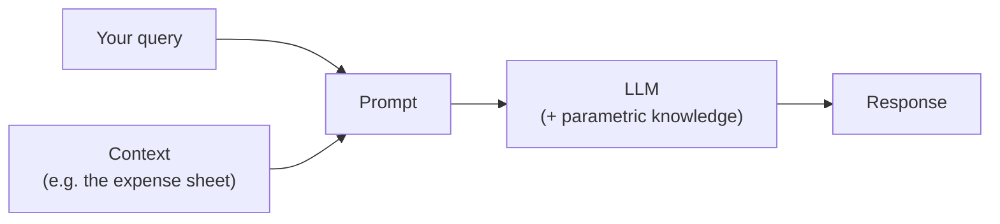
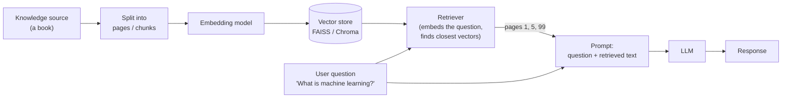
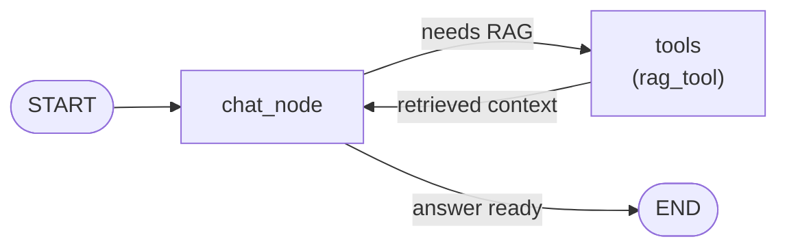

> **Video 20 of 28** · [Watch on YouTube](https://www.youtube.com/watch?v=E1qP9Xsnmik) · Translated from the
> Hindi transcript. Notes follow the video section by section, in its order.

This video turns the running chatbot from a simple chatbot into a RAG chatbot, so you can upload a document and ask questions over it, by treating RAG as just another tool.

## Recap of the running project

The chatbot is a running project: each new feature teaches a new LangGraph concept. So far it has gained a basic chatbot, a UI, streaming, persistence (resume chat), observability, tools and, in the last video, MCP.

Today it gets a new power: **RAG, retrieval-augmented generation**. The benefit is that you can upload a document to the chatbot and do question answering over it.

## Demo of the finished chatbot

The chatbot is now called **Multi Utility Chatbot**, because it can do many kinds of things. The UI has changed too: the sidebar used to show only past conversations, and now it also lets you **upload files**.

- A PDF is uploaded: a blog being written around Google.
- "Hi" gets a normal reply.
- "Based on the uploaded document, can you tell me what Google Brain is?" The chatbot uses the **RAG tool** behind the scenes and answers from the document.
- "Based on the document, what are the main achievements of Google Brain?" Again via the RAG tool, it lists achievements such as the development of **TensorFlow** and the **Transformer** model.
- The older tools still work: "What is the stock price of Apple?" makes it pick the right tool and fetch the price.

So normal chatting, tools, MCP and RAG are all integrated. You can have ordinary conversations, use tools, and upload a personal document or an e-book and chat with it. This multi-utility chatbot is the goal of the video.

## Plan of action

The video is split conceptually into three parts:

1. **A quick recap of RAG**: what it is and why it is needed, at a theoretical level and not in depth. A detailed video on RAG already exists in the LangChain playlist (linked in the description); if RAG is completely new to you, watch that first.
2. **RAG with LangGraph in separate, new code**, built from scratch, to understand the integration on its own.
3. **Integrating it into the existing chatbot project.** This could be shown directly, but it would be confusing, so the middle step exists to give clarity first.

## Recap of RAG: why it is needed

The recap follows the same **why, what and how** strategy. There are three primary reasons RAG is needed.

**1. Outdated knowledge.** Every LLM has a **knowledge cut-off date**. You train an LLM, and training completes on a particular date. Suppose GPT-5's training completed, say, three months before release, on 31 August. It has consumed no knowledge after that, so 31 August is its knowledge cut-off date: ask it anything after that and it cannot tell you.

You might object that ChatGPT answers questions about today. It does, but behind the scenes ChatGPT does a **web search**, brings the information from the internet, processes it and gives you the output. Conceptually that whole thing is itself RAG. Systems like ChatGPT and Gemini had to take the help of RAG to solve this problem.

**2. Privacy.** An LLM has the whole world's knowledge, which is why it can answer general questions. But questions that are very private or personal, about your life or your professional life, such as your **company's financial report** or your own **personal expense-management Excel sheet**, involve data it never saw in training, so it cannot answer them. With RAG you connect your private documents to the LLM, and it can then answer questions over that private data.

**3. Hallucination.** Hallucination is when an LLM makes up false information. Asked "What are the top research papers of AI in 2025?", an LLM gave 10 links, and four or five of them returned **404 Not Found** when opened. It gave false information with confidence. This happens very commonly; it is slowly reducing but is still a big problem. RAG lets you **ground** the LLM's responses: you tell it to answer only on the basis of the information given to it and not make things up.

These are the three primary reasons RAG is implemented in industry. The most important is chatting over **private data**, like uploading a personal PDF to the chatbot and talking to it. That is the biggest use case.

## What RAG is: in-context learning

RAG works on a simple principle called **in-context learning**: if you provide additional context while chatting with an LLM, it can answer on the basis of that context too.

The simple flow of chatting with an LLM: you ask a question as a prompt, the prompt goes to the LLM, and the LLM answers from the knowledge it learned in training, called **parametric knowledge**.

Now suppose you ask about your private data, for example an **expense sheet** holding this whole month's expenses. That information is not in the parametric knowledge, so the LLM cannot respond. The fix: take the entire content of the expense sheet, paste it into the prompt as **context**, and ask your question on top of it. Now the LLM receives your query plus the whole expense-sheet data as context. It looks at the query, looks at the context, uses its parametric knowledge, and answers well. That, in simple words, is the concept of RAG.



There is only one problem: you cannot always paste the whole context directly, because the LLM's **context window is limited** to a certain number of tokens.

- A small expense sheet fits.
- A folder of **100 e-books**, when you want to ask about any of them, crosses the context-window limit, and the LLM cannot process that much at once.
- A company's whole **code base**, with thousands of files and lakhs of lines of code, again crosses the context window's threshold.

So an important thing in RAG is that you **do not paste the whole context as it is**. You paste only the part relevant to the query. Instead of uploading a whole 200-page book for the question "What is machine learning?", you upload as context only the five or six pages where machine learning is discussed.

RAG therefore works on in-context learning, but with one important job: **filtering the context**. Blindly pasting everything would exceed the LLM's context window, so you must first filter it.

## How RAG works: the architecture

At the "how" level:

1. **Knowledge source.** A book, a web page or something else.
2. **Split** it into smaller parts. A 100-page book, for example, is divided into 100 pages.
3. **Embed** each page or split: convert it into vectors (numbers) that capture the **semantic meaning** of that split, using an **embedding model**. You get one embedding, a set of numbers, per split.
4. **Store** the embeddings, since they will be used many times, in a specialised database called a **vector store**, such as **FAISS** or **Chroma**. Now every page of the book has its embedding stored.
5. **Retrieve.** A user asks, say, "What is machine learning?" The question first goes to a component called the **retriever**. The retriever converts the question into an embedding the same way the pages were embedded, takes that vector to the vector database, and compares it with all stored vectors to find the **closest** ones: vectors whose captured meaning relates to machine learning. Suppose pages **1, 5 and 99** discuss the definition of machine learning; those are extracted as context. A vector store holds not just the vectors but also the **text** (the page) corresponding to each one, so you get the textual content of those three pages.
6. **Generate.** The question and the content of the three pages are put into one prompt and sent to the LLM. The LLM reads the query, studies what those pages say about machine learning, and uses its parametric knowledge to frame it well in English. From these three things it generates the response.



That is the high-level architecture of a RAG-based chatbot, and what gets built in LangGraph today. If it did not click, the channel has a roughly one-hour video called **"What is RAG"** that explains it in depth; after watching it, today's video will flow smoothly.

## Coding: RAG as a tool

There are multiple ways to implement RAG in LangGraph. The approach here is very simple: **define RAG as a tool** and treat it exactly like any other tool. This is a very good template; agentic AI applications generally use RAG as a tool.

The code is already written, since writing it from scratch would take too long. It is largely a copy of the last three or four videos with small changes, and it lives in a **Jupyter notebook** so it can be run step by step.

### Setup

Create a new file, `rag.ipynb`. Install the packages, import the libraries, call `load_dotenv`, and define the LLM. The model is `gpt-4o-mini`.

```python
from dotenv import load_dotenv
from langchain_openai import ChatOpenAI

load_dotenv()

llm = ChatOpenAI(model="gpt-4o-mini")
```

### Step 1: load, split, embed, store, retrieve

The first job is the indexing portion of the architecture: load the document, split it, generate embeddings, and save them in a vector store so it can be queried later.

The document is a book called **Intro to ML**, a PDF on machine learning found with a simple Google search. Questions will be asked over it.

**Load the document** with `PyPDFLoader`: give it the PDF's path, get a loader object, and call `.load()` to get all the documents.

```python
from langchain_community.document_loaders import PyPDFLoader

loader = PyPDFLoader("intro-to-ml.pdf")   # path to the PDF (exact filename not read out)
docs = loader.load()
```

**Split into chunks** with `RecursiveCharacterTextSplitter`. You give two important things: the **size** of each chunk, and the **overlap** between chunks so context is retained across two chunks. Then `split_documents` returns the chunks.

```python
from langchain_text_splitters import RecursiveCharacterTextSplitter

splitter = RecursiveCharacterTextSplitter(
    chunk_size=1000,    # (implied, not shown in narration: value not read out)
    chunk_overlap=200,  # (implied, not shown in narration: value not read out)
)
chunks = splitter.split_documents(docs)
```

**Embedding model**: the `OpenAIEmbeddings` class with the `text-embedding-3-small` model.

```python
from langchain_openai import OpenAIEmbeddings

embeddings = OpenAIEmbeddings(model="text-embedding-3-small")
```

**Generate embeddings and store them** in one step, using **FAISS**, Facebook's vector store. Its `from_documents` function takes the chunks and the embedding model; the model runs over every chunk, generates its embedding and saves it in the vector store.

```python
from langchain_community.vectorstores import FAISS

vector_store = FAISS.from_documents(chunks, embeddings)
```

**Create a retriever** from the vector store. This is the object that, when a query comes in later, does the similarity search. The parameters say the search is by (semantic) **similarity** and that the **four** most similar vectors are wanted.

```python
retriever = vector_store.as_retriever(
    search_type="similarity",
    search_kwargs={"k": 4},
)
```

That completes the indexing portion: a document came in, was split, embedded, put in a vector store, and a retriever was built from it. From here the main work starts, where the user comes again and again to ask questions over the document, and that part is done in LangGraph.

### Step 2: wrap the retriever in a tool

The RAG retriever is wrapped in a tool: a function with the `@tool` decorator. Its docstring is a carefully written message for the LLM, so that it understands it must invoke this tool whenever someone asks a question from an uploaded document. Inside, you call `retriever.invoke` with the query to get the most relevant results from the book.

**Trying the retriever on its own.** After running all the cells, the retriever has an `invoke` function. Asking "What is a decision tree?", it converts the question into an embedding, goes to the vector store, and asks for the top four most similar vectors. The result looks complex at first, but it is a **list** whose length is **4**, because it fetches the text corresponding to the four most similar vectors.

Each item is a `Document` object with several fields: `id`, `metadata`, and `page_content`. The main answer is hidden in `page_content`.

So the tool does this:

- `retriever.invoke(query)`, storing the data in `result`;
- from every `Document` object, take the `page_content` and collect them in a list, `context` (four pages, the four most similar);
- similarly collect each document's `metadata` in a list. Metadata is sometimes useful, such as the producer, the writer of the book, or the date it was written, so it is passed to the LLM too in case it needs it;
- return a dictionary with three things: the original **query**, the **context**, and the **metadata**. This is the "question + retrieved text" that goes to the LLM in the architecture.

```python
from langchain_core.tools import tool

@tool
def rag_tool(query):
    """Use this tool for questions about the uploaded document."""  # wording not read out; a carefully written message goes here
    result = retriever.invoke(query)

    context = [doc.page_content for doc in result]
    metadata = [doc.metadata for doc in result]

    return {
        "query": query,
        "context": context,
        "metadata": metadata,
    }
```

### Step 3: bind the tool and build the graph

Make a list called `tools`, add the RAG tool, and **bind** it to the LLM so the LLM knows it has access to it, as done many times before.

The LangGraph code is unchanged from previous videos: the chat state, a **chat node** (exactly the same as the last two or three videos), a **tool node**, then the graph with the two nodes, the edges between them, and the compile.

```python
from typing import Annotated, TypedDict                   # (implied, not shown in narration)
from langchain_core.messages import BaseMessage, HumanMessage  # (implied, not shown in narration)
from langgraph.graph import StateGraph, START               # (implied, not shown in narration)
from langgraph.graph.message import add_messages           # (implied, not shown in narration)
from langgraph.prebuilt import ToolNode, tools_condition   # (implied, not shown in narration)

tools = [rag_tool]
llm_with_tools = llm.bind_tools(tools)


class ChatState(TypedDict):
    messages: Annotated[list[BaseMessage], add_messages]


def chat_node(state: ChatState):
    messages = state["messages"]
    response = llm_with_tools.invoke(messages)
    return {"messages": [response]}


tool_node = ToolNode(tools)

graph = StateGraph(ChatState)
graph.add_node("chat_node", chat_node)
graph.add_node("tools", tool_node)

graph.add_edge(START, "chat_node")
graph.add_conditional_edges("chat_node", tools_condition)
graph.add_edge("tools", "chat_node")

chatbot = graph.compile()
```

The graph looks exactly as in the last two or three lectures. It starts, the question reaches the chat node, and the chat node decides whether it needs RAG to answer. If not, it answers directly and goes to END. If it does, it goes to RAG, which does its work and sends back the retrieved documents as context. With that context and the original query, the chat node generates the answer and goes to END.



### Step 4: ask questions

The final step invokes the chatbot with a question:

```python
result = chatbot.invoke(
    {
        "messages": [
            HumanMessage(
                content="Using the PDF notes, explain how to find the ideal value of K in K nearest neighbour"
            )
        ]
    }
)
print(result["messages"][-1].content)  # (implied, not shown in narration)
```

It takes a little time, because there is back-and-forth: it goes to a database and searches. This run took **9 seconds**, and the answer begins:

```text
To find the ideal value of K in K nearest neighbours ...
```

A second question, "Using the PDF notes, explain how to split a node in a decision tree", again takes 8–9 seconds (search the document, bring the context, give it to the LLM, let the LLM work) and answers:

```text
To split a node in a decision tree, the algorithm follows a recursive process ...
```

That is how a RAG-based chatbot works in LangGraph. The flow is very simple: **if you know how to work with tools, RAG is just another tool.**

## Behind the scenes in LangSmith

The notebook is connected to **LangSmith**, so every interaction is captured there. The most recent trace is the question "Using the PDF notes, explain how to split a node in a decision tree". It happened in three steps: the question went to the **chat node**, control went to **tools**, and control came back to the **chat node**.

Step by step:

1. **First chat node call.** The input is the question. The LLM inside the chat node outputs a tool call: call the RAG tool with the input "how to split a node in a decision tree". So the plan is to send that query to the tool.
2. **Tools node.** It has the full history so far: what the human asked and what the AI replied. On that basis the RAG tool function is invoked, and it pulls the **four most similar chunks** from the vector store; the chunks are visible in the trace. Wrapped up in the tool's reply, they go back to the chat node.
3. **Second chat node call.** Its input now has the original question, its first reply, and the tool's reply. From all this the chat node generates the final answer.

The flow is simple, but LangSmith lets you visualise how the whole thing works. This is how you integrate RAG in LangGraph and build a RAG-based chatbot: once RAG is a tool, it becomes very easy, and the same architecture is used in agentic AI applications.

## Integrating RAG into the existing chatbot project

In the existing **chatbot in LangGraph** folder, where all the incremental code lives, there are two new files: `langgraph_rag_backend` for the back end and `streamlit_rag_frontend` for the front end. The code is not very different; the key changes:

**Back end**

- A new function, `ingest_pdf`, does the three jobs from before: loading the document, splitting it and generating embeddings. The chunks and the retriever are made inside it.
- The tools section still has the **search** tool, the **calculator** tool and the **get stock price** tool, and the **RAG tool** is added alongside them. Inside the RAG tool, mostly the same work happens as in the notebook: get a retriever, invoke it, extract the context and metadata, and pass them on.
- The tools are bound, then comes the LangGraph code, and the rest is mostly similar. A little extra **error handling** has been added so that errors do not come through.

**Front end**

- Mostly similar, with one major difference: an extra element in the **sidebar** for **uploading your PDF file**.
- Some **thread-handling** code has been modified.

Writing all of this from scratch on screen would add another half hour to the video, so the code is provided in the description. If you have followed all the code so far, you will mostly understand it. Download it, run it on your machine, and go through it step by step, with ChatGPT's help if needed.

## Wrap-up

That covers building a RAG feature, a RAG chatbot, in LangGraph.

## What comes next

The LangGraph playlist continues with certain other topics, and after those it moves on to building agents.
