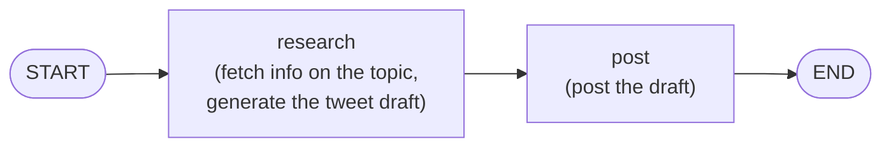
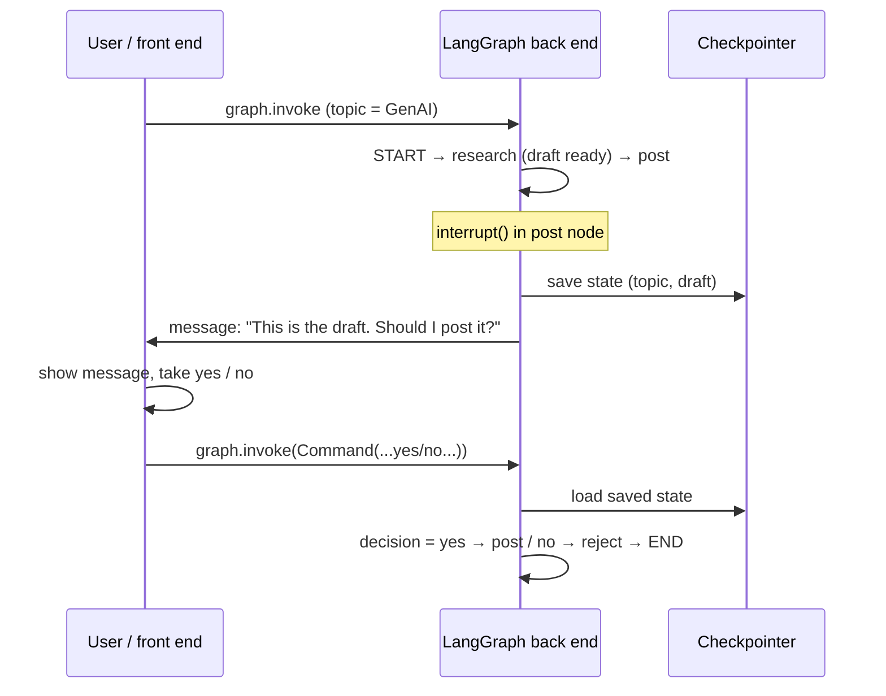
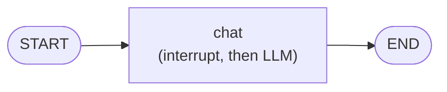

> **Video 21 of 28** · [Watch on YouTube](https://www.youtube.com/watch?v=xxqZzVZ4gE0) · Translated from the
> Hindi transcript. Notes follow the video section by section, in its order.

HITL, human in the loop, is a very common and important topic you will need in almost any agentic AI system you build, and LangGraph implements it with just two things: `interrupt` and `Command`.

## Plan for the video

1. **Theory**: what HITL is and why agentic AI systems need it.
2. **HITL from LangGraph's perspective**: a theoretical introduction to how LangGraph implements it.
3. **Two pieces of code**: one basic, one a bit more advanced.

## What HITL is

Agentic AI systems were built because we needed **autonomy**: some of our work getting done automatically, without our interference.

Take **customer support**. Companies like **Swiggy and Zomato** deal with thousands, lakhs, of customers every day, and many requests are very repetitive: "my order has not arrived", "this is missing from my order". AI agents handle such repetitive tasks easily, so you do not need to hire people for them. Wherever there is repetition, AI agents can replace humans. That is what agentic systems are for.

But in certain scenarios you cannot depend completely on agentic AI. Current LLMs, the brain of these systems, are not yet developed enough to handle every situation on their own. In those situations you bring a **human** in between and use their judgement to drive the system.

Example: **travel booking**. A chatbot does all the searching for you.

- "Show me flights from Delhi to Bombay." It shows them.
- "From these, pick out cheap flights between 6 and 9 in the morning." It shows those too.
- "Now book the tickets." Here, instead of leaving the whole control with the agentic system, you want control handed back to the human: "I have finalised this flight and want to make the payment. Should I go ahead?" Only when the human says so does it book the ticket.

You bring human judgement into the process at that point because you do not yet completely trust the LLM behind the system.

The definition shown on screen:

> HITL is a design approach in AI systems where a human actively participates at critical points of the AI workflow, either to supervise, approve, correct or guide the model's output. Think of HITL as putting a **human checkpoint** inside an AI pipeline so that important decisions are not made autonomously by the model.

Whatever kind of AI system you build today, there is a 99% chance you will have to implement HITL in it.

## Why HITL exists in agentic systems

There are two important reasons.

### Reason 1: to help agentic systems, which are not perfect

LLMs today are not perfect. They may **misinterpret** the user's goal, the user's query may have some **ambiguity**, or the LLM may **hallucinate**, and any of these can make the system's output wrong.

Example: the user says **"Book flight tickets for next Friday"**, and today is Monday. The query is ambiguous: it could mean the Friday coming this week, or the Friday of next week. The LLM can get confused and make a mistake. HITL comes in here: you ask the user back, "Sorry, there is an ambiguity in your query. Do you mean this week's Friday or next week's?"

So at such roadblocks, misinterpretation, ambiguity or hallucination, you do not take a chance. You bring in the human and use their judgement, because humans, at least today, are better than LLMs at handling these situations.

### Reason 2: accountability

This is the bigger reason. However powerful and intelligent AI systems become, one thing they cannot give you is **accountability**. For that you will always need a human. If something goes wrong you cannot put the blame on the AI; it loses nothing.

- **Gmail.** Suppose Google puts an AI system in Gmail that reads a mail, generates a reply and sends it. If it replies directly without asking the user, that is a bad idea, because the user can question Google: "You generated a reply yourself, sent it yourself, and look, this went wrong." Google understands this, so it brings the user in: once the reply is generated, the user is asked, "We have thought of this reply for this email. Should we send it?" The user gives their judgement, "this looks fine" or "make these changes", and only then is the mail sent.
- **Payments**, any kind of payment. Before paying you want confirmation from the person on whose behalf you are paying, because sometimes a wrong amount may get filled in and the agent makes the payment. Where financial decisions are involved the user experience can become very bad; an upset customer may go and give negative feedback about you to many people.

So HITL has two primary purposes: to **help agentic systems**, because they are not yet perfect, and to **bring accountability**, because you can blame a human but you cannot blame an AI system.

## Benefits of HITL

1. **Accuracy improves.** Wherever the LLM struggles, it takes a human's help, and human judgement improves accuracy. Example: you upload an **invoice** to a chatbot and say "Make this payment". While scanning the image it may misread the amount, say 1,200 as 12,000, and pay it, which would be a mess. If it first confirms, "I have extracted ₹12,000 from the invoice. Is that correct? Should I pay?", the human can say "No, that can't be right, it should be around a thousand", and the amount is corrected to 1,200. HITL reduces the chances of mistakes.
2. **Safety.** Example: you tell a chatbot, "Delete the files on my machine that I have not used in the last 30 days." Before deleting it asks: "I am going to delete all these files, but 10 of them belong to your current project. Should I delete those too?" Then you realise that although you have not touched them for 30 days, they are still needed for the current project. Bringing in the human increases safety.
3. **Ethical alignment.** Example: a customer angrily messages your customer executive, "My order has still not come." The executive generates a reply with an LLM, but the reply is not very emotional and shows little **empathy**. The executive can quickly tell the AI agent, "Your reply is correct and logical, but add a little empathy to it", which helps the customer calm down. The LLM may not understand this on its own. With a human in between, you can align agentic systems with your company's ethics policy or core customer values.

In short, HITL lets you give any AI app a **better user experience**. The more you use the synergy of human and AI, the better your output and your user experience.

## Common HITL patterns

There are three or four main categories where you see HITL in agentic AI systems.

1. **Action approval pattern.** The most common. Whenever the system is about to make a crucial decision or take an action, such as making a payment, sending an important email, or deleting files from a server, you bring in a human and ask whether it should be done. Yes, you do it; no, you stop.
2. **Output review or edit pattern.** Slightly less common. For example, a **research agent that publishes blogs** has two jobs: research and generate a draft, then post it. Or a **social media agent** researches content and then posts it. Once the draft is formed, a human reviews it: does it look right? If so you post it; if not you refine it.
3. **Ambiguity clarification pattern.** Also quite common. Whenever the agent has some confusion, it asks the human, as in "Book tickets for next Friday": this week's Friday or next week's?
4. **Escalation pattern.** The AI agent keeps doing its work, but at any moment, if it feels the matter has gone out of its hands, it **escalates** the problem to a human agent. This is very common in customer support. With a company like Swiggy, you talk to the chatbot for a while, and when it feels the case is not being handled by it, it asks, "Would you like to talk to a human executive?" If you say yes, the case is escalated.

## How LangGraph implements HITL: the theory

To understand the LangGraph side, take a small example: a **social media manager agent** that generates tweets for a company for Twitter, or X, and also **posts** them.

Suppose the company is **CampusX** and wants to grow on X. The agent has a website: you write a topic, say **"GenAI"**, and click **submit**. Two things happen: research on a tweet starts and a draft is prepared, and then the agent posts the tweet on its own.

Behind the scenes there are two parts, a **front end** and a **back end**, and the back end is built in LangGraph. It is a simple four-step workflow:



Here is how HITL works in this system, step by step.

**Step 1: the first invoke.** The user loads the website, gives the topic GenAI and clicks submit. On the click you want the LangGraph graph to run, so you call `graph.invoke`. This triggers `START` with the topic GenAI. Suppose the graph's state has an attribute `topic`, which now gets set, and an attribute `draft`, currently blank.

**Step 2: research.** The research node's code goes to different sources, fetches information about GenAI, and generates a tweet from it. Now `draft` also has a value.

**Step 3: post, with HITL.** The post node's job is to post the ready draft, but obviously not without the user's permission. So HITL is implemented in this node, using a function called **`interrupt`**. The pseudo code inside the post node:

```python
decision = interrupt(...)

if decision == "yes":
    post()
else:
    reject()   # don't post
```

When LangGraph's code reaches the `interrupt` function, it does these things:

1. **Pauses the execution.** The run was going top to bottom, from `START` to research to post, and next to `END`. It stops at post.
2. **Saves the current state**, the values of `topic` and `draft`, with the help of a **checkpointer**, into a `MemorySaver` or an SQLite database.
3. **Prepares a message**, for example: "I have prepared this draft. Does it look right? Should I post it?"
4. **Sends that message to the front end.**

Now control is with the front end, which:

1. receives the interrupt message;
2. shows it to the user: "We got this message from the back end. Look at it and answer yes or no";
3. takes the user's yes or no and sends it back to the back end by calling **`graph.invoke` again**, but this time passing a parameter called **`Command`**, which carries whether the user said yes or no.

When invoke is called this time, control returns to LangGraph, which **continues from exactly the point where it left off**, the post node. It goes to the checkpointer, loads the current state into memory, and now also has the user's yes or no, which is stored in `decision`. If yes, the tweet is posted; if no, it is rejected. Then the flow goes to `END` and the workflow finishes.



Conceptually, that is how HITL works in LangGraph. The whole game is two functions: **`interrupt`** and **`Command`**.

## Code 1: a simple approval workflow

The first example is very simple, even a "stupid" one, but it shows clearly how to implement HITL in LangGraph.

The workflow: the user asks an LLM a question, and the LLM generates a reply. One unnecessary complication is added: as soon as the user asks a question, you confirm back with them, "Do you really want to ask this question to the LLM?" Only if they say yes does the question go to the LLM; otherwise the flow exits saying the question cannot be asked. No real application needs this logic, but it makes HITL very easy to understand.

### The notebook

The code is in a Jupyter notebook. First the imports, `load_dotenv`, the LLM, and a chat state; these have all been discussed before.

```python
from typing import Annotated, TypedDict                   # (implied, not shown in narration)

from dotenv import load_dotenv
from langchain_core.messages import AIMessage, BaseMessage # (implied, not shown in narration)
from langchain_openai import ChatOpenAI
from langgraph.checkpoint.memory import InMemorySaver
from langgraph.graph import StateGraph, START, END
from langgraph.graph.message import add_messages
from langgraph.types import interrupt, Command

load_dotenv()

llm = ChatOpenAI()


class ChatState(TypedDict):
    messages: Annotated[list[BaseMessage], add_messages]
```

The most important part is the **chat node**, which is also the **HITL node**. It first calls `interrupt`, and inside the call it puts all the details the front end will need. This is the message from step 3 of the theory. It is a dictionary giving:

- the **type**: approval;
- the **reason**;
- the **question** the user asked;
- the **instruction**: ask the user whether they approve or not.

Whatever answer comes back from the front end is stored in `decision`. The front end is expected to pass a **dictionary** with a key called `approved`. If `approved` is `"no"`, the node simply returns an `AIMessage` with the content "Not approved". If the user approved, it invokes the LLM with the messages and returns the response.

```python
def chat_node(state: ChatState):
    decision = interrupt({
        "type": "approval",
        "reason": "Model is about to answer a user question.",   # (implied, not shown in narration: exact text)
        "question": state["messages"][-1].content,
        "instruction": "Approve this question? yes/no",         # (implied, not shown in narration: exact text)
    })

    if decision["approved"] == "no":
        return {"messages": [AIMessage(content="Not approved.")]}

    response = llm.invoke(state["messages"])
    return {"messages": [response]}
```

The rest is familiar. A `StateGraph` object with just **one** node, the chat node (it is not three nodes), and edges from `START` to chat and from chat to `END`: a simple linear workflow.

For HITL a **checkpointer is essential**, because the graph pauses and its state has to be saved somewhere. Here that is `InMemorySaver`. Then compile.

```python
builder = StateGraph(ChatState)
builder.add_node("chat", chat_node)

builder.add_edge(START, "chat")
builder.add_edge("chat", END)

checkpointer = InMemorySaver()
app = builder.compile(checkpointer=checkpointer)
```

The flow is `START` → chat → `END`.



### First invoke: the graph pauses

Now the front end's side. It invokes the graph for the first time. Since there is a checkpointer there has to be a **thread ID**. The initial state carries the user's question, **"Explain gradient descent in very simple terms."**

```python
config = {"configurable": {"thread_id": "1234"}}   # (implied, not shown in narration: the ID value)

initial_input = {
    "messages": [("user", "Explain gradient descent in very simple terms.")]
}

result = app.invoke(initial_input, config=config)
print(result)
```

Printing the result, the state, shows first the user message. The flow then reached the chat node, which contains `interrupt`, so the flow **broke right there**, and the result contains an **`__interrupt__`** key holding exactly the message put inside the `interrupt` call.

### Showing the message and taking the user's answer

Next, extract that interrupt message from the result, and on the front-end side show it to the user inside `input`, asking yes or no. The answer is stored in `user_input`.

```python
message = result["__interrupt__"][0].value
user_input = input(f"\nBackend message - {message}\nApprove this question? (yes/no): ")
```

The user sees exactly the back end's message: type approval, the reason, the question asked, and the instruction to approve or not. Suppose the user says **"no"**.

### Second invoke: resuming with `Command`

To send this back, invoke the graph again, this time passing **`Command`**, with a key **`resume`** whose value is a dictionary with the key **`approved`**. The key is `approved` because, up in the chat node, `decision["approved"]` is expected to hold the user's input. Send the same config, the same thread ID.

```python
final_result = app.invoke(
    Command(resume={"approved": user_input}),
    config=config,
)
```

The final result: the `AIMessage` says **"Not approved"**. The user did not approve.

Run it again. Again ask about gradient descent; the interrupt value comes back again and is shown to the user. This time the user says **"yes"**, so on invoking again the final result contains the LLM's whole answer.

That is the complete HITL flow in LangGraph, and it is very simple. The only difference: a normal LangGraph graph is invoked once, but with HITL you invoke **one additional time for every time human input is needed**, because the graph's execution is paused and saved in between, and invoking again with `Command` resumes it from that same point.

## Code 2: a stock-buying chatbot with a risky tool

Now a slightly harder, more meaningful example, so you can appreciate the concept more. It is a small, normal chatbot you can have ordinary conversations with, but it has access to two tools:

1. **`get_stock_price`**: an API you hit to bring the current stock price of any company;
2. **`purchase_stock`**: a **dummy** tool whose job is to buy shares of a given company. The user says "I want to buy this many shares of this company" and this tool does it. At this point it is a dummy; in a real chatbot you would integrate a payment gateway and so on so the whole operation runs smoothly.

First the user experience without HITL, then with HITL, then the code.

### Demo without HITL

- "Hi": it replies.
- "What is the stock price of Apple?": behind the scenes it uses the `get_stock_price` tool and says the current stock price is **$278**.
- "Purchase 10 stocks": using the second tool it buys them too: "Your purchase order of 10 shares of Apple has been successfully placed."

The problem: such important work is happening **without a human's permission**. The LLM could have misinterpreted something. Perhaps you were talking about different companies, suddenly said "Purchase 10 stocks", and it got confused and bought another company's shares. Accountability matters here. Ideally, before using the purchase tool, it should confirm: "I am going to buy this many shares of this particular company." This code does not do that.

### Demo with HITL

- "Hi": it replies.
- "What is the stock price of Apple?": same flow, $278 via `get_stock_price`.
- "Purchase 10 stocks": now an HITL message appears: **"Approve buying 10 shares of Apple (yes/no)"**. Answer **yes**, and it replies: "I have successfully placed a purchase order for 10 shares of Apple."
- "Now purchase 50 shares of Google": it asks again. Answer **no**, and it says the purchase has been declined.
- "exit": the flow ends.

With HITL in the picture, many things are stabilised: the system's **accountability** and **stability** increase. This is a real example where you can truly appreciate what HITL brings.

### The HITL code

The code builds on what you have already seen. Imports and the LLM first. Then the two tools. The first, `get_stock_price`, is exactly the tool from the old videos, copy-pasted.

The second, `purchase_stock`, is the dummy tool; no real purchase happens. Since this is where HITL sits, it first calls `interrupt` with the message "Approve buying this quantity of shares of this company", which goes to the front end, and whatever comes back is stored in `decision`.

The code differs a little from the first example: here the decision from the front end is expected to be a **string**. If `decision` is a string and its value is "yes", it replies with a dummy success message saying which company's shares and how many were bought. Otherwise, for example if "no" comes back, it returns a **cancelled** status with the further information.

```python
@tool
def purchase_stock(symbol: str, quantity: int) -> dict:
    """Simulate purchasing a given quantity of a stock symbol."""   # (implied, not shown in narration: exact wording)
    decision = interrupt(f"Approve buying {quantity} shares of {symbol} (yes/no)")

    if isinstance(decision, str) and decision.lower() == "yes":
        return {
            "status": "success",
            "message": f"Purchase order placed for {quantity} shares of {symbol}.",
            "symbol": symbol,
            "quantity": quantity,
        }
    return {
        "status": "cancelled",
        "message": f"Purchase of {quantity} shares of {symbol} was declined by human.",  # (implied, not shown in narration: exact text)
        "symbol": symbol,
        "quantity": quantity,
    }
```

Note that here the decision-making happens **inside the tool**, not inside a node.

The rest is familiar and nothing special: the tools bound to the LLM, the state, a simple chat node where the chatting happens, a tool node given the tools, `MemorySaver`, and the graph.

```python
tools = [get_stock_price, purchase_stock]
llm_with_tools = llm.bind_tools(tools)

# state, chat_node, ToolNode(tools), the memory checkpointer and the graph,
# exactly as in the earlier chatbot videos
```

### The command-line front end

There is no UI here; the main, front-end-style code runs in the command prompt, through the CLI.

- Define a thread ID.
- A `while` loop, so you can keep chatting.
- Ask the user for a message and invoke the chatbot with it.
- After invoke, get the value of the interrupt and check whether it is **not empty**. If it is not empty, the risky tool, the purchase tool, was triggered.
- Extract the message and show it to the user, who gives their decision, yes or no.
- Invoke the chatbot again with `Command`. This time `resume` gets not a dictionary but simply the **string**, yes or no. That goes up to the tool, and the tool does its work.
- Keep showing the messages to the user.

```python
thread_id = "demo-thread"   # (implied, not shown in narration: the ID value)

while True:
    user_input = input("You: ")
    if user_input.lower().strip() == "exit":   # (implied, not shown in narration: exact exit check)
        break

    state = {"messages": [HumanMessage(content=user_input)]}   # (implied, not shown in narration)
    config = {"configurable": {"thread_id": thread_id}}

    result = chatbot.invoke(state, config=config)

    interrupts = result.get("__interrupt__", [])
    if interrupts:
        prompt_to_human = interrupts[0].value
        print(f"HITL: {prompt_to_human}")
        decision = input("Your decision: ").strip().lower()

        result = chatbot.invoke(Command(resume=decision), config=config)

    last_msg = result["messages"][-1]
    print(f"Bot: {last_msg.content}\n")
```

It is exactly the same flow as the first example, implemented more meaningfully in a chatbot. The code is in the description; it is very basic and you could write it yourself, and if you want you can add a GUI to it with Streamlit.

## Closing

HITL is a very important concept, but its implementation in LangGraph is very intuitive and simple, so you will be able to use it easily in future projects.
