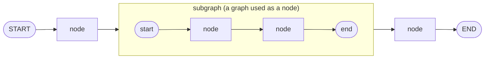
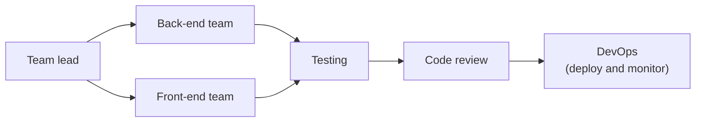
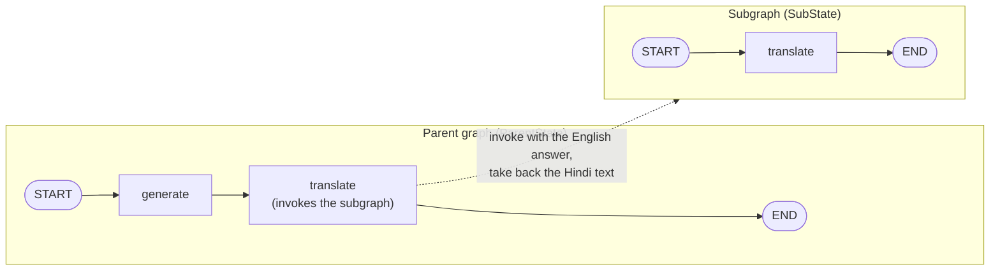
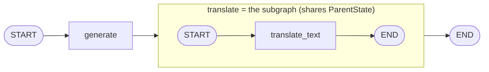

> **Video 22 of 28** · [Watch on YouTube](https://www.youtube.com/watch?v=wcHcocpAoX4) · Translated from the
> Hindi transcript. Notes follow the video section by section, in its order.

Subgraphs are an important topic in their own right, and they become a very important concept once you start building multi-agent systems.

## Plan for the video

1. **Theory**: what subgraphs are.
2. **The need**: why subgraphs become important in AI workflows.
3. **Practical code examples**: how to implement subgraphs in LangGraph.

## What a subgraph is

So far you have learned to build graphs in LangGraph: any AI workflow can be represented as a graph, and the graph's **nodes** generally represent **tasks**, such as calling an LLM, doing retrieval from a vector database, or calling a tool. Each such task is a node.

Now, what if you **replace one of those nodes with a graph itself**? There is a graph with a node inside it, and that node is replaced with another graph. The inner graph, since it is part of a bigger graph, is called a **subgraph**. That is the whole concept.

On the whole the diagram is one graph, but some of its nodes are themselves graphs, and those inner graphs are the subgraphs.



The definition shown on screen:

> A subgraph in LangGraph usually means a graph that is **embedded and executed as a node inside another graph**.

## Why subgraphs are needed

When you built your first GenAI application, its flow was probably very simple: a user's query goes to an LLM, and the LLM returns an output. Over time, as you learned more concepts, you realised GenAI systems can be very complex, with many kinds of modules. Your chatbot may need **tools**; you may want a **RAG**-based chatbot; depending on the logic you may need **conditional routing**; if something is not achieved in one go you may need **retry**; there can be **memory**, **HITL**, **evaluation**, **guardrails**. A proper real-world GenAI application can be a big application with a lot going on.

### Example: a software developer agent

Suppose you want to build a **software developer agent** for your company, whose job is to build software. Look at how software development works:

1. A **team lead** gets a website or some software developed by the developers.
2. There may be two software teams, a **back-end team** and a **front-end team**, who develop the software together.
3. Once both have done their work, the software is **tested**.
4. Then the whole code is **reviewed**.
5. Then it goes to the **DevOps team**, which **deploys and monitors** it.



To build a proper software development agent you have to implement this whole flow. Think how complex the LangGraph graph for such an agent would become: each part may have its own tools, its own retry logic, its own memory; you may need HITL; you may need separate guardrails in each module. It can become very complex.

You can make it easier by **dividing the big agent into multiple small agents**:

- the team lead becomes a **planning agent**;
- the back-end and front-end teams become two **coding agents**;
- a **testing agent**;
- a **code review agent**;
- a **DevOps agent**.

The big agent has been converted into small agents: a **multi-agent architecture**. The fun part is that **each agent can be represented by a subgraph**. The coding agent's subgraph runs its own graph inside: its logic for code development is implemented inside it, with its own tools, its own memory, its own evaluation logic and its own guardrails. Similarly the whole logic of the testing agent is contained in its subgraph. The big job is broken down, and you achieve it by breaking it down.

That is why subgraphs are needed: GenAI applications can get complex, and to handle that complexity you break the work down into simpler tasks.

### The three conceptual benefits

1. **Modularity.** Anywhere in software you are told your code should be modular, and the same applies here. It is like breaking your entire code base into functions.
2. **Reusability.** The coding agent you implemented for the back-end team can be reused for the front-end team, because essentially both are only coding, just on a different set of files.
3. **Maintainability.** Debugging becomes easy: when something goes wrong, you pick up exactly that graph and debug it.

These are the three biggest things you achieve by implementing subgraphs in an agentic or GenAI workflow, and why, whenever you build multi-agent architectures in future, you will use subgraphs.

### The three LangGraph-specific benefits

1. **Failure isolation.** LangGraph is designed so that if one particular subgraph fails, or some problem occurs in it, the rest of the graph still executes completely and comfortably, with some warnings obviously. One subgraph going down does not bring the whole graph down. Without subgraphs, one node's failure can start causing problems in the rest of the graph.
2. **State separation.** In LangGraph every graph has its own **state**, basically the data about the graph. If you build the whole software development agent as a single graph, you have **only one state** for that whole big architecture, and every component (coding, testing, DevOps) interacts with that same state, which is not a good thing. With subgraphs you can define a separate state for each agent: the coding agent has its own state, the testing agent its own, the code reviewer its own, so the states do not get mixed up.
3. **Observability.** Earlier you saw how a tool like LangSmith can be integrated with LangGraph to study how your whole workflow performs. In a complex software development agent you may specifically want to know how the **coding agent** is doing: how many tokens it consumes, what its average latency is. LangGraph lets you go to a granular level and **trace subgraphs separately**: the coding agent, the testing agent, the code reviewer agent, each on its own. This is one of the major benefits of LangGraph.

## Two ways to add a subgraph in LangGraph

Before the code, one important point: you can build subgraphs in LangGraph in **two different ways**. The LangGraph documentation says:

> When adding subgraphs, you need to define how the parent graph and the subgraph communicate.

**1. Invoke a graph from a node.** "Subgraphs are called from inside a node in the parent graph." You have a parent graph and want to insert a subgraph at some point. You build the subgraph separately, and then **invoke it from inside a node** of the parent. There is no direct connection between the two graphs: you build them independently, and the parent's node contains the code that invokes the subgraph.

**2. Add a graph as a node.** "A subgraph is added directly as a node in the parent and shares state keys with the parent." This is what was described so far: rather than having a node at that point, you put the subgraph **in place of** the node.

The biggest difference between them:

| Invoke a graph from a node | Add a graph as a node |
| --- | --- |
| The parent graph and the subgraph can have their own **separate states**. | The two have a **shared state**: the subgraph works with the parent's own state keys. |

Both mechanisms are shown one by one, solving the same use case first with the first and then with the second, so you get the flavour of both.

## The use case: answer in English, show it in Hindi

A user asks a question. The question goes to an LLM, which generates an answer, in **English**. But you want to show the user the answer in **Hindi**, so the generated English answer is sent to a **second LLM**, which does the translation and returns the Hindi answer as output. A very simple workflow.

## Mechanism 1: invoking the subgraph from a node (separate states)

Here you develop **two separate graphs**, and **state is not shared** between them.

- The **parent graph**: `START` → **generate** (generates the answer) → **translate** (translates the answer) → `END`.
- A second, **independent** graph, the **subgraph**, which only does translation: `START` → **translate** → `END`.

In the parent graph's translate node you write no translation code, just one line that **invokes the subgraph**. Each graph has its own state: state one for the parent, state two for the subgraph.



### The code

Import the libraries and call `load_dotenv`.

```python
from typing import TypedDict

from dotenv import load_dotenv
from langchain_openai import ChatOpenAI
from langgraph.graph import StateGraph, START, END

load_dotenv()
```

**Build the subgraph first.** Think about what it needs as input and what it gives as output: in goes an English text, or answer; out comes the text translated into Hindi. So its state, called `SubState`, has two keys: `input_text`, the English answer it receives, and `translated_text`, the Hindi translation it generates.

```python
class SubState(TypedDict):
    input_text: str
    translated_text: str
```

Choose an LLM for the subgraph, a `ChatOpenAI` one. The subgraph has only one node, so define that node. It has a simple prompt: you will be given a text, translate it into Hindi, keep it natural and clear, and do not add any extra content. It invokes the subgraph LLM with the prompt and puts the Hindi translation into the state.

```python
subgraph_llm = ChatOpenAI(model="gpt-4o-mini")   # (implied, not shown in narration: model name)

def translate_text(state: SubState):
    prompt = f"""
Translate the following text to Hindi.
Keep it natural and clear. Do not add extra content.

Text:
{state["input_text"]}
""".strip()   # (implied, not shown in narration: exact prompt wording)

    translated_text = subgraph_llm.invoke(prompt).content
    return {"translated_text": translated_text}
```

Build the subgraph with its single node and its edges, `START` to the translate node and from there to `END`, then compile it.

```python
subgraph_builder = StateGraph(SubState)
subgraph_builder.add_node("translate_text", translate_text)

subgraph_builder.add_edge(START, "translate_text")
subgraph_builder.add_edge("translate_text", END)

subgraph = subgraph_builder.compile()
```

The subgraph is now ready.

**Now the parent graph.** It also has a state, called `ParentState`, with three things, all strings: the **question**, the **English answer**, and the **Hindi answer**. Then the parent LLM.

```python
class ParentState(TypedDict):   # key names as described (exact spelling not read out)
    question: str
    answer_eng: str
    answer_hin: str

parent_llm = ChatOpenAI(model="gpt-4o")   # (implied, not shown in narration: model name)
```

Two nodes are needed: **generate** and **translate**. The generate node is very simple: `parent_llm.invoke` with "You are a helpful assistant. Answer this question", and the answer is saved in the state as the English answer.

```python
def generate_answer(state: ParentState):
    answer = parent_llm.invoke(
        f"You are a helpful assistant. Answer clearly.\n\nQuestion: {state['question']}"   # (implied, not shown in narration: exact prompt wording)
    ).content
    return {"answer_eng": answer}
```

The translate node is where the main thing happens, and it does nothing itself: it simply **invokes the subgraph**, sending the English answer. The subgraph sends back its **whole final state**, which contains both the English answer and the Hindi answer. You only care about the Hindi answer, so you extract it and put it in the parent state's Hindi-answer key.

```python
def translate_answer(state: ParentState):
    result = subgraph.invoke({"input_text": state["answer_eng"]})
    return {"answer_hin": result["translated_text"]}
```

Build the parent graph, **two nodes and three edges**, and compile it.

```python
parent_builder = StateGraph(ParentState)

parent_builder.add_node("generate", generate_answer)
parent_builder.add_node("translate", translate_answer)

parent_builder.add_edge(START, "generate")
parent_builder.add_edge("generate", "translate")
parent_builder.add_edge("translate", END)

graph = parent_builder.compile()
```

Invoke the parent graph with a question. The final state shows the **question**, the **English answer** and the **Hindi answer**.

```python
graph.invoke({"question": "..."})   # (implied, not shown in narration: the question used)
```

That is how a subgraph is implemented in LangGraph with the first mechanism, where the **states are isolated**: both graphs had their own states.

## Mechanism 2: adding the subgraph as a node (shared state)

The same example, now with a **shared state** used by both graphs.

Imports and `load_dotenv` first. The interesting thing: you **do not define two separate states**. The states are shared, so there is a single state, the parent's, with the same three keys: question, English answer, Hindi answer.

```python
from typing import TypedDict

from dotenv import load_dotenv
from langchain_openai import ChatOpenAI
from langgraph.graph import StateGraph, START, END

load_dotenv()


class ParentState(TypedDict):
    question: str
    answer_eng: str
    answer_hin: str
```

Then two separate LLMs, one for the parent and one for the subgraph.

```python
parent_llm = ChatOpenAI(model="gpt-4o")         # (implied, not shown in narration: model name)
subgraph_llm = ChatOpenAI(model="gpt-4o-mini")  # (implied, not shown in narration: model name)
```

**Design the subgraph**, the inner graph, first. It still has a single node, translate text, and the code to build it is exactly the same as before, except that it now works on the parent's keys.

```python
def translate_text(state: ParentState):
    prompt = f"""
Translate the following text to Hindi.
Keep it natural and clear. Do not add extra content.

Text:
{state["answer_eng"]}
""".strip()   # (implied, not shown in narration: exact prompt wording)

    translated_text = subgraph_llm.invoke(prompt).content
    return {"answer_hin": translated_text}

subgraph_builder = StateGraph(ParentState)
subgraph_builder.add_node("translate_text", translate_text)
subgraph_builder.add_edge(START, "translate_text")
subgraph_builder.add_edge("translate_text", END)

subgraph = subgraph_builder.compile()
```

**Build the parent graph.** Notice that this time you do **not** build two nodes, only one: **generate**. The translate node now comes through the subgraph. The generate node has exactly the same logic as in the previous code.

```python
def generate_answer(state: ParentState):
    answer = parent_llm.invoke(
        f"You are a helpful assistant. Answer clearly.\n\nQuestion: {state['question']}"   # (implied, not shown in narration: exact prompt wording)
    ).content
    return {"answer_eng": answer}
```

The real change is in building the parent graph: the first node is the generate-answer function, but the second node is **the subgraph itself**. This is the biggest change: instead of a node, you use a **subgraph as a node**. Then define the edges and compile.

```python
parent_builder = StateGraph(ParentState)

parent_builder.add_node("generate", generate_answer)
parent_builder.add_node("translate", subgraph)   # the compiled subgraph, added as a node

parent_builder.add_edge(START, "generate")
parent_builder.add_edge("generate", "translate")
parent_builder.add_edge("translate", END)

graph = parent_builder.compile()
```



Invoking the graph gives the same answer, but by a completely different mechanism.

Those are the two main mechanisms for implementing subgraphs in LangGraph.

## Closing: read the official documentation

One suggestion: study LangGraph's **official documentation on subgraphs**. It mostly covers what was shown here, with one or two additional things:

- **Adding persistence to subgraphs.** The idea is simple: you only give the **checkpointer to the parent graph**, and LangGraph automatically checkpoints the child subgraph too. The documentation has a code example.
- **Streaming** the subgraph's output; the code is in the documentation.
- **Viewing the subgraph's state**; that code is there too.

Studying these on your own gives additional perspective, but the main idea has been covered, and on its basis you will be able to build multi-agent systems going forward.
