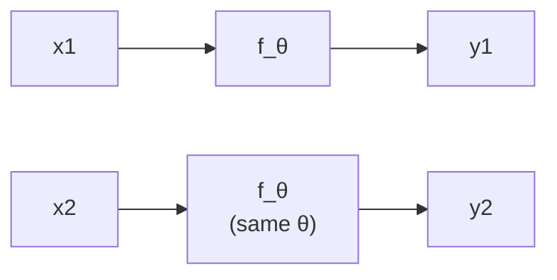
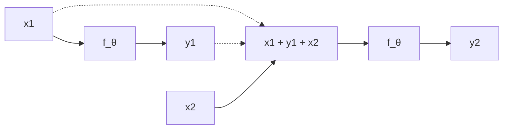
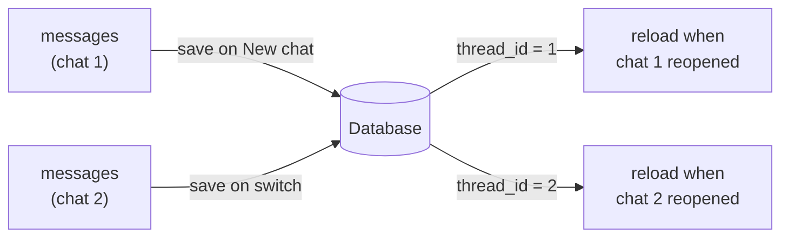
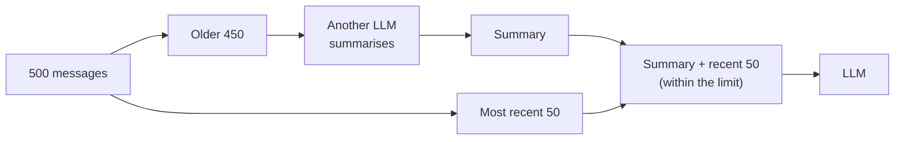
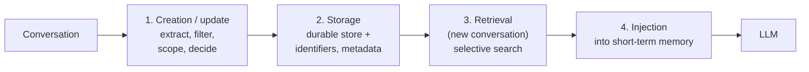

> **Video 23 of 28** · [Watch on YouTube](https://www.youtube.com/watch?v=DcPKJrOF9Wo) · Translated from the
> Hindi transcript. Notes follow the video section by section, in its order.

No chatbot or agent can function without memory, and LLMs have none of their own; this video invents memory from first principles, as a framework-agnostic concept, until it reaches where today's GenAI systems already are.

## Why memory, and how this video teaches it

Memory is one of those things without which no GenAI application can work. Whether you are building a chatbot or an agent, it cannot function without memory, which makes the topic worth studying in its own right.

Two things about the approach:

- **Framework-agnostic.** No single library is used to teach the concept. The aim is a general understanding you can then implement in any GenAI application.
- **First principles, as if inventing it.** The video starts from a basic problem statement and builds solutions around it, step by step, until it arrives at what current GenAI systems do. It should feel like listening to a story, but leave you with a deep concept.

## An LLM at inference is a parameterised maths function

The starting statement:

> An LLM at inference is just a parameterised math function: y = f_θ(x).

**What a parameterised function is.** In mathematics, a parameterised function is one whose output depends not only on its input but also on some parameters. In y = ax², you need both x and a to calculate y. The user provides x, but a comes from somewhere else.

Where from? Take **linear regression**. You have data and your job is to find the best-fit line. Since it is a line, you know in advance its equation is y = mx + b. Here m and b are the **parameters**, and their values come from the data: the data tells you what the slope m and the intercept b of the best-fit line should be. So in machine learning, parameter values come from data, when you train on it. You can write the same equation as y = f(x; m, b), which is the same shape as y = f_θ(x).

An LLM is also a machine learning model (a deep learning model), so the setup is identical. Behind f hides a very complex mathematical function whose details you do not need. θ represents **billions of parameters** and their values; where linear regression has two, an LLM has billions, which is why models are described as "70-billion-parameter" or "100-billion-parameter" models.

The three components:

- **θ**: the values of the parameters, billions of them.
- **x**: the **input tokens** you send to the LLM at inference. At this point you can simply call it the prompt.
- **y**: the **output tokens**, produced from the combination of the input and θ.

y depends on both θ and x, but **θ is fixed**. It was decided at training time and you cannot change it at inference, so the user has no control over it. The user can change **x**, and that is why a different prompt gives a different output. This simple mathematical overview is the foundation for the rest of the discussion.

## The function is stateless

The interesting property of this function is that it is **stateless**:

> A system is stateless if its output depends only on the current input and not on anything that has happened before.

Send prompt x1: with θ it produces y1. Send a second prompt x2: θ is the same, and you get y2. Being stateless means only x2 had a hand in calculating y2. x1 and y1 had none.



This can be shown in code with OpenAI's LLM. Invoke it with "My name is Nitish" (x1); its parameters and this input give y1. Then invoke the same function with "What is my name?" (x2), parameters unchanged:

```python
from langchain_openai import ChatOpenAI  # (implied, not shown in narration)

llm = ChatOpenAI()  # (implied, not shown in narration)

result = llm.invoke("My name is Nitish")
print(result.content)

result = llm.invoke("What is my name?")
print(result.content)
```

The second reply:

```text
I'm sorry, I do not know your name.
```

This proves the LLM is stateless. It does not remember what input it was given last time or what it replied. Every call is unique and independent, unrelated to the previous one. That is the realisation to absorb here: an LLM at inference is **stateless by nature**.

## No intrinsic memory, yet every app needs memory

From this you can establish facts.

**Fact 1.** If LLMs are stateless at inference, then LLMs have **no intrinsic memory**. They cannot remember past conversations.

**Fact 2.** There is hardly any GenAI application in the world that does not need memory. A chatbot without memory cannot remember past conversation or context, so the user has to repeat everything every time, which would be highly frustrating. Building a chat application without memory is not possible: every time the user sends a message, the backend calls this function with the user's message as x and gets back y. When the next message arrives, the function is called again without considering the past conversation, so the chatbot treats every question as brand new. Any GenAI or agentic AI application needs memory.

So you are in a **deadlock**.

**Fact 3.** If LLMs have no memory of their own but you need memory, you have to **develop the memory feature externally**: keep the LLM at the centre and build a system around it that acts like memory.

That is the rest of the video: inventing, from first principles, a system that gives LLMs the power of memory. So far the discussion was about "why"; now it moves to "what" and "how". Before the solution, you need two concepts.

## Concept 1: the context window

x represents the input tokens you send during prediction. Is there a maximum number? There is, and it is called the **context window**. Every LLM has one:

> The context window is the amount of text an LLM can read and remember at one time before answering.

The analogy is a **camera**. The camera is the LLM and its **lens** is the context window. A small lens captures a small part of the scene in front of it; a very big lens captures a much bigger portion. The bigger the context window, the more text the LLM can process before answering.

Modern LLMs have context windows of **128K tokens** or more, and some, such as the Gemini models, have **1 million tokens**. A 128K-token window means you can upload roughly a 200-page PDF.

The reason for teaching this now: you can send **a lot of tokens** inside x. That is a very important power that will help build memory.

## Concept 2: in-context learning

When you train an LLM, you give it huge amounts of data, basically the whole internet. During training it finds patterns, gathers knowledge, and that knowledge is stored in its parameters. That is why it is called **parametric knowledge**. At inference, your prompt goes and searches this parametric knowledge; if the answer is there, it is returned.

As LLMs grew in size, training and data, people observed an **emergent phenomenon**: LLMs do not only use parametric knowledge; they can also use details hidden **inside the prompt** to answer. For example, take a 100-page PDF of your company's private data, which the LLM has never seen. Put the whole PDF in the prompt, ask a question from it, and send it. The answer is not in its parametric knowledge, but the LLM can read the 100 pages and answer. This is **in-context learning**:

> In-context learning is an emergent ability that allows an LLM to use information and patterns present in the prompt itself, in addition to its trained parametric knowledge, to generate an answer.

The default mode is to search parametric knowledge, but the LLM can also use knowledge hidden in the prompt.

## The first-principles solution: send the whole conversation

Using both concepts, you can build a system that works as memory for the LLM. The plan is very simple: every time you invoke the LLM, **concatenate the entire conversation so far into x** and send it.

In a chat where the LLM is invoked twice: for the user's first message there is no earlier chat, so send x1 directly and get y1. When the user asks x2, do not compute y2 = f_θ(x2). Instead compute:

> y2 = f_θ(concatenation of x1, y1, x2)



How the two concepts apply:

- **Context window.** It is large, so sending x1, y1 and x2 is no problem.
- **In-context learning.** If the answer to x2 is not in its parametric knowledge, the LLM can read x1 and y1 to answer it. Its parametric knowledge obviously does not contain the user's name, but x1 and y1 are in the context, so it reads that the user said his name is Nitish and replies "Your name is Nitish".

This is the simple, elegant solution. You are not asking the LLM to remember anything; you are providing **continuity in its context window** by passing the whole conversation at every point.

## Demo: a `messages` list

The same code, now with a variable called `messages`, a list holding x1:

```python
messages = ["My name is Nitish"]

result = llm.invoke(messages)
print(result.content)
```

```text
Nice to meet you, Nitish
```

Append the LLM's output (y1) back into `messages`, so the list holds x1 and y1. Then the user asks x2, so append it too; the list now holds the concatenation x1, y1, x2:

```python
messages.append(result)
messages.append("What is my name?")

result = llm.invoke(messages)
print(result.content)
```

```text
Your name is Nitish
```

Exactly what was discussed in theory is now in code. You carry a `messages` variable along and keep appending every new message to it. In a way, `messages` is working as the **state** of the system: the system was stateless, but because of this variable it has become **stateful**. In many places this variable is called the **conversation buffer**, because the whole conversation history is loaded into it dynamically. It is not memory, but it works like memory.

And if you restart the file, the LLM again refuses to recognise you, because `messages` no longer holds those messages. This memory is **temporary**, which is why, in the context of LLMs, it is called **short-term memory**.

## How chatbots implement short-term memory

Take any chatbot, ChatGPT or Gemini. They have the concept of a **conversation**: one session with the chatbot. You open ChatGPT, talk about one topic, and close it; that is one conversation. The next day you open it, talk about something else, and close it; that is a second conversation. The sidebar lists all of them.

The rule is that **each conversation gets its own short-term memory**. Short-term memory is **conversation-scoped** and does not exist outside a conversation. With one conversation open, only its chats are concatenated into `messages`. When you close it and start another, `messages` is first emptied, then filled with the new conversation's messages.

Why not keep one short-term memory for the whole chatbot? Suppose you have 1000 conversations with ChatGPT held in a single `messages` variable. It would be far too long, and incoherent too; the LLM could not answer properly after seeing something that big. So you create a **logical boundary**: one conversation is one boundary, and short-term memory lives inside it, so you know what is going on in this conversation and have nothing to do with the others.

Terminology: in many places a conversation is called a **thread**. Thread equals conversation, which is why you will read that **short-term memory is thread-scoped**: its scope is a single thread and it does not exist outside it.

So short-term memory is just a conversation buffer, implemented within a conversation.

## Problem 1: short-term memory is fragile

Fragile means it breaks easily. Short-term memory in code is a `messages` variable holding the whole history. If the code resets or the server crashes, everything in it is wiped out, and so is the whole conversation context.

A scenario: you are chatting with ChatGPT and every new message is added to `messages`. You decide to start a new conversation and click **New chat**. The window goes blank and the previous conversation's messages are removed from `messages`. In the new chat you exchange messages, stored again in `messages`. Then you remember you needed something from the previous chat and click on it. What is displayed? **Nothing**, because the previous conversation was never stored anywhere. Any new message you send in the old conversation is treated as completely new; the old information was not retained.

**Solution: persistence.** Connect a **database** to short-term memory. Before moving to a new chat, store what is in `messages` in the database against a **thread ID**, say thread ID 1. In the new chat, `messages` fills up again. Before going back to the previous chat, store the new chat's messages against a new thread ID, say thread ID 2. When you return to the old conversation, first load the messages stored against its thread ID back into place. The chat and its context are not lost, and the next question is answered in continuity, with the previous context understood.



This whole thing has already been built and shown in the LangGraph playlist.

## Problem 2: the context window

The context window is the maximum number of tokens an LLM can process while generating an answer. Imagine a very long conversation: lots of messages, big responses from the LLM, new questions from you. Every new message is sent with the entire old history attached, so the `messages` list keeps growing. Eventually, when it is tokenised, its size **exceeds the context window**. Then the LLM stops understanding things: it may give incoherent replies or start hallucinating. That is the context window problem with STM (short-term memory): a long-running chat whose accumulated history, sent again and again, has become too big.

There are multiple solutions. One widely used approach merges two techniques:

1. **Trimming.** Send only the most recent n messages. Rather than the entire conversation of, say, 500 messages, send the last 50, because the most recent context is there and going back through the old 500 does not help. (The slide shows only the two most recent messages kept and the rest removed.) The problem is that by removing earlier messages you may miss an important point or context.
2. **Summarisation.** To improve on this, send the messages you are removing to another LLM and generate a **summary**, for example "Discussed project X, task Y, deadline Z and feature W". Then send the 50 most recent messages with the summary attached on top.

The summary is obviously much smaller than 450 messages, so the recent 50 messages plus the summary of all 500 come within the token limit, and the LLM gives coherent responses again. This is the most widely accepted solution.



## Problem 3: short-term memory is thread-scoped

This is the third and most critical problem. Each thread has its own short-term memory; switch conversations and it disappears, then moulds itself to the new conversation. In itself that is a feature, the reason short-term memory lets you continue conversations. But being thread-scoped also has a negative impact, in three ways.

**1. No user continuity between conversations.** Suppose you are a programmer who prefers Python over any other language. In one conversation you study an algorithm and the LLM writes all the code in Java. You tell it explicitly that you do not know Java and want Python, and for the rest of that conversation it writes Python. Two days later you start a new conversation on a different programming topic, and it shows JavaScript, Java or C++ again. It has forgotten you know only Python. Since short-term memory remembers only what is inside one conversation, by definition it cannot remember **user preferences** or personalise things for you.

**2. Learning never compounds over time.** Whatever effort you put in with the LLM has to be repeated from scratch in every new conversation. For example, you ask for help with SQL: extract the top five customers from a table. It writes a difficult subquery that works but is not optimised. You ask for an optimised query using a **window function** instead of a subquery, and it gives you one. You have put in real effort, sitting with it and applying your brain. Two days later, on another dataset or table, it writes a subquery again. It never adapts to you; its learning does not evolve with you, and you have to hold its hand and teach it from the start each time.

**3. Cross-thread reasoning is impossible.** You can never ask "What did we talk about yesterday?" or "The last time we got stuck on this kind of problem, what was the solution?" That conversation happened in the past, you are now in a different one, and short-term memory has forgotten it.

The basic idea: every time you start a new conversation, you become a **stranger** to the LLM again. It cannot personalise for you, because all its memory is locked inside a boundary, thread-scoped and conversation-scoped.

Now think about building a **personal assistant** for your users. Its biggest quality is that it understands its user inside and out, knows every nuance, and evolves with them. That is impossible with short-term memory by definition, because preferences do not come from one conversation. From one conversation the LLM learns you like Python; from another that you are a software developer; from another that you like simple explanations; from another that you like to travel. Small things from different conversations build a **personalised profile** of the user. Since STM is locked inside a single conversation, that personalisation is not possible. This is the biggest drawback of short-term memory.

## The solution: a completely new type of memory

Short-term memory cannot solve this. You need a completely new memory with **two properties**.

**Property 1: it stores a special type of information for a long time.** Special means information that survives a single conversation: its relevance extends beyond one conversation or session, possibly for many days. You may introduce it in one conversation today, but it stays relevant for days. For example, if you are writing a book, you will talk to the chatbot many times while writing it, and the information stays relevant until the book is finished, which could be months. The memory must be able to identify and store this kind of information. What kind?

- **Who the user is.** If Nitish is the user: male, Indian, a YouTuber, a teacher, teaches AI. Things needed across multiple days.
- **How the system** (the chatbot, the assistant) **should behave** for this user.
- **What works and what fails** for this user.
- **What happened in the past**: what decisions were taken, what work was done, what the output was, what processes were implemented.

**Property 2: it is very, very selective.** You do not blindly store entire chats. From every conversation you extract only the most important, useful pieces of information: things that are **stable, useful and reusable** over a long period. Everything else is ignored.

A memory with these two properties is called **long-term memory** in LLM terms. Short-term memory existed inside a single conversation and was destroyed when the conversation went away; this memory exists outside the conversation for a long period, hence "long-term". The rest of the video is about it.

## The three types of long-term memory

There are precisely three types of things you store in long-term memory.

### Episodic memory

Episodic memory tells you **what happened in the past**, and knowing that improves the current conversation. Examples:

- In the last session the user rejected a particular solution.
- The credentials put into the deployment you triggered were wrong.
- In the previous session this solution worked and that one did not.

The benefit is that in the current conversation your agent can answer questions such as "What did we do last time?", "What method did we use last time?", "Has this happened before?", "Have we already used this technique?", so it acts a little better.

### Semantic memory

The **most common and most important** type. It is made of **facts about the user and the system** (and the task). Examples:

- The user prefers Python.
- The user is a beginner in software.
- The system in use runs PostgreSQL.
- The ticket booking in progress has a budget constraint of ₹10,000.

In simple terms, you store what is true about the system and the user. It is user-level or system-level long-term memory.

### Procedural memory

Procedural memory tells you **how to do things**. You store strategies, rules and learnt behaviours. Examples:

- This user wants to avoid subqueries when solving SQL problems (the example from earlier).
- If tool X fails, always try tool Y.
- Always explain things step by step to this user.
- The preferred workflow for task Z is some particular workflow.

It exists to tell your LLM **which way of doing the work is right**. It compounds over time, and it is the memory that makes an agent feel better to you over time: you grow comfortable with it, and it moulds itself to you.

In short: **episodic** memory tells you about past events, **semantic** memory about facts, and **procedural** memory how to do things for a particular user and system.

## How long-term memory works: four steps

At a very high level, the system built around long-term memory works in four steps: **creation**, **storage**, **retrieval** and **injection**.



### Step 1: creation (or update)

A user is interacting with your chatbot in a conversation. As the system architect or planner, you have to understand which pieces of this conversation can become part of long-term memory. The goal is to find out **whether anything that has just happened is worth remembering beyond this conversation**, anything between the AI and the human that should survive outside it.

You look at the user's messages, the model's responses, and, if you have built a tool-based system such as an agent, the tools' outputs. Then you do four things:

1. **Extract memory candidates** from the messages exchanged. If the user says "I prefer Python over Java" while chatting, that is a memory candidate.
2. **Filter out noise.** A message contains a lot else; extract the core fact or core information and remove the noise.
3. **Decide the scope**: is this memory at the user level, the app level or the agent level? You have to do this tagging.
4. **Decide** whether to create a new memory, update an existing memory, or ignore it.

### Step 2: storage

Once you have decided a piece of information belongs in long-term memory and processed it, you have to store it, because you need to reuse it later and cannot lose it. Storage is a kind of store where long-term memory lives, and it does two things:

1. Save the memory from step 1 in a **durable store**.
2. Tag it with **identifiers and metadata**, so it is easy to retrieve later.

The purpose is that the memory survives any restarts or crashes. Which store you use depends on what you are storing: a relational database, a key-value store, a log (basically a text file), or a vector database for semantic search. The options differ for episodic, procedural and semantic memory.

### Step 3: retrieval

The user starts a new chat. As they chat, before replying, the model asks whether it needs any memory to answer this particular question. The whole focus is: **given the current situation, what should I remember right now?**

1. Look at the current user input.
2. Decide whether memory is needed.
3. If it is, search the memory store.
4. Bring back a **small, relevant subset** of the memory, not everything in the store.

The point to remember: **retrieval is selective, not exhaustive**. Unlike short-term memory, you do not bring everything; you do a selective search.

### Step 4: injection

Always remember: **long-term memory never interacts directly with the LLM**. You search long-term memory, get relevant information, pull it into **short-term memory**, and from there it becomes part of the context window and reaches the LLM. Long-term memory first becomes part of the short-term memory, the conversation buffer. The system adds these extra things to the prompt the user wrote, and the whole thing is sent to the model. It becomes part of the prompt, and the model sees it as just more input tokens.

There are many nuances and challenging details in this. This is a very high-level, framework-agnostic overview; different libraries implement it differently, but broadly this is how long-term memory works.

## The challenges of building it

Building this whole workflow is challenging. The key challenges:

1. **Memory creation.** Figuring out what to turn into memory and what not to is very difficult. Users chat normally, with a lot of noise, and deciding whether what is being said should be part of long-term memory, whether it will stay relevant, is very hard.
2. **Retrieval in real time.** Even with memories created and stored properly, working out during a live conversation which things to pull from the whole long-term memory so that they help the current conversation is very challenging.
3. **Orchestrating the entire system.** You are already building a complex system (an agentic AI system, an agent, a chatbot), and building the whole memory system on top is hard. The engineering side is difficult too, because you have to connect memory stores to your system. There are many moving parts and running it properly is tricky.

## Libraries and managed solutions

Recently some help has arrived: new libraries and managed solutions that act as the **memory layer** for GenAI and agentic AI apps. Their pitch: focus on building your application and leave the long-term memory system to them. Creating memories, storing them and retrieving them at the right time is done for you; you simply call their functions.

- **LangMem**: from the LangChain family; integrates very easily with LangGraph when building AI agents.
- **Mem0**: a very famous platform, becoming very popular recently, doing the same job as a memory layer for GenAI apps.
- **Supermemory**: you may have heard of it in the news; its founder is described as a 15-year-old Indian kid who built the whole platform. It too manages long-term memory for your GenAI app.

:::note

News coverage of Supermemory's 2025 funding round described its founder, Dhravya Shah, as 19 or 20 years old, not 15.

:::

These managed solutions are appearing in the market and their funding is going very well, so this field, memory around LLMs, looks set to grow fast in the next one or two years.

## Research: memory inside the model

Looking back, all these problems exist because LLMs have no default, intrinsic memory of their own. So research is also under way to build LLMs that have their own memory. A recent Google Research paper, **Titans + MIRAS**, tries to build a different kind of transformer architecture with its own intrinsic memory, so that all these external systems are not needed.

A lot of work is going on in this area, mainly because memory is so important: without it you cannot build GenAI and agentic AI applications. That is why this overview of memory was made, and it is worth learning these ideas well.
