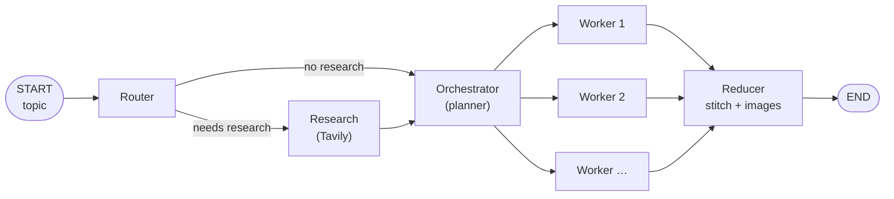
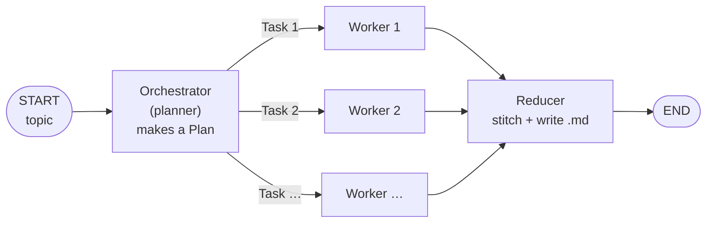
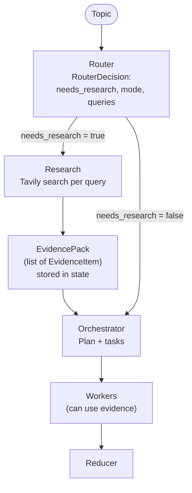
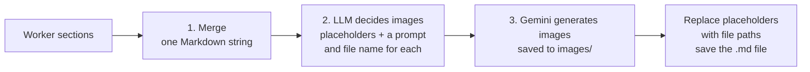
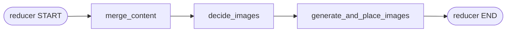

> **Video 26 of 28** · [Watch on YouTube](https://www.youtube.com/watch?v=Ou_v9lk0rxg) · Translated from the
> Hindi transcript. Notes follow the video section by section, in its order.

A planning agent first makes a structured plan and then executes it step by step; this video builds one that plans, researches and writes a complete blog with images.

## What a planning agent is

The definition used here:

> A planning agent is an AI agent that does not immediately jump to answer or act. Instead, it first creates a structured plan of what needs to be done and then executes that plan step by step.

Every workflow and agent built so far in this playlist starts working on the task the moment you give it. The UPSC essay evaluator from earlier is an example: you provided the essay, said "evaluate this", and the LLM jumped straight into evaluating.

Some tasks need planning before any work begins. Suppose you ask an AI agent to build an **expense tracker website**. If it starts coding directly, there is a good chance the outcome has some problem or other. The second option is for the agent to understand the task, make a plan, and then execute the plan step by step. For a complex task like this, the second way is clearly better, and that is what planning agents do.

Planning agents work in **two phases**:

1. **Phase 1, plan.** The agent breaks the task down into subtasks.
2. **Phase 2, execute.** It executes all those subtasks.

## The use case: a blog-writing agent

The agent built today has a simple job: you give it a topic, and it writes a detailed blog on that topic.

This is a task that needs planning. Ask for a blog on, say, the transformer architecture, and an agent that starts writing directly may miss some things. An agent that first understands the task, plans around it and then executes the plan is more likely to produce a better blog. That is why this use case was chosen.

## Demo of the finished agent

The whole system has already been built, so here is the demo first.

- On the left you give the blog's **topic**, for example **self-attention**. You can write just the topic name, or add a short description of what you want covered.
- Clicking **Generate Blog** triggers the agent. The app shows the agent's **progress** as it moves through the nodes of the architecture: the **router** node, then the **research** node, then the **orchestrator** node (the planning node), then the **worker** node, the main node where the blog is written. The progress display is there so you can see the agent is working correctly. A proper, long blog takes a little time.
- Two features have been added beyond plain writing. First, it can **research**: whenever needed it goes online and brings things from online knowledge sources, like a research assistant. Second, it adds **images**: wherever an image is needed, one is generated automatically and placed inside the blog.

When execution completes, the **Plan** tab shows what the agent planned. It decided the **title**, the **audience**, the **tone** and the **kind** of blog on its own (you can specify all of these in the prompt if you prefer). It divided the blog into seven sections:

1. Introduction to Self-Attention
2. How Self-Attention Works
3. Step-by-Step Example of Self-Attention
4. Why Self-Attention Is Powerful for Sequence Modelling
5. Self-Attention in Popular Architectures
6. Common Challenges
7. Conclusion

For each section it also decided the **target word count**, assigned some **tags**, and decided whether the section needs **research**, **citations** or **code**. Self-attention needs little research, because LLMs already know about it.

The generated blog follows those sections, and images have been generated automatically from the text. In the step-by-step example section the whole calculation has been turned into an image. You can **download** the blog along with its images.

The other tabs:

- **Evidence** shows citations. This blog has none. For a topic that needs research, such as "top AI news for this week", the LLM searches online, and all the evidence, citations and links appear here.
- **Logs** records the decisions the agent made behind the scenes.
- **Images** lists every generated image.

Past blogs can be reopened at any time. An earlier one, **"Open Source vs Proprietary LLMs"**, has images and also **citations**; clicking a source opens the links used while writing it (for example under "Innovation Trends Shaping Open Source LLMs"). Hallucination is very low because the system uses recent OpenAI LLMs, and the images look good because they are made with **Gemini**.

## The architecture

This is the actual graph built in LangGraph.



- **Router.** The topic (say, self-attention) arrives at the start node and goes first to the router. Its one job is to decide whether the topic needs **internet research**. A conventional topic like self-attention or the transformer architecture needs none, because the LLM already has the knowledge. A topic that depends on recent things, such as "top AI news of January 2026", does. In the demo, entering a topic sets a key called `needs_research` to true or false. For "The Evolution of ChatGPT from 2022 to 2026" it came out **true**, because recent developments need a search.
- **Research.** The research node breaks the topic down into the searches to run. For the ChatGPT topic: "ChatGPT version releases and updates from 2022 to 2026", new features, performance improvements, "changes in ChatGPT usage patterns and applications", and "OpenAI announcements about ChatGPT". The searches are run with **Tavily**, which is like a search engine for LLMs, and the data is passed to the orchestrator.
- **Orchestrator (planner).** It generates the plan for the blog, meaning which sections it will have, based on its own knowledge and whatever the research brought. It also decides the word count for each section and whether each section needs research, citations or code. A timeless topic like self-attention skips research and comes straight to the planner.
- **Workers.** The workers write the blog. If the plan has nine sections, nine workers are triggered automatically: worker 1 writes the first section, worker 2 the second, and so on, **all in parallel**. Each returns its finished section.
- **Reducer.** It has two jobs. First, it **stitches** all the sections together. Second, it sends the combined blog to an LLM, asks where images are needed, generates those images and places them there.

In short: topic in, research if needed, plan made, the plan fans out to workers that write sections in parallel, and the reducer joins the sections and integrates images.

## Plan of action: four stages

The project is built step by step in four stages:

1. **Stage 1:** a very basic blog-writing agent with no research and no images; it generates a simple textual blog.
2. **Stage 2:** add the **research** feature, so the agent can search the internet and put that information into the blog.
3. **Stage 3:** add the feature of adding **images** to the blog.
4. **Stage 4:** convert it into a **GUI**.

The first focus is how to build a basic blog-writing agent that generates static blogs, without research and without images.

## Stage 1: a basic blog-writing agent

### The architecture

The stage 1 architecture is simpler: an **orchestrator**, which is the planner, and **worker** nodes, which are the writers.



The topic (say, self-attention) reaches the orchestrator, which looks at it and makes a plan around it. "Making a plan" sounds vague, but concretely the orchestrator produces a **`Plan` object**, a Pydantic object with two things:

- the blog's **title**;
- a set of **tasks**: task 1, task 2, task 3 and so on.

Each task is itself a **`Task` object**, another Pydantic model, with an **id**, a **title**, and a **description** of what has to be done. Each `Task` holds the information about **one section** of the blog. If planning decides on five sections, five `Task` objects are made, each with the id, the section title and a brief description of exactly what goes in that section.

The plan then goes to the workers using the **orchestrator-worker flow**: exactly as many workers **fan out** (get triggered) as you need. Five sections means five worker nodes, and the orchestrator hands one task to each, with the description of how to write that section. Each worker has its own LLM and works on its section independently, so the five sections get ready in parallel. The **reducer** then does two things: it stitches the five sections together, and it creates a **Markdown file** that holds the final blog.

### The code: schemas

The code has already been written. After the imports come the two Pydantic models. `Plan` has `blog_title`, a string, and `tasks`, a list of `Task` objects. Each `Task` (each section) has three things: `id`, `title`, and `brief`, a description of what the section should cover.

```python
import operator
from typing import Annotated, List, TypedDict

from pydantic import BaseModel
from langchain_openai import ChatOpenAI
from langchain_core.messages import SystemMessage, HumanMessage
from langgraph.graph import StateGraph, START, END
from langgraph.types import Send


class Task(BaseModel):
    id: int
    title: str
    brief: str


class Plan(BaseModel):
    blog_title: str
    tasks: List[Task]
```

### The state

The state of this LangGraph workflow holds:

- `topic`, which comes from the user;
- `plan`, which the orchestrator makes;
- `sections`, the output of every worker. If five workers run in parallel, each returns a string (a paragraph or set of paragraphs), and all of them are collected here. That is why it is a **list of strings**, with the reducer function **`operator.add`** (used earlier in this playlist) so the outputs from all the workers are joined into one place;
- `final`, which stores the final blog after the last merge.

```python
class State(TypedDict):
    topic: str
    plan: Plan
    sections: Annotated[List[str], operator.add]
    final: str


llm = ChatOpenAI(model="gpt-4.1-mini")
```

### The orchestrator node

The orchestrator calls `with_structured_output` on the LLM with the `Plan` object, forcing its output to always be a `Plan`. Two messages are sent: a system message, "Create a blog plan with 5-7 sections on the following topic.", and right below it a human message carrying the state's `topic`. The returned plan goes into the state's `plan`. After visiting this node you have your plan: one `Plan` object containing multiple `Task` objects.

```python
def orchestrator(state: State) -> dict:
    plan = llm.with_structured_output(Plan).invoke(
        [
            SystemMessage(content="Create a blog plan with 5-7 sections on the following topic."),
            HumanMessage(content=f"Topic: {state['topic']}"),
        ]
    )
    return {"plan": plan}
```

### The fanout function

Here is the interesting part. You have to go from the orchestrator to the workers, but you do not know in advance how many workers there will be: the plan may have five sections or three. So an intermediate function, **`fanout`**, checks how many tasks the `Plan` holds (how many sections the planner planned) and triggers the worker node once for each.

LangGraph provides the **`Send` API** for this. The function loops over `state["plan"].tasks` and, for each `Task`, calls `Send` to trigger the worker node with a **payload**: the worker's own task, the blog's topic, and the **entire plan**. Giving every worker the overall plan lets each one write its section coherently with the rest.

```python
def fanout(state: State):
    return [
        Send("worker", {"task": task, "topic": state["topic"], "plan": state["plan"]})
        for task in state["plan"].tasks
    ]
```

### The worker node

The worker does the main writing. It receives the payload (task, topic and plan) and takes the blog title from the plan. It calls `llm.invoke` with the system message "Write ONE clean Markdown section." and a human message telling it everything: the blog title, the topic the user gave, the section it has to work on, and the description to follow (both of which are in the `Task` object). The prompt ends with "Return only the section content in Markdown."

Each worker writes only its own section and returns it inside a list under `sections`. With as many workers as there are `Task` objects, everything is reduced and merged into one list.

```python
def worker(payload: dict) -> dict:
    task = payload["task"]
    topic = payload["topic"]
    plan = payload["plan"]
    blog_title = plan.blog_title

    section_md = llm.invoke(
        [
            SystemMessage(content="Write ONE clean Markdown section."),
            HumanMessage(
                content=(
                    f"Blog: {blog_title}\n"
                    f"Topic: {topic}\n\n"
                    f"Section: {task.title}\n"
                    f"Brief: {task.brief}\n\n"
                    "Return only the section content in Markdown."
                )
            ),
        ]
    ).content.strip()

    return {"sections": [section_md]}
```

### The reducer node

The last node takes the title from the plan in the state and applies `join` to `state["sections"]` on a line change: one section, a line break, the next section, and so on, making one big string called `body`. The final string is the title, a line break, then the whole body. A `#` goes in front of the title because this is Markdown, where `#` means a heading. The last three lines create a new file and write the string into it.

```python
def reducer(state: State) -> dict:
    title = state["plan"].blog_title
    body = "\n\n".join(state["sections"]).strip()
    final_md = f"# {title}\n\n{body}\n"

    filename = f"{title}.md"  # (implied, not shown in narration)
    with open(filename, "w", encoding="utf-8") as f:
        f.write(final_md)

    return {"final": final_md}
```

### Building and running the graph

The graph adds the orchestrator, worker and reducer nodes, then connects them: an edge from start to the orchestrator, a **conditional edge** from the orchestrator through `fanout` (which decides how many workers to create), an edge from worker to reducer, and an edge from reducer to end. Printing the app shows the flow.

```python
g = StateGraph(State)
g.add_node("orchestrator", orchestrator)
g.add_node("worker", worker)
g.add_node("reducer", reducer)

g.add_edge(START, "orchestrator")
g.add_conditional_edges("orchestrator", fanout, ["worker"])
g.add_edge("worker", "reducer")
g.add_edge("reducer", END)

app = g.compile()
app

out = app.invoke({"topic": "Write a blog on Self Attention", "sections": []})
```

`sections` is passed as blank here; it could be removed.

Opening the generated Markdown file (through an editor extension, for easier reading) shows two things: **no research** was done, since the agent was not connected to the internet, and there is **no image**, since no image work was done. Still, it is a decent blog, not great but not useless either. The basic agent works.

## Improving the basic agent: elaborate schemas and prompts

Before adding research and images, the basic agent is improved. Right now the planning system prompt is just "Create a blog plan with 5-7 sections on the following topic." and the worker's system prompt is just "Write one clean Markdown section." That is too basic. To make the agent perform better, give it **more elaborate system prompts**. These are two or three small changes, not major ones, but they make even this basic agent perform better.

**Change 1: a richer `Plan`.** Besides `blog_title` and `tasks`, the plan now has **`audience`** and **`tone`**, which you can provide through your prompt.

**Change 2: a richer `Task`.** The old `Task` was only `id`, `title` and `brief`. The new one has:

- `id` and `title`;
- **`goal`**: "One sentence describing what the reader should be able to do/understand after this section.";
- **`bullets`**: "3–5 concrete, non-overlapping subpoints to cover in this section.", so the orchestrator adds a few pointers for what each section must cover;
- **`target_words`**: how many words each section should have;
- a **type** saying whether the section is an **intro**, **core**, **examples** or **checklist** section. This one is optional; it was added here.

```python
from typing import Literal
from pydantic import BaseModel, Field


class Task(BaseModel):
    id: int
    title: str
    goal: str = Field(
        ...,
        description="One sentence describing what the reader should be able to do/understand after this section.",
    )
    bullets: List[str] = Field(
        ...,
        description="3-5 concrete, non-overlapping subpoints to cover in this section.",
    )
    target_words: int
    section_type: Literal["intro", "core", "examples", "checklist"]  # (implied, not shown in narration: field name)


class Plan(BaseModel):
    blog_title: str
    audience: str
    tone: str
    tasks: List[Task]
```

Everything else is almost the same: the state and the LLM are unchanged. The difference is in the orchestrator's **system prompt**, which is now a big, elaborate prompt explaining in detail how the LLM should make the plan (pause the video to read it, or get the code from the description). The fanout code and the worker code are unchanged, except that the worker's system message is also very elaborate, with every instruction given carefully, and it passes the extra per-section details now that the Pydantic model has them. The reducer, the graph-building code and the run code are exactly the same.

Running it again on self-attention and comparing with the previous blog shows a clear improvement: it now includes code in **NumPy**, explains **why you scale by this factor**, adds a summary, and gives a full code implementation, none of which were there before. The quality of the text improved just by adding elaborate system prompts and a detailed Pydantic model.

## Stage 2: adding research

### Why research is needed

Sometimes the LLM does not have updated knowledge, so the agent should search the internet and bring the information. This is a very important feature: any research assistant today has it. The code can seem a bit difficult, so a detailed overview comes first.

### Overview of the plan

1. **Router.** The topic first goes to an **LLM-based router** that decides whether the topic needs an internet search. For **self-attention** it does not: the content is most likely already in the LLM's **parametric knowledge**. For "**top AI news of the week**" (or of the month) it does, because that knowledge is not in the parametric knowledge. When a search is needed, the router does not only say so; it also **recommends search queries**. For "**Evolution of ChatGPT from 2022 to 2026**" the website generated queries such as "ChatGPT version releases and updates from…", "new features introduced", "performance improvements", "changes in ChatGPT", and "OpenAI announcements about ChatGPT".
2. **Research.** The research node takes those queries and, using **Tavily** (a search engine for LLMs), sends them one by one. Tavily brings back info from the internet for each query, and all of it is saved in the state.
3. **Orchestrator (planner).** The planner is told: here is the topic, generate a plan (which sections the blog should have), and also consider the research stored in the state while planning. Say it plans five sections.
4. **Workers.** The five sections go to five different workers, each working independently. If a section needs the knowledge brought from the internet, the worker gets it from the state.
5. **Reducer.** It stitches everything and you get the blog.

### The graph layout and the schemas

The graph is the one shown earlier: the router decides whether research is needed; either way you reach the orchestrator (planner), which plans the sections; a worker writes each section; the reducer merges them.

**The router's output.** When the blog topic reaches the router, it returns a **`RouterDecision`** object, a Pydantic schema with three things:

- **`needs_research`**: a boolean, yes or no;
- **`mode`**, with only three possible values:
  - **`closed_book`**, for a topic like self-attention (no research needed);
  - **`open_book`**, for a topic like top AI news of the week (research needed);
  - **`hybrid`**, for a topic you can mostly answer conceptually from the LLM's knowledge but that needs a little research. **Open source LLMs** is the example: what they are, the LLM can explain; which ones are in the market right now needs a search (research needed);
- **`queries`**: four or five queries, generated if the mode is hybrid or open book.

**Running a Tavily search.** On the "yes" path, you do one Tavily search per query, which is simple:

1. Go to the Tavily website ("Connect your AI agents to the web"), a search engine for LLMs, and make an account.
2. You get an **API key**; put it in your `.env` file.
3. With LangChain and Tavily you can now search easily: the class **`TavilySearchResults`** takes how many results you want per query, and you **invoke** the tool with a query.

```python
from langchain_community.tools.tavily_search import TavilySearchResults

tool = TavilySearchResults(max_results=2)
results = tool.invoke("ChatGPT version releases and updates from 2022 to 2026")
results
```

Because `max_results` is 2, the list holds two results, each with a **title**, a **URL** and its **content**. You can loop over them however you like. This is how internet knowledge enters your system. The number of results per search is under your control, anywhere from 2 to 10.

**`EvidenceItem`.** The raw result is complex text, not a standardised format, so each result is converted into a standardised Pydantic schema called **`EvidenceItem`**, storing the **title**, the **URL**, the **date it was published**, the **source**, and the **snippet** (the content text).

**`EvidencePack`.** If the researcher is given five queries and takes two results from each, it has 10 results, each converted to an `EvidenceItem`. Those are collected into an **`EvidencePack`**, a collection of `EvidenceItem` objects, which the research step stores in the state.

**The richer plan.** You can reach the orchestrator by two routes, through the researcher or without it. The orchestrator must make a plan using the `Plan` object, which now holds the blog's **title**, **audience**, **tone**, the blog's **kind**, **constraints**, and **tasks** (the section details). Each `Task` has its own **id**, **title**, **goal**, **bullets**, **target words**, **tags**, **requires research**, **requires citations** and **requires code**.

The orchestrator makes the plan and uses the `EvidencePack` from the researcher for ideas while developing it. It then makes the tasks and sends each to a worker. A worker that needs internet material can go back to the `EvidencePack` and pick items from it. The sections go to the reducer, get stitched, and you get the output.



It may seem a bit complex; watching this part again should make it clear.

### The code

**Imports and schemas.** Tavily is imported (it needs a pip install; search for the package name). Then come all the schemas just discussed: `Task`, `Plan`, `EvidenceItem`, `RouterDecision` and `EvidencePack`.

```python
from typing import List, Literal, Optional
from pydantic import BaseModel, Field


class Task(BaseModel):
    id: int
    title: str
    goal: str
    bullets: List[str]
    target_words: int
    tags: List[str]
    requires_research: bool
    requires_citations: bool
    requires_code: bool


class Plan(BaseModel):
    blog_title: str
    audience: str
    tone: str
    blog_kind: str
    constraints: List[str]
    tasks: List[Task]


class EvidenceItem(BaseModel):
    title: str
    url: str
    published_at: Optional[str] = None
    source: Optional[str] = None
    snippet: Optional[str] = None


class RouterDecision(BaseModel):
    needs_research: bool
    mode: Literal["closed_book", "hybrid", "open_book"]
    queries: List[str] = Field(default_factory=list)


class EvidencePack(BaseModel):
    evidence: List[EvidenceItem] = Field(default_factory=list)
```

**The state** has room for everything: `topic` from the user; `mode`, `needs_research` and `queries` from the routing decision; `evidence` from research; `plan` from the orchestrator; `sections` from the workers; and `final` from the reducer. The most important new field is `evidence`, where everything brought from the internet is stored. Then the LLM is defined.

```python
class State(TypedDict):
    topic: str
    mode: str
    needs_research: bool
    queries: List[str]
    evidence: List[EvidenceItem]
    plan: Optional[Plan]
    sections: Annotated[List[str], operator.add]
    final: str
```

**The router.** Read the router's system prompt (pause the video for it). It opens "You are a routing module for a technical blog planner." At this point the system has been narrowed to **technical blogs only**; it is not catering to all blogs. It asks the model to decide whether web research is needed before planning, and defines the three modes:

- **closed_book**: evergreen topics where correctness does not depend on recent facts (self-attention);
- **hybrid**: mostly evergreen but needs up-to-date examples, tools or models to be useful (open source LLMs);
- **open_book**: the most volatile topics, needing the most research (top AI news of the week).

If `needs_research` is true, it must write **3 to 10 high-signal queries**, like the ones shown above. "Queries should be scoped and specific." If the user asked for "last week", "this week" or "latest", that constraint must be reflected in the queries.

The router node takes the topic from the state, calls `with_structured_output` so the output comes in the `RouterDecision` schema, and invokes the LLM with that system message and the topic as the human message. The decision holds whether research is needed, the blog's mode, and the queries (blank if there are none).

After the router, the flow can go down two paths, so a small function **`route_next`** applies simple logic: if `needs_research` is true, go to research; if false, go to the orchestrator.

```python
def router_node(state: State) -> dict:
    topic = state["topic"]
    decider = llm.with_structured_output(RouterDecision)
    decision = decider.invoke(
        [
            SystemMessage(content=ROUTER_SYSTEM),
            HumanMessage(content=f"Topic: {topic}"),
        ]
    )
    return {
        "needs_research": decision.needs_research,
        "mode": decision.mode,
        "queries": decision.queries,
    }


def route_next(state: State) -> str:
    return "research" if state["needs_research"] else "orchestrator"
```

**The research node.** Its system prompt: "You are a research synthesizer for technical writing. Given raw web search results, produce a deduplicated list of EvidenceItem objects." The rules:

- only include items with a non-empty URL;
- prefer relevant and authoritative sources (company blogs, docs, reputed outlets);
- if a published date is explicitly present in the result payload, keep it as is; if missing or unclear, set it to null, and do not guess;
- keep snippets short;
- **deduplicate by URL**: Tavily can return two results pointing to the same URL, and only one should be kept.

The node first fetches all the queries the router made, then limits each query to at most **six results**. Five queries times six results means up to 30 `EvidenceItem` objects from Tavily. It loops over the queries, runs a Tavily search for each (the search helper is written above), and keeps adding the results to a list called raw results, a list of dictionaries. The whole research comes back as an `EvidencePack` object, which is stored in the state under the `evidence` key.

```python
def research_node(state: State) -> dict:
    queries = state.get("queries", [])
    max_results = 6

    raw_results = []
    for q in queries:
        raw_results.extend(_tavily_search(q, max_results=max_results))

    extractor = llm.with_structured_output(EvidencePack)  # (implied, not shown in narration)
    pack = extractor.invoke(  # (implied, not shown in narration)
        [
            SystemMessage(content=RESEARCH_SYSTEM),
            HumanMessage(content=f"Raw results:\n{raw_results}"),
        ]
    )
    return {"evidence": pack.evidence}
```

**The rest of the flow** is exactly what you saw in stage 1. The planner has a big system prompt, but the code is the same; the one addition is that the evidence collected so far is passed in, with an instruction to look at it while making the plan. Evidence exists only for topics that were researched; for an evergreen topic it is empty, and the prompt says it "may be empty". The fanout logic is the same, except that the evidence is also sent in the payload. The worker has a detailed prompt too and can use the evidence (the internet research) to write its section, but the idea and the output are the same; compare it with the previous code. The reducer combines the sections and writes the file. That's it.

The graph connects router, research, orchestrator, worker and reducer; the graph is printed; and a function is written to run it.

### Running it

The topic this time is "**State of Multimodal LLMs in 2026**". It takes a little time.

The blog comes back titled "**State of Multimodal LLMs in 2026: Overview and Industry Implications**". Up front you can see not only the blog but its **sources**; clicking them opens them (for example, a page on the Google Gemini series). It is pulling in very recent blogs, which clearly proves the agent is doing research: going to the internet and pulling in relevant material.

## Stage 3: adding images

### The plan

The graph's structure stays the same, and everything above the reducer stays exactly as it is. All the changes are in the **reducer**. Until now it did two jobs: merge the sections sent by the workers, and write the merged blog to a file. To add images it does more work, in three steps.

**Step 1, merge.** As before, the reducer merges the pieces: this part came from the first worker, this from the second, this from the third. The result is one Markdown **string**, not yet a file.

**Step 2, decide images.** The reducer sends this Markdown to an LLM and asks where in the textual blog images should go. The LLM is intelligent; it reads the blog and sees, say, two places where images would improve it. It does not only say where; it also says what **type** of image each should be. For every **placeholder** it creates, it also gives a detailed **prompt** for generating that image: the image's **file name**, and the prompt to give your image model, **Gemini**. So after step 2 you have the Markdown with placeholders, and a detailed prompt for each placeholder.

**Step 3, generate and place.** You send all those prompts to a model like Gemini and have the images generated one by one. As each image is generated, you save it into a directory called **`images`** in your project folder. Then you replace each placeholder with the file name. When this new Markdown is saved as a file and opened, you see both text and images.



### The reducer as a subgraph

In code, the reducer has been converted from a single node into a **subgraph** of three nodes:

1. **`merge_content`**: step 1, merge and generate the Markdown.
2. **`decide_images`**: the most important one. It sends the textual Markdown to the LLM, which creates placeholders in it and a prompt for each placeholder.
3. **`generate_and_place_images`**: for each image, it fetches that image's Pydantic spec, goes to Gemini, generates the image, and replaces the placeholder with the generated image.



The output of `decide_images` has two parts, so it is represented by a Pydantic object called **`GlobalImagePlan`**:

- **`md_with_placeholders`**: a string holding the whole Markdown with placeholders;
- **`images`**: a list of **`ImageSpec`** objects, one per image to generate. An `ImageSpec` holds the **placeholder**, the **file name**, the **prompt**, the image **size** and the image **quality**.

It is getting a bit technical, but the key point is this: `decide_images` outputs a `GlobalImagePlan`, which is a string with placeholders plus an `ImageSpec` for each placeholder, carrying the details of the image to be generated.

### Getting a Gemini API key

Images are generated with Google's **Gemini** models, so you need a Gemini API key:

1. Go to **Google AI Studio** (aistudio.google.com) and click **Get API key**, then **Create API key**.
2. Select an existing project, or create a new project and create the key there.

On the **free tier** you may not be able to generate many images, in which case you may need the paid, **pay-as-you-go** option. Here it was connected to a UPI account when prompted. After generating about **30 to 40 blogs** while making this tutorial, the bill was **₹135**, so expect to spend hardly ₹100.

:::warning

Be careful with the key. Do not hand it out blindly; if other people use your key, the bill can go up a lot. Used carefully, it will not cost much.

:::

Copy the key into your project's environment file as **`GOOGLE_API_KEY`**, and image generation will work.

### The code

The changes are in very few places. Everything up to the worker is exactly the same.

- **Schemas.** `Task`, `Plan`, `EvidenceItem`, `RouterDecision` and `EvidencePack` are unchanged. Two new schemas are added: `GlobalImagePlan` and `ImageSpec`.
- **State.** Three new fields: `merged_md`, `md_with_placeholders` and `image_specs`. Everything else is as before.
- **Router, research node, planning node, fanout and worker** are all exactly the same.

```python
class ImageSpec(BaseModel):
    placeholder: str
    filename: str
    prompt: str
    size: str
    quality: str


class GlobalImagePlan(BaseModel):
    md_with_placeholders: str
    images: List[ImageSpec] = Field(default_factory=list)


class State(TypedDict):
    # ... all the stage 2 fields, plus:
    merged_md: str
    md_with_placeholders: str
    image_specs: List[dict]  # (implied, not shown in narration: exact type)
```

The change starts at the reducer, now made of three nodes.

**`merge_content`** merges everything the workers wrote. It does not convert it into a Markdown file yet.

**`decide_images`** has its own system prompt: "You are an expert technical editor. Decide if images/diagrams are needed for this blog." The rules: at most **three images** per blog, and each image should **materially improve understanding**, with diagram-, flow- or table-like visuals, spelling out what kind of diagrams are wanted. The LLM is structured to return a `GlobalImagePlan`, and the whole blog so far is sent to it. It returns the Markdown with placeholders plus the image specs for the three or four images.

**`generate_and_place_images`** hits Google Gemini's API through a helper function that generates the image bytes (written above; the code was taken from Gemini's website). The helper takes a prompt and generates an image for it. The node calls Gemini with the prompt, gets the image, saves it, and passes its path back to the Markdown: the placeholder is removed, the file path is put in its place, and the whole thing is saved to a file. The actual code is written more defensively so that no error blows it up, but that is the main funda.

Finally, a small **subgraph** is built for the reducer, and that subgraph is used as the reducer inside the big graph. Everything else is the same.

```python
reducer_graph = StateGraph(State)
reducer_graph.add_node("merge_content", merge_content)
reducer_graph.add_node("decide_images", decide_images)
reducer_graph.add_node("generate_and_place_images", generate_and_place_images)

reducer_graph.add_edge(START, "merge_content")
reducer_graph.add_edge("merge_content", "decide_images")
reducer_graph.add_edge("decide_images", "generate_and_place_images")
reducer_graph.add_edge("generate_and_place_images", END)
reducer_subgraph = reducer_graph.compile()

g.add_node("reducer", reducer_subgraph)
```

### Running it

The topic is self-attention again: "**Self Attention in Transformer Architecture**".

The generated blog now has **images** as well as text, with the same detailing as before. No research happened for this topic, so there are no links, but there are code blocks and images. The images need checking for hallucination: one looks good, but in some places the text inside the images does not look correct. Still, the images are being downloaded and placed correctly in the blog.

The agent can now generate a normal textual blog, add research if required, and add images.

## Stage 4: a GUI with Streamlit

The last step is the user interface shown at the start of the video. It is built entirely with **Streamlit**, one of the easiest ways to create a GUI in Python. You could build the front end in React or another front-end framework, but that is more advanced and is probably what you would do in a company; this project is for learning, so Streamlit it is.

Not much effort went into the front end. The UI was planned once (how it should look, what it should contain), those specifications were written very clearly and given to **ChatGPT**, and ChatGPT generated the whole Streamlit code: fully vibe-coded. The only work needed was to connect the back end:

1. Put all the code written so far, up to image generation, into one Python `.py` file.
2. Import the compiled graph `app` from that file into the Streamlit file.
3. Run it like any Streamlit file: `streamlit run <file name>`.

That produces the app from the start of the video. The 200 to 300 lines of Streamlit code are not explained here, honestly because much of it was not written by hand and would take a lot of time. The recommendation: write the specification of the GUI you want, give it to ChatGPT along with your back-end code, and it will build the front end. That is not the job here anyway; the job is to develop the back end of agents, and that has been done.

## Closing thoughts

Building this small project was a lot of fun because it shows a lot of potential. Every company takes content seriously today, and content does not mean only video: textual content and blogs still matter a lot. Companies have content divisions where people are hired to write content and blogs. A system that genuinely adapts to its customer and generates blogs to their requirements whenever they need them could be a very powerful business.

Given a month, this project could be refined a great deal, but as a teacher there is not that much time. If you are looking for a good project to show an interviewer, this can be a very good one. If you understood this video, you can probably already see where it can be improved; there is a lot of scope, and if you take it seriously and build on it, it can be a very good **portfolio project**.
