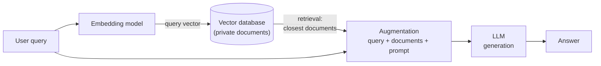
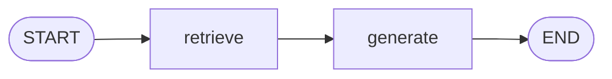
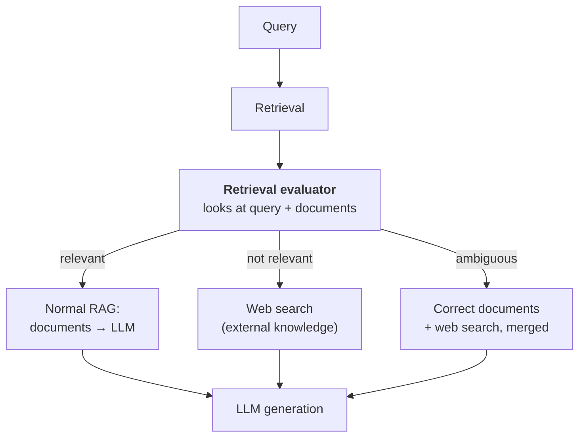
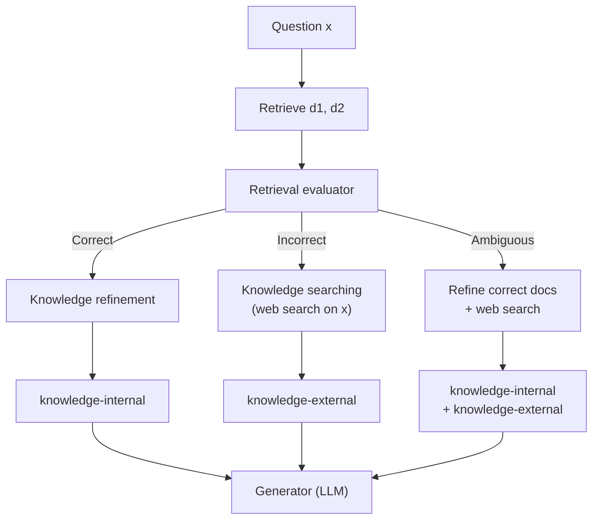
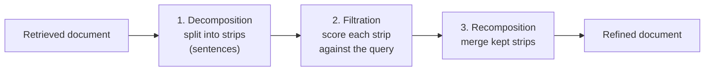
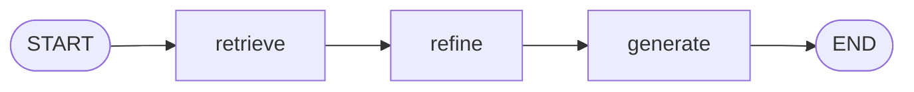
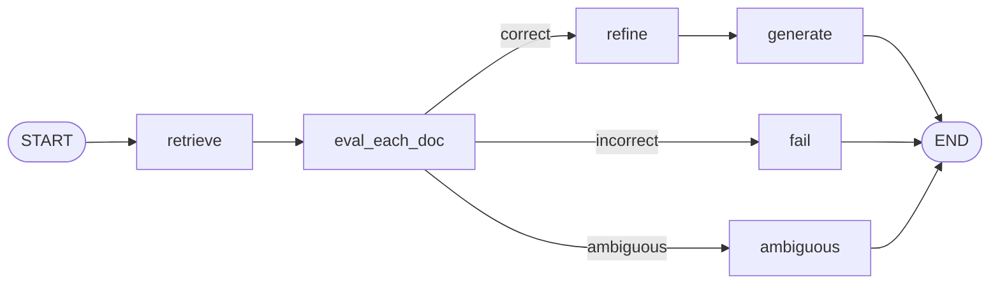
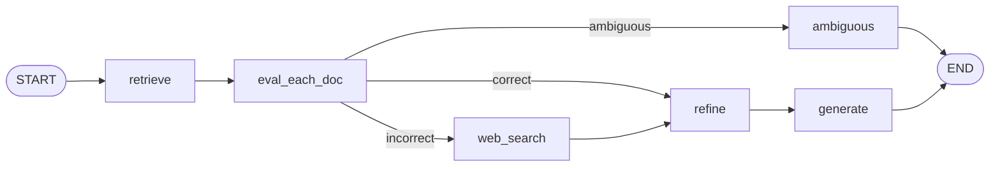
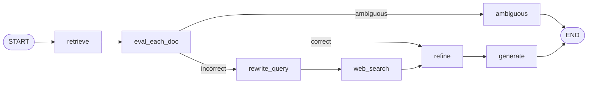
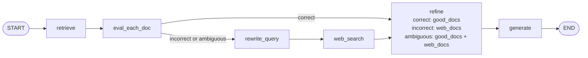

> **Video 27 of 28** · [Watch on YouTube](https://www.youtube.com/watch?v=41XDn81nR5c) · Translated from the
> Hindi transcript. Notes follow the video section by section, in its order.

Corrective RAG (CRAG) is a variant of RAG that stops blindly trusting whatever the retriever returns; this video explains the idea conceptually and then builds it in LangGraph, one feature at a time.

## Why CRAG, if RAG already works?

The obvious question is: if RAG works properly, why do you need CRAG? Settling that needs two things you should already know: what RAG is as a concept and how it works. Both are covered in the LangChain playlist on the same channel; watch those first and you will appreciate this video more.

### A quick recap of the RAG workflow

In traditional RAG, the user gives a query, say "What is machine learning?".

1. The query goes to an **embedding model**, a deep learning model that converts text into numbers (vectors). It produces a vector for the query.
2. That vector is taken to a **vector database**, where your private documents are stored as vectors. Suppose you have stored some books on machine learning, so the database holds many vectors explaining machine learning concepts.
3. A **semantic search** extracts the vectors closest to the query vector. This step is **retrieval**, and it returns documents that contain what the query asks, here some context around what machine learning is.
4. The retrieved documents and the original query are sent to the LLM together with a prompt: "the user asked this question; use these documents to answer it". This is **augmentation**.
5. The LLM looks at the question and the documents and produces the answer from them. This is **generation**.

RAG is the combination of these three steps: retrieval, augmentation and generation.



### The problem: the LLM blindly trusts the retrieved documents

When you hand the retrieved documents to the LLM and tell it to answer only from them, the LLM **blindly trusts** them. If those documents are not related to the query, the answer will be wrong too.

Suppose you ask "What is an LLM?" but every book in your vector database is about machine learning. There is nothing on LLMs, yet the semantic search has to return something, so it pulls out some far-off topic, say random forest or XGBoost documents. Now you have told the LLM: here is the query "What is an LLM?" and here are documents on random forest, answer. It is forced to build an answer from the wrong documents and ends up giving the user a wrong answer.

In a business scenario this can be a very big problem. Imagine an employee asking what the leave policy is in a particular situation, and that document does not even exist in the vector database. They get a wrong answer, assume it is correct, and start acting on it. The implications can be very dangerous. This is the problem Corrective RAG solves.

## Demo: the problem in a traditional RAG chatbot

Before seeing how CRAG solves it, here is a practical demonstration that the problem really happens: a question whose retrieved documents are about something else, and a wrong-sourced answer.

### The setup: three classic books

A folder holds three books on machine learning and deep learning, all absolute classics:

1. *Hands-On Machine Learning*
2. *Deep Learning*
3. a *Pattern Recognition* book

The goal is a RAG chatbot over these three books. Follow the walkthrough even if you already know how to code RAG, because the Corrective RAG code is built on top of this same code.

### The traditional RAG code

**Loading.** All three books are loaded as `Document` objects and combined into a list called `docs`, almost 2000 `Document` objects.

**Text splitting.** `RecursiveCharacterTextSplitter` with a chunk size of 900 and a chunk overlap of 150. Some PDFs have weird characters that cause a Unicode encoding error, so one line replaces them so no error is thrown. After chunking there are more than 6000 documents.

**Embeddings and vector store.** OpenAI's embedding model and the FAISS database: every chunk is converted into a vector and stored. A **retriever** is created on the vector store that does similarity (semantic) search and returns the **top four** documents for any query, stored in `retriever`.

**LLM.** An LLM from `ChatOpenAI`.

```python
import re  # (implied, not shown in narration)
from typing import List, TypedDict

from langchain_community.document_loaders import PyPDFLoader  # (implied, not shown in narration)
from langchain_community.vectorstores import FAISS
from langchain_core.documents import Document
from langchain_core.prompts import ChatPromptTemplate
from langchain_openai import ChatOpenAI, OpenAIEmbeddings
from langchain_text_splitters import RecursiveCharacterTextSplitter
from langgraph.graph import StateGraph, START, END

docs = (
    PyPDFLoader("./documents/book1.pdf").load()  # (implied, not shown in narration)
    + PyPDFLoader("./documents/book2.pdf").load()  # (implied, not shown in narration)
    + PyPDFLoader("./documents/book3.pdf").load()  # (implied, not shown in narration)
)

chunks = RecursiveCharacterTextSplitter(chunk_size=900, chunk_overlap=150).split_documents(docs)

# replace the weird characters some PDFs contain, so no Unicode error is thrown
for d in chunks:
    d.page_content = d.page_content.encode("utf-8", "ignore").decode("utf-8", "ignore")  # (implied, not shown in narration)

embeddings = OpenAIEmbeddings()
vector_store = FAISS.from_documents(chunks, embeddings)
retriever = vector_store.as_retriever(search_type="similarity", search_kwargs={"k": 4})

llm = ChatOpenAI()
```

**State.** Three things: the `question` the user asks, the retrieved `docs`, and the `answer` the LLM generates.

```python
class State(TypedDict):
    question: str
    docs: List[Document]
    answer: str
```

**Graph.** One node for retrieval, one for generation:



The **retrieve** node takes the question, invokes the retriever with it, and stores the documents in `docs`. The **generate** node joins all the retrieved documents into a string and sends it to the LLM with the instruction "Answer only from the context. If not in context, say you don't know." In other words, trust the documents blindly. It passes the user's question and the context (the retrieved documents), and stores the result in `answer`.

```python
def retrieve(state: State) -> State:
    q = state["question"]
    return {"docs": retriever.invoke(q)}


prompt = ChatPromptTemplate.from_messages(
    [
        ("system", "Answer only from the context. If not in context, say you don't know."),
        ("human", "Question: {question}\n\nContext:\n{context}"),
    ]
)


def generate(state: State) -> State:
    context = "\n\n".join(d.page_content for d in state["docs"])
    out = (prompt | llm).invoke({"question": state["question"], "context": context})
    return {"answer": out.content}


g = StateGraph(State)
g.add_node("retrieve", retrieve)
g.add_node("generate", generate)
g.add_edge(START, "retrieve")
g.add_edge("retrieve", "generate")
g.add_edge("generate", END)

app = g.compile()
```

### Test 1: a question the books do answer

"What is bias variance trade-off?" is certainly answered in all three books.

```python
res = app.invoke({"question": "What is bias variance trade-off?"})
print(res["answer"])
```

```text
The bias-variance trade-off is a fundamental concept in statistics and machine learning that
describes the relationship between two sources of error that affect a model's performance:
bias and variance. ...
```

It then defines bias, defines variance and explains the trade-off: a very solid answer. The four retrieved documents all talk about bias and variance and the trade-off. Documents related to the query were fetched, so the answer is accurate.

### Test 2: a question the books cannot answer

"What are the top AI news from last month?" cannot be in these books; they are classics written long ago.

```text
I don't know.
```

### Test 3: a question whose documents are missing

As far as is known, these three books do not discuss the transformer architecture in detail; in fact not at all. Ask "What is a transformer in deep learning?":

```text
A transformer in deep learning is a type of model architecture that is particularly effective
for processing sequential data such as text. It utilises mechanisms called self-attention and
feed-forward neural networks. ... Transformers do not process data sequentially, which enables
them to be more parallelisable and efficient in training. The architecture has become
foundational in natural language processing tasks and has led to significant advancements in
the field.
```

It also says transformers are better than traditional RNNs. The answer looks correct, so what is the problem? Look at the retrieved documents. Nowhere is the transformer discussed:

- the first explains the MLP (multi-layer perceptron); its spaces have been stripped so the words run together, though semantic search still works;
- the second discusses convolutional neural networks;
- the third, hard to read, discusses regularisation;
- the last, "reinforcement… deep neural network regularisation", is basically an index page.

None of the four covers transformers, yet the model answered. The answer came from the LLM's **parametric knowledge**. In another situation it could have **hallucinated**: if the LLM had no parametric knowledge of the topic (a company's leave policy, say) and the right documents were not retrieved either, it could make up anything.

So the problem with traditional RAG: when it does not get the right documents, it falls back on parametric knowledge, with a very big chance of hallucination, and in business settings that can be very, very bad. It took almost 10 minutes to show, but it had to be shown that this happens in practice.

## How CRAG solves it

In CRAG, the retrieved documents are **not sent directly to the LLM**. At that spot you place a model called the **retrieval evaluator**. Its simple job: look at all the documents and the query, and decide whether the retrieved documents are useful for answering the query. If the query is "What is an LLM?" and the documents are about random forest, it recognises they are not useful.

There are three cases, and CRAG does something different for each:

1. **Relevant.** The rest works like normal RAG: send the documents to the LLM, which answers from them.
2. **Not relevant at all.** CRAG goes to **external knowledge sources**. For example you may have added a **web search** tool. Since the retriever brought random forest for "What is an LLM?", the model sees the documents are irrelevant, does a web search, and answers from what the web search returns.
3. **Ambiguous.** The documents are partly correct and partly garbage; some explain the query and some cannot. CRAG does both: like normal RAG it sends the correct documents to the LLM, and for the rest it brings external knowledge from a web search, merges the two, and then the LLM generates.



The basic difference: CRAG does not assume the retrieved documents are correct and does not blindly trust them. It works through three cases, and the retrieval evaluator is what forms them. This video develops Corrective RAG from scratch in LangGraph.

## The CRAG paper

Corrective RAG comes from a very recent paper, from 2024 as far as is recalled. It explains in detail the architecture the researchers used, and the code here tries to be a very close representation of it. The paper is not difficult and not long, so read it once, and especially look at its main diagram, which is the same thing just discussed:

- A question **x** goes into the system, which retrieves documents **d1** and **d2**.
- The **retrieval evaluator** looks at x, d1 and d2, and judges whether d1 and d2 are the right knowledge sources to answer x.
- **Correct**: refine the documents a little to get **knowledge-internal**, and generate the answer from it.
- **Incorrect** (their context does not match x): do **knowledge searching**. Send x to the web, and from the web search get **knowledge-external**; generate from x and knowledge-external.
- **Ambiguous** (the documents partially answer the question): do both. Refine the correct documents into knowledge-internal, web-search for the rest to get knowledge-external, and send all three (question, internal knowledge, external knowledge) to the LLM.



The goal is to build this diagram in LangGraph. Rather than building such a big architecture in one go, which could be overwhelming, complexity is added to traditional RAG step by step, and in three to five iterations it reaches Corrective RAG: start with traditional RAG, add one feature, then another, a very first-principles approach.

## Iteration 1: knowledge refinement

The first feature is **knowledge refinement**, the part of the CRAG architecture applied when the retrieved documents are correct.

### Why refinement is needed

Retrieved documents may contain the relevant material, but often something extra is written alongside it. That is because of chunking: you asked for chunks of 900 characters, so a new document starts every 900 characters. No brain is applied to keep one topic in one chunk. Often a topic is split across two chunks, and often one chunk covers more than one topic.

Knowledge refinement has precisely three steps: **decomposition**, **filtration** and **recomposition**.

### A worked example

The query x is "What is gradient descent?" and the retrieved document D1 reads:

> Gradient descent is an optimisation algorithm used to minimise a loss function. It iteratively updates parameters in the direction of the negative gradient. Neural networks are composed of layers of neurons with non-linear functions. Convolutional neural networks are particularly effective for image processing tasks.

The first part is all about gradient descent, but the next two lines are not useful for this question. They are in the same document because of chunking: part came from one paragraph and part probably from the next, so the document talks about two topics, and only the first is useful.

**Step 1: decomposition.** Divide the document into **strips** (strip 1, strip 2 … strip k). The paper does not explain in detail how to make strips, but says stripping basically means breaking the document into sentences, roughly single sentences or groups of two. Here the document breaks into four sentences: strips 1 to 4.

**Step 2: filtration.** Send the query and each strip (S1, S2, S3, S4) to a model. In the paper this model is Google's **T5-large** transformer, which the authors fine-tuned for this filtration task. For each strip it gives a **confidence score** of how relevant that strip is to answering the query. Here it would find strips 1 and 2 useful and strips 3 and 4 not, so only S1 and S2 remain.

**Step 3: recomposition.** Merge the surviving sentences back into a paragraph. That paragraph, not the original, becomes document one for generation, and sending it improves the quality of generation.

Do the same for D2 and for every retrieved document.



In the traditional RAG graph, where generation follows retrieval directly, a **refine** step now goes in the middle: retrieved documents are refined, and the refined documents go to generation.



### Why an OpenAI model instead of T5

The authors do not provide a link to their fine-tuned T5; they only say they used it. So a `ChatOpenAI` LLM is used for filtration instead. The paper says their transformer is small (770 million parameters), lightweight, free, and on this particular task it performs better than an OpenAI LLM; they state this explicitly. Without access to it, `ChatOpenAI` it is.

### The refine code

The code is the same as the traditional RAG code, with improvements and one new node: libraries, document loading, text splitting, embeddings, vector store, retriever and LLM are all unchanged.

**State.** Compared with traditional RAG, three things are added:

- `strips`: all the strips produced when the documents are decomposed,
- `kept_strips`: the strips finally selected,
- `refined_context`: the recombination of the kept strips.

```python
class State(TypedDict):
    question: str
    docs: List[Document]

    strips: List[str]
    kept_strips: List[str]
    refined_context: str

    answer: str
```

The retrieve node is exactly the same. The new **refine** node starts with a function that turns a string into strips, breaking a document down at sentence level. Run on its own with a sample text, it returns a list of sentence-level strips.

```python
def decompose_to_sentences(text: str) -> List[str]:
    text = re.sub(r"\s+", " ", text).strip()  # (implied, not shown in narration)
    sentences = re.split(r"(?<=[.!?])\s+", text)  # (implied, not shown in narration)
    return [s.strip() for s in sentences if len(s.strip()) > 20]  # (implied, not shown in narration)
```

Then a prompt for the LLM, whose JSON output is basically a true/false, wrapped with structured output into a filter chain:

```python
from pydantic import BaseModel


class KeepOrDrop(BaseModel):
    keep: bool


filter_prompt = ChatPromptTemplate.from_messages(
    [
        (
            "system",
            "You are a strict relevance filter.\n"
            "Return keep=true only if the sentence directly helps answer the question.\n"
            "Use only the sentence. Output JSON only.",
        ),
        ("human", "Question: {question}\n\nSentence:\n{sentence}"),
    ]
)

filter_chain = filter_prompt | llm.with_structured_output(KeepOrDrop)
```

The refine node:

1. Picks up the question and all the documents, and merges the documents into one context.
2. Sends the context to `decompose_to_sentences` to get all the strips.
3. Loops over the strips, sending each (with the question) to the filter chain, which asks the LLM whether this strip is right for answering this question. If the LLM says true, the strip is added to the kept list.
4. Puts all the kept strips into the refined context.
5. Returns all three: the strips, the kept strips and the refined context.

```python
def refine(state: State) -> State:
    q = state["question"]

    context = "\n\n".join(d.page_content for d in state["docs"]).strip()

    strips = decompose_to_sentences(context)

    kept: List[str] = []
    for s in strips:
        if filter_chain.invoke({"question": q, "sentence": s}).keep:
            kept.append(s)

    refined_context = "\n".join(kept).strip()

    return {"strips": strips, "kept_strips": kept, "refined_context": refined_context}
```

The generate node is the same as before, and the three nodes are joined: retrieve, refine, generate.

```python
def generate(state: State) -> State:
    out = (prompt | llm).invoke(
        {"question": state["question"], "context": state["refined_context"]}  # (implied, not shown in narration)
    )
    return {"answer": out.content}


g = StateGraph(State)
g.add_node("retrieve", retrieve)
g.add_node("refine", refine)
g.add_node("generate", generate)
g.add_edge(START, "retrieve")
g.add_edge("retrieve", "refine")
g.add_edge("refine", "generate")
g.add_edge("generate", END)

app = g.compile()
```

### Testing refinement

Ask "Explain the bias variance trade-off". The output is almost the same as before, a bit more point-wise because it is built from strips. Retrieval returned exactly the same documents as in the last code, but now you can inspect the kept strips and the refined context built from them. Out of the four large retrieved documents, only that much useful material came out, and the answer was generated from it. That is refinement implemented, and one part of the architecture achieved.

## Iteration 2: retrieval evaluation

The second improvement is **retrieval evaluation**: judge from the retrieved documents whether the retrieval quality was good, bad or so-so; correct, completely wrong, or ambiguous.

### The threshold logic

An LLM takes the place of the retrieval evaluator, in this case an OpenAI chat model. Take a **lower threshold of 0.3** and an **upper threshold of 0.7** (change them as you like). Send the retrieved documents to the LLM one by one (d1, then d2), asking it to look at the question and the document and say, as a number between 0 and 1, how right the document's content is for answering the question. 0.9 would mean very right; 0.1 would mean not at all right.

Suppose d1 gets 0.8 and d2 gets 0.5. From these ratings you decide the retrieval quality:

| Verdict       | Criterion                                                            | Example                                 |
| ------------- | -------------------------------------------------------------------- | --------------------------------------- |
| **Correct**   | at least one document scores above the upper threshold (0.7)         | 0.8 and 0.5: correct, since 0.8 > 0.7   |
| **Incorrect** | not even one document scores above the lower threshold (0.3)         | 0.1 and 0.2: incorrect, go to web search |
| **Ambiguous** | anything else                                                        | scores that fall in between             |

For **correct**, you generate the answer from the retrieved documents. For **incorrect**, the retrieved documents are not sufficient, so you should go out and do a web search.

### Two more points

**Which documents are used for generation.** Say three documents come back: D1 scores 0.8, D2 0.4, D3 0.2. Pause and label it. The answer is **correct**, since at least one is above the upper threshold. But not all three are used for generation: only documents whose score is **above the lower threshold** are used, another important point from the paper. So D1 and D2 (above 0.3) are used, and D3 (0.2) is not. On the correct path, generation is based on documents one and two, not three.

**The paper's evaluator.** Here the evaluator is an OpenAI LLM, but the paper's authors used the same fine-tuned T5-large transformer they used for refinement, for two reasons: it is cheaper, and, being fine-tuned for this task, it performed better than these LLMs. Without access to it, an LLM is used, but you should know this.

### Scope of this iteration

To keep the code simple, only the **correct** case is done properly. If the evaluator says correct, you do knowledge refinement and answer generation, as in the last code. If it says **incorrect** you would be expected to web-search, but for now it only prints that the result is incorrect, with no generation. The same for **ambiguous**: no generation, it just says ambiguous and the code ends.

### The evaluation code

The code is built on the previous one, so much is the same: libraries, the three machine learning books, text splitting, vector database, retriever, and the LLM used throughout. The new line defines the thresholds. The paper does not say what thresholds it used; tune them as you like.

```python
UPPER_TH = 0.7
LOWER_TH = 0.3
```

**State.** `question`, `docs`, `strips`, `kept_strips`, `refined_context` and `answer` carry over. Three keys are new:

- `good_docs`: every document whose evaluation score is above 0.3, since generation happens only from these,
- `verdict`: correct, incorrect or ambiguous,
- `reason`: why that verdict was given.

```python
class State(TypedDict):
    question: str
    docs: List[Document]

    good_docs: List[Document]
    verdict: str
    reason: str

    strips: List[str]
    kept_strips: List[str]
    refined_context: str

    answer: str
```

The retrieve node is exactly the same as in the previous two codes. Next comes the new part, the retrieval evaluation. A Pydantic schema gives two things for each document: a **score** and the **reason** behind it (why a document got, say, 0.5), stored so you can access it.

The system prompt: "You are a strict retrieval evaluator for RAG. You will be given ONE retrieved chunk and a question. Return a relevance score in [0.0, 1.0]." 1.0 means "the chunk alone is sufficient to answer fully"; 0.0 means "the chunk is irrelevant". "Be conservative with high scores. Also return a short reason. Output JSON only." The human message carries the question and the chunk. The prompt and the LLM form a chain, with the schema passed to `with_structured_output` so the LLM is forced to output just those two fields.

```python
class DocEvalScore(BaseModel):
    score: float
    reason: str


doc_eval_prompt = ChatPromptTemplate.from_messages(
    [
        (
            "system",
            "You are a strict retrieval evaluator for RAG.\n"
            "You will be given ONE retrieved chunk and a question.\n"
            "Return a relevance score in [0.0, 1.0].\n"
            "- 1.0: chunk alone is sufficient to answer fully\n"
            "- 0.0: chunk is irrelevant\n"
            "Be conservative with high scores.\n"
            "Also return a short reason.\n"
            "Output JSON only.",
        ),
        ("human", "Question: {question}\n\nChunk:\n{chunk}"),
    ]
)

doc_eval_chain = doc_eval_prompt | llm.with_structured_output(DocEvalScore)
```

The evaluation node:

1. Fetches the question from the state.
2. Makes a list of `scores`, a list of `reasons`, and a list for the good documents (score above 0.3).
3. Loops over every document, sending the question and `d.page_content` to the chain, and appends the score and reason.
4. If a document's score is above the lower threshold (0.3), adds it to the good documents.
5. Then the three cases:
   - if even one score is above 0.7: return the good docs, verdict **correct**, and its reason;
   - if all scores are below 0.3: return no good docs (obviously none is above 0.3), verdict **incorrect**, and its reason;
   - otherwise: return whatever good docs there are, verdict **ambiguous**, and its reason.

```python
def eval_each_doc_node(state: State) -> State:
    q = state["question"]

    scores: List[float] = []
    reasons: List[str] = []
    good: List[Document] = []

    for d in state["docs"]:
        out = doc_eval_chain.invoke({"question": q, "chunk": d.page_content})
        scores.append(out.score)
        reasons.append(out.reason)

        if out.score > LOWER_TH:
            good.append(d)

    if any(s > UPPER_TH for s in scores):
        return {
            "good_docs": good,
            "verdict": "CORRECT",
            "reason": f"At least one retrieved chunk scored > {UPPER_TH}.",
        }

    if all(s < LOWER_TH for s in scores):
        return {
            "good_docs": [],
            "verdict": "INCORRECT",
            "reason": f"All retrieved chunks scored < {LOWER_TH}. No chunk was sufficient.",
        }

    return {
        "good_docs": good,
        "verdict": "AMBIGUOUS",
        "reason": f"No chunk scored > {UPPER_TH}, but not all were < {LOWER_TH}. Mixed signals received.",
    }
```

The knowledge refinement code and the generation code are exactly the same, with one small change in refine: the context is built **only over the good documents**, not all documents, since only documents scoring above 0.3 are used to generate the answer.

```python
def refine(state: State) -> State:
    q = state["question"]

    context = "\n\n".join(d.page_content for d in state["good_docs"]).strip()

    # ... decompose, filter and recompose exactly as before
```

### Routing after evaluation

The graph grows a little: a **fail** node, an **ambiguous** node, and a routing function `route_after_eval`. If the verdict is correct, go to the refine node; if incorrect, go to the web search node; if ambiguous, go to the ambiguous node.

That label needs a correction mid-walkthrough: there is no web search yet, so the incorrect route goes to the fail node. It can still be labelled "web search" (no change in meaning), with the mapping sending it to the fail node, and the ambiguous label to the ambiguous node.

```python
def fail_node(state: State) -> State:
    print("FAIL: ", state["reason"])  # (implied, not shown in narration)
    return {}


def ambiguous_node(state: State) -> State:
    print("AMBIGUOUS: ", state["reason"])  # (implied, not shown in narration)
    return {}


def route_after_eval(state: State) -> str:
    if state["verdict"] == "CORRECT":
        return "refine"
    elif state["verdict"] == "INCORRECT":
        return "web_search"
    else:
        return "ambiguous"


g = StateGraph(State)
g.add_node("retrieve", retrieve)
g.add_node("eval_each_doc", eval_each_doc_node)
g.add_node("refine", refine)
g.add_node("generate", generate)
g.add_node("fail", fail_node)
g.add_node("ambiguous", ambiguous_node)

g.add_edge(START, "retrieve")
g.add_edge("retrieve", "eval_each_doc")
g.add_conditional_edges(
    "eval_each_doc",
    route_after_eval,
    {"refine": "refine", "web_search": "fail", "ambiguous": "ambiguous"},
)
g.add_edge("refine", "generate")
g.add_edge("generate", END)
g.add_edge("fail", END)
g.add_edge("ambiguous", END)

app = g.compile()
```

The structure is simple: correct goes to refine then generate; incorrect says it is incorrect and ends; ambiguous says it is ambiguous and ends. For now only the correct path generates.



### Testing the three verdicts

Three examples:

1. **"bias variance trade-off"** will certainly be in the books, so there is a good chance at least one document scores above 0.7. Verdict **correct**, reason "At least one retrieved chunk scored > 0.7", with an answer.
2. **"AI news from last week"** is not covered in the books at all, so it should be **incorrect**: every retrieved document scored below 0.3, "No chunk was sufficient."
3. **"What are attention mechanisms and why are they important in current models?"**, found after quite a lot of experimenting, gives **ambiguous**. The first half is covered a little in one of the books, and the second half is not. No single chunk was above 0.7, but not all were below 0.3: "Mixed signals received."

The system can now evaluate retrieval quality and say correct, incorrect or ambiguous. Next the incorrect path gets the web search feature, and then the ambiguous path is implemented. The architecture is being developed step by step from first principles, so the idea grows in your mind rather than being built all at once.

## Iteration 3: web search on the incorrect path

When the evaluator says the documents are **incorrect** (not even one can answer the question), the system does not stop. It takes the question and searches the internet with **Tavily**, used in the last video too, and uses those results to generate the answer. The philosophy: even when the documents are not sufficient, don't send the user back empty-handed; show the right result, even if you have to find it on the web. This makes the system more robust.

Connecting the Tavily API to LangGraph code was covered before, so this is quite simple, with one complexity. In the paper's diagram the query goes to the internet (to Tavily), which returns multiple documents, like a search page of results. Not all of those results are necessarily useful for the answer; maybe only some are good, so filtering is needed here too. Reading the paper more deeply shows that the documents from a web search are **also refined**, and generation uses only the refined documents. This refinement is exactly like the one before: take the web docs, convert them into strips, filter with an LLM (or a model like T5), and recombine into a context. That context is **knowledge-external**, from which generation happens.

So the documents from web search go to the **refine** node, and generation follows from refine. The refine and generate nodes are **reused**; there is no need for a second refine and generation code for web search.

- **Correct**: refine the retrieved documents, then generate.
- **Incorrect**: web-search the query, refine the new documents, then generate.
- **Ambiguous**: not handled yet.

### The web search code

Again mostly the same: libraries, documents, text splitting, embeddings, retriever, LLM, thresholds. The state has one small change, a new key `web_docs` for the documents fetched from the web. The retrieve node and the evaluation node are exactly the same, returning verdict correct, incorrect or ambiguous.

```python
class State(TypedDict):
    question: str
    docs: List[Document]

    good_docs: List[Document]
    verdict: str
    reason: str

    strips: List[str]
    kept_strips: List[str]
    refined_context: str

    web_docs: List[Document]

    answer: str
```

The refine code changes a little because there are now two sources: documents coming through the correct path (retrieved documents) or web docs. If the verdict is correct, build the context over `good_docs`; if incorrect, over `web_docs`. The rest of the logic is exactly the same.

```python
def refine(state: State) -> State:
    q = state["question"]

    if state.get("verdict") == "CORRECT":
        docs_to_use = state["good_docs"]
    else:
        docs_to_use = state["web_docs"]

    context = "\n\n".join(d.page_content for d in docs_to_use).strip()

    # ... decompose, filter and recompose exactly as before
```

A new node does the web search with Tavily. As shown in a previous video, you need an API key, and the rest is simple: send the question to Tavily, get the results back, extract each result's **title**, **URL** and **content**, convert each into a `Document` object, and store them in the state.

```python
from langchain_community.tools.tavily_search import TavilySearchResults

tavily = TavilySearchResults(max_results=5)  # (implied, not shown in narration)


def web_search_node(state: State) -> State:
    q = state["question"]
    results = tavily.invoke({"query": q})

    web_docs = []
    for r in results or []:
        title = r.get("title", "")
        url = r.get("url", "")
        content = r.get("content", "")
        text = f"TITLE: {title}\nURL: {url}\nCONTENT:\n{content}"  # (implied, not shown in narration)
        web_docs.append(Document(page_content=text, metadata={"url": url, "title": title}))

    return {"web_docs": web_docs}
```

The generation code is exactly the same as before. The fail node is removed, because the web search node takes its place; the ambiguous node is untouched. The routing logic stays the same, and the graph changes so that web search connects to refine:

```python
g.add_conditional_edges(
    "eval_each_doc",
    route_after_eval,
    {"refine": "refine", "web_search": "web_search", "ambiguous": "ambiguous"},
)
g.add_edge("web_search", "refine")
g.add_edge("refine", "generate")
```



### Testing web search

Ask "AI news from the last month". The verdict is **incorrect**, the reason is given, and the output is no longer empty. It reports that last January's notable AI news included a new open-source AI assistant that gained a lot of popularity on GitHub, and that "physical AI made a strong presence at CES 2026".

When the documents cannot answer the query, the system goes to the web, fetches results, and generates the answer from them. Even when something goes wrong, the user still gets results.

## Iteration 4: query rewrite

The next improvement is small, but the paper calls it a very important one that you should use: **query rewrite**.

Look closely at the incorrect case in the paper's diagram. The user's original query x was "Who was the screenwriter for Death of a Batman?". It is not searched directly on the internet; it is first **rewritten**, in this case into something like "Death of a Batman; screenwriter; Wikipedia".

The difference is that the rewritten query is **more apt for a search engine**. A user's query can be vague, and vague queries sent to a search engine bring back weaker results. For example a user might ask "LLM and recent developments": vague, underspecified, missing keywords or a time constraint. Search engines respond better to queries where everything is clearly specified, with no vagueness and plenty of keywords, and then return richer results.

So the paper's authors say: before web search, rewrite the user's query into a better one. An LLM does it: input the original query with a prompt to look at it, understand it and generate better search queries. Then search Tavily with those, get results, and generate from them. In simple terms, the only change is that on the incorrect path, **before web search, you rewrite the query**.

### The rewrite code

A new file, very familiar again: libraries, documents, chunking, vector database, retriever, LLM and thresholds all the same. The state is almost the same, with one new key, `web_query`, for the revised query. The retrieve node, the evaluation node and the refine node (good docs or web docs depending on the verdict) are all the same.

```python
class State(TypedDict):
    question: str
    docs: List[Document]

    good_docs: List[Document]
    verdict: str
    reason: str

    strips: List[str]
    kept_strips: List[str]
    refined_context: str

    web_query: str
    web_docs: List[Document]

    answer: str
```

The main change is where the Tavily code was: before it, a new **rewrite query** node. It has a Pydantic schema for the query and a system prompt: "You are a web search query composer." with the rules "Keep it short. If the question implies recency, add constraints like (last 30 days). Do not answer the question. Return JSON with a single key: query." The human message carries the original user question. The chain is invoked with the user's question, and the resulting web query is stored in the state.

```python
class WebQuery(BaseModel):
    query: str


rewrite_prompt = ChatPromptTemplate.from_messages(
    [
        (
            "system",
            "You are a web search query composer.\n"
            "Rules:\n"
            "- Keep it short.\n"
            "- If the question implies recency, add constraints like (last 30 days).\n"
            "- Do NOT answer the question.\n"
            "- Return JSON with a single key: query",
        ),
        ("human", "Question: {question}"),
    ]
)

rewrite_chain = rewrite_prompt | llm.with_structured_output(WebQuery)


def rewrite_query_node(state: State) -> State:
    out = rewrite_chain.invoke({"question": state["question"]})
    return {"web_query": out.query}
```

In the Tavily code everything is the same except that Tavily is now asked the **web query** rather than the original user query:

```python
def web_search_node(state: State) -> State:
    q = state["web_query"]
    results = tavily.invoke({"query": q})
    # ... build web_docs exactly as before
```

Generation, the ambiguous node and the routing code are exactly the same. The only change to the graph is that the rewrite query node now comes before web search:

```python
g.add_node("rewrite_query", rewrite_query_node)

g.add_conditional_edges(
    "eval_each_doc",
    route_after_eval,
    {"refine": "refine", "web_search": "rewrite_query", "ambiguous": "ambiguous"},
)
g.add_edge("rewrite_query", "web_search")
g.add_edge("web_search", "refine")
```



### Testing query rewrite

Ask "recent AI news", a very user-type query with little information, where the user just wants a quick answer. Sent to Tavily as is, it would not give such good results. The results here came out good, and the web query was:

```text
recent AI news last 30 days
```

The LLM understood that defining a period would bring better results, and added one; that was not part of the original query. In the experiments done for this video, this step does not help very much in most situations. But the authors press that it belongs in the architecture, and the aim is to stay very close to the original paper, and it is not a difficult feature: just an LLM rewriting the user's query into one optimised for a search engine. The build is now quite close to the paper's architecture.

## Iteration 5: the ambiguous path

One last thing completes the architecture: the **ambiguous** path.

In the ambiguous case, retrieval returns several documents, say D1, D2, D3. None has an evaluation score above 0.7, yet they are not all below 0.3. The retrieved documents cannot on their own fully answer the user's question, but they are not so weak that you should ignore them completely. The authors propose: **keep these documents, and also do a web search**. Merge the kept documents (at least the good docs, those scoring above 0.3) with the web search documents into one big new context, and generate from it.

### A smart use of state

So far the graph had a third branch for ambiguous. Now that branch is **eliminated completely**. How is the third case handled, then? This is where LangGraph's state helps. Keep only two routes: one for **correct**, and one shared by **incorrect and ambiguous**.

- **Correct** (at least one document above 0.7): refine and generate.
- **Incorrect**: rewrite the query, search the web, bring the web docs, refine and generate.
- **Ambiguous**: the evaluation says ambiguous, so rewrite the query and bring the web docs. But the **good docs** are already in the state from evaluation. So in the refine stage, work on **good docs plus web docs** rather than one or the other, and generate from the combined context.

The whole magic is in the refine node.



### The final code

Libraries, documents, text splitting, vector database, retriever, LLM and thresholds as before. Nothing new in the state. The retrieve and evaluation code are exactly the same. The only difference is in refine: correct uses good docs, incorrect uses web docs, and the new third case, ambiguous, uses **good docs plus web docs**. The combined context is decomposed and filtered as before to build the refined context.

```python
def refine(state: State) -> State:
    q = state["question"]

    if state.get("verdict") == "CORRECT":
        docs_to_use = state["good_docs"]
    elif state.get("verdict") == "INCORRECT":
        docs_to_use = state["web_docs"]
    else:  # AMBIGUOUS
        docs_to_use = state["good_docs"] + state["web_docs"]

    context = "\n\n".join(d.page_content for d in docs_to_use).strip()

    strips = decompose_to_sentences(context)

    kept: List[str] = []
    for s in strips:
        if filter_chain.invoke({"question": q, "sentence": s}).keep:
            kept.append(s)

    refined_context = "\n".join(kept).strip()

    return {"strips": strips, "kept_strips": kept, "refined_context": refined_context}
```

The query rewrite, Tavily search and generation code are exactly the same. The ambiguous node is removed completely, and the routing changes: if the verdict is correct, go straight to refine; for either other case, incorrect or ambiguous, go to rewrite query. The graph is defined accordingly.

```python
def route_after_eval(state: State) -> str:
    if state["verdict"] == "CORRECT":
        return "refine"
    else:
        return "rewrite_query"


g = StateGraph(State)
g.add_node("retrieve", retrieve)
g.add_node("eval_each_doc", eval_each_doc_node)
g.add_node("rewrite_query", rewrite_query_node)
g.add_node("web_search", web_search_node)
g.add_node("refine", refine)
g.add_node("generate", generate)

g.add_edge(START, "retrieve")
g.add_edge("retrieve", "eval_each_doc")
g.add_conditional_edges(
    "eval_each_doc",
    route_after_eval,
    {"refine": "refine", "rewrite_query": "rewrite_query"},
)
g.add_edge("rewrite_query", "web_search")
g.add_edge("web_search", "refine")
g.add_edge("refine", "generate")
g.add_edge("generate", END)

app = g.compile()
```

### Testing the ambiguous path

Search "batch normalization vs layer normalization". As far as is known, the three books define batch normalisation but not layer normalisation. The verdict comes back **ambiguous**. The printed reason, "No chunks scored > 0.7, but all were…", is worded slightly wrongly; the point is that none was above 0.7 and not all were below 0.3. The rewritten web query is fired, and the output comes back. Here both sources were used: the good docs and the web docs were combined into one refined context, and generation happened from it.

The third case merges into the incorrect path, and thanks to the state the work got easier: two routes instead of three.

## Back to the paper's diagram

Looking at the paper's diagram again, the whole architecture has truly been built from scratch:

- retrieval happens,
- evaluation happens,
- three cases are formed and all three are handled properly:
  - **correct**: knowledge refinement, then the answer, using **internal knowledge only**;
  - **ambiguous**: both parts, using **internal and external knowledge**;
  - **incorrect**: web search, using **external knowledge only**;
- and the generation step.

The code is very true to the paper. Some things were not done, for example the T5 transformer, since it is not known where it is available, so an LLM was used. But at the architecture level CRAG, Corrective RAG, should now be well understood. Go through the code once, and write your own; that is much better.

Other advanced RAG techniques will be covered in future; say in the comments which one you want, and if many people ask for one, it will be covered.
