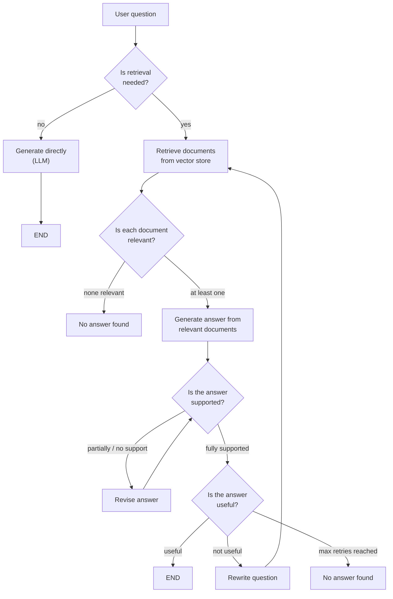
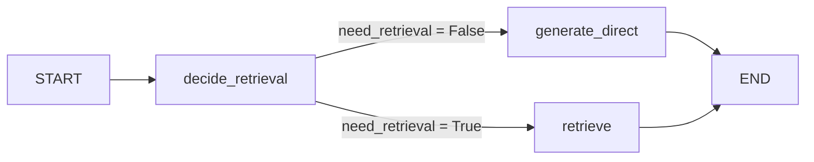
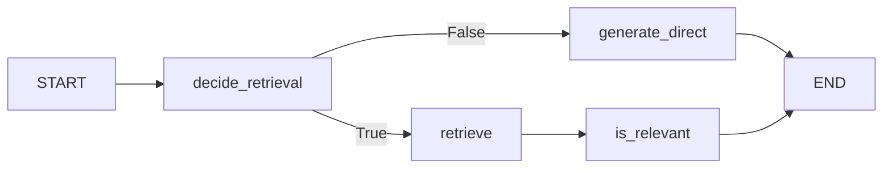
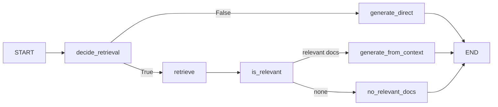
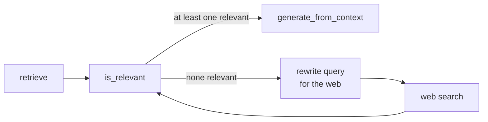
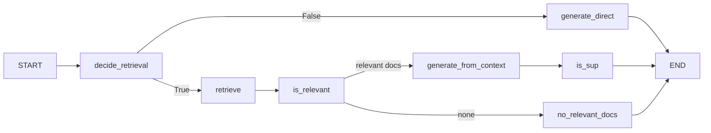
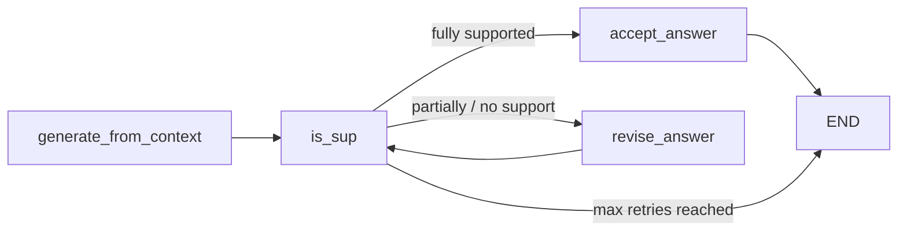
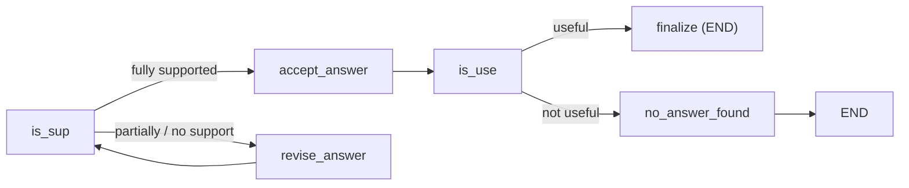
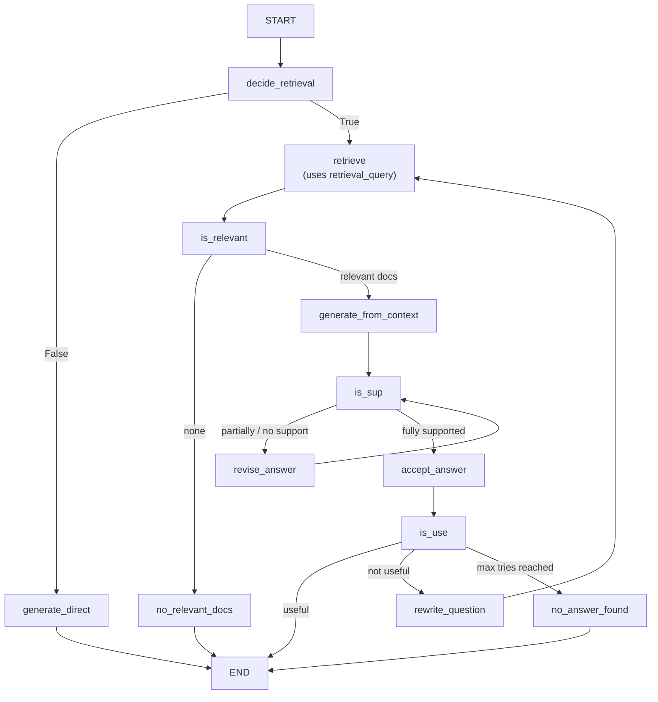

> **Video 28 of 28** · [Watch on YouTube](https://www.youtube.com/watch?v=BbO_XaEjzaA) · Translated from the
> Hindi transcript. Notes follow the video section by section, in its order.

Self-RAG is a RAG architecture that judges its own actions at every step instead of blindly trusting whatever it retrieves; this video explains why it is needed, how it is built, and then codes it step by step in LangGraph.

## Where this video fits

The previous video covered CRAG, Corrective RAG. This one covers another advanced RAG technique, **Self-RAG**, and the plan is to keep covering the other advanced RAG techniques over time. The video first teaches the theory (why Self-RAG is needed, what it contains conceptually) and then, as always, implements the whole technique in LangGraph. It may be a little long.

**Disclaimer:** you need to know RAG before watching this. You should have studied the RAG architecture and ideally built a few basic RAG applications. If you do not know RAG you will not understand Self-RAG at all. RAG is covered in depth, in theory and in code, in the LangChain playlist on the same channel; watch that first and come back.

## Why Self-RAG: three problems with traditional RAG

### Problem 1: RAG retrieves even when retrieval is unnecessary

Suppose you build a small, special RAG chatbot for children and give it lots of encyclopedia books, so children can chat with it and look up facts. A child asks a very simple question: **"How many seconds are there in a minute?"**

No encyclopedia is needed for this. The LLM's **parametric knowledge**, what it learned in training, is enough. But because the LLM sits inside a RAG chatbot, retrieval happens first, and some chunks are fetched:

- Chunk A: "A minute is a unit of time equal to 60 seconds."
- Chunk B: "In some contexts a minute can colloquially mean a short period of time." (probably from a history encyclopedia)
- Chunk C: "The concept of time units evolved historically." (from yet another encyclopedia)

The LLM must now answer from these three chunks, and it may say: *"A minute typically consists of about 60 seconds, depending on the context."* Two things went wrong:

1. **The answer is less confident.** The LLM already knew the answer, but the extra context left it unsure whether the question was about a "period of time" or literally seconds and minutes, so it hedges with "typically", "about", "depending on the context".
2. **Computation is wasted.** The question could have been answered directly, but we retrieved and then generated from the retrieval.

In traditional RAG you retrieve no matter what the question is. This is called **indiscriminate retrieval**, and it is a very bad thing.

### Problem 2: RAG blindly trusts retrieved documents

A user asks **"What causes diabetes?"** The retrieved document says: *"Diabetes is a chronic medical condition that affects how the body processes blood sugar."* That describes the effect of diabetes, not its cause.

Because the LLM is forced to answer from this chunk, it may say: *"Diabetes is caused by problems in how the body processes blood sugar."* That is not factually correct and sounds logically odd, and it is wrong only because the LLM was handed this document and told to answer from it.

Why was it retrieved at all? Retrieval works on **semantic similarity**, on whether the meaning roughly matches. The question was about diabetes and so is the document, so it was fetched. Once fetched, the LLM has no choice but to answer from it.

### Problem 3: RAG does not verify its own answers

Once RAG produces an answer, it does not check it; that answer goes straight to the user. Ideally, after generation there should be a check on whether the answer is actually correct, a hallucination, or simply wrong.

These three are the major problems of traditional RAG that Self-RAG tries to solve.

## What Self-RAG is

> Self-RAG stands for Self-Reflective RAG, where the LLM actively judges its own retrieval, evidence and answers instead of blindly trusting retrieved documents.

In simpler words, the biggest USP of Self-RAG is **self-reflection**: at every step the architecture judges its own actions and asks whether it did things correctly. Precisely, it tries to answer **four questions**:

1. **Is retrieval needed for this query at all?** This is asked as soon as the query arrives.
2. **Are all the retrieved documents relevant** for answering the question?
3. **Is the generated response grounded in the retrieved documents?** Did everything in the answer come from the documents, or did the LLM fabricate (hallucinate) something at its own level?
4. **Does the response actually answer the user's question?**

**Example for question 3.** The user asks "What are the side effects of drug X?" The retrieved documents say:

- "Drug X is commonly prescribed for hypertension."
- "Clinical trials report mild dizziness and nausea as observed side effects."

The LLM answers: *"Drug X may cause dizziness, nausea, fatigue and headaches, especially in older patients."* Dizziness and nausea come from the document. Fatigue, headaches and "especially in older patients" were fabricated: the LLM looked into its parametric knowledge, saw that many medicines list fatigue and headache alongside dizziness and nausea, and added them to make the answer "better". That should not happen. You were given evidence to answer from, and you fabricated extra evidence on your own; that is what hallucination is. Self-RAG asks whether the model is hallucinating at any level.

**Example for question 4.** The user asks "Why does ice float on water?" The retrieved document says "Ice is the solid form of water." The LLM, answering from that document, says *"Ice is the solid form of water that occurs at low temperature."* It is based on the document, but it does not answer the question. Self-RAG can tell that its answer does not fit the question.

This is the main difference and the main USP. Self-RAG is not "conscious" in the conventional sense, but it is very **self-reflective**: at every step it asks whether the next thing it is doing is right, and modifies its actions on that basis.

## How the Self-RAG architecture is built

The full architecture looks complex at first, but it is very logical, especially if you have worked with LangGraph before. It is explained first conceptually, step by step with examples, and then implemented in LangGraph.

The running scenario: a **chatbot built for a company**, so employees can retrieve company-related information.

### Step 1: decide whether retrieval is needed

The user asks a question. The first step is to look at it and ask: do I need retrieval, or can the model answer directly?

- "How many paid leave days do employees at our company get per year?" needs information retrieved from the company's documents.
- "What is a paid leave?" (say the user is a fresher) needs no documents; the LLM's parametric knowledge is enough.

If retrieval is not needed, the question goes straight to the LLM, which generates a direct answer, and the flow ends. If it is needed, you move on and retrieve documents from the vector store.

### Step 2: check each retrieved document for relevance

For every retrieved document (say d1, d2, d3) you ask: are you relevant for answering the question? Only the relevant ones survive; the rest are eliminated.

**No relevant documents.** For the question "How many paid leaves do employees at our company get per year?" the retrieved documents are:

- "The company observes 12 public holidays each year."
- "Employees may work remotely up to two days per week."
- "Leave requests must be approved by a reporting manager."

None of these answers the question. When not a single document is relevant, you print **"No answer found"** and the flow terminates.

**At least one relevant document.** In a second scenario the retrieved documents are:

- "All full-time employees are entitled to 24 paid leaves per calendar year." (very relevant; the answer comes straight from it)
- "Employees may take different types of leaves including sick leave and casual leave." (kind of related; not completely irrelevant)
- "Leave approval is managed through the HR portal." (irrelevant)

Since at least one document is relevant, you go to the next node and generate the answer from the relevant document(s), for example *"All full-time employees at our company are entitled to 24 paid leaves per calendar year."*

### Step 3: check the answer for hallucination (is it supported?)

Being hallucination-free means every fact in the answer comes from the retrieved documents, with nothing self-fabricated. There are three possibilities, using the 24-paid-leaves documents above:

- **Fully supported:** every fact comes from the given documents. *"All full-time employees at our company are entitled to 24 paid leaves per calendar year."* The "24 paid leaves" comes from the document, and nothing lies outside the three documents.
- **Partially supported:** some facts come from the documents, some the model fabricated because it felt they belonged in the answer. *"All full-time employees receive 24 leaves per year, which includes sick leaves and casual leaves, and these leaves are managed through the HR portal."* The model looked at two documents and invented the link that the 24 paid leaves include sick and casual leave. The documents never state that correlation.
- **No support:** all facts are self-generated; nothing comes from the retrieved documents. *"Employees are entitled to 30 paid leaves per year with additional carry-forward benefits."* Neither fact exists in any of the documents. This is a proper hallucination case.

A node checks which of the three categories the generated answer falls into.

- **Fully supported:** accept the answer and send it on to the next step.
- **Partially supported or no support:** send it to a **revise answer** node. Revise answer uses a very strong system prompt: "On the basis of these documents my model generated this answer, and it contains facts not present in the retrieved documents; remove those facts." The aim is to convert partially supported and unsupported answers into fully supported ones.

After revising, revise answer sends the new answer **back** to the support check. So a loop runs: check, revise, check again, until an answer with fully supported claims appears and takes the accept path. To stop this becoming an infinite loop, add a breaking condition such as a maximum number of tries (do not try more than 5 times, or 10).

### Step 4: check whether the answer is useful

A fully supported answer is then checked for **usefulness**: does it actually help answer the question?

You might think a hallucination-free answer must be useful. Not necessarily. Take the retrieved documents that state how many paid leaves there are, that you can take sick and casual leave, and that all this is handled through the HR portal. Suppose the model somehow ignores the first document entirely and answers: *"Employees may take different types of leaves such as sick leave and casual leaves, and leave requests are managed through the HR portal."* This is factually correct: no hallucination, every claim based on evidence, nothing fabricated. But it does not answer the question.

In the **is-use** step:

- If the answer justifies the question, go to the end and show it to the user.
- If not, **rewrite the user's initial question** and go all the way back to the retrieve stage. Fetch new documents, check their relevance, generate from the relevant ones, check hallucination, check usefulness again, and keep looping.

Again, to avoid an infinite loop, cap this at 5 or 10 runs. If the answer still is not useful after that, take a third path: **"No answer found"**, and the flow ends.



Going back to the four questions, all of them are answered in this architecture:

| Question Self-RAG asks | Where it is answered |
| --- | --- |
| Should retrieval happen? | The first step, at the query |
| Are the retrieved documents relevant? | The relevance check after retrieval |
| Is the generated response grounded? | The "supported" step |
| Does the response answer the user's question? | The "useful" step |

That is how Self-RAG works conceptually, and how it improves on conventional, traditional RAG.

## Two things before the code

1. **It is built step by step.** Rather than showing the whole end-to-end code at once, one feature is added, then the next on top of it, so the idea grows organically.
2. **The code differs from the original paper.** The paper used a different type of model, fine-tuned in its own way, and built the architecture on that. This implementation uses no fine-tuned model; it uses **OpenAI's LLMs**. So the finer, minute implementation details differ, but all the core ideas of Self-RAG are covered. The link to the original paper is in the video description; after watching this you should be able to follow it at least partly.

## Step 1 in code: decide retrieval, then generate directly or retrieve

The first build is only the part of the architecture in the first box: the user's question goes to a node that decides whether the LLM can answer from parametric knowledge or documents must be retrieved. Depending on that decision the flow takes one of two routes. On the direct route the LLM generates the answer. On the retrieve route documents are retrieved, but **no answer is generated yet**; the documents are only shown.



### The data: a hypothetical company

The chatbot is a RAG chatbot for a hypothetical company, **Nexa AI Solutions**, which does not exist. All its documents were generated with ChatGPT:

- **Company profile:** overview, when the company was founded, headquarters, number of employees, vision, mission, core values, the founder and the leadership team.
- **Company policies:** HR policies, leave policy, workplace conduct, disciplinary actions.
- **Products and pricing:** the main products of Nexa AI Solutions with their pricing.

### Loading, splitting, embedding

Import the libraries, load the three documents, and split them. Chunk size is 600 with overlap 150; after some experimenting these numbers gave the best results, but you can experiment too. Then embed everything into a vector store, create a retriever object for retrieval, and create the LLM.

```python
from typing import List, TypedDict
from pydantic import BaseModel, Field
from langchain_community.document_loaders import PyPDFLoader  # (implied, not shown in narration)
from langchain_text_splitters import RecursiveCharacterTextSplitter  # (implied, not shown in narration)
from langchain_community.vectorstores import FAISS  # (implied, not shown in narration)
from langchain_openai import ChatOpenAI, OpenAIEmbeddings
from langchain_core.documents import Document
from langchain_core.prompts import ChatPromptTemplate
from langgraph.graph import StateGraph, START, END

# load the three company documents
docs = []
for path in ["company_profile.pdf", "company_policies.pdf", "products_and_pricing.pdf"]:  # (implied, not shown in narration)
    docs.extend(PyPDFLoader(path).load())

splitter = RecursiveCharacterTextSplitter(chunk_size=600, chunk_overlap=150)
chunks = splitter.split_documents(docs)

vector_store = FAISS.from_documents(chunks, OpenAIEmbeddings())
retriever = vector_store.as_retriever()

llm = ChatOpenAI(model="gpt-4o-mini")  # (implied, not shown in narration)
```

### The state

- `question`: what the user asks
- `need_retrieval`: a boolean (yes/no) used for routing
- `docs`: where the retrieved documents are stored
- `answer`: the final answer shown to the user

```python
class State(TypedDict):
    question: str
    need_retrieval: bool
    docs: List[Document]
    answer: str
```

### The decide-retrieval node

First a Pydantic schema, `ShouldRetrieve`, which forces the model to answer yes or no in that shape:

```python
class ShouldRetrieve(BaseModel):
    should_retrieve: bool = Field(
        ..., description="True if external documents are needed to answer reliably, else False."
    )
```

Then the system prompt (pause the video to read it in full). Its content, as read out: you decide whether retrieval is needed and return JSON matching this schema. `should_retrieve` is True if answering requires specific facts, citations or information likely not in the model; it is False for a general explanation, a definition or reasoning. **If unsure, choose True.** The user's question is inserted into the prompt.

```python
decide_retrieval_prompt = ChatPromptTemplate.from_messages([
    ("system",
     "You decide whether retrieval is needed. Return JSON that matches this schema.\n"
     "Guidelines:\n"
     "- should_retrieve=True if answering requires specific facts, citations, or info likely not in the model.\n"
     "- should_retrieve=False for general explanations, definitions, or reasoning.\n"
     "- If unsure, choose True."),
    ("human", "Question: {question}"),  # (implied, not shown in narration)
])

should_retrieve_llm = llm.with_structured_output(ShouldRetrieve)

def decide_retrieval(state: State):
    decision = should_retrieve_llm.invoke(
        decide_retrieval_prompt.format_messages(question=state["question"])
    )
    return {"need_retrieval": decision.should_retrieve}
```

### The direct-generation node

Its system prompt: answer the question using your general knowledge; do not assume access to external documents; if you are unsure or the answer requires specific sources, say "I don't know based on my general knowledge." The question is inserted, the LLM is invoked, and the reply's content is stored in `answer`.

```python
direct_generation_prompt = ChatPromptTemplate.from_messages([
    ("system",
     "Answer the question using your general knowledge. "
     "Do not assume access to external documents. "
     "If you are unsure or the answer requires specific sources, say: "
     "\"I don't know based on my general knowledge.\""),
    ("human", "{question}"),  # (implied, not shown in narration)
])

def generate_direct(state: State):
    out = llm.invoke(direct_generation_prompt.format_messages(question=state["question"]))
    return {"answer": out.content}
```

### The retrieve node, routing and graph

Retrieval simply calls `retriever.invoke` with the question. A routing function sends the flow to `retrieve` if retrieval is needed, otherwise to `generate_direct`. Then the nodes and edges are defined, which gives exactly the graph above.

```python
def retrieve(state: State):
    return {"docs": retriever.invoke(state["question"])}

def route_after_decide(state: State):
    if state["need_retrieval"]:
        return "retrieve"
    return "generate_direct"

graph = StateGraph(State)
graph.add_node("decide_retrieval", decide_retrieval)
graph.add_node("generate_direct", generate_direct)
graph.add_node("retrieve", retrieve)

graph.add_edge(START, "decide_retrieval")
graph.add_conditional_edges("decide_retrieval", route_after_decide,
                            {"retrieve": "retrieve", "generate_direct": "generate_direct"})
graph.add_edge("generate_direct", END)
graph.add_edge("retrieve", END)

app = graph.compile()
```

### Testing step 1

- **"Who is the CEO of Nexa AI?"** needs retrieval, so no answer is printed (nothing generates yet). `need_retrieval` is True, and `docs` holds the retrieved chunks; somewhere in them you can see that Aarav Mehta is the CEO.
- **"What is machine learning?"** goes through the generate branch, so an answer appears. `need_retrieval` is False and `docs` is empty, because no retrieval happened.

## Step 2 in code: filter retrieved documents by relevance

The next small improvement: check each retrieved document for relevance to the question, keep only the relevant ones, and ignore the rest. A new state key, `relevant_docs`, holds only the relevant documents, and later answers will be generated from it. The workflow is: decide retrieval, retrieve if needed, test every document, store the relevant ones, and end.



Most of the code is identical: the same libraries, documents, text splitting, vector store, retriever and LLM. The retrieval decision, direct generation and retrieve nodes are unchanged. Only the state and one new node change.

`relevant_docs` is a list of `Document` objects, just like `docs`, except `docs` holds everything retrieved and `relevant_docs` holds only the relevant ones.

```python
class State(TypedDict):
    question: str
    need_retrieval: bool
    docs: List[Document]
    relevant_docs: List[Document]
    answer: str
```

The is-relevant node has a Pydantic schema with a single boolean field, `is_relevant`. The system prompt: you are judging document relevance; return JSON matching this schema; a document is relevant if it contains information useful for answering the question. Both the question and the individual document are passed in, and the model returns True or False. An LLM called `relevance_llm` is created with structured output.

The node initialises an empty `relevant_docs` list, loops over every retrieved document, invokes the LLM for each, and appends the document to `relevant_docs` whenever the decision is True. `relevant_docs` is stored in the state.

```python
class IsRelevant(BaseModel):
    is_relevant: bool = Field(..., description="True if document helps answer the question, else False.")

is_relevant_prompt = ChatPromptTemplate.from_messages([
    ("system",
     "You are judging document relevance. Return JSON that matches this schema.\n"
     "A document is relevant if it contains information useful for answering the question."),
    ("human", "Question:\n{question}\n\nDocument:\n{document}"),  # (implied, not shown in narration)
])

relevance_llm = llm.with_structured_output(IsRelevant)

def is_relevant(state: State):
    relevant_docs = []
    for doc in state.get("docs", []):
        decision = relevance_llm.invoke(
            is_relevant_prompt.format_messages(question=state["question"], document=doc.page_content)
        )
        if decision.is_relevant:
            relevant_docs.append(doc)
    return {"relevant_docs": relevant_docs}
```

`route_after_decide` is unchanged. The graph just gets the new node and a new edge:

```python
graph.add_node("is_relevant", is_relevant)
graph.add_edge("retrieve", "is_relevant")
graph.add_edge("is_relevant", END)
```

### Testing step 2

"Who is the CEO of Nexa AI?" goes through retrieve and then is_relevant. Still no answer is printed, because nothing is generated after retrieval. `need_retrieval` is True, and **four** documents were retrieved (it keeps looking like three, but it is four). `relevant_docs` contains only **one**: the first, which actually says who the CEO is. The others are semantically close but not relevant to the question, so they were ignored. From now on answers will be generated from that one document, not all four. You can already see how noise is being filtered out.

## Step 3 in code: answer from context, or report no relevant documents

The flow can now filter documents but still gives no answer. Next: if at least one document is relevant, answer from the relevant documents; if none is, tell the user there is no information and end.

A new state key, `context` (a string), holds all the relevant docs (one, two or more) merged together. The context plus the question go to the LLM, which generates the answer shown to the user.



Everything before is the same (retrieval decision, direct generation, retrieve, relevance filter). The new `generate_from_context` node uses the prompt "You are a business RAG assistant. Answer the user's question using only the provided context." It builds the context from `relevant_docs`, invokes the LLM with the question and the context, and returns the answer along with the context.

```python
class State(TypedDict):
    question: str
    need_retrieval: bool
    docs: List[Document]
    relevant_docs: List[Document]
    context: str
    answer: str

rag_generation_prompt = ChatPromptTemplate.from_messages([
    ("system",
     "You are a business RAG assistant. Answer the user's question using only the provided context."),
    ("human", "Question:\n{question}\n\nContext:\n{context}"),  # (implied, not shown in narration)
])

def generate_from_context(state: State):
    context = "\n\n".join(d.page_content for d in state.get("relevant_docs", []))
    out = llm.invoke(rag_generation_prompt.format_messages(question=state["question"], context=context))
    return {"answer": out.content, "context": context}
```

There is also a kind of empty node, `no_relevant_docs`, that simply returns this answer:

```python
def no_relevant_docs(state: State):
    return {"answer": "No relevant document found."}
```

Why not just go to END directly? There is a reason for this node, explained after the test.

The branching sends the flow to `generate_from_context` when there are relevant docs and to `no_relevant_docs` otherwise:

```python
def route_after_relevance(state: State):
    if len(state.get("relevant_docs", [])) > 0:
        return "generate_from_context"
    return "no_relevant_docs"

graph.add_node("generate_from_context", generate_from_context)
graph.add_node("no_relevant_docs", no_relevant_docs)
graph.add_conditional_edges("is_relevant", route_after_relevance,
                            {"generate_from_context": "generate_from_context",
                             "no_relevant_docs": "no_relevant_docs"})
graph.add_edge("generate_from_context", END)
graph.add_edge("no_relevant_docs", END)
```

:::note

In the narration the branching condition is read as "length of `relevant_docs` more than one". The intent stated just before it is "at least one relevant document", so the condition is written here as `> 0`.

:::

### Testing step 3

- **"Who is the CEO of Nexa AI?"** The information is in the documents, so at least one relevant doc comes out and the answer comes from it:

```text
The CEO of Nexa AI is Aarav Mehta.
```

- **"What is the refund policy of Nexa AI?"** The documents talk about pricing but say nothing about a refund policy, so the flow enters the other branch:

```text
No relevant document found.
```

### Why the extra `no_relevant_docs` node

It serves no special purpose now, but you can easily **replace it with a web search node**. If none of the retrieved documents is relevant, search the web instead and bring those results back into the same `is_relevant` step; if any is relevant, generate the answer from it.

Code for this is in the repository linked below the video. In that flow, when not a single retrieved document is relevant, the query is first **rewritten** (optimised for the web), searched on the web, and the resulting documents go back to `is_relevant`; if at least one is relevant the flow continues into `generate_from_context`.



Going forward, the web-search part is **not** implemented in this Self-RAG build; it was just one possibility, which is why a placeholder node was left there.

## Step 4 in code: the is-supported (hallucination) check

Next, check whether the answer generated from the retrieved documents hallucinates: is it fully supported, partially supported, or not supported? This is the **IsSUP** node. Nothing is done with the verdict yet; the goal is only to know which category the answer falls into.

Everything up to generation is the same. The generated answer goes to an LLM along with the question (and the context), and that LLM judges whether the answer is hallucinating, whether it fabricated any facts itself.



Two new state keys:

- `issup`: its value is one of the three categories.
- `evidence`: a list where the facts extracted from the context are placed. You do not strictly need it; it was added for debugging and can be removed. It is not that useful.

```python
from typing import Literal

class State(TypedDict):
    question: str
    need_retrieval: bool
    docs: List[Document]
    relevant_docs: List[Document]
    context: str
    answer: str
    issup: Literal["fully_supported", "partially_supported", "no_support"]  # value names (implied, not shown in narration)
    evidence: List[str]
```

Every earlier node is unchanged. The new part is a Pydantic schema, `IsSUP`, with a key that takes one of the three values and an `evidence` list. The system prompt is detailed (pause the video and read it); it is given the question, the generated answer, and the context built from the relevant documents. An LLM with structured output is created, and the node invokes it with the question, answer and context. It returns whether the answer is fully supported, partially supported or not supported, and the evidence is stored as well.

```python
class IsSUP(BaseModel):
    issup: Literal["fully_supported", "partially_supported", "no_support"]  # value names (implied, not shown in narration)
    evidence: List[str] = Field(default_factory=list)

issup_prompt = ChatPromptTemplate.from_messages([
    ("system", "..."),  # detailed grading instructions; shown on screen, not read out
    ("human", "Question:\n{question}\n\nAnswer:\n{answer}\n\nContext:\n{context}"),  # (implied, not shown in narration)
])

issup_llm = llm.with_structured_output(IsSUP)

def is_sup(state: State):
    decision = issup_llm.invoke(
        issup_prompt.format_messages(
            question=state["question"], answer=state.get("answer", ""), context=state.get("context", "")
        )
    )
    return {"issup": decision.issup, "evidence": decision.evidence}
```

The graph structure is the same; one node is added at the end:

```python
graph.add_node("is_sup", is_sup)
graph.add_edge("generate_from_context", "is_sup")
graph.add_edge("is_sup", END)
```

### Testing step 4

Some additional details are printed alongside the answer.

**"How many employees does Nexa AI have?"** The answer is in the documents. `need_retrieval` is True, four documents were fetched, two were relevant, and the is-supported verdict is **fully supported**: every fact in the answer comes from the relevant documents and the LLM fabricated nothing.

```text
Nexa AI has 85+ (over 85) employees.
```

The evidence extracted from the context includes "Employees: 85+" and a couple of other items. The answer must always come from inside the evidence, never from outside it, and that is exactly what happens here, so the answer is fully grounded in the context provided.

**"Describe Nexa AI company culture."** This prompt was found after a lot of experimenting. Its output comes back **partially supported**. If you pause and compare the evidence with the answer, the LLM has taken a little freedom and added some things of its own, outside the evidence, which is why the is-supported node calls it partially supported.

**"Does Nexa AI have a free trial? If yes, for how many days?"** This information is not in the provided documents. Nothing is captured in evidence, meaning none of the relevant documents says anything around this question. Yet the answer is:

```text
Yes, Nexa AI plans include a free trial which lasts for 14 days.
```

The model got no facts from the context but had to answer, so under pressure it looked into its parametric knowledge; it probably learned in training that most software products have a 14-day free trial, and printed that. The good part: because the system now self-reflects, it can say this is **no support**. That is how hallucination is being detected.

## Step 5 in code: revise unsupported answers, with a retry limit

Now the is-supported verdict drives the next decision:

- **Fully supported:** accept the answer for now and end the workflow.
- **Partially supported or not supported:** go to a new node, **revise answer**, whose purpose is to improve the answer using the given context so that no extra fabricated fact remains and every fact comes directly from the context.

After revising, the new answer goes **back** to is-supported to be checked again. Looping brings the risk of an infinite loop: you may keep getting stuck and never get a fully supported answer. The mechanism to break it is simple: keep a count of **max retries**. If the loop has run, say, more than five times, come out of it and show the user the answer labelled as not supported.



The first new thing in the code is a `retries` variable in the state, storing how many retries have been taken. Everything else up to is-supported is the same (retrieval decision, direct generation, retrieval, relevance filter, generate from context, is-supported).

The new code is the revise prompt. It says very strictly, "You are a strict reviser", and asks for the answer to be modified so that it is written on the basis of the context only. It gets the question, the current answer and the context, and returns a new, revised answer. Every time this function is called, one is added to `retries`.

```python
class State(TypedDict):
    question: str
    need_retrieval: bool
    docs: List[Document]
    relevant_docs: List[Document]
    context: str
    answer: str
    issup: Literal["fully_supported", "partially_supported", "no_support"]  # value names (implied, not shown in narration)
    evidence: List[str]
    retries: int

MAX_RETRIES = 5  # (implied, not shown in narration)

revise_prompt = ChatPromptTemplate.from_messages([
    ("system",
     "You are a STRICT reviser. Rewrite the answer so that it is based only on the context. "
     "..."),  # rest of the prompt shown on screen, not read out
    ("human", "Question:\n{question}\n\nCurrent Answer:\n{answer}\n\nContext:\n{context}"),  # (implied, not shown in narration)
])

def revise_answer(state: State):
    out = llm.invoke(
        revise_prompt.format_messages(
            question=state["question"], answer=state.get("answer", ""), context=state.get("context", "")
        )
    )
    return {"answer": out.content, "retries": state.get("retries", 0) + 1}

def accept_answer(state: State):
    return {}  # (implied, not shown in narration)

def route_after_issup(state: State):
    if state.get("issup") == "fully_supported":
        return "accept_answer"
    if state.get("retries", 0) >= MAX_RETRIES:
        return "accept_answer"  # (implied, not shown in narration) exit the loop, labelled not supported
    return "revise_answer"
```

The rest of the graph code is very similar: the revise-answer node is added and connected back to is-supported, which creates the loop together with its breaking condition.

```python
graph.add_node("revise_answer", revise_answer)
graph.add_node("accept_answer", accept_answer)
graph.add_conditional_edges("is_sup", route_after_issup,
                            {"accept_answer": "accept_answer", "revise_answer": "revise_answer"})
graph.add_edge("revise_answer", "is_sup")
graph.add_edge("accept_answer", END)
```

### Testing step 5

"Describe Nexa AI company culture." came back partially supported last time. Running it again now gives **fully supported**. The answer has been trimmed down and is entirely based on the evidence: this very strict revision means the answer no longer hallucinates. It took **one** retry to turn the answer from partially supported into fully supported.

That is how the is-supported self-reflection is implemented: you know whether the answer hallucinates, and if it does, how to fix it.

## Step 6 in code: the is-use (usefulness) check

The last question Self-RAG answers: is the generated answer useful? This is the **is-use** node. A fully supported answer from is-supported goes to is_use, and there are two outcomes:

- **Useful:** end the flow.
- **Not useful:** for now, go to a dummy node, **no answer found**, and end from there too.

It may seem odd to have two paths when both end. The second path exists because a loop will be implemented there later; for now the build goes step by step. The is-use node asks an LLM: here is the question and here is the generated answer; think and tell whether the answer justifies the question. The model says useful or not useful, and control goes down the matching path.



The code is largely identical. Two new state keys:

- `is_use`: only two possibilities, useful or not useful.
- `reason`: why it is useful, or why not.

Every earlier node is unchanged (retrieval decision, direct generation, retrieval, relevance filter, generate from context, hallucination check, revision). The new code is a Pydantic model for `is_use` and `reason`, a system prompt for them (pause and read it), an LLM with structured output, and the node, which sends the question and answer and stores the two returned values in the state. The routing sends a useful answer to `finalize`, which is basically END, and anything else to `no_answer_found`.

```python
class State(TypedDict):
    question: str
    need_retrieval: bool
    docs: List[Document]
    relevant_docs: List[Document]
    context: str
    answer: str
    issup: Literal["fully_supported", "partially_supported", "no_support"]  # value names (implied, not shown in narration)
    evidence: List[str]
    retries: int
    is_use: Literal["useful", "not_useful"]  # value names (implied, not shown in narration)
    reason: str

class IsUSE(BaseModel):
    is_use: Literal["useful", "not_useful"]  # value names (implied, not shown in narration)
    reason: str

is_use_prompt = ChatPromptTemplate.from_messages([
    ("system", "..."),  # shown on screen, not read out
    ("human", "Question:\n{question}\n\nAnswer:\n{answer}"),  # (implied, not shown in narration)
])

is_use_llm = llm.with_structured_output(IsUSE)

def is_use(state: State):
    decision = is_use_llm.invoke(
        is_use_prompt.format_messages(question=state["question"], answer=state.get("answer", ""))
    )
    return {"is_use": decision.is_use, "reason": decision.reason}

def no_answer_found(state: State):
    return {"answer": "No answer found."}

def route_after_is_use(state: State):
    if state.get("is_use") == "useful":
        return "finalize"
    return "no_answer_found"
```

### Testing step 6

**"Who is the CEO of Nexa AI?"** is-supported is fully supported, the evidence and final answer are shown, and the usefulness status is useful, with the reason:

```text
The answer directly provides the name of the CEO of Nexa AI.
```

**"What is the refund policy of Nexa AI?"** No related documents exist. is-supported is no support, the final answer is "No answer found", and the usefulness status is not useful, because the code labels an answer as not useful when it still does not come even after multiple retries. That is logical.

## Step 7 in code: rewrite the question and retry when the answer is not useful

Now decisions are made on usefulness:

- **Useful:** simply end the workflow.
- **Not useful:** try to make it useful. First **rewrite the user's question**, so that with the rewritten question you can go back and retrieve new documents that are better for answering it. Then repeat the whole flow: fetch new documents, find which are relevant, generate an answer from only those, check it for hallucination, and if it is fine, come back and check usefulness again.

This is a loop too, so it needs breaking logic: carry another **max retries** variable, and once it goes beyond 5 or 10 attempts, break out and go to **no answer found**, from where the workflow exits.



Two new state keys:

- `retrieval_query`: the rewritten question.
- `rewrite_tries`: the max-tries counter for this loop.

All other nodes are the same except one real change: the **retrieve** node now retrieves on the basis of `retrieval_query` instead of `question`. The relevance filter, generate from context, hallucination check, accept answer, revision and is-use decision are all unchanged.

```python
class State(TypedDict):
    question: str
    retrieval_query: str
    rewrite_tries: int
    need_retrieval: bool
    docs: List[Document]
    relevant_docs: List[Document]
    context: str
    answer: str
    issup: Literal["fully_supported", "partially_supported", "no_support"]  # value names (implied, not shown in narration)
    evidence: List[str]
    retries: int
    is_use: Literal["useful", "not_useful"]  # value names (implied, not shown in narration)
    reason: str

def retrieve(state: State):
    q = state.get("retrieval_query") or state["question"]
    return {"docs": retriever.invoke(q)}
```

The new node rewrites the question. Its schema has a `retrieval_query` field described as "Rewritten query optimized for vector retrieval against internal company PDFs." Its system prompt: rewrite the user's question into a query optimised for vector retrieval over internal company PDFs; keep it short, preserve key entities, add 2–5 high-signal keywords. It is given the question, the previous retrieval query and the answer just generated. An LLM with structured output is invoked, and it returns the new retrieval query, while the number of tries so far is updated (you can skip sending those extra fields and it still works).

```python
class RewriteDecision(BaseModel):
    retrieval_query: str = Field(
        ..., description="Rewritten query optimized for vector retrieval against internal company PDFs."
    )

rewrite_prompt = ChatPromptTemplate.from_messages([
    ("system",
     "Rewrite the user's question into a query optimized for vector retrieval over INTERNAL company PDFs.\n"
     "Keep it short, preserve key entities, add 2-5 high-signal keywords."),
    ("human",
     "Question:\n{question}\n\nPrevious retrieval query:\n{retrieval_query}\n\nAnswer (if any):\n{answer}"),  # (implied, not shown in narration)
])

rewrite_llm = llm.with_structured_output(RewriteDecision)

def rewrite_question(state: State):
    decision = rewrite_llm.invoke(
        rewrite_prompt.format_messages(
            question=state["question"],
            retrieval_query=state.get("retrieval_query", ""),
            answer=state.get("answer", ""),
        )
    )
    return {"retrieval_query": decision.retrieval_query,
            "rewrite_tries": state.get("rewrite_tries", 0) + 1}
```

Then the whole graph is built, and when initialising the state you send the `question` and also a `retrieval_query`. At the start the question itself is the retrieval query; it keeps changing later only if the answer turns out not useful.

```python
result = app.invoke({
    "question": "Describe Nexa AI company culture.",
    "retrieval_query": "Describe Nexa AI company culture.",
    "rewrite_tries": 0,
})
```

### Testing the full build

Everything is printed. For **"Describe Nexa AI company culture."**:

- needs retrieval: True; rewrite tries: 0
- one try needed for support
- total documents retrieved: 4; relevant: 2; the fetched sources are listed
- is-supported: fully supported, with the evidence
- usefulness: useful, with the reason
- and the final answer

The whole structure is now built and working. There is no example here where the answer was at first not useful and became useful after retrieving again and again: attempts to find one either stayed useful or stayed not useful. Test the code with different questions yourself to see an answer go from not useful to useful. Either way, the flow has been built correctly.

What is on screen at the end is the essence, the core, of Self-RAG, built in LangGraph step by step with intuition: what Self-RAG is, why it is needed, and how to implement it in LangGraph.
