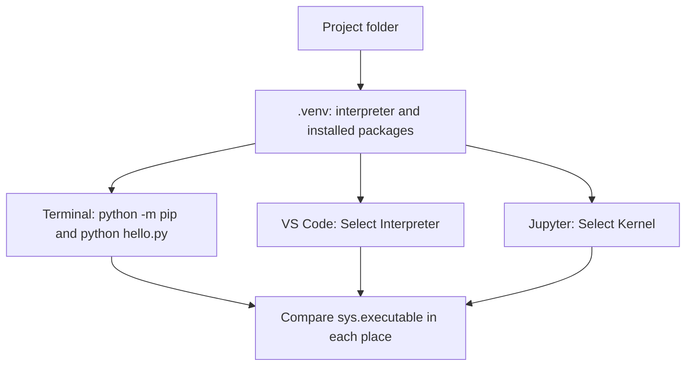

> **Video:** [03:58–51:36](https://www.youtube.com/watch?v=ygXn5nV5qFc&t=238s), with package management revisited near [2:48:48](https://www.youtube.com/watch?v=ygXn5nV5qFc&t=10128s).

Make the editor, terminal and interactive window run the same Python before installing packages.

## Know the pieces

| Piece | Its job |
| --- | --- |
| Python interpreter | Executes Python code |
| `.py` file | Stores your program as text |
| VS Code | Edits files and launches tools |
| Terminal and shell | Accept commands such as `python hello.py` |
| Virtual environment | Gives a project its own installed packages |
| pip | Installs packages into a Python environment |
| Jupyter kernel | A running Python process that remembers interactive variables |
| Workspace | VS Code's collection of opened folders and settings |

An editor extension does not install the Python interpreter. Installing a package into one environment does not make it available in every other environment.

## Install and verify Python

Use the [official Python downloads](https://www.python.org/downloads/) and choose a supported Python 3 version compatible with the libraries you plan to use. These beginner examples use Python 3.12 or later; they do not require the newest release.

| Platform | Verify installation | Create an environment later |
| --- | --- | --- |
| Windows | `py --version` | `py -m venv .venv` |
| macOS / Linux | `python3 --version` | `python3 -m venv .venv` |

The video shows a Windows installer with an **Add Python to PATH** checkbox. Installer interfaces can change; the success check is that a new terminal can run Python. On macOS, an existing `python3` may belong to developer tools or another installation. Inspect the version rather than assuming it is the one you just installed. On Linux, install Python and its venv support with your distribution's package manager if they are missing.

The commands above belong in a terminal. At a Python `>>>` prompt, enter `exit()` first. That prompt expects Python expressions, so shell commands such as `pip install requests` produce a syntax error there.

## Create the project and first file

1. Create a `python-projects` folder wherever you keep your work.
2. Inside it, create `python-for-ai` and open that folder in [VS Code](https://code.visualstudio.com/).
3. Install Microsoft's **Python**, **Pylance** and **Jupyter** extensions.
4. Create `hello.py`. Confirm the extension is `.py`, not `.py.txt`.
5. Save the following code, then use **Python: Run Python File in Terminal** from the Command Palette.

```python
print("Hello, world!")
print("I am learning Python for AI.")
```

Expected output:

```text
Hello, world!
I am learning Python for AI.
```

Open the Command Palette with `Ctrl+Shift+P` on Windows/Linux or `Cmd+Shift+P` on macOS. **Python: Select Interpreter** chooses the Python used by the Python extension. The video's `Cmd+Enter` shortcut is a custom binding; use the command name or play button until you set your own shortcut.

**File → Save Workspace As** can save a `.code-workspace` file for reopening the project. This is convenient and shown in the video, but opening a folder is already a valid single-folder workspace. Neither a workspace nor a saved `.py` file preserves the running kernel's variables.

Themes and Explorer tree indentation change appearance only. The video demonstrates Atom One Dark and a wider tree indent; choose these if they help you read the editor.

## One environment for this project

In VS Code, run **Python: Create Environment → Venv**, choose the interpreter, and select the resulting `.venv`. Alternatively, run the terminal commands below from the project folder.

**macOS / Linux:**

```bash
python3 -m venv .venv
source .venv/bin/activate
python --version
```

**Windows PowerShell:**

```powershell
py -m venv .venv
.\.venv\Scripts\Activate.ps1
python --version
```

If PowerShell blocks activation, you can use the environment's Python directly without changing execution policy:

```powershell
.\.venv\Scripts\python.exe hello.py
.\.venv\Scripts\python.exe -m pip --version
```

Activation adjusts the shell's command lookup. It does not move your project, copy your source code, or install packages. After selecting a different interpreter in VS Code, open a **new terminal**; an older terminal can still be using the previous environment.

Verify the actual executable:

```bash
python -c "import sys; print(sys.executable)"
python -m pip --version
```

Both paths should refer to this project's `.venv`. Run `deactivate` when you want to leave an activated environment.



A venv isolates Python packages. Conda can also manage Python versions and non-Python libraries. The video uses venv and later uv; you do not need Anaconda for these exercises. A conda environment is not always interchangeable with pip/venv when a project depends on native libraries.

## Install, import and recreate

Run these in the activated environment:

```bash
python -m pip install requests ipykernel
python -m pip show requests
```

Then run this **Python** code:

```python
import requests

print(requests.__version__)
print(requests.__file__)
```

`python -m pip` ties the installer to the same `python` command used for execution. `import` loads an installed module into the current process. The [Python environment tutorial](https://docs.python.org/3/tutorial/venv.html) explains activation and package installation.

For the pip workflow, save and restore the installed dependency versions:

```bash
python -m pip freeze > requirements.txt
python -m pip install -r requirements.txt
```

The first command records the current environment; the second installs those requirements into the environment you are using. `freeze` includes indirect dependencies and tools you installed for experimentation. It does not record the Python interpreter or guarantee identical results across operating systems. A hand-written requirements file can instead list direct dependencies; these are different purposes. Later, the [uv workflow](../06-engineering/00-project-workflow.md) separates declared dependencies from the resolved lockfile.

Share the dependency files and source code. Recreate `.venv` on another machine rather than copying it.

## Interactive Python: select the kernel too

The video uses the **Jupyter Interactive Window** to run selected Python code. Follow the [VS Code interactive-window guide](https://code.visualstudio.com/docs/python/jupyter-support-py) if the editor controls have moved.

1. Install `ipykernel` in the project environment, as above.
2. Open the Interactive Window and select this project's `.venv` as its kernel.
3. Search VS Code settings for **Jupyter: Interactive Window: Text Editor: Execute Selection**, and enable it if you want `Shift+Enter` to send selected code there.
4. Alternatively, separate a `.py` file into cells with `# %%` and use **Run Cell**.

```python
# %% Define the inputs
price = 12
quantity = 3

# %% Inspect a result
total = price * quantity
print(total)  # 36
```

The `# %%` lines are comments to ordinary Python. Jupyter recognises them as cell boundaries. In an interactive window, a bare expression such as `total` can display its value. In a script, use `print(total)` to display it.

### The hidden-state trap

Run the first cell, then change `price = 12` to `price = 20` in the editor without rerunning that cell. Running the second cell still uses the old value in memory. Editing text and executing code are different actions.

Restart the kernel, run all cells in order, and finally run `python hello.py` or your complete script in the terminal. This catches missing imports, stale variables and accidental dependence on execution order.

## Diagnose setup failures

| Symptom | Check | Fix |
| --- | --- | --- |
| `python` is not found | Does `python3` or `py` work? | Use the correct platform command; reopen the terminal after installation |
| `ModuleNotFoundError` after installing a package | Print `sys.executable` in the failing process | Install with that interpreter, then select it in VS Code and Jupyter |
| Script works, notebook fails | Compare terminal executable and kernel executable | Switch kernel or install into the kernel environment |
| Editor shows an import warning, script works | Selected interpreter and `requests.__file__` | Select the right interpreter; reload the editor if analysis is stale |
| `NameError` in the interactive window | Was the defining cell executed? | Restart and run the file in order |
| `FileNotFoundError` | Print `Path.cwd()` | Use an explicit path base; see [paths](../02-programs/03-files-and-context-managers.md#start-here-where-is-python-looking) |

The video enables `python.terminal.executeInFileDir`. That setting changes where editor-launched terminal runs start. It does not control every notebook, external terminal or scheduled run. Learn the current-working-directory rule before relying on this convenience.

## Added practice: set it up twice

Create another folder called `python-setup-check`. Give it its own `.venv`, install `ipykernel`, and create a script that prints a greeting and `sys.executable`. Run it in both the terminal and the Interactive Window. Close VS Code, reopen the folder or saved workspace, and repeat.

- [ ] I can explain the difference between a workspace, an environment and a kernel.
- [ ] I can show that installs and execution use the same interpreter.
- [ ] I can run a saved file without relying on interactive state.
- [ ] I can rebuild a project from source and its dependency files.
