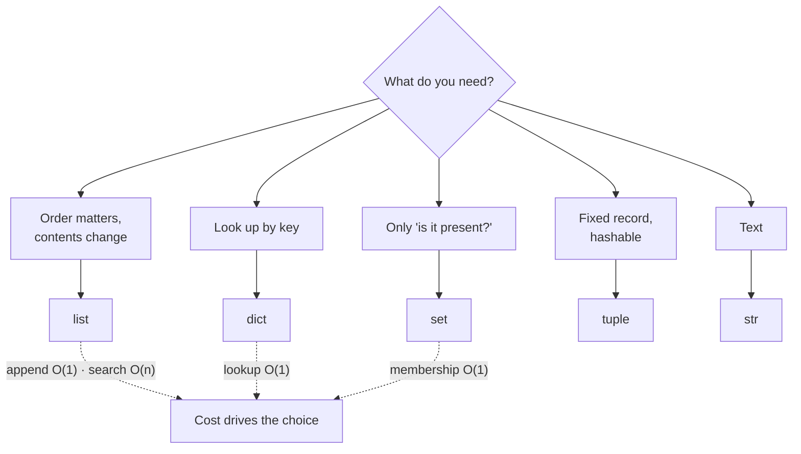

**In one line.** Five containers cover almost everything: list for order, dict for lookup, set for membership, tuple for fixed records, and str for text.

## The idea in plain words

Python gives you a small set of built-in types, and picking the right one is most of the performance work you will ever do at this level.

The distinction that causes the most bugs is **mutable versus immutable**. Lists, dicts and sets can be changed in place; strings, tuples, ints and frozensets cannot. That single fact explains default-argument bugs, surprise aliasing, and why only immutable things can be dictionary keys.

The second thing to internalise is **cost**:

- `list` — ordered, indexable. Append is O(1); searching or inserting at the front is O(n).
- `dict` — hash lookup. Insert, lookup and delete are O(1) on average, and it keeps insertion order.
- `set` — a dict without values. Membership tests are O(1), which is why `x in big_set` beats `x in big_list` by orders of magnitude.
- `tuple` — an immutable list. Slightly smaller, hashable, and signals "this is a fixed record".
- `str` — immutable sequence of characters; every "modification" builds a new string.



## How it works

### Mutability, aliasing and the classic trap

Two names can point at the same object. Mutating through one is visible through the other:

```python
a = [1, 2, 3]
b = a          # same object, not a copy
b.append(4)
print(a)       # [1, 2, 3, 4]
```

Use `list(a)`, `a.copy()` or `copy.deepcopy(a)` when you want independence. The most famous version of this bug is a mutable default argument:

```python
def add_item(item, basket=[]):     # WRONG: the list is created once, at def time
    basket.append(item)
    return basket
```

Use `basket=None` and create the list inside the function.

### Strings are immutable, so build them properly

Every `+=` on a string in a loop allocates a new string. For anything longer than a few items, collect into a list and `"".join(...)`, or use an f-string.

f-strings are the default formatting tool: `f"{name:>10} {value:.2%}"` handles alignment, precision and percent formatting in one place. The `=` specifier (`f"{x=}"`) prints both the expression and its value, which is excellent for debugging.

### Dict and set are the performance levers

Turning an `in list` check into an `in set` check is the single most common real speedup in ordinary Python code — O(n) becomes O(1).

Modern dict idioms worth knowing: `dict.get(key, default)`, `dict.setdefault`, `collections.defaultdict`, `collections.Counter`, dict comprehensions, and the merge operators `{**a, **b}` or `a | b`.

## A real system that works this way

**Deduplicating an event stream.** A naive implementation keeps a list of seen ids and does `if event_id not in seen` — which is O(n) per event and quadratic overall. With a `set` it is O(1) per event. On a million events that is the difference between minutes and a fraction of a second, and it is the same three lines of code.

**Config objects** are usually `dict` in transit and a frozen `dataclass` at rest: mutable while you are assembling it, immutable and hashable once it is agreed.

## Code you can run

Measure the difference yourself rather than taking it on faith.

```python
import random, timeit
from collections import Counter

random.seed(0)
ids = [random.randrange(200_000) for _ in range(20_000)]
haystack_list = list(range(200_000))
haystack_set = set(haystack_list)

def with_list():
    return sum(1 for i in ids[:2_000] if i in haystack_list)

def with_set():
    return sum(1 for i in ids if i in haystack_set)

t_list = timeit.timeit(with_list, number=1)
t_set = timeit.timeit(with_set, number=1)
print(f"list membership, 2k lookups : {t_list*1000:8.1f} ms")
print(f"set  membership, 20k lookups: {t_set*1000:8.1f} ms")
print(f"per-lookup speedup ≈ {(t_list/2_000) / (t_set/20_000):,.0f}×\n")

# mutability in one screen
a = [1, 2, 3]
b = a
b.append(4)
print("aliasing:", a)

def bad(item, basket=[]):
    basket.append(item); return basket

def good(item, basket=None):
    basket = [] if basket is None else basket
    basket.append(item); return basket

print("mutable default:", bad("x"), bad("y"))     # ['x'] then ['x', 'y'] — shared!
print("fixed          :", good("x"), good("y"))

# counting without writing a loop
words = "the cat sat on the mat the end".split()
print("counter:", Counter(words).most_common(2))
```

## Designing with it

**Choosing a container**

| Need | Use | Watch out for |
| --- | --- | --- |
| Ordered, growing sequence | `list` | `insert(0, …)` and `in` are O(n) — use `collections.deque` for queues |
| Keyed lookup | `dict` | Keys must be hashable (so immutable) |
| Membership / uniqueness | `set` | Unordered; no indexing |
| Fixed record passed around | `tuple` or `NamedTuple` | Prefer a `dataclass` once it has behaviour |
| Text | `str` | Build with `join`, not `+=` in a loop |

**Rules that prevent most bugs**

- **Never use a mutable default argument.** Use `None` and create inside.
- **Copy at the boundary.** If a function stores a list the caller passed in, copy it, or the caller can mutate your state later.
- **Prefer immutable for anything shared** across threads, cached, or used as a key.
- **Let the structure carry meaning**: a `set` says "uniqueness matters", a `tuple` says "this shape is fixed". That communicates more than a comment.

## Where this stands in 2026

:::info Industry view

- Container choice is the most common source of accidental O(n²) in production Python — the fix is almost always a `set` or a `dict`.
- `collections` (`Counter`, `defaultdict`, `deque`) is standard in professional code; hand-rolled equivalents read as inexperience.
- Immutability is increasingly the default for shared state — frozen dataclasses and tuples avoid a whole class of concurrency bug.
- f-strings are the expected formatting style; `%` and `.format()` survive only in legacy code and logging calls.

:::

## Practice questions

<details>
<summary><strong>Q1.</strong> Why can a tuple be a dictionary key but a list cannot?</summary>

Keys must be hashable, and hashability requires the value never to change — otherwise the hash computed at insert time would stop matching. Tuples are immutable (provided their contents are too), lists are not.

</details>

<details>
<summary><strong>Q2.</strong> What does `a = [1,2]; b = a; b += [3]` leave in `a`, and why?</summary>

`[1, 2, 3]`. `+=` on a list calls `__iadd__`, which extends **in place**, so both names still point at the same mutated list. `b = b + [3]` would instead create a new list and leave `a` unchanged.

</details>

<details>
<summary><strong>Q3.</strong> When is a list comprehension the wrong choice?</summary>

When the result is never used (use a plain loop — a comprehension for side effects is misleading), when it will not fit in memory (use a generator expression), or when the logic needs more than one condition and a transformation and stops being readable.

</details>

## Further reading

- [Python tutorial: data structures](https://docs.python.org/3/tutorial/datastructures.html) — the official walkthrough of the built-in containers.
- [TimeComplexity wiki](https://wiki.python.org/moin/TimeComplexity) — the cost table for every built-in operation. Worth memorising the top half.
- [collections — container datatypes](https://docs.python.org/3/library/collections.html) — `Counter`, `defaultdict`, `deque` and friends.
