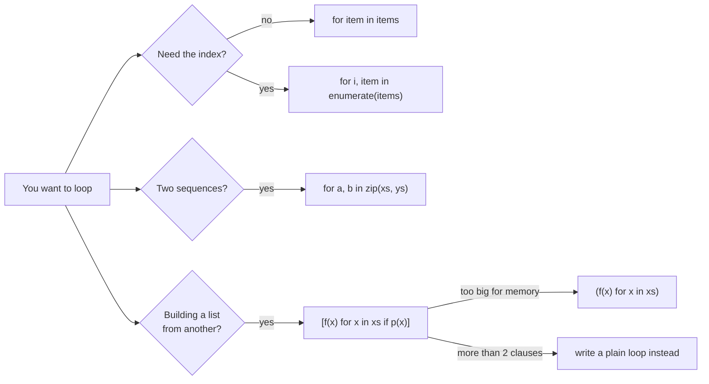

**In one line.** Python has few control structures, and idiomatic code leans on comprehensions and iteration protocols rather than index arithmetic.

## The idea in plain words

The building blocks are `if/elif/else`, `for`, `while`, and the jump statements `break`, `continue` and `return`.

Three things separate idiomatic Python from translated-from-Java Python:

- **Iterate over objects, not indices.** `for item in items` — and when you need the position, `enumerate(items)`; when you need two sequences together, `zip(a, b)`.
- **Truthiness.** Empty containers, `0`, `None` and `""` are falsy, so `if items:` is the idiom rather than `if len(items) > 0:`. Be careful when `0` is a legitimate value — then test `is not None` explicitly.
- **Comprehensions.** `[f(x) for x in xs if p(x)]` replaces the build-an-empty-list-and-append loop, and reads as a single expression.

Two newer tools matter: the **walrus operator** `:=` assigns inside an expression, and **structural pattern matching** (`match`/`case`) destructures data by shape — far more than a switch statement.



## How it works

### Loop with the iteration protocol, not with indices

```python
for i, (name, score) in enumerate(zip(names, scores), start=1):
    print(f"{i:2}. {name:<10} {score:5.1f}")
```

`enumerate` gives you position, `zip` pairs sequences, and `zip(*rows)` transposes. `itertools` covers the rest: `chain`, `islice`, `groupby`, `product`, `accumulate`.

A `for` loop can carry an `else` clause, which runs only if the loop finished **without** `break` — useful for search loops, and worth a comment because few people know it.

### Comprehensions, and when to stop

```python
squares      = [x * x for x in range(10)]
evens        = [x for x in data if x % 2 == 0]
lookup       = {user.id: user for user in users}
unique_tags  = {tag for post in posts for tag in post.tags}
lazy_lines   = (line.strip() for line in file)      # generator: no list built
```

The readability rule: **one loop clause and at most one condition**. Past that, write the loop out. Nested comprehensions that need a comment are worse than the loop they replaced.

### Walrus and pattern matching

The walrus operator avoids computing something twice or a redundant pre-assignment:

```python
while (chunk := stream.read(8192)):
    process(chunk)

if (match := pattern.search(line)) is not None:
    print(match.group(1))
```

Structural pattern matching destructures by **shape**, including classes and mappings:

```python
match event:
    case {"type": "click", "pos": (x, y)}:
        handle_click(x, y)
    case {"type": "key", "key": str(key)} if key.isalpha():
        handle_key(key)
    case Order(status="paid", total=total) if total > 1000:
        escalate(total)
    case _:
        ignore(event)
```

This is the natural way to handle heterogeneous JSON events and replaces long `isinstance` chains.

## A real system that works this way

**Event routers.** Any service that consumes a stream of differently shaped JSON messages — webhooks, queue consumers, agent tool calls — ends up as either a chain of `if msg["type"] == …` or a `match` block. The `match` version fails more loudly when a message has an unexpected shape, because an unmatched case is visible rather than silently falling through.

**ETL scripts** live on comprehensions and generator expressions: a chain of lazy transformations that never materialises the whole dataset.

## Code you can run

```python
from dataclasses import dataclass

# --- iteration idioms -------------------------------------------------------
names = ["ada", "grace", "alan"]
scores = [99.5, 97.25, 91.0]
for rank, (name, score) in enumerate(zip(names, scores), start=1):
    print(f"{rank}. {name:<6} {score:5.1f}")

# for/else: the else runs only if no break happened
def find_first_negative(values):
    for v in values:
        if v < 0:
            return v
    else:
        return None

print("first negative:", find_first_negative([3, 1, -4, 5]), find_first_negative([1, 2]))

# --- walrus: read a stream in chunks without repeating yourself -------------
import io
stream = io.StringIO("abcdefghij" * 3)
chunks = []
while (chunk := stream.read(8)):
    chunks.append(chunk)
print("chunks:", len(chunks), "->", chunks[:3], "…")

# --- structural pattern matching over heterogeneous events -----------------
@dataclass
class Order:
    status: str
    total: float

def route(event):
    match event:
        case {"type": "click", "pos": (x, y)}:
            return f"click at ({x},{y})"
        case {"type": "key", "key": str(key)} if key.isalpha():
            return f"letter {key!r}"
        case Order(status="paid", total=total) if total > 1000:
            return f"escalate large order: {total:.2f}"
        case Order(status=status):
            return f"order in status {status!r}"
        case _:
            return "unhandled event"

for e in [{"type": "click", "pos": (3, 9)},
          {"type": "key", "key": "k"},
          {"type": "key", "key": "7"},
          Order("paid", 2500.0),
          Order("pending", 10.0),
          42]:
    print(f"  {route(e)}")
```

## Designing with it

**Readability rules that hold up in review**

| Situation | Do |
| --- | --- |
| Transforming a sequence | Comprehension, if it fits one line and one condition |
| Huge or streaming data | Generator expression — constant memory |
| More than two clauses | Plain loop with a name for the intermediate |
| Branching on data shape | `match`/`case`, not an `isinstance` ladder |
| Testing "has a value" where 0 is valid | `if x is not None`, never `if x` |

**Flat is better than nested.** Guard clauses beat deep nesting:

```python
def process(order):
    if order is None:
        return
    if not order.items:
        return
    ...   # the real work, at one level of indentation
```

**Avoid `while True` without an exit condition in the header** — if you write one, the `break` should be immediately visible, and the loop should have a step or time budget in anything long-running.

## Where this stands in 2026

:::info Industry view

- `match`/`case` is now common in event-driven and API code, and is the expected answer to "how would you dispatch on message shape".
- The walrus operator is standard in stream-reading and regex code; reviewers will ask for it where you compute the same thing twice.
- Comprehension abuse is a frequent review comment — the readable limit is roughly one `for` and one `if`.
- Generator expressions are the default for large data: constant memory and they compose into pipelines.

:::

## Practice questions

<details>
<summary><strong>Q1.</strong> When is `if items:` wrong and `if items is not None:` right?</summary>

When an empty container is a meaningful value distinct from "no value at all" — for example a filter that legitimately matched nothing. The same applies to numbers where `0` is valid data.

</details>

<details>
<summary><strong>Q2.</strong> What does the `else` on a `for` loop do?</summary>

It runs when the loop completes without hitting `break`. It is the "search finished and found nothing" branch; without it you need a flag variable.

</details>

<details>
<summary><strong>Q3.</strong> Give a case where `match` beats `if/elif`.</summary>

Destructuring nested data: `case {"user": {"id": int(uid)}}` binds and type-checks in one step. An `if` chain would need repeated key lookups, `isinstance` checks and temporary variables.

</details>

## Further reading

- [Python tutorial: control flow](https://docs.python.org/3/tutorial/controlflow.html) — the official reference including `match`.
- [PEP 636 — Structural Pattern Matching tutorial](https://peps.python.org/pep-0636/) — the best explanation of `match`, with worked examples.
- [PEP 572 — Assignment expressions](https://peps.python.org/pep-0572/) — the walrus operator and the reasoning behind it.
- [itertools](https://docs.python.org/3/library/itertools.html) — the iteration toolkit that removes most manual loops.
