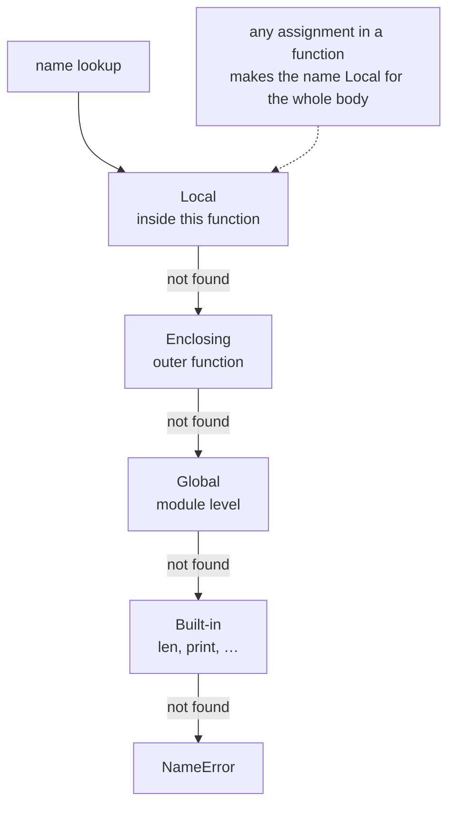

**In one line.** Functions are ordinary objects: you can pass them, return them, and close over the variables they were created with.

## The idea in plain words

A Python function signature can express more than most people use:

```python
def f(pos_only, /, normal, *args, kw_only, **kwargs):
```

Everything before `/` must be positional; everything after `*` must be passed by keyword. Making an argument **keyword-only** is the cheapest way to stop `f(True, False)` call sites that nobody can read.

Two rules cause most surprises:

- **Defaults are evaluated once**, at definition time. A mutable default is shared by every call.
- **Arguments are passed by object reference.** Rebinding a parameter inside the function does not affect the caller; mutating the object does.

**Scope** follows LEGB: Local, Enclosing, Global, Built-in. Assigning to a name anywhere in a function makes it local for the whole function — which is why reading it before assignment raises `UnboundLocalError`. `global` and `nonlocal` opt out, and both are usually a smell.

Functions are **first-class**: they can be stored, passed and returned. A function that captures a variable from an enclosing scope is a **closure**, and that is the mechanism behind decorators, callbacks and dependency injection.



## How it works

### Signatures that document themselves

```python
def send(message, *, retries=3, timeout=5.0, dry_run=False):
    ...
send("hello", retries=5, dry_run=True)     # every flag is named at the call site
```

`*args` collects extra positionals into a tuple; `**kwargs` collects extra keywords into a dict. Use them for pass-through wrappers (decorators, adapters), not as a substitute for a real signature — `**kwargs` on a public API hides what the function accepts from readers and type checkers alike.

### Closures and late binding

A closure remembers the *variable*, not its value at creation time. The classic trap:

```python
fns = [lambda: i for i in range(3)]
[f() for f in fns]        # [2, 2, 2] — all three see the final i
```

Bind explicitly with a default argument (`lambda i=i: i`) or `functools.partial`.

### Lambdas, and when to name the function

`lambda` is a single expression with no statements, no annotations and no docstring. Use it for a throwaway key function (`sorted(rows, key=lambda r: r.score)`). The moment it needs a comment, a name or a test, write a `def`.

## A real system that works this way

**Retry and timing wrappers** are closures: a factory takes configuration, returns a function that captures it. That is the whole idea behind decorators, and behind most plugin systems.

**Dependency injection in FastAPI or pytest fixtures** is the same machinery — a callable produced with its dependencies already bound, passed where a plain function is expected.

## Code you can run

```python
from functools import partial, reduce

# --- keyword-only arguments make call sites readable ------------------------
def resize(image, *, width, height, keep_aspect=True):
    return f"resize({image}, {width}x{height}, keep_aspect={keep_aspect})"

print(resize("cat.png", width=800, height=600))

# --- mutable default: the bug and the fix -----------------------------------
def collect_bad(item, into=[]):
    into.append(item); return into

def collect_good(item, into=None):
    into = [] if into is None else into
    into.append(item); return into

print("shared default :", collect_bad(1), collect_bad(2))
print("fresh each call:", collect_good(1), collect_good(2))

# --- closures and late binding ----------------------------------------------
late = [lambda: i for i in range(3)]
early = [lambda i=i: i for i in range(3)]
print("late binding  :", [f() for f in late])
print("bound default :", [f() for f in early])

# --- a closure factory: configuration captured once -------------------------
def make_retry(attempts, on_error):
    def retry(fn, *args, **kwargs):
        for attempt in range(1, attempts + 1):
            try:
                return fn(*args, **kwargs)
            except Exception as exc:
                on_error(attempt, exc)
        raise RuntimeError(f"failed after {attempts} attempts")
    return retry

calls = {"n": 0}
def flaky():
    calls["n"] += 1
    if calls["n"] < 3:
        raise ValueError("boom")
    return "succeeded"

retry3 = make_retry(3, on_error=lambda a, e: print(f"  attempt {a} failed: {e}"))
print("result:", retry3(flaky))

# --- scope: assignment makes a name local -----------------------------------
counter = 0
def broken():
    try:
        counter += 1          # UnboundLocalError: assignment makes it local
    except UnboundLocalError as exc:
        return f"UnboundLocalError: {exc}"
print(broken())

def fixed():
    global counter
    counter += 1
    return counter
print("with global:", fixed())

# --- first-class functions --------------------------------------------------
double = partial(lambda factor, x: factor * x, 2)
print("partial:", [double(x) for x in range(4)])
print("reduce :", reduce(lambda a, b: a * b, range(1, 6)))
```

## Designing with it

**Signature design**

| Decision | Guidance |
| --- | --- |
| More than 3 positional args | Make the rest keyword-only with `*` |
| A boolean flag | Keyword-only, always — `f(True)` is unreadable |
| Optional collection | Default `None`, build inside |
| Pass-through wrapper | `*args, **kwargs` is right here, and only here |
| Public API | Annotate types; avoid `**kwargs` swallowing everything |

**Return one kind of thing.** A function that returns a dict on success and `False` on failure forces every caller to type-check. Raise an exception, or return a consistent type (including `None` with an annotated `Optional`).

**Keep functions at one level of abstraction.** If a function both parses an HTTP response and computes a business metric, the seam between them is where the test should be, and where the split belongs.

## Where this stands in 2026

:::info Industry view

- Keyword-only arguments are standard in modern library APIs — they survive refactors that reorder parameters.
- Closures are how retry, caching, rate limiting and dependency injection are implemented; `functools.partial` and `functools.wraps` are everyday tools.
- The mutable-default bug is a classic interview question **and** still a real source of production incidents.
- `global` in application code is a review red flag; module-level state belongs in a class, a config object or an explicit singleton.

:::

## Practice questions

<details>
<summary><strong>Q1.</strong> Why does `def f(x, cache={}): cache[x] = True; return cache` accumulate across calls?</summary>

The default is evaluated once when the `def` executes, so every call shares that dict. It is occasionally used deliberately as a cache, but `functools.lru_cache` says so explicitly and is what reviewers expect.

</details>

<details>
<summary><strong>Q2.</strong> What is the difference between `*args` in a definition and `*args` at a call site?</summary>

In a definition it *collects* extra positional arguments into a tuple. At a call site it *unpacks* an iterable into separate positional arguments. The same applies to `**` with dicts and keyword arguments.

</details>

<details>
<summary><strong>Q3.</strong> Why do all the lambdas in `[lambda: i for i in range(3)]` return 2?</summary>

They close over the variable `i`, not its value. By the time any of them is called, the loop has finished and `i` is 2. Bind the current value with a default argument (`lambda i=i: i`) or `partial`.

</details>

## Further reading

- [Python tutorial: defining functions](https://docs.python.org/3/tutorial/controlflow.html#defining-functions) — parameter kinds and defaults.
- [PEP 3102 — keyword-only arguments](https://peps.python.org/pep-3102/) — why the `*` separator exists.
- [functools](https://docs.python.org/3/library/functools.html) — `partial`, `wraps`, `lru_cache`, `singledispatch`.
