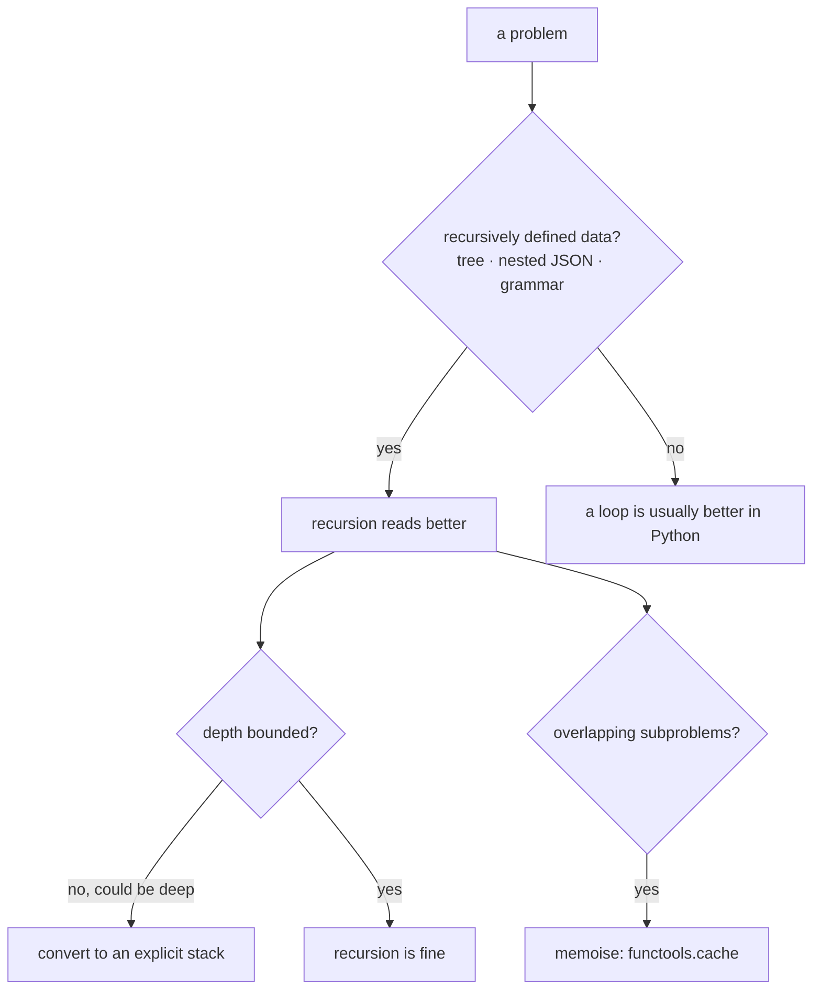

**In one line.** Recursion solves a problem by solving a smaller copy of itself — which is natural for trees and awkward for long sequences, because Python's call stack is finite.

## The idea in plain words

Every recursive function has two parts:

- **A base case** that returns without recursing. Without one you get infinite recursion.
- **A recursive case** that calls itself on a strictly *smaller* input, so the base case is eventually reached.

### The theory: what the machine actually does

Each call pushes a **stack frame** holding that call's local variables and return address. The frames unwind as calls return. Two consequences follow directly:

1. **Depth costs memory.** Python's default limit is 1,000 frames (`sys.getrecursionlimit()`), and exceeding it raises `RecursionError`. This is a deliberate guard against a C-stack overflow, not an arbitrary limit.
2. **Python has no tail-call optimisation.** In languages that have it, a recursive call in tail position reuses the frame. Python does not do this, by design — Guido's argument is that it would destroy tracebacks. So a linear recursion over a million items *will* fail; the equivalent loop will not.

**Naive recursion can be exponential.** Computing `fib(n)` by recursion recomputes the same subproblems repeatedly — `fib(35)` makes about 30 million calls. Memoisation (`functools.cache`) collapses that to linear by remembering each result, which is the whole idea behind dynamic programming.

### When recursion is the right shape

Recursion mirrors **recursively defined data**: trees, nested JSON, filesystems, expression grammars. For those, the recursive version is shorter and clearer than a manual stack. For flat sequences, a loop is almost always better in Python.

### Searching and sorting, in practice

You rarely implement these, but you must know their cost and the tools:

- **`sorted` / `list.sort`** use Timsort: O(n log n), stable, and very fast on partly-ordered data.
- **`bisect`** does binary search on a sorted sequence in O(log n) — the standard-library tool people forget exists.
- **Linear scan** is O(n); for repeated lookups build a `dict` or `set` instead (O(1)).



## How it works

### Base case, recursive case, and the stack

```python
def factorial(n):
    if n <= 1:          # base case: stops the recursion
        return 1
    return n * factorial(n - 1)     # recursive case: strictly smaller input
```

Each call waits for the one below it, so `factorial(5)` holds five frames at its deepest point. Swap in `factorial(5000)` and you get `RecursionError` — the function is correct and the machine still refuses.

### Memoisation turns exponential into linear

```python
from functools import cache

@cache
def fib(n):
    return n if n < 2 else fib(n - 1) + fib(n - 2)
```

Without `@cache`, `fib(n)` makes roughly `2^n` calls. With it, each `n` is computed once, and the rest are dictionary lookups. That single decorator is the difference between minutes and microseconds.

### Converting recursion to iteration

Any recursion can be rewritten with an explicit stack — you take over the bookkeeping the interpreter was doing:

```python
def walk_iterative(node):
    stack = [node]
    while stack:
        current = stack.pop()
        yield current["name"]
        stack.extend(reversed(current.get("children", [])))
```

This is the standard fix when the data might be deep: unbounded depth becomes a heap-allocated list instead of a limited C stack.

### bisect: binary search you do not have to write

```python
import bisect

index = bisect.bisect_left(sorted_values, target)
found = index < len(sorted_values) and sorted_values[index] == target
```

`bisect.insort` keeps a list sorted as you add to it. Both assume the sequence is already sorted — that precondition is the whole contract.

## A real system that works this way

**Walking nested JSON** — API responses, configuration trees, ASTs — is the everyday recursion in professional Python. A schema validator or a redaction pass over arbitrary nested data is naturally recursive, and the depth is bounded by the document, which is why it is safe.

**Filesystem traversal** is the other: `Path.rglob` is doing this for you, and when you need custom pruning you write it yourself — usually iteratively, because directory trees on a build server can be surprisingly deep.

**Binary search in production** shows up as "find the newest record at or before this timestamp" over a sorted array, and as `bisect` over a list of cumulative weights for weighted random choice.

## Code you can run

```python
"""Recursion: the stack, the cost, memoisation, and the iterative equivalent."""
import bisect, random, sys, time
from functools import cache

# --- 1. the call stack is finite -------------------------------------------
def depth_probe(n):
    return 0 if n == 0 else 1 + depth_probe(n - 1)

print("recursion limit:", sys.getrecursionlimit())
print("depth 900 works :", depth_probe(900))
try:
    depth_probe(20_000)
except RecursionError as exc:
    print("depth 20,000    :", type(exc).__name__, "- Python has no tail-call optimisation")

# --- 2. naive recursion can be exponential ----------------------------------
calls = {"n": 0}
def fib_naive(n):
    calls["n"] += 1
    return n if n < 2 else fib_naive(n - 1) + fib_naive(n - 2)

@cache
def fib_fast(n):
    return n if n < 2 else fib_fast(n - 1) + fib_fast(n - 2)

start = time.perf_counter(); fib_naive(26); naive_time = time.perf_counter() - start
start = time.perf_counter(); fib_fast(26);  fast_time = time.perf_counter() - start
print(f"\nfib(26) naive : {calls['n']:>9,} calls in {naive_time*1000:7.1f} ms")
print(f"fib(26) cached: {'1 per n':>9} in {fast_time*1000:7.3f} ms "
      f"({naive_time/max(fast_time,1e-9):,.0f}x faster)")
print("cache stats   :", fib_fast.cache_info())

# --- 3. recursion fits recursive data ---------------------------------------
TREE = {"name": "root", "children": [
    {"name": "src", "children": [
        {"name": "app.py", "children": []},
        {"name": "lib", "children": [{"name": "util.py", "children": []}]}]},
    {"name": "README.md", "children": []},
]}

def walk_recursive(node, depth=0):
    yield "  " * depth + node["name"]
    for child in node.get("children", []):
        yield from walk_recursive(child, depth + 1)

print("\nrecursive walk:")
for line in walk_recursive(TREE):
    print("   ", line)

def walk_iterative(node):
    """The same traversal with an explicit stack - safe at any depth."""
    stack = [(node, 0)]
    while stack:
        current, depth = stack.pop()
        yield "  " * depth + current["name"]
        for child in reversed(current.get("children", [])):
            stack.append((child, depth + 1))

print("iterative walk produces the same order:",
      list(walk_recursive(TREE)) == list(walk_iterative(TREE)))

# a tree deep enough to break the recursive version
deep = {"name": "n0", "children": []}
node = deep
for i in range(1, 5_000):
    child = {"name": f"n{i}", "children": []}
    node["children"].append(child)
    node = child

try:
    sum(1 for _ in walk_recursive(deep))
except RecursionError:
    print("recursive walk on a 5,000-deep tree: RecursionError")
print("iterative walk on the same tree     :", sum(1 for _ in walk_iterative(deep)), "nodes")

# --- 4. divide and conquer: binary search ----------------------------------
def binary_search(values, target):
    low, high = 0, len(values) - 1
    while low <= high:
        mid = (low + high) // 2
        if values[mid] == target:
            return mid
        if values[mid] < target:
            low = mid + 1
        else:
            high = mid - 1
    return -1

values = sorted(random.sample(range(1_000_000), 200_000))
target = values[123_456]

start = time.perf_counter(); linear = values.index(target); t_linear = time.perf_counter() - start
start = time.perf_counter(); found = binary_search(values, target); t_binary = time.perf_counter() - start
start = time.perf_counter(); idx = bisect.bisect_left(values, target); t_bisect = time.perf_counter() - start

print(f"\nsearching {len(values):,} sorted values")
print(f"  list.index (linear O(n))   : {t_linear*1000:7.3f} ms")
print(f"  hand-written binary O(log n): {t_binary*1000:7.3f} ms")
print(f"  bisect (C, O(log n))        : {t_bisect*1000:7.3f} ms")
print("  all three agree:", linear == found == idx)

# --- 5. sorting: stable, and cheap on partly-sorted data -------------------
rows = [{"name": n, "score": s} for n, s in
        [("ada", 90), ("bob", 75), ("cy", 90), ("dee", 75)]]
by_name = sorted(rows, key=lambda r: r["name"])
by_score_then_name = sorted(by_name, key=lambda r: -r["score"])
print("\nstable two-pass sort:", [(r["name"], r["score"]) for r in by_score_then_name])

nearly_sorted = list(range(200_000)); nearly_sorted[5000] = -1
shuffled = random.sample(range(200_000), 200_000)
start = time.perf_counter(); sorted(nearly_sorted); t_nearly = time.perf_counter() - start
start = time.perf_counter(); sorted(shuffled);      t_shuffled = time.perf_counter() - start
print(f"Timsort on nearly-sorted: {t_nearly*1000:6.1f} ms | on shuffled: {t_shuffled*1000:6.1f} ms")
```

## Designing with it

**Recursion or iteration?**

| Situation | Choose |
| --- | --- |
| Tree, nested document, grammar, bounded depth | Recursion — it mirrors the data |
| Flat sequence, or depth could exceed ~1,000 | Iteration, or an explicit stack |
| Overlapping subproblems | Recursion **plus** `functools.cache`, or bottom-up DP |
| Deep tree from untrusted input | Explicit stack — a hostile document should not crash you |

**Rules**

- **Write the base case first.** Most infinite recursions are a missing or unreachable base case.
- **Prove the input shrinks** on every call. "Smaller" must be measurable — fewer items, a smaller number, a shallower node.
- **Do not raise the recursion limit** to make a bug go away. `sys.setrecursionlimit(100000)` risks a hard interpreter crash; convert to iteration instead.
- **`@cache` requires hashable arguments** and unbounded growth is a leak — use `@lru_cache(maxsize=…)` in long-running processes.
- **Keep the sorted precondition explicit** when using `bisect`; searching an unsorted list returns a confidently wrong answer.

**Complexity worth memorising**

| Operation | Cost |
| --- | --- |
| `x in list` | O(n) |
| `x in set` / `dict[key]` | O(1) average |
| `sorted(…)` / `list.sort()` | O(n log n), stable |
| `bisect` on a sorted list | O(log n) |
| `list.insert(0, x)` | O(n) — use `collections.deque` |
| Naive recursive Fibonacci | O(2ⁿ) — memoise to O(n) |

## Where this stands in 2026

:::info Industry view

- Recursion in production Python is mostly **tree and nested-document traversal**; anything over unbounded depth is written iteratively.
- `functools.cache` made memoisation a one-line change, and it is the standard answer to repeated pure computation.
- `bisect` is under-used: many teams reach for pandas or a scan when a sorted list plus binary search is faster and simpler.
- Interviewers still ask for recursion, memoisation and binary search by hand — and for the reason Python lacks tail-call optimisation.

:::

## Practice questions

<details>
<summary><strong>Q1.</strong> Why does Python raise `RecursionError` instead of optimising tail calls?</summary>

CPython deliberately does not implement tail-call optimisation: reusing frames would remove the intermediate frames from tracebacks, making debugging much harder. The recursion limit is a guard so a runaway recursion raises a catchable Python exception rather than overflowing the C stack and crashing the interpreter.

</details>

<details>
<summary><strong>Q2.</strong> `fib(35)` takes minutes; adding `@cache` makes it instant. What changed?</summary>

Naive recursion recomputes the same subproblems exponentially often — roughly 2ⁿ calls. Memoisation stores each `fib(k)` the first time it is computed, so each of the n distinct subproblems runs once and everything else is a dict lookup: O(2ⁿ) becomes O(n).

</details>

<details>
<summary><strong>Q3.</strong> You must walk a JSON document from an untrusted source. Recursion or a stack?</summary>

An explicit stack. Depth is attacker-controlled, so a deeply nested document would hit the recursion limit — a denial-of-service. An iterative walk moves the depth onto the heap, where it is bounded by memory and can be capped explicitly.

</details>

## Further reading

- [sys.setrecursionlimit and the recursion limit](https://docs.python.org/3/library/sys.html#sys.setrecursionlimit) — what it protects, and why raising it is risky.
- [functools.cache and lru_cache](https://docs.python.org/3/library/functools.html#functools.cache) — memoisation with and without bounds.
- [bisect](https://docs.python.org/3/library/bisect.html) — binary search and sorted-list insertion.
- [Timsort description (listsort.txt)](https://github.com/python/cpython/blob/main/Objects/listsort.txt) — why Python's sort is fast on real data.
