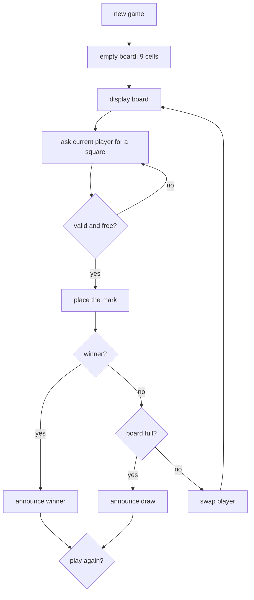

**In one line.** Build a playable two-player tic-tac-toe game using only what the core-language notes covered: lists, loops, conditionals, functions and input validation.

## The brief

A game that runs in the terminal, takes turns between two players, rejects invalid moves, detects wins and draws, and offers a replay. No classes, no libraries — the point is to get fluent with the basics before reaching for anything bigger.

## Requirements

- [ ] Display a 3×3 board with position numbers so players know what to type.
- [ ] Alternate turns between `X` and `O`.
- [ ] **Reject** input that is not a number, is out of range, or targets an occupied square — and ask again rather than crashing.
- [ ] Detect all eight winning lines, and detect a draw when the board fills.
- [ ] Announce the result and offer another game.
- [ ] No global mutable state: every function takes what it needs and returns what it produced.

## What it exercises

| Concept | Where it appears |
| --- | --- |
| [Lists and indexing](/docs/code/python/types-and-data-structures) | The board is a flat list of nine cells |
| [Control flow](/docs/code/python/control-flow-and-comprehensions) | The turn loop, the validation loop, `any`/`all` for win detection |
| [Functions and scope](/docs/code/python/functions-and-scope) | One function per job; no globals |
| [Errors](/docs/code/python/errors-and-exceptions) | `try/except ValueError` around `int()` |
| f-strings | Board rendering and messages | ## Design it first



Separating **state** (the board list), **rules** (`winner`, `is_full`) and **interaction** (`prompt`, `render`) is what makes the game testable — you can play a whole match without any input at all, which is exactly what the solution does at the end.

## The solution

```python
"""Tic-tac-toe: lists, loops, functions and validation. No classes, no imports."""

WIN_LINES = [
    (0, 1, 2), (3, 4, 5), (6, 7, 8),      # rows
    (0, 3, 6), (1, 4, 7), (2, 5, 8),      # columns
    (0, 4, 8), (2, 4, 6),                 # diagonals
]

def new_board():
    return [" "] * 9

def render(board):
    """Show the board; empty squares display their number so players can choose."""
    cells = [c if c != " " else str(i + 1) for i, c in enumerate(board)]
    rows = [f" {cells[i]} | {cells[i+1]} | {cells[i+2]} " for i in (0, 3, 6)]
    return ("\n" + "-" * 13 + "\n").join(rows)

def free_squares(board):
    return [i for i, c in enumerate(board) if c == " "]

def is_full(board):
    return not free_squares(board)

def winner(board):
    """Return 'X', 'O' or None."""
    for a, b, c in WIN_LINES:
        if board[a] != " " and board[a] == board[b] == board[c]:
            return board[a]
    return None

def parse_move(raw, board):
    """Validate one move. Raises ValueError with a message the player can act on."""
    try:
        position = int(raw)
    except ValueError:
        raise ValueError(f"{raw!r} is not a number - type 1 to 9")
    if not 1 <= position <= 9:
        raise ValueError(f"{position} is out of range - choose 1 to 9")
    index = position - 1
    if board[index] != " ":
        raise ValueError(f"square {position} already holds {board[index]!r}")
    return index

def place(board, index, mark):
    """Return a NEW board - no in-place surprises for the caller."""
    updated = list(board)
    updated[index] = mark
    return updated

def other(mark):
    return "O" if mark == "X" else "X"

# --- interaction (the only part that touches input/output) -------------------

def prompt_move(board, mark, read=input):
    while True:
        try:
            return parse_move(read(f"Player {mark}, choose a square: "), board)
        except ValueError as exc:
            print(f"  {exc}")

def play(read=input, show=print):
    board, mark = new_board(), "X"
    while True:
        show(render(board))
        board = place(board, prompt_move(board, mark, read), mark)
        if won := winner(board):
            show(render(board)); show(f"\nPlayer {won} wins!")
            return won
        if is_full(board):
            show(render(board)); show("\nA draw.")
            return None
        mark = other(mark)

# --- a scripted match, so the whole game runs without a keyboard ------------

if __name__ == "__main__":
    # X:1  O:4  X:(bad, bad, taken, then 2)  O:5  X:3  -> X wins the top row
    scripted = iter(["1", "4", "x", "99", "4", "2", "5", "3"])
    result = play(read=lambda _: next(scripted))
    print("\nresult:", result or "draw")

    # the rules are testable without any I/O at all
    assert winner(["X", "X", "X", " ", " ", " ", " ", " ", " "]) == "X"
    assert winner(["X", "O", "X", "O", "X", "O", "O", "X", "O"]) is None
    assert is_full(["X", "O", "X", "O", "X", "O", "O", "X", "O"])
    assert free_squares(new_board()) == list(range(9))
    try:
        parse_move("5", ["X"] * 9)
    except ValueError as exc:
        print("validation works:", exc)
    print("all rule checks pass")
```

Run it interactively with `python tictactoe.py` after deleting the scripted block — `play()` with the default `input` is a real game.

## How to check yourself

- Typing `abc`, `0`, `10` or an occupied square **re-prompts** instead of raising.
- `winner()` finds all eight lines — test each one.
- A full board with no line returns a draw, not a crash.
- `place()` does not mutate the caller's board (that habit prevents a whole class of bug later).
- Every function is testable without `input()`.

## Extensions

1. **A computer opponent.** Start with "pick a random free square", then "win if you can, block if you must", then minimax — which is a small, exact version of the search in [Model-Based RL and MCTS](/docs/theory/drl/model-based-rl-and-mcts).
2. **Score across games**, persisted to a file — that pulls in [Files and Context Managers](/docs/code/python/files-and-context-managers).
3. **Generalise to N×N with K in a row.** The win-line generation becomes the interesting part.
4. **Add tests** with pytest once you reach [Testing](/docs/code/python/testing) — this game is an ideal first suite because the rules are pure functions.
