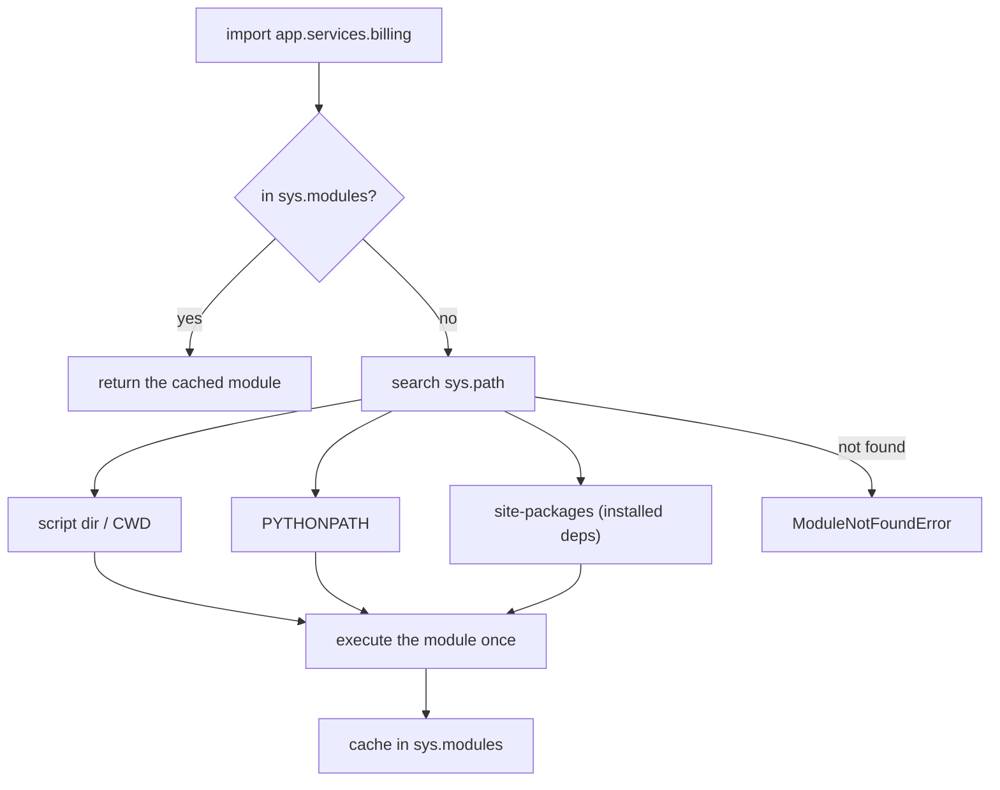

**In one line.** A module is a file, a package is a directory with importable contents, and almost every import error is really a `sys.path` problem.

## The idea in plain words

When you write `import app.services.billing`, Python:

1. checks `sys.modules` for an already-imported copy,
2. searches `sys.path` (script directory or CWD, then `PYTHONPATH`, then site-packages),
3. executes the module **once**, top to bottom, and caches the result.

Two consequences matter. **Module-level code runs on import** — so anything expensive or side-effecting at module level happens as soon as someone imports you. And **modules are singletons**, which is why module-level state is shared process-wide.

`__init__.py` marks a package and runs when the package is first imported; keep it thin — re-exports at most. `if __name__ == "__main__":` separates "run as a script" from "imported as a module", which is what makes a file both usable and testable.

The layout that avoids most pain is **src layout**: your package lives in `src/yourpkg/`, tests live outside it, and you install the project in editable mode (`pip install -e .`). Then tests import the *installed* package rather than accidentally picking up the source directory, which is exactly how it will behave in production.



## How it works

### Absolute imports, and relative ones inside a package

```python
from app.services.billing import charge      # absolute — preferred
from .billing import charge                  # relative — only inside the package
```

Absolute imports are unambiguous and survive moving a file better. Relative imports are fine *within* a package but break when a module is run directly as a script, which is the source of the perennial `ImportError: attempted relative import with no known parent package`. The fix is to run modules with `python -m app.cli`, not `python app/cli.py`.

### Circular imports are a design signal

If `a.py` imports `b.py` and `b.py` imports `a.py`, one of them sees a half-initialised module. The mechanical fixes — importing inside a function, or `if TYPE_CHECKING:` for annotations only — work, but the real fix is usually that both modules want a third thing that should be extracted.

### Project layout that just works

```text
myproject/
├── pyproject.toml          # the single source of project metadata
├── src/
│   └── myproject/
│       ├── __init__.py
│       ├── __main__.py     # python -m myproject
│       ├── config.py
│       └── services/
│           └── billing.py
├── tests/
│   └── test_billing.py
└── README.md
```

With `pip install -e .`, `import myproject` works from anywhere, tests run against the installed package, and there is no `sys.path` hacking anywhere in the codebase. A `sys.path.append` in application code is a sign the layout is wrong.

## A real system that works this way

**Every team meets this on day one**: tests pass locally and fail in CI because the local run picked up the source directory implicitly. src layout plus an editable install removes that entire class of failure, and is now the default in most project templates.

**Plugin systems** (pytest, Django apps, Airflow providers) rely on import side effects and entry points — which is exactly why keeping `__init__.py` cheap matters: importing your package should not open a database connection.

## Code you can run

```python
import importlib, sys, textwrap, types
from pathlib import Path
import tempfile

# Build a tiny package on disk, then import it — the whole mechanism, visible.
root = Path(tempfile.mkdtemp())
pkg = root / "demopkg"
(pkg / "services").mkdir(parents=True)

(pkg / "__init__.py").write_text('__version__ = "1.0"\nprint("  [import] demopkg/__init__ executed")\n')
(pkg / "services" / "__init__.py").write_text("")
(pkg / "services" / "billing.py").write_text(textwrap.dedent("""
    print("  [import] billing executed")
    RATE = 0.2

    def charge(amount):
        return round(amount * (1 + RATE), 2)
"""))
(pkg / "__main__.py").write_text('print("  [main] ran as a script")\n')

sys.path.insert(0, str(root))

print("first import:")
from demopkg.services.billing import charge
print("second import (cached, no output):")
import demopkg.services.billing          # module body does NOT run again
print("charge(100) =", charge(100))
print("cached?", "demopkg.services.billing" in sys.modules)

# __name__ decides script vs import
mod = types.ModuleType("demo")
exec(compile('if __name__ == "__main__":\n    ran = True\nelse:\n    ran = False',
             "<demo>", "exec"), mod.__dict__)
print("imported module ran main block:", mod.ran)

# where did it come from?
print("resolved from:", Path(importlib.import_module("demopkg").__file__).parent.name)
print("sys.path[0]  :", sys.path[0] == str(root))
```

## Designing with it

**Layout and import rules**

| Rule | Why |
| --- | --- |
| Use `src/` layout | Tests exercise the installed package, as production will |
| Absolute imports in application code | Survive file moves; unambiguous |
| `python -m package.module`, not `python path/file.py` | Relative imports and package context work |
| Thin `__init__.py` | Importing must be cheap and side-effect free |
| No `sys.path` manipulation | If you need it, the layout or install is wrong |

**Module-level code is startup cost.** Anything at module level runs on import: keep it to constants and definitions. Connections, config loading and clients belong in functions or lazily-initialised singletons — this also makes them mockable in tests.

**One public surface.** Re-export the handful of names you want people to use in `__init__.py` and define `__all__`. Everything else is internal and free to change.

## Where this stands in 2026

:::info Industry view

- **src layout plus `pyproject.toml`** is the current default in professional Python projects; flat layouts are legacy.
- Editable installs (`pip install -e .`, or `uv pip install -e .`) are how every developer environment is set up.
- Import-time side effects are a common cause of slow CLI startup and of untestable code — reviewers look for them.
- Circular imports almost always indicate a missing module; the mechanical workarounds are accepted only as a temporary measure.

:::

## Practice questions

<details>
<summary><strong>Q1.</strong> Why does `python app/cli.py` break relative imports that work under `python -m app.cli`?</summary>

Running a file directly sets `__package__` to `None` and puts the file's directory on `sys.path`, so there is no parent package for a relative import to resolve against. `-m` imports the module as part of its package, which sets the package context correctly.

</details>

<details>
<summary><strong>Q2.</strong> A module's top-level code runs twice. What happened?</summary>

It was imported under two different names — typically once as `package.module` and once as `module` because the directory was also on `sys.path`. Two entries in `sys.modules` means two separate module objects, and two copies of any module-level state.

</details>

<details>
<summary><strong>Q3.</strong> Why prefer src layout?</summary>

Without it, the current directory is on `sys.path`, so `import mypkg` silently finds the source tree even if the package is not installed correctly. Tests then pass locally and fail on a clean install. src layout forces you to install the package, so local behaviour matches production.

</details>

## Further reading

- [The import system](https://docs.python.org/3/reference/import.html) — the authoritative description of resolution order.
- [Python Packaging User Guide: src layout vs flat layout](https://packaging.python.org/en/latest/discussions/src-layout-vs-flat-layout/) — why src wins.
- [Modules tutorial](https://docs.python.org/3/tutorial/modules.html) — packages, `__init__.py` and `__all__`.
