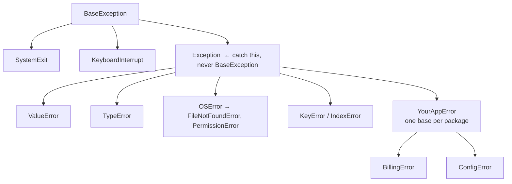

**In one line.** Catch the narrowest exception you can actually handle, and let everything else travel up to a layer that can decide.

## The idea in plain words

Python prefers **EAFP** — easier to ask forgiveness than permission. Try the operation and handle failure, rather than checking every precondition first. It avoids race conditions (the file can vanish between your check and your open) and usually reads better.

The full statement has four parts:

- `try` — the risky operation, kept as short as possible.
- `except` — one clause per failure you can actually do something about.
- `else` — runs only if nothing was raised; keeps the success path out of the `try`.
- `finally` — always runs, for cleanup that must happen either way.

Two rules that separate professional code:

- **Never write a bare `except:`** — it swallows `KeyboardInterrupt` and `SystemExit` too. If you must catch broadly, use `except Exception` and re-raise or log with a traceback.
- **Preserve the cause.** `raise OrderError("…") from exc` keeps the original traceback; re-raising a new bare exception destroys the evidence you will need at 3am.

Define your own exception types for your own failure modes, derived from a single base per package, so callers can catch `except BillingError` without knowing every subclass.



## How it works

### The shape of a good handler

```python
try:
    row = parse(line)                 # only the risky call
except ValueError as exc:
    log.warning("skipping malformed line %d: %s", n, exc)
    return None
else:
    return enrich(row)                # success path, outside the try
finally:
    metrics.increment("lines_processed")
```

Keeping `try` short matters: a wide `try` block catches exceptions from code you never meant to guard, and hides real bugs.

### Custom exceptions carry context

```python
class BillingError(Exception):
    """Base for anything this package raises."""

class PaymentDeclined(BillingError):
    def __init__(self, order_id, reason):
        super().__init__(f"payment declined for {order_id}: {reason}")
        self.order_id = order_id
        self.reason = reason
```

Attributes on the exception let callers branch on data instead of parsing message strings — the difference between a handler that survives a wording change and one that does not.

### Where to handle what

A layered rule that scales:

- **Low level (I/O, parsing)** — translate library exceptions into your own domain exceptions, adding context.
- **Middle (services)** — handle what you can retry or default; let the rest rise.
- **Top (request handler, CLI, task runner)** — one place that logs with a traceback, converts to an exit code or HTTP status, and never lets the process die silently.

Retry only what is genuinely transient (timeouts, 5xx, deadlocks) and always with backoff and a cap.

## A real system that works this way

**HTTP services**: a payment client raises `httpx.TimeoutException`; the service layer translates it to `PaymentUnavailable`, retries twice with backoff, then gives up; the request handler maps `PaymentUnavailable` to a 503 with a correlation id. The user sees a sensible message and support can find the exact traceback by that id.

**Data pipelines**: a malformed row should not kill a batch of a million. The pattern is per-record `try`, a dead-letter queue for failures, and a counter — the job finishes and the failures are inspectable.

## Code you can run

```python
import logging, time

logging.basicConfig(level=logging.INFO, format="%(levelname)s %(message)s")
log = logging.getLogger("billing")

class BillingError(Exception):
    """Base for this package."""

class PaymentDeclined(BillingError):
    def __init__(self, order_id, reason):
        super().__init__(f"payment declined for {order_id}: {reason}")
        self.order_id, self.reason = order_id, reason

class GatewayUnavailable(BillingError):
    pass

# --- a flaky dependency ------------------------------------------------------
attempts = {"n": 0}
def gateway_charge(order_id, amount):
    attempts["n"] += 1
    if attempts["n"] < 3:
        raise TimeoutError("gateway timed out")
    if amount > 1000:
        raise ValueError("limit exceeded")
    return {"order_id": order_id, "charged": amount}

# --- translate, retry, and preserve the cause -------------------------------
def charge(order_id, amount, retries=3, backoff=0.01):
    for attempt in range(1, retries + 1):
        try:
            result = gateway_charge(order_id, amount)
        except TimeoutError as exc:
            log.warning("attempt %d/%d timed out", attempt, retries)
            if attempt == retries:
                raise GatewayUnavailable(f"no response after {retries} attempts") from exc
            time.sleep(backoff * attempt)          # linear backoff, capped by retries
        except ValueError as exc:
            # not transient: translate, keep the cause, do not retry
            raise PaymentDeclined(order_id, str(exc)) from exc
        else:
            log.info("charged %s", result)
            return result
        finally:
            pass    # metrics would go here — runs on every path

print("== success after retries ==")
print(charge("ORD-1", 100))

print("\n== declined, with the original cause preserved ==")
attempts["n"] = 5
try:
    charge("ORD-2", 5000)
except PaymentDeclined as exc:
    print("caught:", exc)
    print("order_id attribute:", exc.order_id)
    print("original cause    :", type(exc.__cause__).__name__, exc.__cause__)

print("\n== EAFP vs LBYL ==")
data = {"a": 1}
try:
    value = data["b"]
except KeyError:
    value = "default"
print("EAFP:", value, "| LBYL:", data.get("b", "default"))
```

## Designing with it

**Handler checklist**

| Question | Answer |
| --- | --- |
| Can this layer actually fix it? | If no, do not catch it |
| Is it transient? | Retry with backoff and a cap; otherwise fail fast |
| Will the caller need to branch on it? | Give the exception attributes, not just a message |
| Am I hiding a bug? | `except Exception: pass` always hides one |
| Will an operator find this at 3am? | Log with `exc_info=True` and a correlation id |

**Anti-patterns that show up in review**

- Bare `except:` or `except Exception: pass`.
- Catching an exception to `return None`, so the failure surfaces as a `NoneType` error three frames later.
- Using exceptions for ordinary control flow across module boundaries.
- Raising `Exception("something went wrong")` — untypeable, uncatchable selectively, unloggable usefully.

**Exception groups** (`except*`) are the modern tool when several concurrent tasks can fail at once — relevant as soon as you use `asyncio.TaskGroup`.

## Where this stands in 2026

:::info Industry view

- Domain exceptions with a single package base are standard; libraries are expected to raise their own types, not built-ins.
- `raise … from exc` is expected in review — losing the cause makes production debugging far harder.
- Retry-with-backoff (tenacity, or hand-rolled) plus a dead-letter path is the default resilience pattern in services and pipelines.
- `except*` and `ExceptionGroup` matter for concurrent code, where several failures can arrive together.

:::

## Practice questions

<details>
<summary><strong>Q1.</strong> Why is `except Exception` acceptable but bare `except:` not?</summary>

`BaseException` includes `KeyboardInterrupt` and `SystemExit`. A bare `except:` catches those too, so Ctrl-C and clean shutdown stop working. `except Exception` leaves them alone.

</details>

<details>
<summary><strong>Q2.</strong> What does `raise NewError("…") from exc` change?</summary>

It sets `__cause__`, so the traceback shows "The above exception was the direct cause of the following exception" and keeps both stacks. Without `from`, you get an implicit `__context__` and a more confusing report; with `from None` you deliberately suppress the original.

</details>

<details>
<summary><strong>Q3.</strong> When should `finally` be used instead of a context manager?</summary>

Rarely. If the cleanup is tied to a resource, a context manager expresses it better and cannot be forgotten. `finally` is for one-off cleanup that is not resource-shaped, such as emitting a metric or restoring a global setting.

</details>

## Further reading

- [Errors and exceptions tutorial](https://docs.python.org/3/tutorial/errors.html) — the statement forms and built-in hierarchy.
- [Built-in exceptions](https://docs.python.org/3/library/exceptions.html) — the full tree, worth skimming once.
- [PEP 654 — exception groups and except*](https://peps.python.org/pep-0654/) — concurrent failure handling.
- [tenacity](https://tenacity.readthedocs.io/) — the retry library most teams use instead of hand-rolling backoff.
