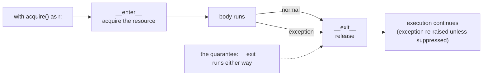

**In one line.** `with` guarantees cleanup even when something raises — and any resource you acquire deserves one.

## The idea in plain words

Two ideas, tightly linked.

**Paths are objects, not strings.** `pathlib.Path` replaces `os.path` string surgery: `Path("data") / "raw" / "events.csv"` works on every platform, and the object carries `.exists()`, `.read_text()`, `.glob()`, `.stat()` and `.parent`.

**Resources need deterministic release.** Opening a file leaks a file descriptor if an exception fires before you close it. The `with` statement binds acquisition and release together:

```python
with open(path, encoding="utf-8") as f:
    for line in f:          # streams; never loads the whole file
        process(line)
```

Two details that cause real bugs: **always pass `encoding=`** (the default depends on the platform, which is how "works on my machine" happens), and **iterate the file** rather than `.read()` when it might be large.

A context manager is any object with `__enter__`/`__exit__`, or a generator decorated with `@contextlib.contextmanager`. Use them for database transactions, locks, temporary directories, timers, and any "set this, then put it back" pattern.



## How it works

### pathlib in practice

```python
from pathlib import Path

root = Path(__file__).resolve().parent
data = root / "data" / "events.csv"

data.parent.mkdir(parents=True, exist_ok=True)
if data.exists():
    text = data.read_text(encoding="utf-8")

for csv_file in sorted(root.rglob("*.csv")):
    print(csv_file.relative_to(root), csv_file.stat().st_size)
```

`read_text` / `write_text` are fine for small files; for anything large, open and stream.

### Text, bytes and encodings

Text mode decodes bytes into `str` using an encoding; binary mode (`"rb"`) gives you `bytes`. Rules:

- Always specify `encoding="utf-8"` explicitly for text.
- Use `newline=""` when writing CSV, or you get blank lines on Windows.
- Use binary mode for images, archives, pickles and anything you will hash.
- `errors="replace"` is for display; never silently mangle data you intend to store.

### Writing your own context managers

```python
from contextlib import contextmanager

@contextmanager
def timer(label):
    import time
    start = time.perf_counter()
    try:
        yield
    finally:
        print(f"{label}: {time.perf_counter() - start:.3f}s")
```

`contextlib` also gives you `suppress` (replaces try/except/pass), `ExitStack` (a dynamic number of resources), `closing`, and `chdir`. Atomic writes — write to a temp file, then `os.replace` — are a context manager worth having in every project.

## A real system that works this way

**Atomic config writes.** A process that writes a config file directly can be killed halfway and leave a truncated file that breaks every future start. Writing to a sibling temp file and atomically replacing it means readers always see a complete file — a five-line context manager that prevents a whole class of outage.

**Database transactions** are the canonical context manager: `with conn.transaction():` commits on success and rolls back on any exception, with no chance of forgetting.

## Code you can run

```python
import os, tempfile, time
from contextlib import contextmanager, suppress
from pathlib import Path

work = Path(tempfile.mkdtemp())

# --- pathlib: build, write, discover ----------------------------------------
(work / "data").mkdir()
(work / "data" / "events.csv").write_text("id,value\n1,10\n2,20\n", encoding="utf-8")
(work / "data" / "notes.txt").write_text("hello", encoding="utf-8")

print("files found:", sorted(p.name for p in (work / "data").rglob("*")))
print("suffix/stem:", (work / "data" / "events.csv").suffix,
      (work / "data" / "events.csv").stem)

# --- streaming beats reading everything -------------------------------------
with open(work / "data" / "events.csv", encoding="utf-8") as f:
    header = next(f)
    rows = [line.rstrip("\n").split(",") for line in f]
print("header:", header.strip(), "| rows:", rows)

# --- a timer context manager -------------------------------------------------
@contextmanager
def timer(label):
    start = time.perf_counter()
    try:
        yield
    finally:
        print(f"{label}: {time.perf_counter() - start:.4f}s")

with timer("sum to 200k"):
    total = sum(range(200_000))

# --- atomic write: readers never see a half-written file ---------------------
@contextmanager
def atomic_write(path: Path, encoding="utf-8"):
    tmp = path.with_suffix(path.suffix + ".tmp")
    handle = tmp.open("w", encoding=encoding)
    try:
        yield handle
        handle.close()
        os.replace(tmp, path)            # atomic on POSIX and Windows
    except BaseException:
        handle.close()
        with suppress(FileNotFoundError):
            tmp.unlink()
        raise

target = work / "config.json"
with atomic_write(target) as f:
    f.write('{"ready": true}')
print("atomic write ok:", target.read_text())

try:
    with atomic_write(target) as f:
        f.write('{"broken":')
        raise RuntimeError("crash mid-write")
except RuntimeError:
    pass
print("after failed write, file intact:", target.read_text())
print("no temp files left:", [p.name for p in work.glob('*.tmp')] == [])

# --- __exit__ still runs when the body raises -------------------------------
class Tracked:
    def __enter__(self):
        print("  acquired"); return self
    def __exit__(self, exc_type, exc, tb):
        print("  released (exception:", exc_type.__name__ if exc_type else None, ")")
        return False        # False = do not suppress

with suppress(ValueError):
    with Tracked():
        raise ValueError("boom")
```

## Designing with it

**Resource rules**

| Resource | Context manager |
| --- | --- |
| File | `open()` — always with `encoding` |
| Temp dir/file | `tempfile.TemporaryDirectory()` |
| Lock | `with lock:` |
| DB transaction | the driver's transaction manager |
| Many/dynamic resources | `contextlib.ExitStack` |
| Timing, feature flags, chdir | your own `@contextmanager` |

**Design notes**

- **Never return an open file** from a function; return the data, or accept an open handle, or return a context manager.
- **Stream by default.** `for line in f` and chunked reads keep memory flat regardless of file size.
- **Make writes atomic** anywhere a reader could observe the file, and **idempotent** anywhere a job might be retried.
- **Paths from config should be resolved once** at startup (`Path(...).resolve()`), so relative-path surprises surface immediately rather than in a worker at midnight.

## Where this stands in 2026

:::info Industry view

- `pathlib` is the default; new code using `os.path` string joins reads as dated.
- Missing explicit `encoding=` is a classic cross-platform bug — Python 3.15 makes UTF-8 the default, but explicit still wins for clarity.
- Atomic write plus `os.replace` is the standard recipe for config and checkpoint files in production systems.
- `contextlib.ExitStack` is the idiomatic answer when the number of resources is known only at runtime.

:::

## Practice questions

<details>
<summary><strong>Q1.</strong> What guarantee does `with` give that try/finally does not?</summary>

None in principle — `with` compiles to roughly try/finally. The gain is that the guarantee lives with the resource type rather than with each call site, so it cannot be forgotten or written inconsistently.

</details>

<details>
<summary><strong>Q2.</strong> How do you suppress an exception from inside a context manager?</summary>

Return a truthy value from `__exit__`. That is how `contextlib.suppress` works. Returning `None`/`False` lets the exception propagate, which should be the default.

</details>

<details>
<summary><strong>Q3.</strong> Why write to a temp file and rename instead of writing in place?</summary>

`os.replace` is atomic, so a reader sees either the old complete file or the new complete file, never a partial one. Writing in place can leave a truncated file if the process dies mid-write.

</details>

## Further reading

- [pathlib](https://docs.python.org/3/library/pathlib.html) — the object-oriented path API.
- [contextlib](https://docs.python.org/3/library/contextlib.html) — `contextmanager`, `suppress`, `ExitStack`, `closing`.
- [PEP 343 — the with statement](https://peps.python.org/pep-0343/) — the protocol and its rationale.
- [Unicode HOWTO](https://docs.python.org/3/howto/unicode.html) — encodings, and why explicit beats implicit.
