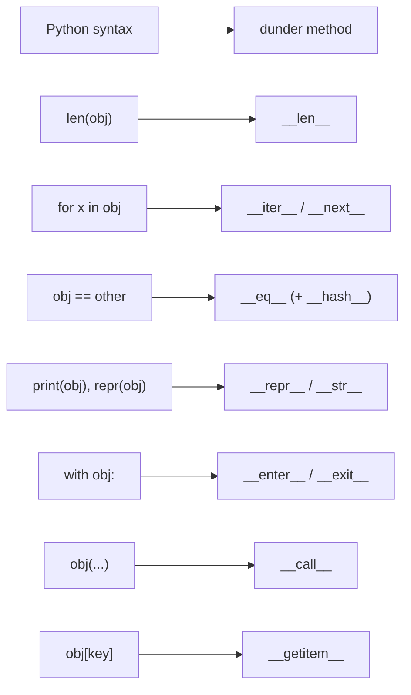

**In one line.** Python objects behave like built-ins because the built-in syntax is wired to dunder methods you can implement yourself.

## The idea in plain words

A class bundles state and behaviour. `__init__` initialises an instance; `self` is the instance, passed explicitly.

Know where state lives: **class attributes** are shared by every instance, **instance attributes** belong to one object. A mutable class attribute is the class-level version of the mutable-default bug.

Three kinds of method:

- **instance method** — takes `self`, uses instance state.
- **`@classmethod`** — takes `cls`; the idiomatic way to write alternative constructors (`Model.from_config(...)`).
- **`@staticmethod`** — takes neither; a plain function that lives here for organisation.

**`@property`** turns a computed value into an attribute, so you can start with a plain attribute and add validation later without changing a single call site.

The **data model** is the real Python story: implement `__len__` and `len(obj)` works; `__iter__` and the object becomes iterable; `__eq__` and `__hash__` and it works in sets and dicts; `__repr__` and your logs become readable. You are not overriding operators for fun — you are opting into protocols the language already knows.

Finally: **prefer composition over inheritance**. Inherit when there is a genuine "is-a" and you want polymorphism; otherwise hold a collaborator as an attribute. Deep hierarchies are the most common OOP mistake in Python code.



## How it works

### Class vs instance state

```python
class Cache:
    hits = 0                      # CLASS attribute — shared by all instances
    def __init__(self):
        self.store = {}           # INSTANCE attribute — one per object
```

`Cache.hits += 1` updates the shared counter; `self.hits += 1` silently creates an instance attribute that shadows it. Never use a mutable class attribute (`items = []`) as per-instance storage — every instance will share it.

### Dunders worth implementing, in order of value

1. **`__repr__`** — always. It is what you see in logs, tracebacks and the REPL. Make it unambiguous: `Order(id='A1', total=12.5)`.
2. **`__eq__`** (+ `__hash__` if immutable) — otherwise equality is identity and two equal-looking objects differ.
3. **`__iter__` / `__len__` / `__getitem__`** — when the object is a collection.
4. **`__enter__` / `__exit__`** — when it owns a resource.
5. **`__call__`** — when an instance is conceptually a configured function.

`@dataclass` writes `__init__`, `__repr__` and `__eq__` for you, which is why most new "record with behaviour" classes start as dataclasses.

### Inheritance, MRO and when to stop

`super().__init__(...)` cooperates with the method resolution order; call it rather than naming the parent class directly. Python uses C3 linearisation, and `Class.__mro__` shows the exact lookup order.

Use an **abstract base class** (`abc.ABC` with `@abstractmethod`) when you want to declare an interface that subclasses must implement, or a **Protocol** (structural typing) when you only care about shape and do not want an inheritance relationship at all. Protocols are increasingly the preferred tool.

## A real system that works this way

**Domain models in services** are usually dataclasses with a couple of properties and validation, not deep hierarchies. The interface boundaries are `Protocol`s — a `PaymentGateway` protocol with two methods lets you swap Stripe for a fake in tests without inheritance.

**`__repr__` earns its keep in incidents**: a log line reading `Order(id='A-1', status='paid', total=99.0)` answers the question immediately; `<myapp.models.Order object at 0x10f3>` costs you ten minutes.

## Code you can run

```python
from dataclasses import dataclass, field
from typing import Protocol

# --- dunders make a class feel built-in -------------------------------------
class Basket:
    def __init__(self, items=None):
        self._items = list(items or [])

    def add(self, name, price):
        self._items.append((name, price)); return self

    def __len__(self):                       # len(basket)
        return len(self._items)

    def __iter__(self):                      # for item in basket
        return iter(self._items)

    def __getitem__(self, index):            # basket[0], slicing, unpacking
        return self._items[index]

    def __contains__(self, name):            # "apple" in basket
        return any(n == name for n, _ in self._items)

    def __repr__(self):                      # readable logs
        return f"Basket(items={len(self._items)}, total={self.total:.2f})"

    @property                                # computed, but reads as an attribute
    def total(self):
        return sum(price for _, price in self._items)

b = Basket().add("apple", 1.20).add("bread", 2.50)
print(repr(b), "| len:", len(b), "| 'bread' in b:", "bread" in b)
print("iterates:", [name for name, _ in b], "| first:", b[0])

# --- class vs instance state -------------------------------------------------
class Counter:
    created = 0                     # shared
    def __init__(self):
        Counter.created += 1
        self.value = 0              # per instance

a, c = Counter(), Counter()
a.value += 5
print(f"shared created={Counter.created}, a.value={a.value}, c.value={c.value}")

# --- properties add validation without changing call sites ------------------
class Temperature:
    def __init__(self, celsius):
        self.celsius = celsius      # goes through the setter

    @property
    def celsius(self):
        return self._celsius

    @celsius.setter
    def celsius(self, value):
        if value < -273.15:
            raise ValueError("below absolute zero")
        self._celsius = value

    @property
    def fahrenheit(self):
        return self._celsius * 9 / 5 + 32

t = Temperature(21.0)
print(f"{t.celsius}C = {t.fahrenheit:.1f}F")
try:
    t.celsius = -400
except ValueError as exc:
    print("validation:", exc)

# --- dataclass: equality and repr for free ----------------------------------
@dataclass(frozen=True, slots=True)
class Point:
    x: float
    y: float
    tags: tuple = field(default=())

p1, p2 = Point(1, 2), Point(1, 2)
print("dataclass eq:", p1 == p2, "| hashable:", len({p1, p2}) == 1, "|", p1)

# --- composition + Protocol beats inheritance -------------------------------
class Notifier(Protocol):
    def send(self, message: str) -> str: ...

class EmailNotifier:
    def send(self, message): return f"email: {message}"

class FakeNotifier:
    def send(self, message): return f"captured: {message}"

class OrderService:
    def __init__(self, notifier: Notifier):      # injected, not inherited
        self.notifier = notifier
    def complete(self, order_id):
        return self.notifier.send(f"order {order_id} complete")

print(OrderService(EmailNotifier()).complete("A-1"))
print(OrderService(FakeNotifier()).complete("A-1"))    # trivially testable

# --- MRO is inspectable ------------------------------------------------------
class A: pass
class B(A): pass
class C(A): pass
class D(B, C): pass
print("MRO:", [k.__name__ for k in D.__mro__])
```

## Designing with it

**Choosing a shape**

| You need | Use |
| --- | --- |
| A record with a little behaviour | `@dataclass` |
| Immutable value object | `@dataclass(frozen=True, slots=True)` |
| An interface for swapping implementations | `Protocol` (structural) |
| A base class subclasses must complete | `abc.ABC` + `@abstractmethod` |
| Shared behaviour across unrelated classes | Composition, or a mixin at most one level deep |
| Validation, parsing, serialisation from untrusted input | Pydantic model |

**Rules**

- **Inherit for polymorphism, compose for reuse.** "I want these methods" is not a reason to inherit.
- **Keep hierarchies two levels deep at most.** Beyond that, behaviour becomes impossible to locate.
- `__eq__` **without** `__hash__` makes the object unhashable; a frozen dataclass handles both.
- **`slots=True`** cuts per-instance memory noticeably when you have millions of objects, at the cost of dynamic attributes.
- **Do not put I/O in `__init__`.** Constructors that open connections are untestable; use a classmethod factory or inject the client.

## Where this stands in 2026

:::info Industry view

- Dataclasses (and Pydantic at boundaries) have largely replaced hand-written `__init__`/`__repr__` boilerplate.
- `Protocol`-based structural typing is the modern way to define seams for testing, without inheritance.
- Deep inheritance is treated as a design smell in review; composition plus small protocols is the expected shape.
- `__repr__` quality is an operational concern — it is what appears in logs and Sentry traces.

:::

## Practice questions

<details>
<summary><strong>Q1.</strong> What is the difference between `__str__` and `__repr__`?</summary>

`__repr__` is for developers: unambiguous, ideally reconstructible, used in the REPL, logs and tracebacks. `__str__` is for end users. If you implement only one, implement `__repr__` — `str()` falls back to it.

</details>

<details>
<summary><strong>Q2.</strong> Why does adding `__eq__` break putting objects in a set?</summary>

Defining `__eq__` sets `__hash__` to `None`, making instances unhashable, because two equal objects must have equal hashes and Python will not guess. Either define `__hash__` too or use `@dataclass(frozen=True)`, which does it for you.

</details>

<details>
<summary><strong>Q3.</strong> When would you choose a Protocol over an abstract base class?</summary>

When you do not control the implementations, or do not want to force an inheritance relationship — a Protocol matches on shape, so any object with the right methods qualifies, including third-party classes and test doubles.

</details>

## Further reading

- [Python data model](https://docs.python.org/3/reference/datamodel.html) — the full list of dunder hooks.
- [dataclasses](https://docs.python.org/3/library/dataclasses.html) — fields, frozen, slots, `__post_init__`.
- [typing.Protocol (PEP 544)](https://peps.python.org/pep-0544/) — structural subtyping.
- [Python MRO explained](https://docs.python.org/3/howto/mro.html) — C3 linearisation, if you ever meet a diamond.
