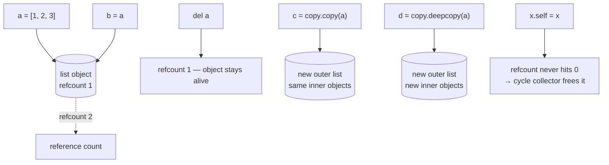

**In one line.** A Python variable is a name bound to an object, never a box holding a value — and nearly every surprising bug at this level follows from that one fact.

## The idea in plain words

### The theory: names, objects and references

Assignment never copies. `b = a` binds a second name to the *same* object. The object carries the value and a reference count; the name is just a label. So:

- **Mutating through one name is visible through the other** — the aliasing bug.
- **Rebinding one name does not affect the other** — `b = something_else` moves the label, leaving `a` where it was.
- **Function arguments are passed the same way**: the callee gets a new name for your object. Mutating it changes your object; rebinding it does not.

**Identity versus equality.** `is` compares identity — are these the same object? `==` compares value, via `__eq__`. Use `is` only for singletons (`None`, `True`, `False`) and genuine identity checks. Comparing values with `is` sometimes *appears* to work because CPython interns small integers and short strings — an implementation detail you must never rely on.

**Hashability** is the contract that makes dicts and sets work: an object's hash must never change while it is in a container, and equal objects must have equal hashes. That is why mutable built-ins are unhashable, and why defining `__eq__` sets `__hash__` to `None` unless you define it too.

### Copies: three levels

1. **No copy** — `b = a`. One object, two names.
2. **Shallow copy** — `list(a)`, `a.copy()`, `a[:]`, `copy.copy(a)`. A new outer object whose elements are still *the same* inner objects.
3. **Deep copy** — `copy.deepcopy(a)`. A new object graph all the way down, with cycles handled by a memo table.

Shallow copying a list of lists is the classic trap: the outer list is independent, the inner lists are shared.

### Memory: reference counting plus a cycle collector

CPython frees an object the moment its reference count hits zero — which is why `del` can be immediate and why resources are released promptly. Reference cycles (an object referring to itself, directly or through a chain) never reach zero, so a separate **generational garbage collector** finds and frees them periodically. That is the whole model: prompt refcounting for the common case, a cycle collector for the rest.



## How it works

### Aliasing, and the three ways to copy

```python
import copy

original = [[1, 2], [3, 4]]

alias   = original                 # same object
shallow = copy.copy(original)      # new outer list, shared inner lists
deep    = copy.deepcopy(original)  # independent all the way down

original[0].append(99)
# alias   -> [[1, 2, 99], [3, 4]]   (same object)
# shallow -> [[1, 2, 99], [3, 4]]   (inner list is shared!)
# deep    -> [[1, 2], [3, 4]]       (fully independent)
```

Deep copying costs time and memory proportional to the whole graph, so use it deliberately — usually at a boundary, when you accept a caller's structure and intend to mutate it.

### Identity, equality and interning

```python
a, b = 256, 256
a is b            # True  — small ints are cached by CPython
c, d = 257, 257
c is d            # may be False — do not depend on either result
```

The rule that never bites you: **`==` for values, `is` for `None` and other singletons.** Linters flag `is` against a literal for exactly this reason.

### Hashability and the eq/hash contract

```python
from dataclasses import dataclass

@dataclass(frozen=True)     # frozen => hashable: __hash__ generated
class Point:
    x: int
    y: int
```

If you write `__eq__` by hand, write `__hash__` too — or accept that instances become unhashable. And never mutate an object that is sitting in a set or used as a dict key; the container will not find it again.

### Reference counting and cycles

```python
import gc, sys

data = [1, 2, 3]
sys.getrefcount(data)     # one higher than you expect: the argument itself counts

class Node:
    def __init__(self):
        self.self_ref = self     # a cycle: refcount never reaches zero

gc.collect()                     # the cycle collector reclaims it
```

`weakref` is the escape hatch: a reference that does *not* keep the object alive, which is how caches and back-references avoid leaking.

## A real system that works this way

**The shared-default-config bug** is the production version of aliasing: a service loads a config dict once and hands the same object to every request handler. One handler mutates it — adding a debug flag, say — and every subsequent request sees it. The fix is a copy at the boundary, or an immutable config object.

**The cache that leaked** is the cycle version: objects held in a dict keyed by id, each holding a back-reference to its parent. Reference counts never hit zero, the cycle collector keeps them alive because the dict is reachable, and memory grows until the process is restarted. `weakref.WeakValueDictionary` fixes it in one line.

## Code you can run

```python
"""Names, aliasing, copy depth, identity, hashability, refcounts and cycles."""
import copy, gc, sys, weakref
from dataclasses import dataclass

# --- 1. assignment binds a name; it never copies ---------------------------
a = [1, 2, 3]
b = a
b.append(4)
print("aliasing        :", a, "<- mutating through b changed a")

b = [9, 9]                      # rebinding moves the label only
print("after rebinding :", a, b)

def mutate(values): values.append("added")
def rebind(values): values = ["replaced"]

payload = ["start"]
mutate(payload); rebind(payload)
print("argument passing:", payload, "- mutation shows, rebinding does not")

# --- 2. the three copy depths ------------------------------------------------
original = [[1, 2], [3, 4]]
alias, shallow, deep = original, copy.copy(original), copy.deepcopy(original)
original[0].append(99)
print(f"\nafter mutating an inner list of the original:")
print(f"  alias   {alias}      (same object)")
print(f"  shallow {shallow}      (inner list shared)")
print(f"  deep    {deep}          (independent)")

# deepcopy handles cycles with a memo table
cyclic = {"name": "root"}
cyclic["self"] = cyclic
clone = copy.deepcopy(cyclic)
print("deepcopy of a cyclic structure:", clone["self"] is clone, "(cycle preserved, not infinite)")

# --- 3. identity vs equality -------------------------------------------------
x, y = [1, 2], [1, 2]
print(f"\n[1,2] == [1,2] -> {x == y}  |  [1,2] is [1,2] -> {x is y}")
small_a, small_b = 100, 100
big_a, big_b = 1000, 1000
print(f"100 is 100 -> {small_a is small_b} (interned) | "
      f"1000 is 1000 -> {big_a is big_b} (implementation detail - never rely on it)")
value = None
print("correct singleton test:", value is None)

# --- 4. hashability and the eq/hash contract -------------------------------
@dataclass(frozen=True)
class Point:
    x: int
    y: int

@dataclass                       # not frozen: __eq__ without __hash__
class Mutable:
    x: int

print(f"\nfrozen dataclass hashable  : {len({Point(1, 2), Point(1, 2)})} unique of 2 equal points")
try:
    {Mutable(1)}
except TypeError as exc:
    print("mutable dataclass in a set :", exc)

# mutating a key breaks the container's ability to find it
class Sneaky:
    def __init__(self, value): self.value = value
    def __hash__(self): return hash(self.value)
    def __eq__(self, other): return isinstance(other, Sneaky) and self.value == other.value

key = Sneaky(1)
store = {key: "payload"}
key.value = 2                    # hash changes while it sits in the dict
print("after mutating a live key  :", key in store, "- the entry is now unreachable")

# --- 5. reference counting and the cycle collector -------------------------
data = [1, 2, 3]
print(f"\nrefcount for one name      : {sys.getrefcount(data) - 1} "
      f"(getrefcount's own argument is excluded here)")
second = data
print(f"refcount for two names     : {sys.getrefcount(data) - 1}")
del second
print(f"after del                  : {sys.getrefcount(data) - 1}")

class Node:
    def __init__(self, name): self.name, self.ref = name, None

gc.collect()
before = len(gc.get_objects())
left, right = Node("left"), Node("right")
left.ref, right.ref = right, left        # a reference cycle
del left, right                           # refcounts never reach zero
collected = gc.collect()                  # the cycle collector reclaims them
print(f"cycle collector reclaimed  : {collected} objects")

# --- 6. weakref: reference without ownership -------------------------------
class Session:
    def __init__(self, sid): self.sid = sid

cache = weakref.WeakValueDictionary()
session = Session("s-1")
cache["s-1"] = session
print(f"\nweak cache while referenced: {'s-1' in cache}")
del session
print(f"weak cache after the owner released it: {'s-1' in cache} "
      "(entry disappeared - no leak)")
```

## Designing with it

**Copy decisions at API boundaries**

| Situation | Do |
| --- | --- |
| You store a collection the caller passed in | Copy it — otherwise the caller can mutate your state later |
| You return internal state | Return a copy, or an immutable view (`tuple`, `frozenset`, `MappingProxyType`) |
| Nested structure you will mutate | `deepcopy` — but measure; it is proportional to the whole graph |
| Shared read-only config | Freeze it (frozen dataclass, tuple) instead of copying everywhere |

**Rules that prevent the classic bugs**

- **Default arguments are evaluated once** — the mutable-default bug is aliasing wearing a different hat.
- **Never mutate an object while it is a dict key or set member.**
- **`is` only for `None`, `True`, `False`** and deliberate identity checks.
- **Define `__hash__` whenever you define `__eq__`**, or use `@dataclass(frozen=True)`.
- **Use `weakref` for caches and back-references** so they cannot keep objects alive.
- **Reach for immutability by default** in shared or concurrent code — it removes the whole class of problem.

**Memory notes**

Objects are large (a small `int` is ~28 bytes, an empty `dict` ~64). For millions of records, use `__slots__`, `array`, NumPy or a database. `gc.freeze()` before forking is a real trick for copy-on-write memory in pre-fork servers such as Gunicorn.

## Where this stands in 2026

:::info Industry view

- Aliasing and shallow-copy bugs remain among the most common defects in Python services, especially around shared configuration and cached objects.
- **Immutability is the prevailing style** for shared state: frozen dataclasses, tuples and Pydantic models with `frozen=True`.
- `weakref`-based caches are standard in long-running services; unbounded dict caches are a known leak pattern.
- Understanding refcounting versus the cycle collector is expected in senior interviews, along with `__slots__` and why `is` is not `==`.

:::

## Practice questions

<details>
<summary><strong>Q1.</strong> After `b = a[:]` on a list of lists, why does mutating `a[0]` still change `b[0]`?</summary>

`a[:]` is a **shallow** copy: it creates a new outer list whose elements are the same inner objects. Mutating an inner list is visible through both outer lists. `copy.deepcopy(a)` copies the whole graph and breaks the sharing.

</details>

<details>
<summary><strong>Q2.</strong> Why is `if x is 1000:` unreliable while `if x is None:` is correct?</summary>

`is` tests identity. CPython caches small integers (−5 to 256) and some short strings, so identity sometimes coincides with equality — an implementation detail that varies by value and version. `None` is a true singleton: there is exactly one, so identity is the right test.

</details>

<details>
<summary><strong>Q3.</strong> What keeps an object alive after its last name is deleted?</summary>

Any remaining reference: a container, a closure, an exception traceback, a module-level cache, or a reference cycle. Refcounting frees objects the moment the count reaches zero; cycles never do, so the generational collector handles them. `weakref` lets you refer to an object without contributing to that count.

</details>

## Further reading

- [Data model: objects, values and types](https://docs.python.org/3/reference/datamodel.html#objects-values-and-types) — identity, type and value, defined precisely.
- [copy module](https://docs.python.org/3/library/copy.html) — shallow versus deep, and `__deepcopy__`.
- [gc module](https://docs.python.org/3/library/gc.html) — generational collection, `gc.freeze`, debugging leaks.
- [weakref](https://docs.python.org/3/library/weakref.html) — caches and back-references that do not leak.
