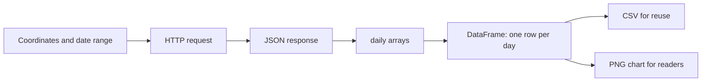

> **Video:** [weather API near 2:57](https://www.youtube.com/watch?v=ygXn5nV5qFc&t=10620s) and [data analysis from 3:06:20](https://www.youtube.com/watch?v=ygXn5nV5qFc&t=11180s).

Fetch structured data, inspect it, turn it into a table and save a report someone else can use.

The video demonstrates current weather for Paris, London and Tokyo, then a daily temperature report. This lab follows that progression with an original implementation. **Added practice** includes timeouts, response checks, a synthetic offline sample and explicit validation so you can repeat the exercise without relying on a live service.

## Before you start

Complete [setup](../00-getting-started/02-setup-and-interactive-python.md) and the introductory sections on [dictionaries](../01-core-language/01-types-and-data-structures.md#four-containers-you-can-create-and-change) and [functions](../01-core-language/03-functions-and-scope.md#start-here-input-work-result).

In your activated environment:

```bash
python -m pip install requests pandas matplotlib
```

| Library | Role in this program |
| --- | --- |
| Requests | Makes an HTTP request and decodes the JSON response |
| pandas | Represents rows/columns and writes CSV |
| Matplotlib | Draws and saves the temperature chart |
| `pathlib` | Finds folders and creates the output directory; included with Python |

## First request: current temperature

An API exposes operations through a documented interface. For this example, the server accepts coordinates and returns weather data. The [Open-Meteo API documentation](https://open-meteo.com/en/docs) defines the endpoint, parameters and response fields.

```python
import requests

response = requests.get(
    "https://api.open-meteo.com/v1/forecast",
    params={
        "latitude": 48.8566,
        "longitude": 2.3522,
        "current": "temperature_2m",
        "temperature_unit": "celsius",
    },
    timeout=20,
)
response.raise_for_status()
data = response.json()
print(data["current"]["temperature_2m"])
print(data["current_units"]["temperature_2m"])
```

The numeric result varies with the time of the request. `params` builds the query string without hand-concatenating values. A response object includes status, headers and body; it is not itself the temperature. `raise_for_status()` raises for HTTP error responses. Decoding JSON can still fail independently. Requests' timeout limits network waiting; it is not a guaranteed total deadline for every operation. See the [Requests quickstart](https://requests.readthedocs.io/en/latest/user/quickstart/).

### Read a nested response

Inspect a synthetic response before dealing with live values:

```python
data = {
    "current": {"temperature_2m": 18.5, "is_day": 1},
    "current_units": {"temperature_2m": "°C"},
}
current = data["current"]
temperature = current["temperature_2m"]
print(type(data), type(current), type(temperature))
print(f"Temperature: {temperature} {data['current_units']['temperature_2m']}")
```

The first lookup returns another dictionary. The second returns a number. Missing keys raise `KeyError`, so inspect the response structure before assuming a field exists.

:::note JSON types and dates

The video describes JSON as string-based while converting dates. More precisely, JSON text represents objects, arrays, strings, numbers, booleans and null. Decoding them gives Python dictionaries, lists, strings, numbers, booleans and `None`. Dates have no dedicated JSON type and commonly arrive as strings, so they need explicit parsing.

:::

## Make the request reusable

```python
import requests

def get_temperature(latitude, longitude):
    response = requests.get(
        "https://api.open-meteo.com/v1/forecast",
        params={
            "latitude": latitude,
            "longitude": longitude,
            "current": "temperature_2m",
            "temperature_unit": "celsius",
        },
        timeout=20,
    )
    response.raise_for_status()
    return response.json()["current"]["temperature_2m"]

cities = {
    "Paris": (48.8566, 2.3522),
    "London": (51.5074, -0.1278),
    "Tokyo": (35.6762, 139.6503),
}
for city, (latitude, longitude) in cities.items():
    try:
        temperature = get_temperature(latitude, longitude)
    except (requests.RequestException, ValueError, KeyError) as exc:
        print(f"{city}: weather unavailable ({type(exc).__name__})")
    else:
        print(f"{city}: {temperature} °C")
```

The function returns data; the caller chooses how to present it or handle failure. This is the same boundary you will need when a later AI application calls an external service.

## From JSON to a table and chart



A daily response contains parallel arrays: a date, minimum temperature and maximum temperature at each position. All arrays must have matching lengths to become columns of the same table.

```python
import pandas as pd

daily = {
    "time": ["2026-01-01", "2026-01-02", "2026-01-03"],
    "temperature_2m_min": [3, 4, 2],
    "temperature_2m_max": [9, 10, 8],
}
table = pd.DataFrame({
    "date": daily["time"],
    "min_temp": daily["temperature_2m_min"],
    "max_temp": daily["temperature_2m_max"],
})
table["date"] = pd.to_datetime(table["date"])
print(table)
print(table.shape)  # (3, 3)
```

`pd` is the conventional alias for pandas. A DataFrame is a two-dimensional table; `table["date"]` selects one column. Parsing dates lets plotting and date arithmetic use chronological values. Converting a column does not change the number of rows.

### Choose the date window explicitly

The demonstration calculates dates with `datetime` and `timedelta`. This independent example shows the boundary rule for seven completed dates:

```python
from datetime import date, timedelta

today = date(2026, 1, 8)  # fixed so the exercise is repeatable
end = today - timedelta(days=1)
start = end - timedelta(days=6)
print(start.isoformat(), end.isoformat())  # 2026-01-01 2026-01-07
print((end - start).days + 1)              # 7, including both endpoints
```

The downloadable live implementation instead uses `past_days=7`, `forecast_days=0` and `timezone="auto"`. This requests completed days in the selected location's timezone without calculating dates from your laptop's timezone. The forecast API's recent past data is model data, not necessarily weather-station observations. Do not reuse this endpoint for an arbitrary historical date range without checking the provider's historical APIs.

### Save both representations

With the `table` from the earlier example, run:

```python
from pathlib import Path
import matplotlib.pyplot as plt

output = Path("output")
output.mkdir(exist_ok=True)
table.to_csv(output / "weather.csv", index=False)

fig, ax = plt.subplots(figsize=(8, 4))
ax.plot(table["date"], table["min_temp"], marker="o", label="Minimum")
ax.plot(table["date"], table["max_temp"], marker="o", label="Maximum")
ax.set(title="Practice weather", xlabel="Date", ylabel="Temperature (°C)")
ax.legend()
fig.autofmt_xdate()
fig.tight_layout()
fig.savefig(output / "weather.png", dpi=150)
plt.close(fig)
```

`index=False` avoids writing pandas' row labels as an extra CSV column. Axis labels and units explain what the chart measures. Save the figure before closing it. This snippet writes relative to the current working directory; the complete script below anchors its default output to the script location.

## Run the complete lab

Download [weather_report.py](/examples/python-beginner/weather_report.py), or use `static/examples/python-beginner/weather_report.py` in this repo. The [requirements file](/examples/python-beginner/requirements.txt) supports both beginner labs.

From the folder containing the downloaded script:

```bash
python weather_report.py
```

Expected results:

- Seven rows covering 1–7 January 2026, from a clearly labelled **synthetic sample**.
- `output/weather/weather.csv`, with date/minimum/maximum columns and no extra index column.
- `output/weather/weather.png`, with both labelled temperature series.

To call the API instead:

```bash
python weather_report.py --live --city Paris --latitude 48.8566 --longitude 2.3522
```

Live data comes from [Open-Meteo](https://open-meteo.com/) under [CC BY 4.0](https://creativecommons.org/licenses/by/4.0/); retain attribution when sharing it. Both modes replace their named output files on rerun. Use `--output-dir output/another-report` to keep a separate report.

### What to inspect in the script

| Function | Responsibility |
| --- | --- |
| `fetch_weather` | Network request, status check and JSON decoding |
| `weather_table` | Column selection, type conversion and seven consecutive dates |
| `save_report` | Output directory, CSV and chart |
| `main` | Command-line options and user-facing failure messages |

The `if __name__ == "__main__"` guard starts the program when run directly. Importing the module for an experiment does not fetch weather or write files.

## Added practice

1. Change all three location arguments, then explain why changing just the city label would produce a misleading report.
2. Add `daily_range = max_temp - min_temp` as a table column and find the day with the largest range.
3. Try an invalid latitude. The program should stop with a clear message.
4. Remove a date from the sample. Explain why the program rejects the result instead of labelling it a seven-day report.
5. Recreate the environment and run the offline version from a different working directory using an absolute script path.

Continue with [sales analysis](./07-sales-analysis.md), then the existing [pandas introduction](../../2.pandas/01.md) for deeper table operations.

- [ ] I can distinguish a response object, JSON text and a decoded dictionary.
- [ ] I can explain each step from nested data to a saved chart.
- [ ] I can state the report's date range, units and data source.
- [ ] I can run the report from a fresh process and diagnose a failed request.
