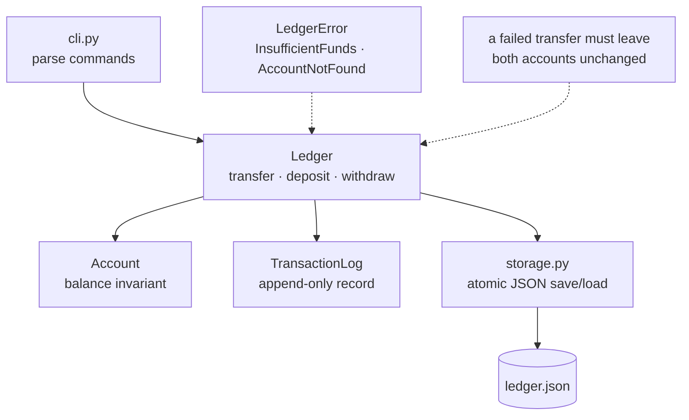

**In one line.** Build a small bank ledger with accounts, transfers, a transaction history and durable storage — using classes, custom exceptions and atomic writes.

## The brief

Money is the classic domain for this stage because it forces you to get four things right: **invariants** (a balance may not go negative), **atomicity** (a transfer either moves money or does not), **durability** (a crash must not corrupt the file) and **auditability** (every change leaves a record).

## Requirements

- [ ] `Account` and `Ledger` classes with a clear split: the account holds state and invariants, the ledger owns transfers and persistence.
- [ ] A **domain exception hierarchy** — `LedgerError` with `InsufficientFunds`, `AccountNotFound`, `InvalidAmount` beneath it.
- [ ] Money as `Decimal`, never `float`.
- [ ] Every mutation appends to an immutable **transaction log**.
- [ ] Save and load as JSON, written **atomically** so an interrupted save cannot corrupt the file.
- [ ] `__repr__` on every class that makes a log line useful.
- [ ] A transfer that fails leaves **both** balances untouched.

## What it exercises

| Concept | Where it appears |
| --- | --- |
| [OOP and the data model](/docs/code/python/oop-and-the-data-model) | Classes, `__repr__`, properties, dataclasses |
| [Errors and exceptions](/docs/code/python/errors-and-exceptions) | A domain hierarchy, translated at the boundary |
| [Files and context managers](/docs/code/python/files-and-context-managers) | Atomic write, JSON round-trip, a `transaction` context manager |
| [Modules and packages](/docs/code/python/modules-and-packages) | Splitting into `models.py`, `ledger.py`, `storage.py`, `cli.py` |
| [Types and data structures](/docs/code/python/types-and-data-structures) | `Decimal` for money, dict index by account id | ## Design it first



The seam that matters is **storage behind an interface**. Keep the ledger ignorant of files and you can test every rule in memory, then test persistence separately.

## The solution

```python
"""A bank ledger: invariants, domain exceptions, an audit log and atomic saves."""
import json, os, tempfile
from contextlib import contextmanager
from dataclasses import dataclass, field
from datetime import datetime, timezone
from decimal import Decimal
from pathlib import Path

# --- domain errors: one base so callers can catch the family ---------------
class LedgerError(Exception):
    """Base for everything this module raises."""

class AccountNotFound(LedgerError):
    def __init__(self, account_id):
        super().__init__(f"no account {account_id!r}")
        self.account_id = account_id

class InsufficientFunds(LedgerError):
    def __init__(self, account_id, balance, requested):
        super().__init__(f"{account_id}: balance {balance} cannot cover {requested}")
        self.account_id, self.balance, self.requested = account_id, balance, requested

class InvalidAmount(LedgerError):
    pass

# --- models ------------------------------------------------------------------
@dataclass
class Account:
    id: str
    owner: str
    balance: Decimal = Decimal("0.00")

    def credit(self, amount: Decimal) -> None:
        self._check(amount)
        self.balance += amount

    def debit(self, amount: Decimal) -> None:
        self._check(amount)
        if amount > self.balance:
            raise InsufficientFunds(self.id, self.balance, amount)
        self.balance -= amount

    @staticmethod
    def _check(amount: Decimal) -> None:
        if not isinstance(amount, Decimal):
            raise InvalidAmount(f"amount must be Decimal, got {type(amount).__name__}")
        if amount <= 0:
            raise InvalidAmount(f"amount must be positive, got {amount}")

    def __repr__(self) -> str:            # what you will see in logs
        return f"Account(id={self.id!r}, owner={self.owner!r}, balance={self.balance})"

@dataclass(frozen=True)
class Transaction:
    at: str
    kind: str
    account: str
    amount: str
    counterparty: str | None = None

# --- the ledger ---------------------------------------------------------------
class Ledger:
    def __init__(self):
        self._accounts: dict[str, Account] = {}
        self.log: list[Transaction] = []

    def open_account(self, account_id: str, owner: str) -> Account:
        if account_id in self._accounts:
            raise LedgerError(f"account {account_id!r} already exists")
        account = self._accounts[account_id] = Account(account_id, owner)
        return account

    def get(self, account_id: str) -> Account:
        try:
            return self._accounts[account_id]
        except KeyError:
            raise AccountNotFound(account_id) from None

    def _record(self, kind, account, amount, counterparty=None):
        self.log.append(Transaction(
            at=datetime.now(timezone.utc).isoformat(timespec="seconds"),
            kind=kind, account=account, amount=str(amount), counterparty=counterparty))

    def deposit(self, account_id, amount):
        self.get(account_id).credit(amount)
        self._record("deposit", account_id, amount)

    def withdraw(self, account_id, amount):
        self.get(account_id).debit(amount)
        self._record("withdraw", account_id, amount)

    @contextmanager
    def _atomic(self):
        """Snapshot balances; restore them if the body raises."""
        snapshot = {aid: acc.balance for aid, acc in self._accounts.items()}
        log_length = len(self.log)
        try:
            yield
        except BaseException:
            for aid, balance in snapshot.items():
                self._accounts[aid].balance = balance
            del self.log[log_length:]
            raise

    def transfer(self, src_id, dst_id, amount):
        with self._atomic():                       # all or nothing
            src, dst = self.get(src_id), self.get(dst_id)
            src.debit(amount)
            dst.credit(amount)
            self._record("transfer_out", src_id, amount, dst_id)
            self._record("transfer_in", dst_id, amount, src_id)

    def total(self) -> Decimal:
        return sum((a.balance for a in self._accounts.values()), Decimal("0.00"))

    def statement(self, account_id):
        self.get(account_id)
        return [t for t in self.log if account_id in (t.account, t.counterparty)]

# --- storage: atomic, so a crash cannot corrupt the file --------------------
def save(ledger: Ledger, path: Path) -> None:
    payload = {
        "accounts": [{"id": a.id, "owner": a.owner, "balance": str(a.balance)}
                     for a in ledger._accounts.values()],
        "log": [t.__dict__ for t in ledger.log],
    }
    tmp = path.with_suffix(path.suffix + ".tmp")
    with tmp.open("w", encoding="utf-8") as f:
        json.dump(payload, f, indent=2)
    os.replace(tmp, path)                          # atomic swap

def load(path: Path) -> Ledger:
    ledger = Ledger()
    data = json.loads(path.read_text(encoding="utf-8"))
    for row in data["accounts"]:
        account = ledger.open_account(row["id"], row["owner"])
        account.balance = Decimal(row["balance"])
    ledger.log = [Transaction(**t) for t in data["log"]]
    return ledger

# --- exercise it -------------------------------------------------------------
if __name__ == "__main__":
    ledger = Ledger()
    ledger.open_account("A-1", "ada")
    ledger.open_account("A-2", "grace")
    ledger.deposit("A-1", Decimal("500.00"))
    ledger.deposit("A-2", Decimal("120.50"))
    ledger.transfer("A-1", "A-2", Decimal("99.50"))

    print(ledger.get("A-1"))
    print(ledger.get("A-2"))
    print("system total:", ledger.total())

    # a failed transfer must leave both sides untouched
    before = (ledger.get("A-1").balance, ledger.get("A-2").balance)
    try:
        ledger.transfer("A-1", "A-2", Decimal("10000.00"))
    except InsufficientFunds as exc:
        print("\nrejected:", exc)
    after = (ledger.get("A-1").balance, ledger.get("A-2").balance)
    print("balances unchanged:", before == after)
    print("no orphan log rows :", len(ledger.log) == 4)

    # errors are typed, so callers branch on data not on message text
    for bad in [lambda: ledger.deposit("NOPE", Decimal("1")),
                lambda: ledger.deposit("A-1", Decimal("-5")),
                lambda: ledger.deposit("A-1", 5.0)]:
        try:
            bad()
        except LedgerError as exc:
            print(f"  {type(exc).__name__}: {exc}")

    # persistence round-trips, and money keeps its precision
    path = Path(tempfile.mkdtemp()) / "ledger.json"
    save(ledger, path)
    restored = load(path)
    print("\nreloaded total:", restored.total(), "| identical:",
          restored.total() == ledger.total())
    print("statement for A-1:")
    for t in restored.statement("A-1"):
        print("   ", t.kind, t.amount, "->", t.counterparty or "-")
    print("no temp file left:", list(path.parent.glob("*.tmp")) == [])
```

## How to check yourself

- A failed transfer leaves **both** balances and the log exactly as they were.
- `Decimal("0.1") + Decimal("0.2") == Decimal("0.3")` — and your totals never drift.
- Killing the process mid-save leaves the previous file intact (simulate it by raising inside `save` before `os.replace`).
- Every exception your module raises inherits from `LedgerError`.
- The ledger can be fully exercised without touching the filesystem.

## Extensions

1. **Split into a package** — `models.py`, `ledger.py`, `storage.py`, `cli.py` with a `__main__.py`, and install it with `pip install -e .`.
2. **Add a CLI** with argparse: `ledger transfer A-1 A-2 99.50 --dry-run`.
3. **Swap JSON for SQLite** behind the same storage functions — see [Databases](/docs/code/python/databases). The ledger code should not change at all.
4. **Add interest accrual** on a schedule, and discover why you now need a fixed clock in your tests.
5. **Write the test suite** when you reach [Testing](/docs/code/python/testing) — the invariants above are ready-made test names.
