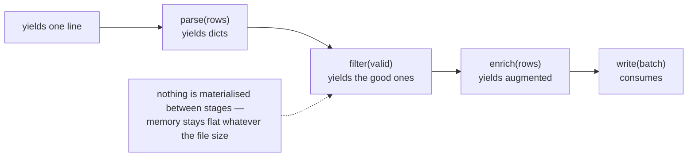

**In one line.** A generator produces values one at a time instead of building a list, so memory stays flat no matter how much data flows through.

## The idea in plain words

**Iterable** — something you can loop over; it has `__iter__`. **Iterator** — the thing doing the walking; it has `__next__` and raises `StopIteration` when exhausted. `for` calls `iter()` then `next()` until it stops.

A **generator** is the easy way to write an iterator: any function containing `yield`. Calling it does not run the body — it returns a generator object. Each `next()` runs to the next `yield` and freezes there, keeping local state.

That gives you three things:

- **Constant memory.** A generator over a 100 GB file holds one line at a time.
- **Laziness.** Nothing is computed until requested, so an infinite sequence is fine if you stop consuming it.
- **Composability.** Generators chain into pipelines where each stage is a few lines and nothing is materialised in between.

The cost: a generator is **single-pass** and has no `len()`. If you need to iterate twice, materialise with `list()` — deliberately.



## How it works

### Generator functions and expressions

```python
def read_lines(path):
    with open(path, encoding="utf-8") as f:
        for line in f:
            yield line.rstrip("\n")

squares = (x * x for x in range(10_000_000))     # generator expression: no list
```

Swap `[` for `(` and a comprehension becomes lazy. `sum(x*x for x in data)` never builds the intermediate list at all.

`yield from` delegates to another iterable and is how you compose generators without a manual loop.

### Pipelines

```python
rows      = read_lines(path)
parsed    = (parse(line) for line in rows)
valid     = (r for r in parsed if r["amount"] > 0)
enriched  = (enrich(r) for r in valid)
```

Nothing has happened yet. The work starts when something consumes `enriched` — and then exactly one record is in flight at a time. This is how you process a file larger than memory without thinking about chunking.

### itertools is the missing half

`islice` (take the first n), `chain` (concatenate), `groupby` (runs of equal keys — sort first), `batched` (fixed-size chunks, 3.12+), `tee` (two independent passes), `count`/`cycle`/`repeat` (infinite sources), `accumulate` (running totals).

Batching is the one you will reach for constantly: database inserts, API calls and model inference all want fixed-size batches from a stream.

## A real system that works this way

**Log and event processing.** A pipeline that reads compressed logs, parses, filters and aggregates is the archetypal generator chain — it runs in constant memory on a small container, whatever the file size.

**Dataset loading for ML.** PyTorch's `IterableDataset` and every streaming data loader is this protocol; `datasets` streaming mode yields examples lazily from remote storage so training starts before the download finishes.

**Paginated APIs.** A generator that yields items and transparently fetches the next page turns an awkward loop-with-cursor into `for item in client.list_orders():`.

## Code you can run

```python
import itertools, sys, tracemalloc

# --- the protocol, by hand ---------------------------------------------------
class Countdown:
    def __init__(self, start): self.n = start
    def __iter__(self): return self
    def __next__(self):
        if self.n <= 0:
            raise StopIteration
        self.n -= 1
        return self.n + 1

print("hand-written iterator:", list(Countdown(5)))

# --- the same thing as a generator ------------------------------------------
def countdown(start):
    while start > 0:
        yield start
        start -= 1

print("generator            :", list(countdown(5)))

# --- laziness: a generator is frozen between yields -------------------------
def noisy():
    print("  ...computing 1"); yield 1
    print("  ...computing 2"); yield 2

gen = noisy()
print("nothing ran yet:", type(gen).__name__)
print("first:", next(gen))
print("second:", next(gen))

# --- memory: list vs generator ----------------------------------------------
tracemalloc.start()
big_list = [x * x for x in range(1_000_000)]
list_peak = tracemalloc.get_traced_memory()[1]
tracemalloc.stop()
del big_list

tracemalloc.start()
gen_total = sum(x * x for x in range(1_000_000))
gen_peak = tracemalloc.get_traced_memory()[1]
tracemalloc.stop()

print(f"list comprehension peak: {list_peak/1e6:8.2f} MB")
print(f"generator expression   : {gen_peak/1e6:8.2f} MB  ({list_peak/max(gen_peak,1):,.0f}× less)")

# --- a pipeline: each stage is lazy -----------------------------------------
def source():
    for i in range(1, 1_000_001):
        yield f"user{i % 7},{i}"

def parse(lines):
    for line in lines:
        user, amount = line.split(",")
        yield {"user": user, "amount": int(amount)}

def only_large(rows, threshold):
    for row in rows:
        if row["amount"] % 100_000 == 0 and row["amount"] > threshold:
            yield row

pipeline = only_large(parse(source()), threshold=300_000)
print("first 3 matches:", list(itertools.islice(pipeline, 3)))

# --- itertools in anger ------------------------------------------------------
def batched(iterable, n):
    it = iter(iterable)
    while (batch := list(itertools.islice(it, n))):
        yield batch

print("batches of 4:", list(batched(range(11), 4)))
print("accumulate  :", list(itertools.accumulate([3, 1, 4, 1, 5])))
print("chain       :", list(itertools.chain("ab", [1, 2])))
print("infinite+stop:", list(itertools.islice(itertools.cycle("xy"), 5)))

# --- single-pass: the trap ---------------------------------------------------
g = (x for x in range(3))
print("first pass:", list(g), "| second pass:", list(g))
```

## Designing with it

**Generator or list?**

| Situation | Choice |
| --- | --- |
| Data larger than memory, or unbounded | Generator |
| Need `len()`, indexing, or two passes | List |
| Building a pipeline of transformations | Generators throughout, materialise at the end |
| Results consumed once, immediately | Generator |
| Values expensive to compute and reused | List (or `functools.cache`) |

**Practical cautions**

- **Exceptions surface at consumption time**, not at call time — which can put the traceback far from the cause. Keep stages small and named.
- **A generator holding a file handle keeps it open** for its whole life; wrap the source in `with` *inside* the generator, as above.
- **Do not `list()` a generator just to check it is non-empty** — use a sentinel `next(gen, None)`.
- **`itertools.tee` buffers**: if one branch races far ahead, memory grows. Two separate passes over the source are often cheaper.

## Where this stands in 2026

:::info Industry view

- Streaming pipelines are the default for log, event and ETL processing in Python — constant memory is what lets them run in small containers.
- `yield` also underpins async iteration (`async for`) and is the mechanism behind streaming responses in FastAPI and LLM token streams.
- `itertools.batched` (3.12+) removed the most-copied helper in Python codebases; batching is essential for DB writes and model inference.
- Generator-based data loading is standard in ML: streaming datasets start training without downloading everything first.

:::

## Practice questions

<details>
<summary><strong>Q1.</strong> What is the difference between an iterable and an iterator?</summary>

An iterable can produce an iterator (`__iter__`); an iterator produces values (`__next__`) and is exhausted after one pass. A list is iterable but not an iterator — that is why you can loop over it repeatedly.

</details>

<details>
<summary><strong>Q2.</strong> What happens when you call a generator function?</summary>

Nothing in the body runs. You get a generator object; the body advances only on `next()` (or a `for` loop), running to the next `yield` and freezing there with its local state intact.

</details>

<details>
<summary><strong>Q3.</strong> Your pipeline works on 1,000 rows and OOMs on 10 million. What is the likely cause?</summary>

A stage that materialises — a `list(...)`, a `sorted(...)`, a `.read()`, or a comprehension with `[` instead of `(`. Sorting and grouping are inherently buffering, so they must be done in chunks or pushed to a database.

</details>

## Further reading

- [Generators (Python tutorial)](https://docs.python.org/3/tutorial/classes.html#generators) — the basics with examples.
- [itertools](https://docs.python.org/3/library/itertools.html) — including the recipes section, which is a free toolbox.
- [PEP 255 — simple generators](https://peps.python.org/pep-0255/) — the original design, still the clearest explanation of the state machine.
- [Functional programming HOWTO — generators](https://docs.python.org/3/howto/functional.html#generators) — generator pipelines, `yield from` and the iterator protocol in depth.
