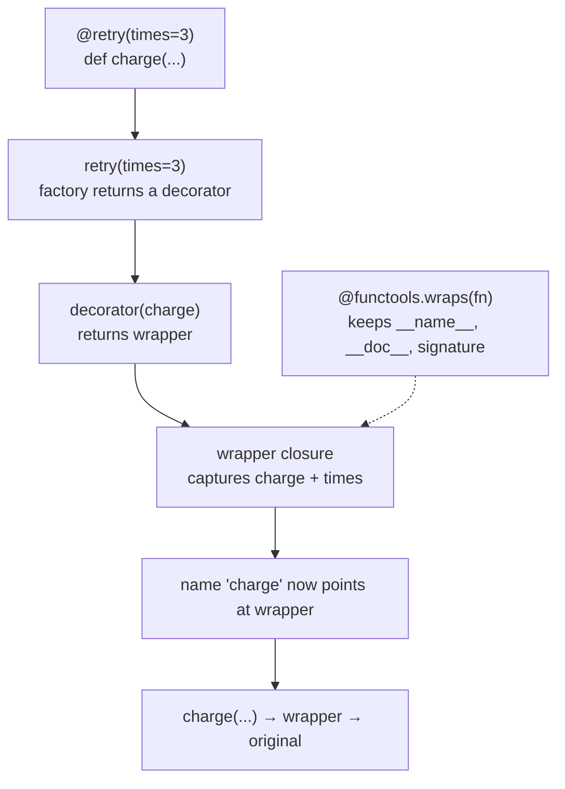

**In one line.** A decorator takes a function, returns a replacement, and lets you add retry, caching, timing or auth without touching the function body.

## The idea in plain words

`@decorator` above a `def` is exactly this:

```python
func = decorator(func)
```

Nothing more. The decorator receives the function object and returns something to bind to that name — usually a wrapper closure that calls the original.

```python
def logged(fn):
    def wrapper(*args, **kwargs):
        print(f"calling {fn.__name__}")
        return fn(*args, **kwargs)
    return wrapper
```

Two details make the difference between a toy and a usable decorator:

- **`functools.wraps`** copies `__name__`, `__doc__`, annotations and `__wrapped__` onto the wrapper. Without it your function is called `wrapper` everywhere — in tracebacks, in docs, in `help()`, and introspection-based frameworks break.
- **Decorators with arguments need a third layer**: a factory that takes the arguments and returns the actual decorator.

Decorators are how frameworks express cross-cutting concerns: `@app.get("/path")` registers a route, `@pytest.fixture` declares a fixture, `@lru_cache` memoises, `@property` changes attribute semantics.



## How it works

### The three layers, once

```python
import functools

def retry(times=3, exceptions=(Exception,)):        # 1. takes the arguments
    def decorator(fn):                              # 2. takes the function
        @functools.wraps(fn)
        def wrapper(*args, **kwargs):               # 3. replaces the function
            for attempt in range(1, times + 1):
                try:
                    return fn(*args, **kwargs)
                except exceptions:
                    if attempt == times:
                        raise
        return wrapper
    return decorator
```

If your decorator takes no arguments, drop the outer layer. If you want it to work both with and without parentheses, check whether the first argument is callable — but most codebases are happier standardising on always using parentheses.

### Order matters

```python
@timing
@retry(times=3)
def fetch(): ...
```

Decorators apply bottom-up: `fetch = timing(retry(3)(fetch))`. So `timing` measures **all** the retries. Swap them and you time each attempt separately. This is a real source of confusing metrics.

### The standard-library ones you should know

- `functools.lru_cache` / `functools.cache` — memoisation; watch unbounded growth and require hashable arguments.
- `functools.cached_property` — compute once per instance, on first access.
- `functools.singledispatch` — dispatch on the type of the first argument, a clean alternative to `isinstance` chains.
- `contextlib.contextmanager` — turn a generator into a context manager.
- `staticmethod`, `classmethod`, `property` — the built-in trio.
- `dataclasses.dataclass` — a class decorator, proving decorators are not just for functions.

## A real system that works this way

**Every web framework** uses decorators for routing, auth and validation: `@app.post("/orders")` registers the handler and `@requires_role("admin")` wraps it in a check. The handler body stays pure business logic.

**Caching an expensive lookup** with `@lru_cache` is often the single highest-value line in a data script — but in a long-running service it becomes a memory leak unless bounded, which is exactly the trade-off the decorator makes visible.

## Code you can run

```python
import functools, time

# --- a decorator worth writing: retry with backoff --------------------------
def retry(times=3, exceptions=(Exception,), backoff=0.01):
    def decorator(fn):
        @functools.wraps(fn)                      # keeps the identity of fn
        def wrapper(*args, **kwargs):
            for attempt in range(1, times + 1):
                try:
                    return fn(*args, **kwargs)
                except exceptions as exc:
                    print(f"  attempt {attempt} failed: {exc}")
                    if attempt == times:
                        raise
                    time.sleep(backoff * attempt)
        return wrapper
    return decorator

calls = {"n": 0}

@retry(times=3, exceptions=(ConnectionError,))
def fetch(url):
    """Fetch a URL (flaky on purpose)."""
    calls["n"] += 1
    if calls["n"] < 3:
        raise ConnectionError("network hiccup")
    return f"200 OK from {url}"

print(fetch("https://example.com"))
print("identity preserved:", fetch.__name__, "|", fetch.__doc__)
print("original reachable:", fetch.__wrapped__.__name__)

# --- what wraps saves you from ----------------------------------------------
def unwrapped(fn):
    def wrapper(*a, **kw): return fn(*a, **kw)
    return wrapper

@unwrapped
def documented():
    """Important docs."""
print("without wraps:", documented.__name__, "|", documented.__doc__)

# --- order: bottom-up --------------------------------------------------------
def tag(label):
    def decorator(fn):
        @functools.wraps(fn)
        def wrapper(*a, **kw):
            print(f"  enter {label}")
            result = fn(*a, **kw)
            print(f"  exit  {label}")
            return result
        return wrapper
    return decorator

@tag("outer")
@tag("inner")
def work(): return "done"

print("call order:"); work()

# --- caching: huge win, with a cost -----------------------------------------
@functools.lru_cache(maxsize=None)
def fib(n):
    return n if n < 2 else fib(n - 1) + fib(n - 2)

start = time.perf_counter()
value = fib(120)
print(f"fib(120) = {value} in {time.perf_counter() - start:.4f}s (memoised)")
print("cache:", fib.cache_info())

# --- singledispatch instead of an isinstance ladder -------------------------
@functools.singledispatch
def describe(value):
    return f"object: {value!r}"

@describe.register
def _(value: int):
    return f"int: {value:,}"

@describe.register
def _(value: list):
    return f"list of {len(value)}"

print([describe(x) for x in (5_000, [1, 2, 3], object())][:2])
```

## Designing with it

**When a decorator is the right tool**

| Concern | Decorator? |
| --- | --- |
| Retry, timing, caching, logging, auth, rate limit | Yes — cross-cutting, uniform across many functions |
| Registering something with a framework | Yes — this is what frameworks expose |
| Business logic that varies per call | No — pass an argument |
| Something that changes the signature | No — it will confuse callers and type checkers |

**Rules**

- **Always use `functools.wraps`.** Tracebacks, docs, type checkers and framework introspection depend on it.
- **Keep wrappers thin and fast** — they run on every call.
- **Never swallow exceptions** in a decorator without an explicit, documented reason.
- **Expose the original** as `__wrapped__` (wraps does this) so tests can reach it.
- **Beware `lru_cache` on methods**: it keeps `self` alive for the life of the cache, which leaks instances. Use `cached_property`, or cache a module-level function.
- **Type them** with `ParamSpec` so the decorated signature survives static checking.

## Where this stands in 2026

:::info Industry view

- Retry, timing, caching and auth decorators exist in essentially every production Python codebase; libraries like tenacity ship theirs.
- Missing `functools.wraps` is a standard review comment — it silently breaks introspection-driven frameworks.
- `lru_cache` on methods and unbounded caches are a common memory-leak source in long-running services.
- `ParamSpec` (PEP 612) is how modern codebases keep decorators type-safe; expect it in typed libraries.

:::

## Practice questions

<details>
<summary><strong>Q1.</strong> What does `@decorator` actually do?</summary>

It rebinds the name: `f = decorator(f)` immediately after the `def` executes. A decorator with arguments adds a layer — `f = decorator(args)(f)`.

</details>

<details>
<summary><strong>Q2.</strong> Why is `functools.wraps` important beyond cosmetics?</summary>

It copies `__name__`, `__doc__`, `__module__`, `__qualname__`, annotations and sets `__wrapped__`. Frameworks that introspect signatures (FastAPI, pytest, Click, Sphinx) misbehave without it, and tracebacks stop naming the real function.

</details>

<details>
<summary><strong>Q3.</strong> Where does `@timing` above `@retry` measure, versus below it?</summary>

Above (applied last, outermost) it measures the whole retry loop including sleeps. Below it measures each individual attempt. Decorators apply bottom-up, so the visual order is the reverse of the call nesting.

</details>

## Further reading

- [functools](https://docs.python.org/3/library/functools.html) — `wraps`, `lru_cache`, `cached_property`, `singledispatch`, `partial`.
- [PEP 318 — decorators for functions and methods](https://peps.python.org/pep-0318/) — the original motivation.
- [PEP 612 — ParamSpec](https://peps.python.org/pep-0612/) — typing decorators without losing the signature.
- [tenacity](https://tenacity.readthedocs.io/) — a production retry decorator worth reading for its API design.
