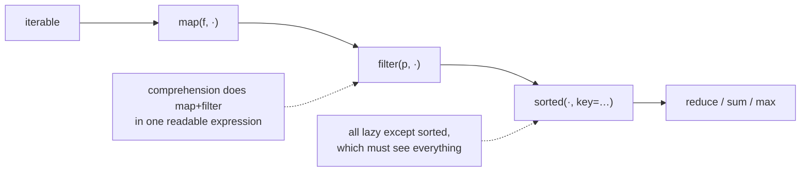

**In one line.** Python borrows the useful parts of functional programming — first-class functions, laziness and immutability — without asking you to stop writing loops.

## The idea in plain words

The higher-order built-ins take a function and an iterable:

- **`map(f, xs)`** — apply, lazily.
- **`filter(p, xs)`** — keep where true, lazily.
- **`functools.reduce(f, xs)`** — fold to a single value. Usually there is a better named tool (`sum`, `max`, `math.prod`, `"".join`).
- **`sorted(xs, key=…)`** and **`min`/`max`** with `key` — the workhorses.
- **`any`/`all`** — short-circuiting truth over an iterable.
- **`zip`/`enumerate`** — pair and index.

In Python, a comprehension is usually clearer than `map`/`filter` with a `lambda`, and the community leans that way. `map` earns its place when you already have a named function: `map(int, parts)` beats `[int(p) for p in parts]` slightly, and `map` over a huge iterable is lazy by default.

Sorting is where the functional style really pays: `key=` accepts any callable, `operator.itemgetter`/`attrgetter` are fast, and Python's sort is **stable**, so you can sort by successive keys to get multi-level ordering.



## How it works

### Sorting is the most useful of these

```python
from operator import attrgetter, itemgetter

rows.sort(key=itemgetter("score"), reverse=True)
people.sort(key=attrgetter("last", "first"))
words.sort(key=str.casefold)                    # case-insensitive, unicode-correct
```

Stability lets you compose passes: sort by secondary key first, then by primary. Or use a tuple key, with `-x` to reverse one numeric component: `key=lambda r: (-r.score, r.name)`.

### any / all read like their specification

```python
if all(field in payload for field in REQUIRED):
    ...
if any(e.level == "ERROR" for e in events):
    ...
```

Both short-circuit, so they stop at the first decisive element — a cheap way to avoid scanning a large sequence.

### functools and operator

`partial` pre-binds arguments; `reduce` folds; `cache`/`lru_cache` memoise; `singledispatch` dispatches on type; `cmp_to_key` adapts an old-style comparator.

The `operator` module gives you fast, picklable function objects for the things `lambda` is usually used for: `itemgetter`, `attrgetter`, `methodcaller`, `add`, `mul`. Picklable matters because `multiprocessing` cannot send a `lambda` to a worker.

## A real system that works this way

**Ranking and leaderboards** are almost pure `sorted(key=…)`: multi-level ordering with a tuple key, then `islice` for the top N. Getting the tie-break right (score descending, then name ascending) is exactly the tuple-key trick.

**Multiprocessing pools** force the functional style for a practical reason: the function you `pool.map` must be picklable, so a module-level function or `partial`, never a lambda. Teams discover this the first time they parallelise a script.

## Code you can run

```python
import functools, math, operator
from dataclasses import dataclass

@dataclass
class Player:
    name: str
    score: int
    country: str

players = [Player("ada", 99, "UK"), Player("grace", 99, "US"),
           Player("alan", 87, "UK"), Player("edsger", 93, "NL")]

# --- sorting: tuple key gives multi-level ordering ---------------------------
ranked = sorted(players, key=lambda p: (-p.score, p.name))
print("leaderboard:", [(p.name, p.score) for p in ranked])

# --- stability: sort by secondary key first, then primary -------------------
by_name = sorted(players, key=operator.attrgetter("name"))
by_country_then_name = sorted(by_name, key=operator.attrgetter("country"))
print("stable two-pass:", [(p.country, p.name) for p in by_country_then_name])

# --- map/filter vs comprehension --------------------------------------------
parts = "10,20,x,40".split(",")
numbers = [int(p) for p in parts if p.isdigit()]
same = list(map(int, filter(str.isdigit, parts)))
print("comprehension:", numbers, "| map+filter:", same)

# --- reduce, and the named tools that usually replace it --------------------
values = [3, 1, 4, 1, 5]
print("reduce product:", functools.reduce(operator.mul, values))
print("math.prod     :", math.prod(values), "  <- prefer this")
print("sum/max/min   :", sum(values), max(values), min(values))

# --- any / all short-circuit -------------------------------------------------
REQUIRED = {"id", "amount", "currency"}
payload = {"id": 1, "amount": 10}
print("valid payload:", all(f in payload for f in REQUIRED),
      "| missing:", sorted(REQUIRED - payload.keys()))

checked = []
def expensive(x):
    checked.append(x)
    return x > 3

print("any(...) =", any(expensive(x) for x in [1, 2, 5, 7]),
      "| evaluated only:", checked)

# --- partial and picklable functions (what multiprocessing needs) -----------
def scale(factor, x):
    return factor * x

double = functools.partial(scale, 2)
print("partial:", list(map(double, range(5))))
print("picklable:", operator.itemgetter(0).__class__.__name__,
      "vs lambda (not picklable)")

# --- grouping: sort then groupby -------------------------------------------
import itertools
rows = sorted(players, key=operator.attrgetter("country"))
for country, group in itertools.groupby(rows, key=operator.attrgetter("country")):
    names = [p.name for p in group]
    print(f"  {country}: {names}")
```

## Designing with it

**Which tool**

| Task | Reach for |
| --- | --- |
| Transform + filter a list | Comprehension |
| Transform with an existing named function, lazily | `map(fn, xs)` |
| Reduce to one value | The named built-in (`sum`, `max`, `math.prod`, `"".join`) — `reduce` only if none fits |
| Order by several keys | `sorted(key=lambda x: (a, b))` or successive stable sorts |
| Group | Sort by the key, then `itertools.groupby` |
| Parallel map | Module-level function or `partial` — never a lambda |

**Notes**

- `reduce` with a non-obvious lambda is the classic write-only line. If a reviewer has to run it mentally, use a loop.
- `sorted` is O(n log n) and must materialise the whole sequence — it is the point in a lazy pipeline where memory spikes.
- `key=` is called once per element; an expensive key is fine (it is not recomputed during comparisons), which is the decorate-sort-undecorate pattern built in.
- Prefer `operator.itemgetter`/`attrgetter` over `lambda` in hot loops and anywhere pickling matters.

## Where this stands in 2026

:::info Industry view

- Comprehensions are the house style for map/filter; `map` survives mainly for named functions and lazy pipelines.
- `sorted(key=…)` with tuple keys is everyday work in ranking, reporting and leaderboards — and a frequent interview exercise.
- `operator.itemgetter`/`attrgetter` are preferred in performance-sensitive and multiprocessing code because they are fast and picklable.
- `functools.reduce` is rare in modern code; reviewers ask for a named aggregate or an explicit loop.

:::

## Practice questions

<details>
<summary><strong>Q1.</strong> Why can Python sort by multiple keys with two sequential sorts?</summary>

Because `sorted`/`list.sort` are stable: elements comparing equal keep their previous relative order. Sort by the least significant key first, then the most significant.

</details>

<details>
<summary><strong>Q2.</strong> Why does `pool.map(lambda x: x*2, data)` fail under multiprocessing?</summary>

Arguments and the function must be pickled to reach the worker process, and lambdas are not picklable. Use a module-level function, or `functools.partial` of one.

</details>

<details>
<summary><strong>Q3.</strong> When is `reduce` genuinely the right choice?</summary>

When folding with a non-standard associative operation that has no named built-in — merging dictionaries or intervals, composing functions, or combining custom accumulator objects. Even then, an explicit loop is often clearer.

</details>

## Further reading

- [Built-in functions](https://docs.python.org/3/library/functions.html) — `map`, `filter`, `sorted`, `any`, `all`, `zip`.
- [Sorting HOW TO](https://docs.python.org/3/howto/sorting.html) — key functions, stability, multi-level sorting.
- [operator](https://docs.python.org/3/library/operator.html) — fast, picklable function objects.
- [Functional programming HOWTO](https://docs.python.org/3/howto/functional.html) — the official tour, including generators and itertools.
