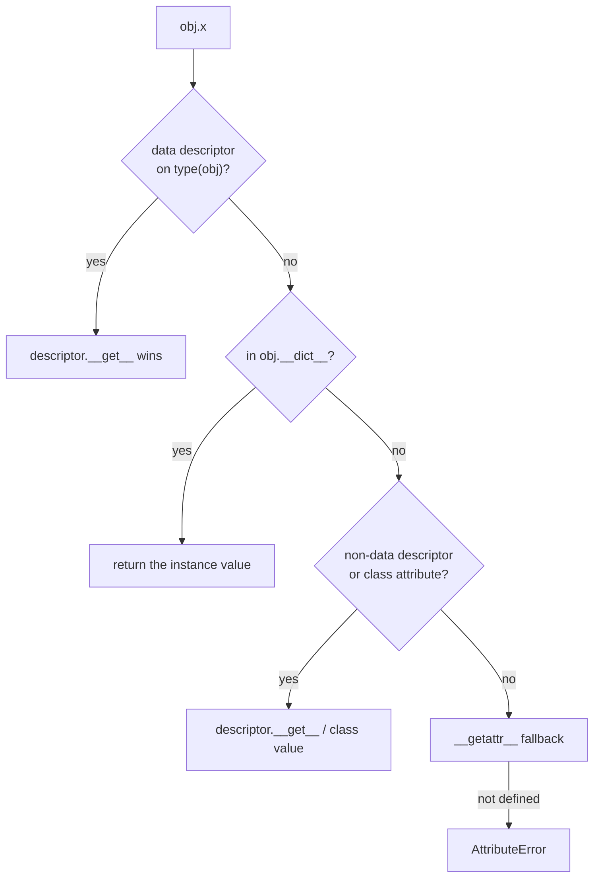

**In one line.** Attribute access, class creation and instance layout are all hooks you can implement — powerful, occasionally necessary, and easy to over-use.

## The idea in plain words

Three layers of machinery sit under ordinary-looking Python.

**Attribute access.** `obj.x` does not simply read a dict. Python looks for a **data descriptor** on the type first, then the instance `__dict__`, then non-data descriptors and class attributes. A descriptor is any object defining `__get__`, `__set__` or `__delete__`. `property`, `classmethod`, `staticmethod` and `functools.cached_property` are all descriptors — nothing special, just this protocol.

**Instance layout.** By default every instance carries a `__dict__`, which is flexible and costs memory. `__slots__` replaces it with a fixed set of descriptors: smaller, faster attribute access, no typo-creates-a-new-attribute.

**Class creation.** `class Foo:` executes the body, collects the namespace, and calls a **metaclass** (`type` by default) to build the class object. A metaclass can validate, register or rewrite classes as they are defined. Most of what people reach for metaclasses for is better done with `__init_subclass__` (customise subclass creation) or `__set_name__` (let a descriptor learn its own attribute name) — both simpler and introduced precisely to reduce metaclass use.

The honest guidance: **learn this to read frameworks, not to write them**. ORMs, Pydantic, dataclasses and pytest are built on it. Application code that needs a metaclass is usually one refactor away from not needing one.



## How it works

### Descriptors: what `property` actually is

```python
class Positive:
    """A reusable, validating attribute — the job property does per-class."""
    def __set_name__(self, owner, name):      # Python tells it its own name
        self._name = f"_{name}"

    def __get__(self, obj, objtype=None):
        if obj is None:
            return self
        return getattr(obj, self._name)

    def __set__(self, obj, value):            # __set__ makes it a DATA descriptor
        if value <= 0:
            raise ValueError(f"{self._name[1:]} must be positive")
        setattr(obj, self._name, value)

class Order:
    quantity = Positive()
    price = Positive()
```

One descriptor, reused across attributes and classes. Writing the same validation as two `@property` pairs duplicates it; that is the case where a descriptor earns its place.

### `__slots__` and instance layout

```python
class Point:
    __slots__ = ("x", "y")        # no per-instance __dict__
```

Saves substantial memory when you have many small objects, and makes typos raise `AttributeError` instead of silently creating a new attribute. The costs: no dynamic attributes, multiple inheritance gets restrictive, and you must declare `__weakref__` if you need weak references.

### Class creation: `__init_subclass__` before metaclasses

```python
class Plugin:
    registry: dict[str, type] = {}

    def __init_subclass__(cls, /, name: str, **kwargs):
        super().__init_subclass__(**kwargs)
        if name in Plugin.registry:
            raise ValueError(f"duplicate plugin {name!r}")
        Plugin.registry[name] = cls           # self-registration, no metaclass

class CsvPlugin(Plugin, name="csv"): ...
```

This covers most real "do something when a subclass is defined" needs. A metaclass is only required when you must change *how the class itself is constructed* — rewriting the namespace, controlling the MRO, or making the class itself callable in a custom way.

### ABCs versus Protocols

An **ABC** is nominal: subclasses must inherit and implement `@abstractmethod`s, and instantiation fails if they do not. A **Protocol** is structural: any object with matching methods qualifies, with no inheritance and no import coupling.

Rule of thumb: ABC when you own the hierarchy and want to force completeness; Protocol when you are typing a seam, especially one you will fake in tests.

## A real system that works this way

**Pydantic and dataclasses** both build classes from annotations at definition time — that is `__init_subclass__`/metaclass work plus descriptors for validation. **Django and SQLAlchemy ORMs** turn `name = Column(String)` into instrumented attributes via descriptors, which is why assigning to a model field can emit SQL. **pytest** rewrites assertions at import time using the import system, another hook in the same family.

Knowing this is what turns "the framework is magic" into "the framework uses `__set_name__` and a metaclass, and here is where to put a breakpoint".

## Code you can run

```python
"""Descriptors, slots, __init_subclass__ and a minimal metaclass — measured."""
import sys
from abc import ABC, abstractmethod
from typing import Protocol, runtime_checkable

# --- 1. a reusable validating descriptor ------------------------------------
class Positive:
    def __set_name__(self, owner, name):
        self._name = f"_{name}"

    def __get__(self, obj, objtype=None):
        return self if obj is None else getattr(obj, self._name)

    def __set__(self, obj, value):
        if value <= 0:
            raise ValueError(f"{self._name[1:]} must be positive, got {value}")
        setattr(obj, self._name, value)

class Order:
    quantity = Positive()
    price = Positive()
    def __init__(self, quantity, price):
        self.quantity, self.price = quantity, price

o = Order(3, 9.99)
print("descriptor get:", o.quantity, o.price)
for bad in [("quantity", 0), ("price", -1)]:
    try:
        setattr(o, *bad)
    except ValueError as exc:
        print("  validated:", exc)

# --- 2. attribute lookup order ----------------------------------------------
class Shadow:
    attr = "class attribute"
s = Shadow()
print("\nclass attr :", s.attr)
s.attr = "instance attribute"
print("instance wins:", s.attr, "| class still:", Shadow.attr)
print("but a DATA descriptor beats the instance dict:",
      type(o).__dict__["quantity"].__class__.__name__)

# --- 3. __slots__: memory and typo safety -----------------------------------
class Fat:
    def __init__(self, x, y): self.x, self.y = x, y

class Lean:
    __slots__ = ("x", "y")
    def __init__(self, x, y): self.x, self.y = x, y

fat, lean = Fat(1, 2), Lean(1, 2)
fat_size = sys.getsizeof(fat) + sys.getsizeof(fat.__dict__)
lean_size = sys.getsizeof(lean)
print(f"\nper instance: dict-based {fat_size} bytes | slots {lean_size} bytes"
      f" ({(1 - lean_size / fat_size) * 100:.0f}% less)")

fat.typoo = 1                                  # silently accepted
print("typo on dict class accepted :", hasattr(fat, "typoo"))
try:
    lean.typoo = 1
except AttributeError as exc:
    print("typo on slots class caught  :", exc)

# --- 4. __init_subclass__: self-registering plugins, no metaclass -----------
class Plugin:
    registry: dict[str, type] = {}
    def __init_subclass__(cls, /, name, **kwargs):
        super().__init_subclass__(**kwargs)
        if name in Plugin.registry:
            raise ValueError(f"duplicate plugin {name!r}")
        Plugin.registry[name] = cls

class CsvPlugin(Plugin, name="csv"):
    def load(self): return "rows from csv"

class JsonPlugin(Plugin, name="json"):
    def load(self): return "rows from json"

print("\nregistry:", {k: v.__name__ for k, v in Plugin.registry.items()})
try:
    class Duplicate(Plugin, name="csv"): ...
except ValueError as exc:
    print("duplicate rejected at class-definition time:", exc)

# --- 5. a metaclass, for the case __init_subclass__ cannot reach ------------
class RequireDocstrings(type):
    """Enforces a rule while the class is being constructed."""
    def __new__(mcls, name, bases, namespace, **kwargs):
        for attr, value in namespace.items():
            if callable(value) and not attr.startswith("_") and not value.__doc__:
                raise TypeError(f"{name}.{attr} needs a docstring")
        return super().__new__(mcls, name, bases, namespace, **kwargs)

class Documented(metaclass=RequireDocstrings):
    def public(self):
        """Has a docstring, so this class builds."""

print("\nmetaclass of Documented:", type(Documented).__name__)
try:
    class Undocumented(metaclass=RequireDocstrings):
        def public(self): ...
except TypeError as exc:
    print("metaclass rejected the class:", exc)

# --- 6. ABC (nominal) vs Protocol (structural) ------------------------------
class Repo(ABC):
    @abstractmethod
    def save(self, item) -> str: ...

@runtime_checkable
class Saver(Protocol):
    def save(self, item) -> str: ...

class Duck:                       # inherits nothing
    def save(self, item): return f"saved {item}"

print("\nDuck satisfies the Protocol :", isinstance(Duck(), Saver))
print("Duck is a subclass of the ABC:", isinstance(Duck(), Repo))
try:
    Repo()
except TypeError as exc:
    print("ABC cannot be instantiated :", str(exc).split(" with ")[0])
```

## Designing with it

**Reach for the simplest tool that works**

| Need | Use | Not |
| --- | --- | --- |
| One computed/validated attribute | `@property` | A descriptor |
| The same validation on many attributes or classes | A descriptor with `__set_name__` | Copy-pasted properties |
| Expensive value computed once per instance | `functools.cached_property` | A hand-rolled cache |
| Do something when a subclass is defined | `__init_subclass__` | A metaclass |
| Control how the class object itself is built | A metaclass | — |
| Force a complete interface in your own hierarchy | ABC + `@abstractmethod` | A metaclass |
| Type a seam you will fake in tests | `Protocol` | An ABC |
| Millions of small objects | `__slots__` or a NamedTuple | Plain classes |

**Warnings**

- **Metaclass conflicts** are real: a class cannot have two unrelated metaclasses, which is why mixing framework base classes sometimes fails with an unhelpful error.
- **Descriptors must not store state on themselves** — they live on the class and are shared by every instance. Store per-instance state on the instance, keyed by the name `__set_name__` gave you.
- **`__getattr__` is only called when normal lookup fails**; `__getattribute__` intercepts *everything* and is very easy to make infinitely recursive.
- **Debuggability is the cost.** Every layer of magic is a layer someone must understand at 3am. If a reader cannot tell where an attribute comes from, you have spent your budget.

## Where this stands in 2026

:::info Industry view

- `__init_subclass__` and `__set_name__` have displaced most legitimate metaclass use in application code; metaclasses survive mainly inside frameworks.
- `Protocol` has become the default way to express interfaces, with ABCs reserved for hierarchies a team fully owns.
- `@dataclass(slots=True)` made the memory win available without hand-writing `__slots__`, and is common in data-heavy services.
- Reading this machinery is a practical skill: Pydantic v2, SQLAlchemy 2.0 and attrs all build classes from annotations, and debugging them requires knowing where the hooks are.

:::

## Practice questions

<details>
<summary><strong>Q1.</strong> What is the difference between a data descriptor and a non-data descriptor, and why does it matter?</summary>

A data descriptor defines `__set__` (or `__delete__`); a non-data one defines only `__get__`. Data descriptors take priority over the instance `__dict__`, non-data ones do not. That is why `property` cannot be shadowed by an instance attribute, while a plain method can be.

</details>

<details>
<summary><strong>Q2.</strong> When is a metaclass genuinely the right answer?</summary>

When you must change how the class object is constructed — rewriting the namespace, injecting a custom `__prepare__`, controlling instantiation of the class itself, or enforcing rules across a whole hierarchy including its bases. For "react to a subclass being created", `__init_subclass__` is simpler and composes better.

</details>

<details>
<summary><strong>Q3.</strong> What do you lose by adding `__slots__`?</summary>

Dynamic attributes (anything not declared), a straightforward `__dict__` for serialisation helpers that expect one, weak references unless you add `__weakref__`, and easy multiple inheritance — two parents with non-empty slots conflict. In exchange you get lower memory and slightly faster attribute access.

</details>

## Further reading

- [Descriptor HowTo Guide](https://docs.python.org/3/howto/descriptor.html) — the official deep dive, including pure-Python implementations of `property` and `classmethod`.
- [Data model reference](https://docs.python.org/3/reference/datamodel.html) — attribute access, class creation, `__slots__`.
- [PEP 487 — `__init_subclass__` and `__set_name__`](https://peps.python.org/pep-0487/) — the simpler alternatives to metaclasses.
- [Fluent Python (Ramalho)](https://www.oreilly.com/library/view/fluent-python-2nd/9781492056348/) — chapters 22–24 are the best treatment of this material.
