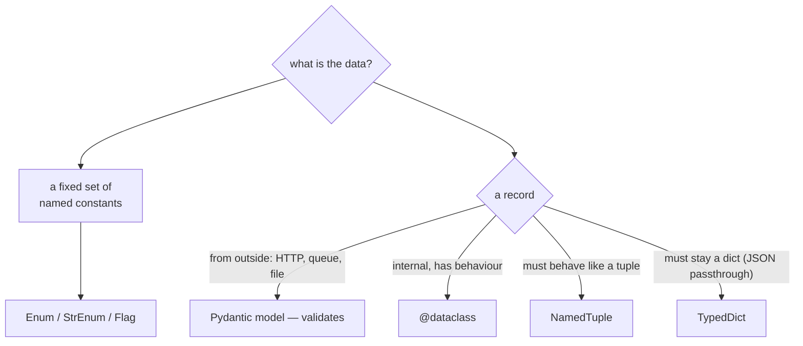

**In one line.** Every magic string in your codebase is a typo waiting to happen — `Enum` makes the set of valid values explicit, and the record types make the shape of your data explicit.

## The idea in plain words

### The theory: why magic values are a problem

`status == "shiped"` is a bug that no tool can catch. The string is valid Python, valid at runtime, and simply never true. The set of permitted values lives only in your head and in whatever documentation has drifted.

An **enumeration** turns that set into a real object:

- Members are **singletons** — `Status.SHIPPED is Status.SHIPPED`, so identity comparison is safe and fast.
- A typo is an `AttributeError` at the moment it runs, not silence.
- The valid set is **iterable and introspectable**: `list(Status)` is the documentation.
- Type checkers and IDEs can complete and verify it.

The variants:

| Type | Use |
| --- | --- |
| `Enum` | The default: named constants with no arithmetic meaning |
| `IntEnum` | When the value must behave as an `int` (protocol codes, database columns) |
| `StrEnum` (3.11+) | When it must behave as a `str` (JSON payloads, log fields) |
| `Flag` / `IntFlag` | Combinable bit options — permissions, feature masks |
| `auto()` | When the values are arbitrary and only the names matter |

### The theory: choosing a record type

Structured data has five common shapes in Python, and picking the right one removes a lot of code:

| Type | Mutable | Typed | Validated | Use when |
| --- | --- | --- | --- | --- |
| `tuple` | no | no | no | A short positional pair you unpack immediately |
| `NamedTuple` | no | yes | no | A lightweight immutable record, tuple-compatible |
| `@dataclass` | optional | yes | no | The default for internal models with behaviour |
| `TypedDict` | yes | yes | no | JSON you pass through without converting |
| Pydantic model | optional | yes | **yes** | Untrusted input at a system boundary |

The line that matters: **Pydantic at the edges, dataclasses inside, NamedTuple when it must be a tuple, TypedDict when it must stay a dict.**



## How it works

### Enum in practice

```python
from enum import Enum, StrEnum, Flag, auto

class Status(StrEnum):          # behaves as a str: JSON-friendly
    PENDING = "pending"
    SHIPPED = "shipped"
    CANCELLED = "cancelled"

class Permission(Flag):         # combinable
    READ = auto()
    WRITE = auto()
    ADMIN = READ | WRITE
```

Enums can carry behaviour — methods, properties, even a `classmethod` factory that parses loose input. That is often where the validation for a field belongs, rather than scattered across call sites.

**`match` works naturally with enums**, and with `Enum` (not `StrEnum`) an unmatched case is easy to catch because the member set is closed and iterable.

### NamedTuple, dataclass, TypedDict side by side

```python
from typing import NamedTuple, TypedDict
from dataclasses import dataclass

class PointT(NamedTuple):       # immutable, iterable, tuple-compatible
    x: float
    y: float

@dataclass(frozen=True, slots=True)
class PointD:                   # immutable, not a tuple, cheaper per instance
    x: float
    y: float

class PointDict(TypedDict):     # still a plain dict at runtime
    x: float
    y: float
```

`NamedTuple` unpacks and indexes like a tuple, which matters when you are returning multiple values or feeding APIs that expect sequences. A `dataclass` does not — and that is usually a feature, because positional access to a record is how field-order bugs happen.

### Serialising them

Enums and records must cross boundaries, so know the conversions: `StrEnum` members serialise straight to JSON; plain `Enum` needs `.value`; `dataclasses.asdict()` converts nested dataclasses; `NamedTuple._asdict()` gives a dict. Parsing back is where Pydantic earns its place, because it validates while it converts.

## A real system that works this way

**Order state machines** are the canonical enum use: a `Status` enum, a dict of allowed transitions, and one function that refuses illegal moves. Written with strings, the same logic silently accepts `"canceled"` alongside `"cancelled"` and the bug surfaces in a report three weeks later.

**Permission flags** are the `Flag` use: one integer column in the database, combinable and testable with `in`, instead of five boolean columns that can contradict each other.

## Code you can run

```python
"""Enums that prevent typos, and the four record types compared."""
import json
from dataclasses import asdict, dataclass, field
from enum import Enum, Flag, StrEnum, auto
from typing import NamedTuple, TypedDict

# --- 1. the problem: magic strings ------------------------------------------
def ship_with_strings(status: str) -> str:
    if status == "shiped":              # typo: silently never true
        return "already shipped"
    return "shipping now"

print("magic string typo   :", ship_with_strings("shipped"), "<- wrong, and silent")

# --- 2. StrEnum: closed set, JSON-friendly ---------------------------------
class Status(StrEnum):
    PENDING = "pending"
    SHIPPED = "shipped"
    CANCELLED = "cancelled"

    @classmethod
    def parse(cls, raw: str) -> "Status":
        try:
            return cls(raw.strip().lower())
        except ValueError:
            raise ValueError(f"unknown status {raw!r}; expected one of "
                             f"{[s.value for s in cls]}") from None

print("members             :", [s.value for s in Status])
print("identity comparison :", Status.SHIPPED is Status("shipped"))
print("behaves as a str    :", Status.SHIPPED == "shipped",
      "| json:", json.dumps({"status": Status.SHIPPED}))
try:
    Status.SHIPED                        # the typo is now an error
except AttributeError as exc:
    print("typo caught         :", exc)
try:
    Status.parse("canceled")
except ValueError as exc:
    print("loose input caught  :", exc)

# --- 3. a state machine the enum makes safe --------------------------------
ALLOWED = {
    Status.PENDING: {Status.SHIPPED, Status.CANCELLED},
    Status.SHIPPED: set(),
    Status.CANCELLED: set(),
}

def transition(current: Status, target: Status) -> Status:
    if target not in ALLOWED[current]:
        raise ValueError(f"cannot move from {current.value} to {target.value}")
    return target

print("\npending -> shipped  :", transition(Status.PENDING, Status.SHIPPED).value)
try:
    transition(Status.SHIPPED, Status.PENDING)
except ValueError as exc:
    print("illegal transition  :", exc)

# --- 4. Flag: combinable options in one value ------------------------------
class Permission(Flag):
    READ = auto()
    WRITE = auto()
    DELETE = auto()
    ADMIN = READ | WRITE | DELETE

granted = Permission.READ | Permission.WRITE
print(f"\ngranted             : {granted}")
print(f"can write           : {Permission.WRITE in granted}")
print(f"can delete          : {Permission.DELETE in granted}")
print(f"stored as an int    : {granted.value} (one column, not three booleans)")

# --- 5. the four record types, compared ------------------------------------
class PointT(NamedTuple):
    x: float
    y: float
    label: str = ""

@dataclass(frozen=True, slots=True)
class PointD:
    x: float
    y: float
    label: str = ""

class PointDict(TypedDict):
    x: float
    y: float

nt, dc = PointT(1.0, 2.0, "a"), PointD(1.0, 2.0, "a")
td: PointDict = {"x": 1.0, "y": 2.0}

print("\nNamedTuple unpacks  :", (lambda x, y, label: f"{x},{y}")(*nt))
print("NamedTuple indexes  :", nt[0], "| as dict:", nt._asdict())
print("dataclass repr      :", dc)
print("dataclass as dict   :", asdict(dc))
print("TypedDict is a dict :", isinstance(td, dict), td)

try:
    dc.x = 99                       # frozen
except Exception as exc:
    print("frozen dataclass    :", type(exc).__name__)

import sys
print(f"\nper-instance size: NamedTuple {sys.getsizeof(nt)}B | "
      f"dataclass(slots) {sys.getsizeof(dc)}B | dict {sys.getsizeof(td)}B")

# --- 6. round-tripping across a boundary -----------------------------------
@dataclass
class Order:
    id: str
    status: Status
    items: list[str] = field(default_factory=list)

order = Order("A-1", Status.PENDING, ["widget"])
payload = json.dumps({**asdict(order), "status": order.status.value})
print("\nserialised          :", payload)

restored_raw = json.loads(payload)
restored = Order(restored_raw["id"], Status.parse(restored_raw["status"]),
                 restored_raw["items"])
print("restored            :", restored, "| status is an enum again:",
      isinstance(restored.status, Status))
```

## Designing with it

**Enum guidance**

- **Prefer `StrEnum`** for anything that crosses a JSON or log boundary — it serialises without a `.value` dance.
- **Use `IntEnum`** only when the number has external meaning (a protocol code, an existing database column).
- **Put parsing on the enum** (`Status.parse`) so loose external input is normalised in exactly one place.
- **Do not renumber or rename members** once they are persisted — the stored value is now part of your data contract.
- **`match` on enums** reads well; add a `case _:` that raises, so a new member cannot be silently ignored.

**Record guidance**

- Start with `@dataclass`. Move to `frozen=True` when it is shared, add `slots=True` when there are many instances.
- Use `NamedTuple` when the value must *be* a tuple (unpacking, sequence APIs, tuple keys).
- Use `TypedDict` for JSON you never convert — it types the dict without a runtime cost.
- Use **Pydantic only at boundaries**; validating on every internal call is real overhead.
- **Never use a bare tuple for more than two fields.** `order[3]` is unreadable and shifts silently when the shape changes.

## Where this stands in 2026

:::info Industry view

- `StrEnum` (3.11+) largely replaced the old `class Status(str, Enum)` idiom and is now the default for API and log values.
- Magic-string status fields are a routine review comment; linters and type checkers flag `Literal` or enum mismatches.
- `@dataclass(slots=True)` is the standard internal record; `NamedTuple` survives where tuple behaviour is genuinely needed.
- `TypedDict` is common in data pipelines, where converting large JSON payloads into objects would cost more than it is worth.

:::

## Practice questions

<details>
<summary><strong>Q1.</strong> Why is `Status.SHIPPED is Status("shipped")` guaranteed to be `True`?</summary>

Enum members are singletons: the metaclass creates each member once, and value lookup (`Status("shipped")`) returns the existing member rather than constructing a new one. That is why identity comparison is both safe and idiomatic for enums, unlike for strings.

</details>

<details>
<summary><strong>Q2.</strong> When would you choose `NamedTuple` over a frozen dataclass?</summary>

When the object must behave like a tuple: unpacking (`x, y = point`), indexing, or passing to an API that expects a sequence. Otherwise a frozen dataclass is usually better — it prevents accidental positional access, and with `slots=True` it is comparable in size.

</details>

<details>
<summary><strong>Q3.</strong> You persisted `IntEnum` values in a database and someone reorders the members. What breaks?</summary>

Every stored row now means something different: the numbers were the contract, not the names. Enum values that reach storage or another service are part of your public schema — assign them explicitly, never with `auto()`, and never renumber.

</details>

## Further reading

- [enum module](https://docs.python.org/3/library/enum.html) — `Enum`, `StrEnum`, `IntEnum`, `Flag`, `auto`, and the member-lookup rules.
- [Enum HOWTO](https://docs.python.org/3/howto/enum.html) — practical recipes including functional creation and custom `__str__`.
- [typing.NamedTuple and TypedDict](https://docs.python.org/3/library/typing.html#typing.NamedTuple) — the typed record options.
- [dataclasses](https://docs.python.org/3/library/dataclasses.html) — fields, frozen, slots and `asdict`.
