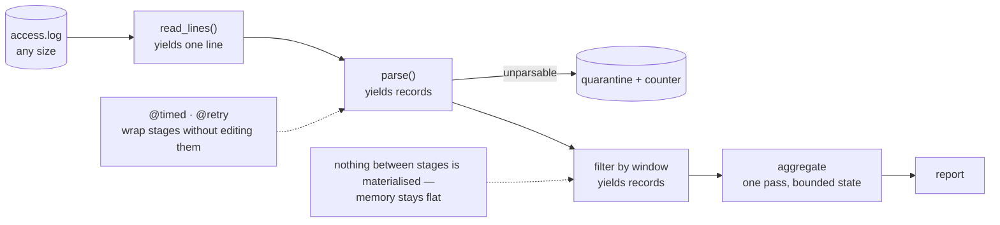

**In one line.** Build a log-analytics pipeline that streams a file of any size, in constant memory, with timing and retry behaviour added by decorators rather than by editing the logic.

## The brief

You are given web-server logs and asked for a report: requests per endpoint, error rate, p95 latency, and the top offenders by traffic. The file may be 50 GB. The machine has 2 GB of RAM.

The shape of the answer is a **chain of generators**: read → parse → filter → aggregate, where nothing between the stages is ever materialised.

## Requirements

- [ ] Memory usage must be flat regardless of file size — no `.read()`, no `list()` of the whole stream.
- [ ] Malformed lines are **counted and quarantined**, never silently dropped and never fatal.
- [ ] Aggregation computes count, error rate and p95 latency per endpoint in **one pass**.
- [ ] A `@timed` decorator reports how long each stage took, without touching the stage's code.
- [ ] A `@retry` decorator handles a flaky enrichment lookup.
- [ ] The pipeline is composed of small, independently testable generators.

## What it exercises

| Concept | Where it appears |
| --- | --- |
| [Iterators and generators](/docs/code/python/iterators-and-generators) | Every stage; `itertools.islice` and batching |
| [Decorators](/docs/code/python/decorators) | `@timed`, `@retry`, `functools.wraps` |
| [Functional tools](/docs/code/python/functional-tools) | `sorted(key=…)`, `Counter`, `groupby` |
| [Text and formats](/docs/code/python/text-dates-and-formats) | Regex with named groups, timezone-aware timestamps |
| [Files and context managers](/docs/code/python/files-and-context-managers) | Streaming reads, the quarantine file | ## Design it first



The discipline: **each stage yields, none of them collects**. The only bounded-but-growing state is the aggregate itself, which holds one entry per endpoint — not per request.

## The solution

```python
"""Streaming log analytics: generators for flow, decorators for cross-cutting concerns."""
import functools, itertools, random, re, statistics, time, tracemalloc
from collections import Counter, defaultdict
from datetime import datetime

# --- decorators: behaviour added without touching the stages ---------------
TIMINGS: dict[str, float] = {}

def timed(fn):
    """Measure a stage. Works on generators too, by timing the whole drain."""
    @functools.wraps(fn)
    def wrapper(*args, **kwargs):
        start = time.perf_counter()
        result = fn(*args, **kwargs)
        if hasattr(result, "__next__"):          # a generator: time as it drains
            def tracked():
                try:
                    yield from result
                finally:
                    TIMINGS[fn.__name__] = time.perf_counter() - start
            return tracked()
        TIMINGS[fn.__name__] = time.perf_counter() - start
        return result
    return wrapper

def retry(times=3, exceptions=(Exception,)):
    def decorator(fn):
        @functools.wraps(fn)
        def wrapper(*args, **kwargs):
            for attempt in range(1, times + 1):
                try:
                    return fn(*args, **kwargs)
                except exceptions:
                    if attempt == times:
                        raise
        return wrapper
    return decorator

# --- a synthetic log, so this runs anywhere ---------------------------------
ENDPOINTS = ["/api/orders", "/api/users", "/api/search", "/healthz"]

def synthetic_log(n=200_000, seed=0):
    """Yield log lines - stands in for a file of any size."""
    rng = random.Random(seed)
    for i in range(n):
        if i % 9_999 == 0 and i:
            yield "!! truncated line without fields"          # deliberate rubbish
            continue
        endpoint = rng.choices(ENDPOINTS, weights=[5, 3, 2, 8])[0]
        status = rng.choices([200, 200, 200, 404, 500], weights=[70, 15, 10, 3, 2])[0]
        ms = abs(rng.gauss(40 if endpoint == "/healthz" else 120, 45))
        yield (f'2026-09-18T08:{i % 60:02d}:{i % 60:02d}+00:00 '
               f'{endpoint} {status} {ms:.1f}ms')

# --- stage 1: parse ----------------------------------------------------------
LINE = re.compile(
    r"^(?P<ts>\S+)\s+(?P<endpoint>/\S*)\s+(?P<status>\d{3})\s+(?P<ms>[\d.]+)ms$")

@timed
def parse(lines, rejects):
    for line in lines:
        m = LINE.match(line)
        if not m:
            rejects["count"] += 1
            if len(rejects["samples"]) < 3:
                rejects["samples"].append(line[:40])
            continue
        yield {
            "ts": datetime.fromisoformat(m["ts"]),
            "endpoint": m["endpoint"],
            "status": int(m["status"]),
            "ms": float(m["ms"]),
        }

# --- stage 2: filter ---------------------------------------------------------
@timed
def only_api(records):
    return (r for r in records if r["endpoint"].startswith("/api"))

# --- stage 3: aggregate in one pass, bounded state -------------------------
@timed
def aggregate(records, latency_sample=2_000):
    stats = defaultdict(lambda: {"count": 0, "errors": 0, "latencies": []})
    for r in records:
        s = stats[r["endpoint"]]
        s["count"] += 1
        s["errors"] += r["status"] >= 500
        if len(s["latencies"]) < latency_sample:     # reservoir cap: bounded memory
            s["latencies"].append(r["ms"])
    return stats

def report(stats):
    rows = []
    for endpoint, s in stats.items():
        p95 = statistics.quantiles(s["latencies"], n=20)[18] if len(s["latencies"]) > 20 else 0
        rows.append((endpoint, s["count"], s["errors"] / s["count"], p95))
    return sorted(rows, key=lambda r: -r[1])          # busiest first

# --- an enrichment that sometimes fails -------------------------------------
_calls = {"n": 0}

@retry(times=4, exceptions=(TimeoutError,))
def owner_of(endpoint):
    _calls["n"] += 1
    if _calls["n"] % 3 != 0:
        raise TimeoutError("service registry timed out")
    return {"/api/orders": "checkout", "/api/users": "identity",
            "/api/search": "discovery"}.get(endpoint, "platform")

# --- run it ------------------------------------------------------------------
if __name__ == "__main__":
    rejects = {"count": 0, "samples": []}

    tracemalloc.start()
    pipeline = aggregate(only_api(parse(synthetic_log(), rejects)))
    peak = tracemalloc.get_traced_memory()[1]
    tracemalloc.stop()

    print(f"{'endpoint':14} {'count':>8} {'error rate':>11} {'p95 ms':>8}  owner")
    for endpoint, count, error_rate, p95 in report(pipeline):
        print(f"{endpoint:14} {count:8,} {error_rate:10.2%} {p95:8.1f}  {owner_of(endpoint)}")

    print(f"\nquarantined lines : {rejects['count']} e.g. {rejects['samples'][:1]}")
    print(f"peak memory       : {peak/1e6:.1f} MB for 200,000 log lines")
    print("stage timings     :", {k: f"{v:.2f}s" for k, v in TIMINGS.items()})
    print("\nmemory is flat because no stage ever holds the whole stream -")
    print("only the aggregate, which has one entry per endpoint.")
```

## How to check yourself

- Change `synthetic_log(n=...)` from 200,000 to 2,000,000: the runtime scales linearly, **peak memory does not move**.
- Remove the `if len(s["latencies"]) < latency_sample` cap and watch memory grow — that is the one unbounded structure, and the reason the cap exists.
- Swap any `(` comprehension for a `[` one and memory jumps; that single character is the whole lesson.
- Malformed lines are counted, sampled and survivable.
- `@timed` and `@retry` can be removed without changing a line of pipeline logic.

## Extensions

1. **Batching** — add `batched()` and write results to a database every 1,000 records ([Databases](/docs/code/python/databases)).
2. **True p95** — replace the capped list with a streaming quantile (t-digest) so accuracy does not depend on the cap.
3. **Parallel parsing** — split the file by byte range and use `ProcessPoolExecutor` ([Concurrency](/docs/code/python/concurrency-and-asyncio)); measure whether parsing is really CPU-bound first.
4. **A real format** — parse nginx combined logs, or JSON lines, and handle multi-line stack traces.
5. **Turn it into a CLI** with `--since`, `--endpoint` and `--top`, then package it ([Environments and Packaging](/docs/code/python/environments-and-packaging)).
