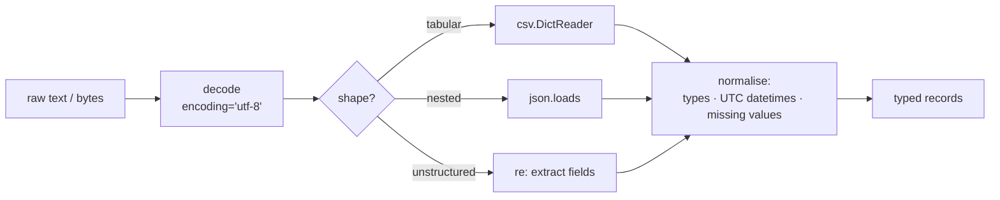

**In one line.** Most real programs are text in, text out — regex for pattern work, timezone-aware datetimes for time, and explicit schemas for JSON and CSV.

## The idea in plain words

Three standard-library areas cover the bulk of everyday data handling.

**Regular expressions (`re`)** find and extract structure from text. Compile patterns you reuse, use named groups so the extraction documents itself, and prefer non-greedy quantifiers when matching inside delimiters. Reach for a real parser when the input is nested — regex cannot parse HTML or JSON reliably.

**Dates and times (`datetime`, `zoneinfo`)** have one rule that prevents most bugs: **store and compute in UTC, convert only for display**. A `datetime` without `tzinfo` is "naive" — it has no timezone and comparing it against an aware one raises. Use `datetime.now(timezone.utc)`, not `utcnow()`, which returns a naive value and is deprecated.

**Formats.** JSON is the default interchange format: `json.dumps`/`loads`, with `default=` for types it does not know (datetime, Decimal, UUID). CSV needs the `csv` module rather than `split(",")` — quoting, embedded commas and newlines are exactly what it handles. Both need decisions about encoding, missing values and numeric precision before you write a line of code.



## How it works

### Regex that survives review

```python
import re
LOG = re.compile(
    r"(?P<ts>\d{4}-\d{2}-\d{2}T[\d:]{8})Z\s+"
    r"(?P<level>[A-Z]+)\s+"
    r"(?P<msg>.*)"
)
m = LOG.match(line)
if m:
    ts, level = m["ts"], m["level"]
```

Named groups beat numeric ones. `re.VERBOSE` lets you write a multi-line pattern with comments. Compile once at module level if the pattern is reused — and remember `re` caches compiled patterns anyway, so the win is readability.

Use `finditer` for large inputs (lazy), `sub` with a function for computed replacements, and `re.escape` on anything user-supplied.

### Time, done properly

```python
from datetime import datetime, timezone, timedelta
from zoneinfo import ZoneInfo

now = datetime.now(timezone.utc)                        # aware, always
local = now.astimezone(ZoneInfo("Europe/Zurich"))       # only for display
stamp = now.isoformat()                                 # store this
parsed = datetime.fromisoformat(stamp)                  # round-trips
```

Durations are `timedelta`. Never do arithmetic on strings, never assume 24-hour days across DST boundaries, and never store local time without an offset.

### JSON and CSV without silent corruption

```python
import csv, json
from datetime import date, datetime
from decimal import Decimal

def encode(obj):
    if isinstance(obj, (datetime, date)):
        return obj.isoformat()
    if isinstance(obj, Decimal):
        return str(obj)            # str, not float — float loses precision
    raise TypeError(type(obj))

json.dumps(record, default=encode)

with open(path, newline="", encoding="utf-8") as f:
    for row in csv.DictReader(f):
        ...
```

`newline=""` is required; without it you get stray blank rows on Windows. For money use `Decimal`, never `float`.

## A real system that works this way

**Log parsing** is the canonical regex job: a compiled pattern with named groups turns a line into a record, `finditer` streams a large file, and anything that fails to match goes to a counter rather than being dropped silently.

**CSV exports for finance** are where `Decimal` matters: `0.1 + 0.2` in float is not `0.3`, and a reconciliation report that is off by a cent is a real incident. Parse money as `Decimal` at the boundary and keep it that way.

## Code you can run

```python
import csv, io, json, re
from datetime import datetime, timedelta, timezone
from decimal import Decimal
from zoneinfo import ZoneInfo

# --- regex with named groups ------------------------------------------------
LOG = re.compile(r"(?P<ts>\S+)\s+(?P<level>[A-Z]+)\s+(?P<msg>.+)")
lines = [
    "2026-09-18T08:15:00+00:00 INFO checkout completed order=A-1 amount=12.30",
    "2026-09-18T08:15:04+00:00 ERROR gateway timeout order=A-2",
    "garbage line that should not match",
]
parsed, bad = [], 0
for line in lines:
    m = LOG.match(line)
    if not m:
        bad += 1
        continue
    parsed.append(m.groupdict())
print(f"parsed {len(parsed)} lines, {bad} unparsable")
print("first:", parsed[0]["level"], "|", parsed[0]["msg"][:32])

# extract key=value pairs from the message
kv = dict(re.findall(r"(\w+)=([\w.\-]+)", parsed[0]["msg"]))
print("fields:", kv)

# --- timezone-aware datetimes ------------------------------------------------
now = datetime.now(timezone.utc)
zurich = now.astimezone(ZoneInfo("Europe/Zurich"))
tokyo = now.astimezone(ZoneInfo("Asia/Tokyo"))
print(f"utc    {now:%Y-%m-%d %H:%M %Z}")
print(f"zurich {zurich:%Y-%m-%d %H:%M %Z} | tokyo {tokyo:%Y-%m-%d %H:%M %Z}")
print("round-trip ok:", datetime.fromisoformat(now.isoformat()) == now)

naive = datetime(2026, 9, 18, 8, 0)
try:
    naive < now
except TypeError as exc:
    print("naive vs aware:", exc)

# DST is why you add timedelta to aware datetimes, not to hours-as-ints
dst_eve = datetime(2026, 3, 28, 12, 0, tzinfo=ZoneInfo("Europe/Zurich"))
print("24h later, local clock:", (dst_eve + timedelta(days=1)).isoformat())

# --- JSON with types it does not know ---------------------------------------
record = {"order": "A-1", "amount": Decimal("12.30"), "at": now}

def encode(obj):
    if isinstance(obj, datetime):
        return obj.isoformat()
    if isinstance(obj, Decimal):
        return str(obj)
    raise TypeError(f"not serialisable: {type(obj).__name__}")

blob = json.dumps(record, default=encode)
print("json:", blob[:72], "…")
print("money stays exact:", Decimal(json.loads(blob)["amount"]) * 3)
print("float would give :", float("12.30") * 3)

# --- CSV: quoting handled for you -------------------------------------------
buf = io.StringIO()
writer = csv.DictWriter(buf, fieldnames=["id", "note", "amount"])
writer.writeheader()
writer.writerow({"id": 1, "note": 'contains, a comma and "quotes"', "amount": "12.30"})
print("csv line:", buf.getvalue().splitlines()[1])

buf.seek(0)
row = next(iter(csv.DictReader(buf)))
print("round-trips:", row["note"])
print("naive split would give:", len('contains, a comma and "quotes"'.split(",")), "fields")
```

## Designing with it

**Boundary decisions to make once, explicitly**

| Decision | Recommendation |
| --- | --- |
| Encoding | UTF-8 everywhere, stated explicitly |
| Timestamps | UTC, ISO-8601 with offset, converted only for display |
| Money | `Decimal`, serialised as a string |
| Missing values | One sentinel (`None`), documented — not `""`, `"NA"` and `-1` mixed |
| Unparsable input | Count and route to a dead-letter file; never drop silently |
| Big files | Stream with `DictReader`/`finditer`; do not `.read()` |

**Regex cautions**

- Do not parse HTML/XML/JSON with regex — use a parser.
- Watch catastrophic backtracking on nested quantifiers with untrusted input (a ReDoS risk); prefer possessive-style rewrites or a timeout.
- Always `re.escape` user input used inside a pattern.

**When to leave the stdlib:** pandas or polars once you are doing joins and aggregations over tabular data; Pydantic once JSON needs validation and typed models rather than dicts.

## Where this stands in 2026

:::info Industry view

- `datetime.utcnow()` is deprecated — `datetime.now(timezone.utc)` is the expected form, and naive datetimes in a codebase are a bug waiting to happen.
- `zoneinfo` (stdlib since 3.9) replaced `pytz`; new code should not pull in pytz.
- Money as `float` still causes real reconciliation incidents; `Decimal` at the boundary is the professional default.
- Structured logging in JSON is now standard, which makes the regex-parsing of logs a legacy-systems skill rather than the default.

:::

## Practice questions

<details>
<summary><strong>Q1.</strong> Why is `datetime.utcnow()` dangerous?</summary>

It returns a naive datetime that *looks* like UTC but carries no tzinfo, so comparisons and conversions silently treat it as local time. It is deprecated in favour of `datetime.now(timezone.utc)`.

</details>

<details>
<summary><strong>Q2.</strong> Why use `csv` instead of `line.split(",")`?</summary>

CSV fields can contain commas, quotes and newlines inside quoted values. The module implements the quoting rules; splitting produces wrong field counts on exactly the rows that matter.

</details>

<details>
<summary><strong>Q3.</strong> What is catastrophic backtracking and when does it matter?</summary>

Nested quantifiers such as `(a+)+b` can make the engine explore exponentially many ways to match a failing input, hanging the process. It matters whenever the pattern or the input comes from a user — the denial-of-service class known as ReDoS.

</details>

## Further reading

- [re — regular expressions](https://docs.python.org/3/library/re.html) and the [Regex HOWTO](https://docs.python.org/3/howto/regex.html).
- [datetime](https://docs.python.org/3/library/datetime.html) and [zoneinfo](https://docs.python.org/3/library/zoneinfo.html) — aware datetimes and the IANA database.
- [json](https://docs.python.org/3/library/json.html) and [csv](https://docs.python.org/3/library/csv.html) — including the dialect and quoting options.
- [regex101](https://regex101.com/) — build and explain patterns interactively before committing them.
