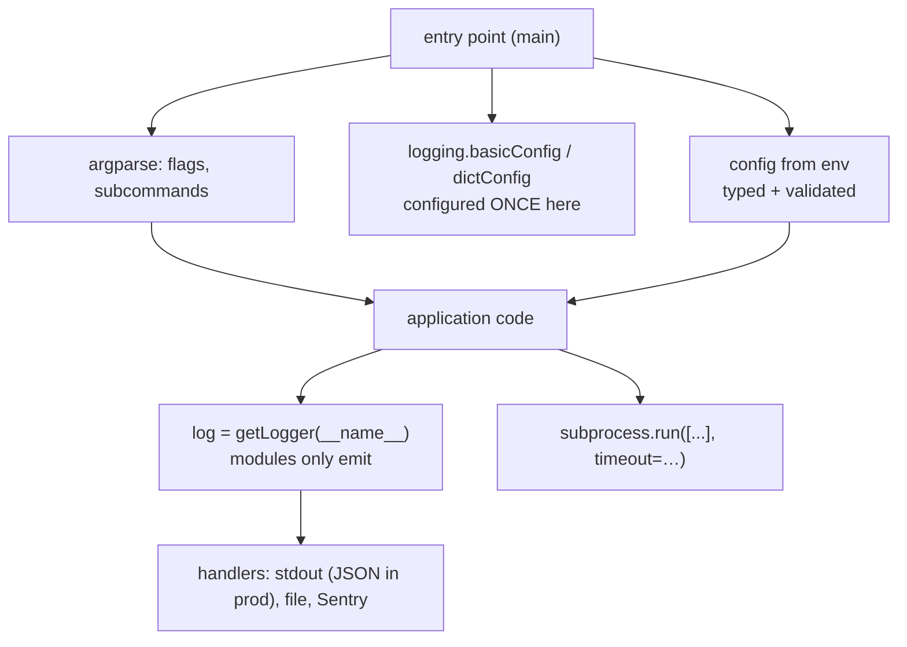

**In one line.** The difference between a script and a tool is logging, a real command-line interface, and configuration that comes from the environment.

## The idea in plain words

**Logging, not `print`.** `print` goes to stdout with no level, no timestamp and no way to turn it down. The `logging` module gives you levels, per-module loggers, and handlers configured once at the entry point. The rule inside a library or module is: get a logger (`log = logging.getLogger(__name__)`), log to it, and **never configure handlers** — that belongs to the application.

**A real CLI.** `argparse` gives `--help`, type conversion, defaults, subcommands and error messages for free. Anything you will run more than twice deserves one. (`click` and `typer` are the popular third-party upgrades.)

**Subprocesses.** `subprocess.run` with a **list** of arguments — never a string with `shell=True` on anything containing user input, which is a command-injection hole. Capture output, set a timeout, and check the return code.

**Configuration** comes from the environment (`os.environ`), with a typed, validated layer in front of it and sensible defaults. Secrets never live in code or in the repository.



## How it works

### Logging that operators can use

```python
import logging, sys

log = logging.getLogger(__name__)        # module level, never configured here

def main():
    logging.basicConfig(
        level=logging.INFO,
        format="%(asctime)s %(levelname)-8s %(name)s %(message)s",
        stream=sys.stdout,
    )
    log.info("starting", extra={"version": "1.2.0"})
```

Rules that matter in production:

- **Use lazy formatting**: `log.info("user %s failed", user_id)` — the string is only built if the level is enabled.
- **`log.exception(...)`** inside an `except` block includes the traceback.
- **One correlation id per request**, attached to every line, or you cannot follow a single user through the logs.
- **Never log secrets or personal data.** Redact at the boundary.

### A CLI with subcommands

```python
parser = argparse.ArgumentParser(prog="tool", description="…")
parser.add_argument("--verbose", action="store_true")
sub = parser.add_subparsers(dest="command", required=True)

ingest = sub.add_parser("ingest", help="load a file")
ingest.add_argument("path", type=Path)
ingest.add_argument("--batch-size", type=int, default=500)
```

Give every command a `--dry-run` if it writes anything, and return a meaningful exit code — `0` success, non-zero failure — because that is what CI and cron act on.

### Subprocess safely

```python
result = subprocess.run(
    ["git", "rev-parse", "HEAD"],
    capture_output=True, text=True, timeout=10, check=True,
)
sha = result.stdout.strip()
```

`check=True` raises on a non-zero exit; `timeout` prevents a hung child from hanging you. Pass arguments as a list so no shell parses them. If you genuinely need a shell pipeline, prefer composing two `Popen` objects, or `shlex.quote` every interpolated value.

## A real system that works this way

**Every batch job** ends up with this shape: parse args, load config from the environment, configure logging once, do the work with per-record error handling, emit a summary line and exit with a status. Cron, Airflow and Kubernetes all key off the exit code, so returning one correctly is what makes the job operable.

**Correlation ids** are what turn logs into an investigation tool: one id generated per request or per message, attached to every log line, so a production incident becomes a single filtered query instead of guesswork.

## Code you can run

```python
import argparse, json, logging, os, subprocess, sys, tempfile, uuid
from pathlib import Path

# --- logging configured once, at the entry point ----------------------------
log = logging.getLogger("demo")

class CorrelationFilter(logging.Filter):
    """Attach a request id to every record — the key to searchable logs."""
    def __init__(self, cid): super().__init__(); self.cid = cid
    def filter(self, record):
        record.cid = self.cid
        return True

def configure_logging(verbose=False):
    handler = logging.StreamHandler(sys.stdout)
    handler.setFormatter(logging.Formatter(
        "%(asctime)s %(levelname)-7s [%(cid)s] %(name)s: %(message)s",
        datefmt="%H:%M:%S"))
    handler.addFilter(CorrelationFilter(uuid.uuid4().hex[:8]))
    root = logging.getLogger()
    root.handlers = [handler]
    root.setLevel(logging.DEBUG if verbose else logging.INFO)

configure_logging()
log.info("started with pid %s", os.getpid())     # lazy %s formatting
log.debug("this is hidden at INFO level")

try:
    1 / 0
except ZeroDivisionError:
    log.exception("arithmetic failed")           # includes the traceback

# --- config from the environment, typed and validated -----------------------
def env_int(name, default):
    raw = os.environ.get(name)
    if raw is None:
        return default
    try:
        return int(raw)
    except ValueError:
        raise SystemExit(f"{name} must be an integer, got {raw!r}")

os.environ["BATCH_SIZE"] = "250"
config = {
    "batch_size": env_int("BATCH_SIZE", 500),
    "dry_run": os.environ.get("DRY_RUN", "0") == "1",
    "api_key": os.environ.get("API_KEY", ""),
}
log.info("config: %s", {**config, "api_key": "***" if config["api_key"] else "(unset)"})

# --- a CLI with subcommands (parsed here from a list, as tests would) -------
def build_parser():
    p = argparse.ArgumentParser(prog="tool", description="demo tool")
    p.add_argument("--verbose", action="store_true")
    sub = p.add_subparsers(dest="command", required=True)
    ingest = sub.add_parser("ingest", help="load a file")
    ingest.add_argument("path", type=Path)
    ingest.add_argument("--batch-size", type=int, default=config["batch_size"])
    ingest.add_argument("--dry-run", action="store_true")
    sub.add_parser("status", help="show status")
    return p

args = build_parser().parse_args(["ingest", "data.csv", "--batch-size", "100", "--dry-run"])
log.info("parsed args: command=%s path=%s batch=%s dry_run=%s",
         args.command, args.path, args.batch_size, args.dry_run)

# --- subprocess: list form, timeout, checked --------------------------------
result = subprocess.run([sys.executable, "-c", "print('hello from a child')"],
                        capture_output=True, text=True, timeout=10, check=True)
log.info("child said: %s (exit %s)", result.stdout.strip(), result.returncode)

failed = subprocess.run([sys.executable, "-c", "import sys; sys.exit(3)"],
                        capture_output=True, text=True)
log.warning("child exited %s — check=False lets us decide", failed.returncode)

# never do this with untrusted input:
user_input = "data.csv; rm -rf /"
log.info("safe arg list keeps this inert: %r", ["cat", user_input][1])

# --- temp files that clean themselves up ------------------------------------
with tempfile.TemporaryDirectory() as tmp:
    path = Path(tmp) / "out.json"
    path.write_text(json.dumps({"ok": True}))
    log.info("wrote %s (%d bytes)", path.name, path.stat().st_size)
log.info("temp dir removed: %s", not Path(tmp).exists())

sys.exit(0) if False else log.info("exit code 0 = success")
```

## Designing with it

**Entry-point checklist**

| Concern | Do |
| --- | --- |
| Logging | Configure once in `main()`; modules only `getLogger(__name__)` |
| Level | INFO default, DEBUG behind `--verbose`, WARNING for libraries |
| Format | Human-readable locally, **JSON in production** for log aggregation |
| Config | Environment variables, typed and validated at startup, fail fast |
| Secrets | From the environment or a secret manager; never logged, never committed |
| Exit codes | 0 success, non-zero failure — cron and CI depend on it |
| Destructive commands | `--dry-run` that prints what would happen |
| Subprocess | List args, `timeout`, `check=True`, no `shell=True` |

**Logging anti-patterns**

- `print` in library code — unroutable and unfilterable.
- f-strings in log calls — the message is formatted even when the level is off (and structured-logging tools lose the template).
- Logging the same error at every layer as it propagates; log it once, where it is handled.
- `logging.basicConfig` inside a library — it silently hijacks the application's configuration.

## Where this stands in 2026

:::info Industry view

- Structured JSON logging with a correlation id is the norm in services; plain-text logs survive mostly in CLI tools.
- `typer`/`click` are the common upgrades over argparse for anything with several subcommands, but argparse remains dependency-free and sufficient.
- `subprocess` with `shell=True` on interpolated input is a recurring security finding — the list form is the expected review answer.
- Twelve-factor configuration (environment variables, validated at startup, fail fast) is the default for containerised Python.

:::

## Practice questions

<details>
<summary><strong>Q1.</strong> Why `log.info("x=%s", x)` rather than `log.info(f"x={x}")`?</summary>

Lazy formatting: with `%s` the string is only built if the level is enabled, and structured-logging handlers can keep the template and arguments separate for indexing. The f-string is always evaluated and loses that structure.

</details>

<details>
<summary><strong>Q2.</strong> What is wrong with `subprocess.run(f"grep {term} file", shell=True)`?</summary>

Command injection — a `term` of `x; rm -rf ~` runs as a shell command. Use the list form `["grep", term, "file"]`, where the argument can never be reinterpreted as syntax.

</details>

<details>
<summary><strong>Q3.</strong> Why should a library never call `logging.basicConfig()`?</summary>

It configures the root logger for the whole process, overriding whatever the application set. Libraries should only obtain `getLogger(__name__)` and emit; configuration is the application's decision.

</details>

## Further reading

- [Logging HOWTO](https://docs.python.org/3/howto/logging.html) and the [logging cookbook](https://docs.python.org/3/howto/logging-cookbook.html).
- [argparse tutorial](https://docs.python.org/3/howto/argparse.html) — options, types and subcommands.
- [subprocess](https://docs.python.org/3/library/subprocess.html) — `run`, `Popen`, and the security notes.
- [The Twelve-Factor App: config](https://12factor.net/config) — why configuration belongs in the environment.
