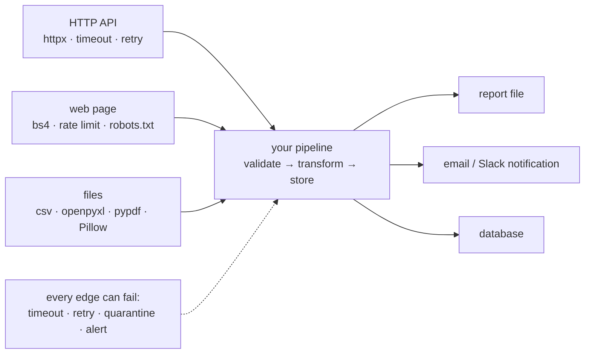

**In one line.** Most Python at work is integration: pull data over HTTP, read someone's spreadsheet, produce a file, send a notification.

## The idea in plain words

Five recurring jobs, each with a settled answer:

- **Call an API** — `httpx` (or `requests`). Always a timeout, always check the status, retry only transient failures, and reuse a client so connections are pooled.
- **Scrape a page** — `httpx` + `BeautifulSoup` for static HTML; Playwright only when the content is rendered by JavaScript. Check `robots.txt` and the terms first; rate-limit yourself.
- **Read or write tabular files** — `csv` for CSV, `openpyxl` for `.xlsx`, `pandas`/`polars` once you are doing joins and aggregations.
- **Handle documents and images** — `pypdf` for PDF text and page surgery, `Pillow` for resizing and format conversion.
- **Send email or notifications** — `smtplib` + `EmailMessage` for SMTP, though in practice most teams call a provider API (SES, SendGrid, Postmark) or post to Slack.

The discipline that separates a script from a job you can schedule: **timeouts, retries, idempotency, and a clear failure path**. Anything touching the network will fail eventually, usually at 3am.



## How it works

### HTTP, done properly

```python
import httpx

with httpx.Client(base_url="https://api.example.com",
                  timeout=httpx.Timeout(10.0, connect=3.0),
                  limits=httpx.Limits(max_connections=20),
                  headers={"User-Agent": "orderflow/1.0"}) as client:
    r = client.get("/orders", params={"since": "2026-09-01"})
    r.raise_for_status()
    data = r.json()
```

The rules: **reuse the client** (a new client per request re-does TLS every time), **set a timeout** (the default in `requests` is *no timeout* — a hung server hangs you forever), **`raise_for_status()`** so a 500 is not silently parsed as JSON, and **paginate** rather than assuming one response holds everything.

For authentication, read the token from the environment. For rate limits, honour `Retry-After` and back off; hammering a 429 is how you get blocked.

### Scraping without getting blocked or sued

```python
from bs4 import BeautifulSoup

soup = BeautifulSoup(html, "html.parser")
titles = [h.get_text(strip=True) for h in soup.select("article h2")]
```

Use CSS selectors (`select`, `select_one`) — they are what the browser inspector gives you. Practical rules: check `robots.txt` and the terms of service, identify yourself in the `User-Agent`, rate-limit (a `time.sleep` between requests is the minimum), cache responses while developing so you are not re-fetching, and prefer an official API whenever one exists. If the content only appears after JavaScript runs, you need Playwright, not a parser.

### Spreadsheets, PDFs and images

```python
from openpyxl import Workbook, load_workbook
from pypdf import PdfReader, PdfWriter
from PIL import Image

wb = load_workbook("input.xlsx", data_only=True)   # data_only: values, not formulas
rows = list(wb["Sheet1"].iter_rows(min_row=2, values_only=True))

reader = PdfReader("report.pdf")
text = "\n".join(page.extract_text() or "" for page in reader.pages)

img = Image.open("photo.jpg")
img.thumbnail((800, 800))          # keeps the aspect ratio
img.convert("RGB").save("photo_small.webp", quality=85)
```

Caveats worth knowing: `data_only=True` gives you cached values, so a spreadsheet never opened in Excel may return `None` for formulas; PDF text extraction is unreliable on scanned documents (you need OCR); and images from users should have their dimensions checked before loading — a "decompression bomb" is a real denial-of-service vector.

### Email and notifications

```python
import smtplib
from email.message import EmailMessage

msg = EmailMessage()
msg["From"], msg["To"], msg["Subject"] = sender, ", ".join(recipients), subject
msg.set_content(body_text)
msg.add_alternative(body_html, subtype="html")

with smtplib.SMTP(host, 587) as smtp:
    smtp.starttls()
    smtp.login(user, password)      # from the environment, never hard-coded
    smtp.send_message(msg)
```

`EmailMessage` handles encoding, attachments and multipart correctly — hand-built MIME strings get this wrong. For anything user-facing, a provider API gives you deliverability, bounce handling and suppression lists that raw SMTP does not.

## A real system that works this way

**The weekly report job** is the archetype of Python at work: pull rows from an API, join them against a spreadsheet finance maintains, render an Excel file, email it to a distribution list, and log what it did. Every failure mode in this note appears in that one job — a timeout, a 429, a corrupt workbook, an SMTP outage — which is why it needs retries, a quarantine path and an exit code.

## Code you can run

```python
"""HTTP plumbing, HTML parsing, CSV/archives and a MIME email — no network needed."""
import csv, io, json, re, tempfile, zipfile
from email.message import EmailMessage
from html.parser import HTMLParser
from pathlib import Path
from urllib.error import HTTPError
from urllib.parse import urlencode

work = Path(tempfile.mkdtemp())

# --- 1. the retry/timeout wrapper every HTTP call needs ---------------------
def fetch_with_retry(fetch, *, attempts=4, base_delay=0.01):
    """Retry transient failures only; give up immediately on a 4xx."""
    import time
    last = None
    for attempt in range(1, attempts + 1):
        try:
            return fetch()
        except HTTPError as exc:
            if 400 <= exc.code < 500 and exc.code != 429:
                raise                                   # our bug: do not retry
            last = exc
        except TimeoutError as exc:
            last = exc
        time.sleep(base_delay * 2 ** (attempt - 1))     # exponential backoff
    raise RuntimeError(f"gave up after {attempts} attempts") from last

calls = {"n": 0}
def flaky_endpoint():
    calls["n"] += 1
    if calls["n"] < 3:
        raise TimeoutError("connection timed out")
    return {"orders": [{"id": "A-1", "total": 25.0}, {"id": "A-2", "total": 12.5}]}

payload = fetch_with_retry(flaky_endpoint)
print(f"fetched after {calls['n']} attempts:", payload["orders"][0])

def permanent_failure():
    raise HTTPError("http://x", 404, "Not Found", {}, None)
try:
    fetch_with_retry(permanent_failure)
except HTTPError as exc:
    print(f"404 not retried (correct): {exc.code}")

# --- 2. building a request URL safely ---------------------------------------
params = {"since": "2026-09-01", "q": "status=paid & total>10"}
print("encoded query:", urlencode(params))

# --- 3. parsing HTML with the standard library ------------------------------
HTML = """
<article><h2>First post</h2><p class="meta">2026-09-01</p></article>
<article><h2>Second post</h2><p class="meta">2026-09-08</p></article>
"""

class ArticleParser(HTMLParser):
    def __init__(self):
        super().__init__(); self.titles, self._in_h2 = [], False
    def handle_starttag(self, tag, attrs):
        if tag == "h2": self._in_h2 = True
    def handle_endtag(self, tag):
        if tag == "h2": self._in_h2 = False
    def handle_data(self, data):
        if self._in_h2: self.titles.append(data.strip())

parser = ArticleParser(); parser.feed(HTML)
print("scraped titles:", parser.titles)
print("(BeautifulSoup would be: [h.get_text() for h in soup.select('article h2')])")

# --- 4. a report file, then an archive --------------------------------------
report = work / "orders.csv"
with report.open("w", newline="", encoding="utf-8") as f:
    writer = csv.DictWriter(f, fieldnames=["id", "total"])
    writer.writeheader(); writer.writerows(payload["orders"])

archive = work / "report.zip"
with zipfile.ZipFile(archive, "w", zipfile.ZIP_DEFLATED) as zf:
    zf.write(report, arcname="orders.csv")
    zf.writestr("manifest.json", json.dumps({"rows": len(payload["orders"])}))

with zipfile.ZipFile(archive) as zf:
    print("archive contains:", zf.namelist())
    print("manifest:", json.loads(zf.read("manifest.json")))

# --- 5. a correct MIME email (not sent — just built) ------------------------
msg = EmailMessage()
msg["From"] = "reports@example.com"
msg["To"] = "finance@example.com"
msg["Subject"] = "Weekly order report"
msg.set_content("Attached: this week's orders.")
msg.add_alternative("<p>Attached: <b>this week's orders</b>.</p>", subtype="html")
msg.add_attachment(archive.read_bytes(), maintype="application",
                   subtype="zip", filename="report.zip")

print("\nemail parts:", [p.get_content_type() for p in msg.walk()])
print("attachment size:", len(archive.read_bytes()), "bytes")
print("(smtplib.SMTP(...).send_message(msg) would deliver it)")
```

## Designing with it

**Integration checklist**

| Concern | Control |
| --- | --- |
| Timeouts | On every network call, connect and read separately |
| Retries | Transient only (timeouts, 5xx, 429); exponential backoff with jitter; a cap |
| Idempotency | Safe to re-run — upserts, idempotency keys, or a processed-ids ledger |
| Rate limits | Honour `Retry-After`; throttle yourself below the documented limit |
| Pagination | Follow cursors; never assume one page |
| Partial failure | Quarantine the bad item and continue; do not abort the whole run |
| Large payloads | Stream (`iter_bytes`, `iter_lines`) rather than `.json()` on 500 MB |
| Secrets | From the environment; never in the URL (they end up in logs) |
| Untrusted files | Check size and type before parsing; images and archives are attack surface |

**Library choices**

| Job | Default | When to change |
| --- | --- | --- |
| HTTP | `httpx` | `requests` if the codebase already uses it; `aiohttp` for heavy async |
| HTML | `BeautifulSoup` + `lxml` | Playwright when JavaScript renders the content |
| Excel | `openpyxl` | `pandas.read_excel` for analysis; `xlsxwriter` for heavy formatting |
| PDF | `pypdf` | `pdfplumber` for tables; OCR (`pytesseract`) for scans |
| Images | `Pillow` | OpenCV for computer vision rather than file handling |
| Email | Provider API | `smtplib` for internal relays only |

:::warning Legal and ethical footing
Scraping is a contractual and sometimes legal question, not just a technical one. Read the terms, respect `robots.txt`, never scrape personal data you have no basis to hold, and prefer the official API. "It was publicly visible" is not a defence anyone wants to test.
:::

## Where this stands in 2026

:::info Industry view

- **httpx is the modern default** — same API shape as requests, plus async, HTTP/2 and proper timeout semantics.
- Most "scraping" work has shifted to official APIs and paid data providers, because sites detect and block scrapers aggressively.
- Excel remains the universal business interchange format; being fluent in `openpyxl` is quietly one of the most useful workplace skills.
- LLM document pipelines put `pypdf` and OCR back in the spotlight — extraction quality is now an accuracy problem, not a plumbing one.

:::

## Practice questions

<details>
<summary><strong>Q1.</strong> What happens if you call `requests.get(url)` with no timeout and the server never responds?</summary>

The call blocks indefinitely — `requests` has no default timeout. In a worker that means one thread is consumed forever; across many workers it is an outage. Always pass an explicit `timeout`, and prefer a client with connect and read timeouts set separately.

</details>

<details>
<summary><strong>Q2.</strong> Which HTTP failures should you retry, and which should you not?</summary>

Retry transient ones: connection errors, timeouts, 502/503/504, and 429 after honouring `Retry-After`. Do not retry 400, 401, 403 or 404 — those are your request being wrong, and retrying just multiplies the error. Non-idempotent writes need an idempotency key before any retry is safe.

</details>

<details>
<summary><strong>Q3.</strong> Why is `data_only=True` significant when reading an Excel file?</summary>

It returns the last cached *value* of a formula cell rather than the formula text. If the file was generated programmatically and never opened in Excel, no cached value exists and you get `None` — a classic silent data loss in spreadsheet pipelines.

</details>

## Further reading

- [httpx documentation](https://www.python-httpx.org/) — clients, timeouts, limits, async.
- [BeautifulSoup documentation](https://www.crummy.com/software/BeautifulSoup/bs4/doc/) — selectors and tree navigation.
- [openpyxl](https://openpyxl.readthedocs.io/) and [pypdf](https://pypdf.readthedocs.io/) — spreadsheets and PDFs.
- [Pillow handbook](https://pillow.readthedocs.io/en/stable/handbook/index.html) — image formats and transformations.
- [email.message.EmailMessage](https://docs.python.org/3/library/email.examples.html) — correct MIME construction.
