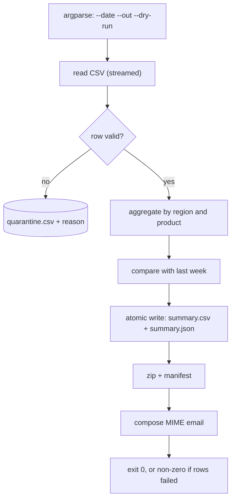

**In one line.** Build the job every company has: read yesterday's data, compute the numbers, write a file, archive it, and send it — with a CLI, logging and an exit code that cron can act on.

## The brief

Finance wants a daily sales summary by 07:00: totals by region, week-on-week change, the top five products, and any rows that failed validation. It must run unattended, be safe to re-run, and tell an operator clearly when something went wrong.

## Requirements

- [ ] A CLI: `report --date 2026-09-17 --out ./reports [--dry-run]`.
- [ ] Parse a CSV whose fields are quoted and contain commas; handle a messy free-text field with a regex.
- [ ] All timestamps **timezone-aware**, computed in UTC, displayed in the business timezone.
- [ ] Money as `Decimal`; the printed totals must reconcile exactly.
- [ ] Invalid rows are written to a quarantine file with the reason, and counted in the report.
- [ ] Outputs written **atomically**, then zipped with a manifest.
- [ ] A MIME email is composed (not sent) with the archive attached.
- [ ] Structured logs, and a non-zero exit code if anything failed.

## What it exercises

| Concept | Where it appears |
| --- | --- |
| [Text, dates and formats](/docs/code/python/text-dates-and-formats) | `csv`, `re` with named groups, `zoneinfo`, `Decimal` |
| [The runtime toolkit](/docs/code/python/the-runtime-toolkit) | `argparse`, `logging`, exit codes, env config |
| [Files and context managers](/docs/code/python/files-and-context-managers) | Atomic write, `zipfile`, `tempfile` |
| [HTTP, files and email](/docs/code/python/working-with-the-outside-world) | `EmailMessage` with an attachment |
| [Functional tools](/docs/code/python/functional-tools) | `sorted(key=…)`, `Counter`, `groupby` | ## Design it first



## The solution

```python
"""A complete daily report job - standard library only."""
import argparse, csv, io, json, logging, os, re, sys, tempfile, zipfile
from collections import Counter, defaultdict
from datetime import date, datetime, timedelta, timezone
from decimal import Decimal, InvalidOperation
from email.message import EmailMessage
from pathlib import Path
from zoneinfo import ZoneInfo

BUSINESS_TZ = ZoneInfo("Europe/Zurich")
log = logging.getLogger("report")

# --- validation --------------------------------------------------------------
NOTE = re.compile(r"(?P<key>\w+)=(?P<value>[\w.\-]+)")

def parse_row(row, line_no):
    """Return a clean record, or raise ValueError describing what is wrong."""
    missing = {"order_id", "region", "product", "amount", "ordered_at"} - row.keys()
    if missing:
        raise ValueError(f"missing columns: {sorted(missing)}")
    try:
        amount = Decimal(row["amount"])
    except InvalidOperation:
        raise ValueError(f"amount {row['amount']!r} is not a number") from None
    if amount <= 0:
        raise ValueError(f"amount must be positive, got {amount}")
    try:
        ordered_at = datetime.fromisoformat(row["ordered_at"])
    except ValueError:
        raise ValueError(f"ordered_at {row['ordered_at']!r} is not ISO-8601") from None
    if ordered_at.tzinfo is None:
        raise ValueError("ordered_at has no timezone")
    return {
        "order_id": row["order_id"],
        "region": row["region"].strip().upper(),
        "product": row["product"].strip(),
        "amount": amount,
        "ordered_at": ordered_at.astimezone(timezone.utc),
        "tags": dict(NOTE.findall(row.get("note", ""))),
    }

def load(path: Path, quarantine: Path):
    """Stream rows; quarantine the bad ones with a reason."""
    good, bad = [], 0
    with path.open(newline="", encoding="utf-8") as src, \
         quarantine.open("w", newline="", encoding="utf-8") as dead:
        writer = csv.writer(dead); writer.writerow(["line", "reason"])
        for line_no, row in enumerate(csv.DictReader(src), start=2):
            try:
                good.append(parse_row(row, line_no))
            except ValueError as exc:
                bad += 1
                writer.writerow([line_no, str(exc)])
                log.warning("row rejected line=%s reason=%s", line_no, exc)
    return good, bad

# --- aggregation -------------------------------------------------------------
def summarise(records, on: date):
    day = [r for r in records if r["ordered_at"].date() == on]
    prior = [r for r in records if r["ordered_at"].date() == on - timedelta(days=7)]

    by_region = defaultdict(Decimal)
    for r in day:
        by_region[r["region"]] += r["amount"]

    last_week_total = sum((r["amount"] for r in prior), Decimal("0"))
    total = sum(by_region.values(), Decimal("0"))
    change = ((total - last_week_total) / last_week_total * 100
              if last_week_total else Decimal("0"))

    top = Counter()
    for r in day:
        top[r["product"]] += r["amount"]

    return {
        "date": on.isoformat(),
        "generated_at": datetime.now(timezone.utc).isoformat(timespec="seconds"),
        "orders": len(day),
        "total": total,
        "week_on_week_pct": change.quantize(Decimal("0.01")),
        "by_region": dict(sorted(by_region.items(), key=lambda kv: -kv[1])),
        "top_products": top.most_common(5),
    }

# --- output ------------------------------------------------------------------
def atomic_write(path: Path, text: str):
    tmp = path.with_suffix(path.suffix + ".tmp")
    tmp.write_text(text, encoding="utf-8")
    os.replace(tmp, path)                      # readers never see a partial file

def write_outputs(summary, out_dir: Path, rejected: int):
    out_dir.mkdir(parents=True, exist_ok=True)
    csv_path, json_path = out_dir / "summary.csv", out_dir / "summary.json"

    buf = io.StringIO()
    writer = csv.writer(buf)
    writer.writerow(["region", "revenue"])
    writer.writerows([(region, f"{value:.2f}") for region, value in summary["by_region"].items()])
    atomic_write(csv_path, buf.getvalue())

    payload = {**summary,
               "total": f"{summary['total']:.2f}",
               "week_on_week_pct": str(summary["week_on_week_pct"]),
               "by_region": {k: f"{v:.2f}" for k, v in summary["by_region"].items()},
               "top_products": [(p, f"{v:.2f}") for p, v in summary["top_products"]],
               "rejected_rows": rejected}
    atomic_write(json_path, json.dumps(payload, indent=2))

    archive = out_dir / f"report-{summary['date']}.zip"
    with zipfile.ZipFile(archive, "w", zipfile.ZIP_DEFLATED) as zf:
        zf.write(csv_path, "summary.csv")
        zf.write(json_path, "summary.json")
        zf.writestr("manifest.json", json.dumps(
            {"date": summary["date"], "rows": summary["orders"], "rejected": rejected}))
    return archive

def compose_email(summary, archive: Path, rejected: int) -> EmailMessage:
    msg = EmailMessage()
    msg["From"], msg["To"] = "reports@example.com", "finance@example.com"
    msg["Subject"] = f"Daily sales report - {summary['date']}"
    local = datetime.now(timezone.utc).astimezone(BUSINESS_TZ)
    msg.set_content(
        f"Date: {summary['date']}\n"
        f"Orders: {summary['orders']}\n"
        f"Revenue: {summary['total']:.2f}\n"
        f"Week on week: {summary['week_on_week_pct']}%\n"
        f"Rejected rows: {rejected}\n"
        f"Generated {local:%Y-%m-%d %H:%M %Z}\n")
    msg.add_attachment(archive.read_bytes(), maintype="application",
                       subtype="zip", filename=archive.name)
    return msg

# --- entry point -------------------------------------------------------------
def build_parser():
    p = argparse.ArgumentParser(prog="report", description="daily sales report")
    p.add_argument("--date", type=date.fromisoformat, required=True)
    p.add_argument("--input", type=Path, required=True)
    p.add_argument("--out", type=Path, required=True)
    p.add_argument("--dry-run", action="store_true")
    p.add_argument("--log-level", default="INFO")
    return p

def main(argv=None) -> int:
    args = build_parser().parse_args(argv)
    logging.basicConfig(level=args.log_level, stream=sys.stdout,
                        format="%(asctime)s %(levelname)-7s %(message)s",
                        datefmt="%H:%M:%S")
    quarantine = args.out / "quarantine.csv"
    args.out.mkdir(parents=True, exist_ok=True)

    records, rejected = load(args.input, quarantine)
    summary = summarise(records, args.date)
    log.info("summary orders=%s revenue=%.2f wow=%s%%",
             summary["orders"], summary["total"], summary["week_on_week_pct"])

    if args.dry_run:
        log.info("dry run - nothing written")
        return 0

    archive = write_outputs(summary, args.out, rejected)
    msg = compose_email(summary, archive, rejected)
    log.info("archive=%s bytes=%s email_parts=%s",
             archive.name, archive.stat().st_size,
             [p.get_content_type() for p in msg.walk()])
    return 1 if rejected else 0                 # cron and CI read this

# --- run it ------------------------------------------------------------------
if __name__ == "__main__":
    work = Path(tempfile.mkdtemp())
    source = work / "sales.csv"
    with source.open("w", newline="", encoding="utf-8") as f:
        w = csv.writer(f)
        w.writerow(["order_id", "region", "product", "amount", "ordered_at", "note"])
        rows = [
            ("A-1", "emea", "Widget, large", "120.50", "2026-09-17T09:00:00+00:00", "channel=web src=ads"),
            ("A-2", "emea", "Gadget",        "80.00",  "2026-09-17T11:30:00+00:00", "channel=app"),
            ("A-3", "amer", "Widget, large", "200.25", "2026-09-17T15:00:00+00:00", ""),
            ("A-4", "apac", "Doohickey",     "45.75",  "2026-09-17T23:59:00+00:00", ""),
            ("A-5", "emea", "Widget, large", "300.00", "2026-09-10T09:00:00+00:00", ""),
            ("A-6", "emea", "Gadget",        "abc",    "2026-09-17T09:00:00+00:00", ""),
            ("A-7", "emea", "Gadget",        "10.00",  "2026-09-17 09:00:00",       ""),
        ]
        w.writerows(rows)

    code = main(["--date", "2026-09-17", "--input", str(source), "--out", str(work / "out")])
    print("\nexit code:", code, "(non-zero because rows were rejected)")
    print("quarantine:")
    print("  " + "\n  ".join((work / "out" / "quarantine.csv").read_text().strip().splitlines()))
    print("\nsummary.json:")
    print(json.dumps(json.loads((work / "out" / "summary.json").read_text()), indent=2)[:420], "...")
```

## How to check yourself

- The quoted product name containing a comma survives the round trip — proof you used `csv`, not `split(",")`.
- Region totals **sum exactly** to the reported total (that is what `Decimal` buys you).
- A naive timestamp is rejected rather than silently assumed to be UTC.
- Re-running the job overwrites cleanly and leaves no `.tmp` files.
- `--dry-run` writes nothing at all.
- The exit code is non-zero when rows were rejected, so a scheduler can alert.

## Extensions

1. **Real Excel output** with `openpyxl`, including a chart — finance will ask.
2. **Send the email** through SMTP or a provider API, with the recipient list in config.
3. **Backfill mode**: `--from 2026-09-01 --to 2026-09-17`, idempotent per day.
4. **Schedule it** in cron or Airflow and add alerting on the non-zero exit.
5. **Swap the CSV source for a database query** ([Databases](/docs/code/python/databases)) without changing the aggregation code.
