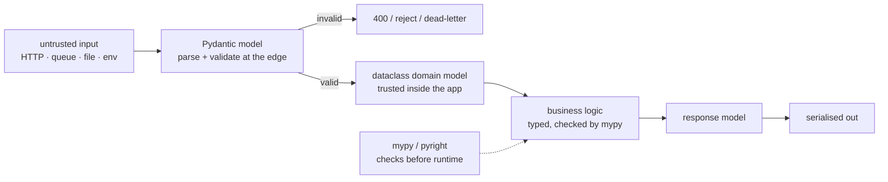

**In one line.** Annotations are checked by a tool, not by Python — they exist to catch mistakes before the code runs and to document intent precisely.

## The idea in plain words

Python stays dynamically typed at runtime; annotations are metadata that a **static checker** (mypy, pyright) verifies. That is a feature: you get most of the safety of static typing without giving up the flexibility.

The essentials:

```python
def total(items: list[Item], discount: float = 0.0) -> Decimal: ...
name: str | None = None                  # optional
Handler = Callable[[Event], None]        # an alias for a callable
```

Modern syntax uses built-in generics (`list[str]`, `dict[str, int]`) and `X | None` rather than the old `List`/`Optional` imports.

Then three tools that matter more than the syntax:

- **`@dataclass`** — internal records with `__init__`, `__repr__` and `__eq__` generated. Fast, stdlib, no validation.
- **`Protocol`** — structural typing: "anything with these methods". The right way to type a seam you will fake in tests.
- **Pydantic** — runtime validation and parsing at the boundary: HTTP payloads, config, message queues. It **enforces** what annotations only describe.

The rule of thumb: **Pydantic at the edges, dataclasses inside.** Validate untrusted input once, convert it into a typed internal model, and trust it thereafter.



## How it works

### Annotations that pull their weight

```python
from collections.abc import Iterable, Callable, Sequence
from typing import TypeVar, Protocol, Self

T = TypeVar("T")

def first(items: Iterable[T], default: T | None = None) -> T | None:
    for item in items:
        return item
    return default
```

Prefer **abstract** parameter types (`Iterable`, `Sequence`, `Mapping`) and **concrete** return types (`list`, `dict`) — accept broadly, return precisely. `TypeVar` keeps the relationship between input and output, which a plain `Any` throws away.

Use `Self` for fluent APIs, `Literal["a","b"]` for fixed string choices, `TypedDict` for JSON-shaped dicts you cannot convert, and `Final` for constants.

### Dataclasses, and what they do not do

```python
@dataclass(frozen=True, slots=True)
class Money:
    amount: Decimal
    currency: str = "CHF"

    def __post_init__(self):
        if self.amount < 0:
            raise ValueError("negative amount")
```

`frozen=True` makes it hashable and safe to share; `slots=True` cuts memory and blocks typos that would otherwise create new attributes. There is **no automatic validation** — `Money("oops")` is accepted at runtime unless you check in `__post_init__`. That is the gap Pydantic fills.

### Where mypy earns its keep

Adopt gradually: turn it on for one package, with `disallow_untyped_defs` there, and let the rest stay untyped. The highest-value settings are `strict_optional` (on by default) and `warn_return_any`.

`Any` is an escape hatch that silently disables checking for everything it touches — treat each one as a TODO. Third-party stubs come from `types-*` packages or `py.typed` markers.

## A real system that works this way

**FastAPI** is the clearest demonstration: the annotations *are* the API. A Pydantic request model gives parsing, validation, an OpenAPI schema and editor completion from one declaration, and a malformed request never reaches your handler.

**Large refactors** are where typing pays back hardest: renaming a field or changing a return type surfaces every affected call site in seconds instead of in production.

## Code you can run

```python
from collections.abc import Iterable
from dataclasses import dataclass, field
from decimal import Decimal
from typing import Literal, Protocol, Self, TypedDict, TypeVar

T = TypeVar("T")

# --- generics keep the input/output relationship ----------------------------
def first(items: Iterable[T], default: T | None = None) -> T | None:
    for item in items:
        return item
    return default

print("first:", first([3, 2, 1]), first([], default=0), first("abc"))

# --- dataclasses for internal models ----------------------------------------
Currency = Literal["CHF", "EUR", "USD"]

@dataclass(frozen=True, slots=True)
class Money:
    amount: Decimal
    currency: Currency = "CHF"

    def __post_init__(self):
        if self.amount < 0:
            raise ValueError(f"negative amount: {self.amount}")

    def __add__(self, other: "Money") -> "Money":
        if other.currency != self.currency:
            raise ValueError("currency mismatch")
        return Money(self.amount + other.amount, self.currency)

a, b = Money(Decimal("10.50")), Money(Decimal("4.50"))
print("money:", a + b, "| hashable:", len({a, b}) == 2)
try:
    Money(Decimal("-1"))
except ValueError as exc:
    print("validated in __post_init__:", exc)

@dataclass
class Order:
    id: str
    lines: list[str] = field(default_factory=list)      # never a mutable default
    total: Money = field(default_factory=lambda: Money(Decimal("0")))

order = Order("A-1")
order.lines.append("widget")
print("order:", order)

# --- Protocol: structural typing for test seams -----------------------------
class Repository(Protocol):
    def save(self, order: Order) -> str: ...
    def get(self, order_id: str) -> Order | None: ...

class InMemoryRepo:
    def __init__(self): self._store: dict[str, Order] = {}
    def save(self, order: Order) -> str:
        self._store[order.id] = order; return order.id
    def get(self, order_id: str) -> Order | None:
        return self._store.get(order_id)

def place(order: Order, repo: Repository) -> str:
    return repo.save(order)          # any object with the right shape qualifies

repo = InMemoryRepo()
print("saved:", place(order, repo), "| fetched:", repo.get("A-1").id)

# --- TypedDict for JSON you do not convert ----------------------------------
class EventDict(TypedDict):
    type: str
    payload: dict[str, str]

def handle(event: EventDict) -> str:
    return f"{event['type']} → {sorted(event['payload'])}"

print(handle({"type": "click", "payload": {"x": "3", "y": "9"}}))

# --- Self, for fluent builders ----------------------------------------------
@dataclass
class Query:
    table: str
    filters: list[str] = field(default_factory=list)
    def where(self, clause: str) -> Self:
        self.filters.append(clause); return self
    def sql(self) -> str:
        where = f" WHERE {' AND '.join(self.filters)}" if self.filters else ""
        return f"SELECT * FROM {self.table}{where}"

print(Query("orders").where("status = 'paid'").where("total > 100").sql())

# --- annotations are metadata, not enforcement ------------------------------
def add(x: int, y: int) -> int:
    return x + y
print("runtime does not check:", add("a", "b"), " <- mypy would reject this")
print("annotations:", add.__annotations__)
```

## Designing with it

**Which model type for which job**

| Layer | Use | Why |
| --- | --- | --- |
| HTTP/queue/config boundary | Pydantic `BaseModel` | Parses and validates untrusted input; generates schemas |
| Internal domain | `@dataclass` (often frozen) | Zero dependencies, fast, expressive |
| Hot path, millions of objects | `@dataclass(slots=True)` or `NamedTuple` | Lower memory, faster attribute access |
| Interface for swapping/faking | `Protocol` | No inheritance coupling |
| JSON you pass straight through | `TypedDict` | Types the dict without converting it |

**Adoption strategy for an existing codebase**

1. Turn on mypy in non-strict mode over the whole repo; fix only errors, not warnings.
2. Make new and touched files strict (`disallow_untyped_defs`).
3. Type the public API first — that is where the leverage is.
4. Ban new `Any` in review; keep existing ones as TODOs.

**Cautions.** Annotations are not runtime validation — do not rely on them for safety. Over-general generics hurt readability; be concrete unless the abstraction is real. And a Pydantic model in the hot inner loop is real overhead: validate once at the edge, not per call.

## Where this stands in 2026

:::info Industry view

- Type hints are expected in professional Python; new code without them does not pass review in most teams.
- **Pydantic at the boundary, dataclasses inside** is the prevailing architecture, largely because FastAPI popularised it.
- mypy or pyright in CI is standard; pyright/Pylance is common in editors for its speed.
- `Protocol`-based seams have largely replaced ABC-based ones for testability, and `Self`, `Literal` and `ParamSpec` are everyday tools now.

:::

## Practice questions

<details>
<summary><strong>Q1.</strong> Does Python enforce type hints at runtime?</summary>

No. They are stored in `__annotations__` and ignored by the interpreter. Enforcement comes from a static checker, or from a library like Pydantic that inspects them deliberately.

</details>

<details>
<summary><strong>Q2.</strong> When would you choose a Protocol over an ABC?</summary>

When you do not control the implementations or do not want an inheritance relationship — a Protocol matches on shape, so third-party objects and simple test doubles satisfy it without subclassing anything.

</details>

<details>
<summary><strong>Q3.</strong> Why `field(default_factory=list)` instead of `= []` in a dataclass?</summary>

A plain `= []` would be a class-level mutable default shared by every instance — the dataclass machinery rejects it for exactly that reason. `default_factory` builds a fresh list per instance.

</details>

## Further reading

- [typing](https://docs.python.org/3/library/typing.html) and the [mypy cheat sheet](https://mypy.readthedocs.io/en/stable/cheat_sheet_py3.html).
- [dataclasses](https://docs.python.org/3/library/dataclasses.html) — fields, frozen, slots, `__post_init__`.
- [Pydantic docs](https://docs.pydantic.dev/latest/) — validation, settings management and serialisation.
- [PEP 544 (Protocol)](https://peps.python.org/pep-0544/) and [PEP 604 (X | Y)](https://peps.python.org/pep-0604/).
